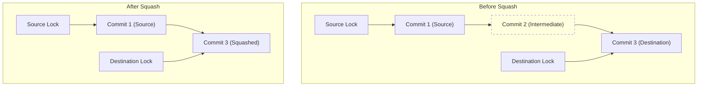
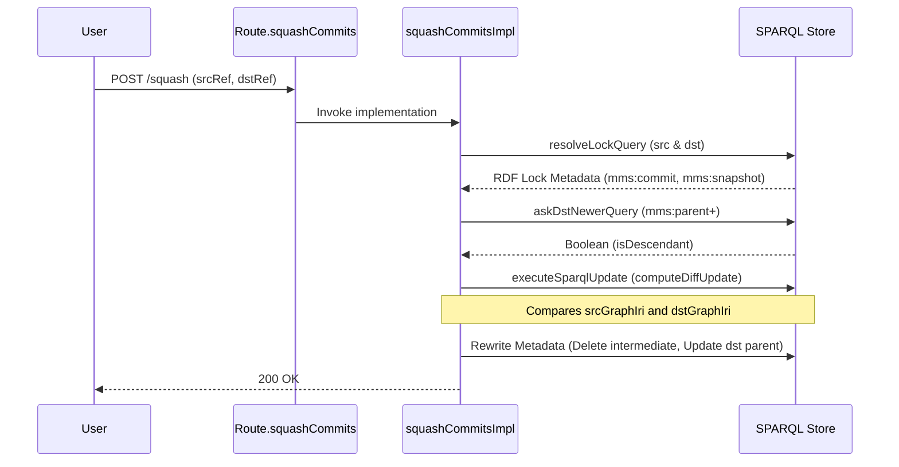

# Page: Commits, Diffs, and Squash

# Commits, Diffs, and Squash

Relevant source files

The following files were used as context for generating this wiki page:

- [src/main/kotlin/org/openmbee/flexo/mms/routes/Commits.kt](src/main/kotlin/org/openmbee/flexo/mms/routes/Commits.kt)
- [src/main/kotlin/org/openmbee/flexo/mms/routes/Diffs.kt](src/main/kotlin/org/openmbee/flexo/mms/routes/Diffs.kt)
- [src/main/kotlin/org/openmbee/flexo/mms/routes/SquashCommits.kt](src/main/kotlin/org/openmbee/flexo/mms/routes/SquashCommits.kt)
- [src/main/kotlin/org/openmbee/flexo/mms/routes/ldp/CommitRead.kt](src/main/kotlin/org/openmbee/flexo/mms/routes/ldp/CommitRead.kt)
- [src/main/kotlin/org/openmbee/flexo/mms/routes/sparql/DiffQuery.kt](src/main/kotlin/org/openmbee/flexo/mms/routes/sparql/DiffQuery.kt)
- [src/test/kotlin/org/openmbee/flexo/mms/CommitAny.kt](src/test/kotlin/org/openmbee/flexo/mms/CommitAny.kt)
- [src/test/kotlin/org/openmbee/flexo/mms/CommitLdpDc.kt](src/test/kotlin/org/openmbee/flexo/mms/CommitLdpDc.kt)
- [src/test/kotlin/org/openmbee/flexo/mms/SquashCommits.kt](src/test/kotlin/org/openmbee/flexo/mms/SquashCommits.kt)

This page documents the management of commit history within the Flexo MMS Layer 1 Service. It covers the retrieval of commit metadata, the computation of differences (diffs) between resource states, and the `squashCommits` operation used to simplify linear history by collapsing a range of commits into a single entry.

## Commit Metadata and Retrieval

Commits are immutable records of changes to a repository. Each commit is associated with a specific `mms:Commit` resource containing metadata such as the creator, submission timestamp, parent commit, and references to the patch data.

### Commit Data Model
A commit resource in the metadata graph typically includes:
*   `mms:parent`: The preceding commit in the history. [src/main/kotlin/org/openmbee/flexo/mms/routes/ldp/CommitRead.kt:16-16]()
*   `mms:etag`: A unique identifier for the state represented by this commit. [src/main/kotlin/org/openmbee/flexo/mms/routes/ldp/CommitRead.kt:17-17]()
*   `mms:submitted`: The XSD dateTime of the commit submission. [src/test/kotlin/org/openmbee/flexo/mms/CommitAny.kt:19-19]()
*   `mms:createdBy`: The user IRI who initiated the commit. [src/test/kotlin/org/openmbee/flexo/mms/CommitAny.kt:20-20]()
*   `mms:data`: A reference to the `mms:CommitData` which holds the actual SPARQL patches (`mms:patch`) or graph references (`mms:insGraph`/`mms:delGraph`). [src/test/kotlin/org/openmbee/flexo/mms/CommitAny.kt:22-22]()

### API Endpoints
Commit metadata is exposed via Linked Data Platform (LDP) Direct Container routes:
*   `GET /orgs/{orgId}/repos/{repoId}/commits`: Returns a list of all commits in the repository. [src/main/kotlin/org/openmbee/flexo/mms/routes/Commits.kt:33-35]()
*   `GET /orgs/{orgId}/repos/{repoId}/commits/{commitId}`: Returns metadata for a specific commit. [src/main/kotlin/org/openmbee/flexo/mms/routes/Commits.kt:57-59]()
*   `PATCH /orgs/{orgId}/repos/{repoId}/commits/{commitId}`: Allows updating commit metadata (e.g., descriptions) subject to `COMMIT_UPDATE_CONDITIONS`. [src/main/kotlin/org/openmbee/flexo/mms/routes/Commits.kt:62-69]()

Sources: [src/main/kotlin/org/openmbee/flexo/mms/routes/Commits.kt:11-74](), [src/main/kotlin/org/openmbee/flexo/mms/routes/ldp/CommitRead.kt:12-51](), [src/test/kotlin/org/openmbee/flexo/mms/CommitAny.kt:10-39]()

## Diff Operations

Diffs represent the delta between two states of the model. While every commit implicitly contains a diff (the patch that created it), the system also allows explicit diff creation and querying.

### Diff Generation Logic
The service computes diffs by comparing two RDF graphs (usually snapshots associated with locks or branches). The process identifies:
1.  **Insertions**: Triples present in the destination graph (`dstGraphIri`) but not the source (`srcGraphIri`). [src/main/kotlin/org/openmbee/flexo/mms/routes/SquashCommits.kt:158-166]()
2.  **Deletions**: Triples present in the source graph but not the destination. [src/main/kotlin/org/openmbee/flexo/mms/routes/SquashCommits.kt:168-176]()

### Diff API
*   `POST /orgs/{orgId}/repos/{repoId}/diffs`: Creates a new diff resource between two refs. [src/main/kotlin/org/openmbee/flexo/mms/routes/Diffs.kt:23-25]()
*   `POST /orgs/{orgId}/repos/{repoId}/diff/{diffId}/query`: Allows executing SPARQL queries against the contents of a specific diff. [src/main/kotlin/org/openmbee/flexo/mms/routes/sparql/DiffQuery.kt:13-26]()

Sources: [src/main/kotlin/org/openmbee/flexo/mms/routes/Diffs.kt:7-27](), [src/main/kotlin/org/openmbee/flexo/mms/routes/SquashCommits.kt:143-181](), [src/main/kotlin/org/openmbee/flexo/mms/routes/sparql/DiffQuery.kt:1-27]()

## Squash Commits

The `squashCommits` operation collapses a linear range of commits into a single commit. This is useful for cleaning up "noisy" intermediate history while preserving the final state of the model.

### Process Flow
The squash operation follows a strict sequence to ensure data integrity:

1.  **Resolution**: The service resolves the provided `mms:srcRef` and `mms:dstRef` (locks) to their respective commits and materialized model graphs. [src/main/kotlin/org/openmbee/flexo/mms/routes/SquashCommits.kt:69-114]()
2.  **Linearity Check**: It verifies that `dstRef` is a direct descendant of `srcRef` using a SPARQL `ASK` query with property paths (`mms:parent+`). [src/main/kotlin/org/openmbee/flexo/mms/routes/SquashCommits.kt:121-141]()
3.  **Diff Computation**: A new diff is computed between the source and destination model graphs. This diff represents the net change of all commits being squashed. [src/main/kotlin/org/openmbee/flexo/mms/routes/SquashCommits.kt:147-181]()
4.  **Patch Reconstruction**: A new SPARQL patch is generated. This patch is designed to transform the source state directly into the destination state in one operation. [src/main/kotlin/org/openmbee/flexo/mms/routes/SquashCommits.kt:191-210]()
5.  **History Rewriting**:
    *   The intermediate commits between `src` and `dst` are logically removed from the linear chain.
    *   The `dst` commit is updated to point directly to the `src` commit as its `mms:parent`.
    *   The `mms:CommitData` for the `dst` commit is replaced with the new squashed patch.

### Safety Constraints
*   **Permissions**: The user must have `Permission.UPDATE_COMMIT` at the `Scope.REPO` level. [src/main/kotlin/org/openmbee/flexo/mms/routes/SquashCommits.kt:18-20]()
*   **Same Commit**: If both locks point to the same commit, the operation returns a 400 error. [src/main/kotlin/org/openmbee/flexo/mms/routes/SquashCommits.kt:116-118]()
*   **Non-Linear History**: If there is no linear path (e.g., the commits are on different branches), the operation returns a 400 error. [src/main/kotlin/org/openmbee/flexo/mms/routes/SquashCommits.kt:139-141]()

### Squash Implementation Diagram
The following diagram illustrates the transformation of the metadata graph during a squash operation.

**Commit History Transformation**

Sources: [src/main/kotlin/org/openmbee/flexo/mms/routes/SquashCommits.kt:13-49](), [src/main/kotlin/org/openmbee/flexo/mms/routes/SquashCommits.kt:52-210]()

### Code Entity Mapping
This table maps natural language concepts to the specific Kotlin functions and SPARQL variables used in the implementation.

| Concept | Code Entity | Purpose |
| :--- | :--- | :--- |
| **Squash Entry Point** | `Route.squashCommits()` | Registers the POST route at `/squash`. [src/main/kotlin/org/openmbee/flexo/mms/routes/SquashCommits.kt:34-49]() |
| **Execution Logic** | `squashCommitsImpl()` | Orchestrates the squash process including lock resolution and diffing. [src/main/kotlin/org/openmbee/flexo/mms/routes/SquashCommits.kt:52-52]() |
| **Lineage Check** | `askDstNewerQuery` | SPARQL query using `mms:parent+` to verify linearity. [src/main/kotlin/org/openmbee/flexo/mms/routes/SquashCommits.kt:121-129]() |
| **Diff Storage** | `diffInsGraphIri` / `diffDelGraphIri` | Temporary graphs created during transaction to hold net changes. [src/main/kotlin/org/openmbee/flexo/mms/routes/SquashCommits.kt:144-145]() |
| **Commit Read** | `fetchCommits()` | Core logic for retrieving commit RDF metadata. [src/main/kotlin/org/openmbee/flexo/mms/routes/ldp/CommitRead.kt:57-57]() |
| **Conditions** | `SQUASH_CONDITIONS` | Defines the `UPDATE_COMMIT` permission requirement. [src/main/kotlin/org/openmbee/flexo/mms/routes/SquashCommits.kt:18-20]() |

**Data Flow: Squash Request**

Sources: [src/main/kotlin/org/openmbee/flexo/mms/routes/SquashCommits.kt:34-181](), [src/main/kotlin/org/openmbee/flexo/mms/routes/ldp/CommitRead.kt:57-89]()
