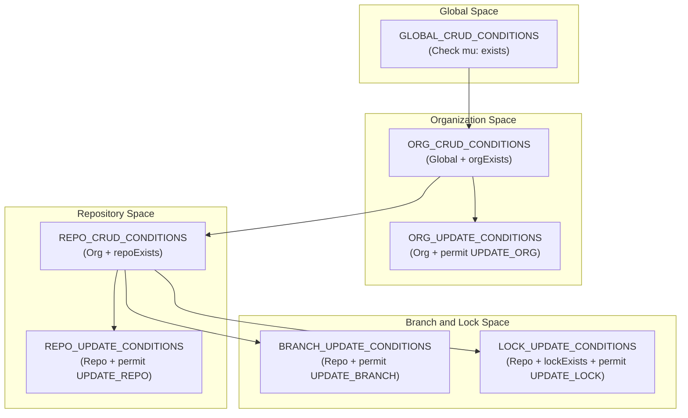
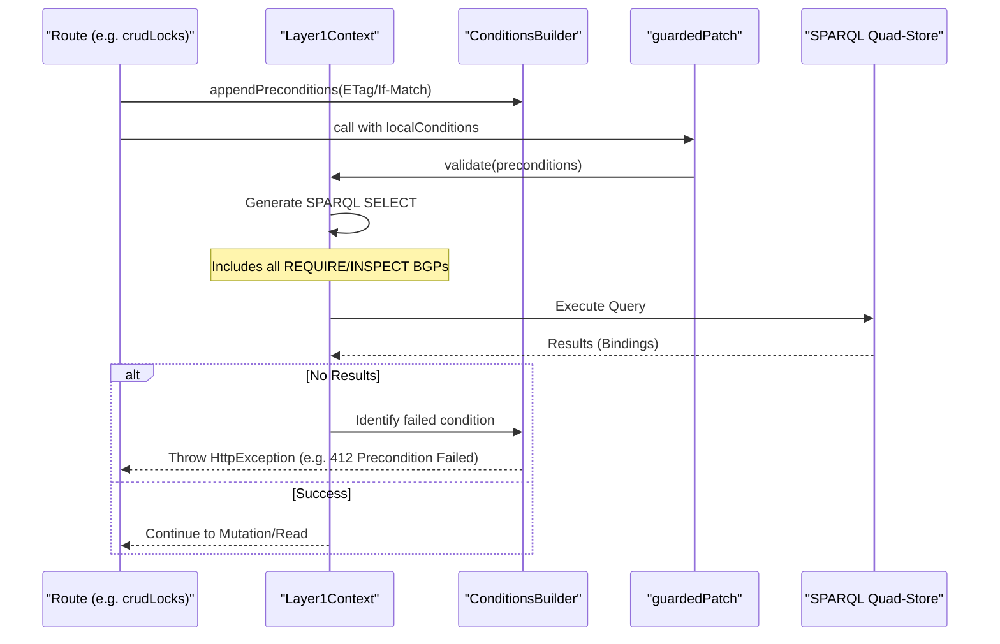

# Page: Conditions and Validation Engine

# Conditions and Validation Engine

<details>
<summary>Relevant source files</summary>

The following files were used as context for generating this wiki page:

- [src/main/kotlin/org/openmbee/flexo/mms/Conditions.kt](src/main/kotlin/org/openmbee/flexo/mms/Conditions.kt)
- [src/main/kotlin/org/openmbee/flexo/mms/Errors.kt](src/main/kotlin/org/openmbee/flexo/mms/Errors.kt)
- [src/main/kotlin/org/openmbee/flexo/mms/routes/Locks.kt](src/main/kotlin/org/openmbee/flexo/mms/routes/Locks.kt)
- [src/main/kotlin/org/openmbee/flexo/mms/routes/Scratches.kt](src/main/kotlin/org/openmbee/flexo/mms/routes/Scratches.kt)
- [src/test/kotlin/org/openmbee/flexo/mms/LockRead.kt](src/test/kotlin/org/openmbee/flexo/mms/LockRead.kt)

</details>


The **Conditions and Validation Engine** is a domain-specific language (DSL) and evaluation framework used to enforce business logic, resource existence, and access control across the Flexo MMS Layer 1 Service. Instead of hard-coding validation logic in every route, the engine allows developers to compose reusable "conditions" that are translated into SPARQL Basic Graph Patterns (BGPs). These patterns are then executed against the quad-store to atomically verify the state of the system before any mutations occur.

### Implementation and DSL Structure

The engine is primarily defined in [src/main/kotlin/org/openmbee/flexo/mms/Conditions.kt:1-187](). It centers around the `ConditionsBuilder` class, which holds a list of `Condition` objects. Each condition represents a SPARQL pattern that must either be satisfied (for `REQUIRE`) or evaluated to extract information (for `INSPECT`).

#### Key Classes and Enums
| Entity | Role |
| --- | --- |
| `ConditionType` | Enum defining `INSPECT` (to bind variables) or `REQUIRE` (must be true). [[src/main/kotlin/org/openmbee/flexo/mms/Conditions.kt:176-179]()] |
| `Condition` | Represents a single validation unit with a SPARQL pattern and an error handler. [[src/main/kotlin/org/openmbee/flexo/mms/Conditions.kt:181-186]()] |
| `ConditionsBuilder` | A DSL builder used to assemble lists of conditions and provide helper methods like `permit`. [[src/main/kotlin/org/openmbee/flexo/mms/Conditions.kt:189-200]()] |

**Sources:** [src/main/kotlin/org/openmbee/flexo/mms/Conditions.kt:176-200]()

---

### Condition Composition and Flow

Conditions are designed to be hierarchical. Base conditions (like `GLOBAL_CRUD_CONDITIONS`) check for agent existence and authentication [[src/main/kotlin/org/openmbee/flexo/mms/Conditions.kt:6-34]()]. These are then extended by more specific resource conditions using the `.append {}` extension.

#### Composition Hierarchy Diagram
"Hierarchy of Condition Groups"

**Sources:** [src/main/kotlin/org/openmbee/flexo/mms/Conditions.kt:6-81](), [src/main/kotlin/org/openmbee/flexo/mms/Conditions.kt:154-170]()

---

### Execution Mechanism: The Validation Pipeline

The engine validates requests by constructing a SPARQL `SELECT` query. The patterns defined in the `ConditionsBuilder` are embedded into the `WHERE` clause. If the query returns no results, the engine iterates through the conditions to identify which specific pattern failed and executes its associated `handler` to return a descriptive HTTP error (e.g., `404 Not Found` or `403 Forbidden`).

#### Data Flow: From DSL to SPARQL
"Validation Execution Flow"

**Sources:** [src/main/kotlin/org/openmbee/flexo/mms/Conditions.kt:181-200](), [src/main/kotlin/org/openmbee/flexo/mms/routes/Locks.kt:80-102](), [src/main/kotlin/org/openmbee/flexo/mms/routes/Scratches.kt:77-103]()

---

### Standard Condition Types

The engine provides several built-in helpers within the `ConditionsBuilder` to handle common MMS requirements:

1.  **Permission Checks**: `permit(permission, scope)` uses `permittedActionSparqlBgp` to ensure the user/group has the required RDF-based policy permissions [[src/main/kotlin/org/openmbee/flexo/mms/Conditions.kt:193-199]()].
2.  **Resource Existence**: Methods like `orgExists()`, `repoExists()`, and `lockExists()` verify that the resource URI is typed correctly in the metadata graph [[src/main/kotlin/org/openmbee/flexo/mms/Conditions.kt:59-61, 154-165]()].
3.  **ETag Validation**: `resourceMatchesEtag()` ensures that the `If-Match` header matches the current `mms:etag` property of the resource [[src/main/kotlin/org/openmbee/flexo/mms/Conditions.kt:201-205]()].
4.  **Complex State Checks**: `BRANCH_COMMIT_CONDITIONS` ensures that a branch is not corrupt by verifying both its `mms:Staging` and `mms:Model` snapshots exist before allowing a commit [[src/main/kotlin/org/openmbee/flexo/mms/Conditions.kt:80-105]()].

#### Code Example: Guarded Patch in Locks
In `Locks.kt`, a `PATCH` request uses a local condition group to combine standard update requirements with dynamic ETag checks:

```kotlin
// [src/main/kotlin/org/openmbee/flexo/mms/routes/Locks.kt:80-102]
patch {
    // build conditions
    val localConditions = LOCK_UPDATE_CONDITIONS.append {
        // enforce preconditions if present (ETags)
        appendPreconditions { values ->
            """
                graph mor-graph:Metadata {
                    morl: mms:etag ?__mms_etag .
                    
                    ${values.reindent(6)}
                }
            """
        }
    }

    // handle all varieties of accepted PATCH request formats
    guardedPatch(
        updateRequest = it,
        objectKey = "morl",
        graph = "mor-graph:Metadata",
        preconditions = localConditions,
    )
}
```

---

### Error Handling and Exceptions

When a condition fails, the engine maps the failure to a specific `HttpException`. These are defined in `Errors.kt` and provide the bridge between SPARQL evaluation and HTTP responses.

| Exception Class | HTTP Status | Typical Cause |
| --- | --- | --- |
| `PreconditionFailedException` | 412 | ETag mismatch in `If-Match` header. [[src/main/kotlin/org/openmbee/flexo/mms/Errors.kt:70]()] |
| `Http403Exception` | 403 | `permit()` check failed for the current agent. [[src/main/kotlin/org/openmbee/flexo/mms/Errors.kt:46]()] |
| `Http404Exception` | 404 | `require("exists")` BGP failed to find the resource. [[src/main/kotlin/org/openmbee/flexo/mms/Errors.kt:49]()] |
| `NotImplementedException` | 501 | Action is defined in routing but not yet implemented. [[src/main/kotlin/org/openmbee/flexo/mms/Errors.kt:90]()] |

**Sources:** [src/main/kotlin/org/openmbee/flexo/mms/Errors.kt:1-91](), [src/main/kotlin/org/openmbee/flexo/mms/Conditions.kt:138-148](), [src/main/kotlin/org/openmbee/flexo/mms/routes/Locks.kt:107]()
