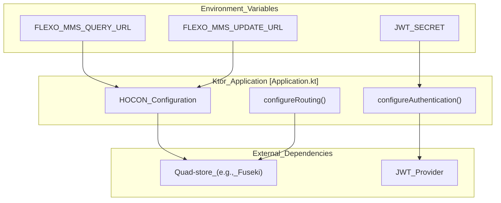
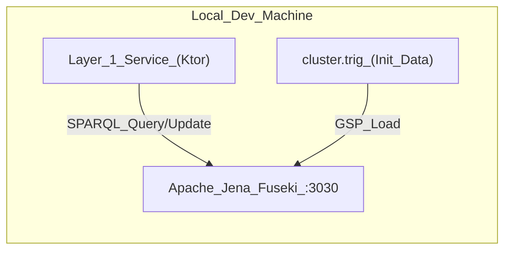

# Page: Configuration and Deployment

# Configuration and Deployment

Relevant source files

The following files were used as context for generating this wiki page:

- [.circleci/config.yml](.circleci/config.yml)
- [README.md](README.md)
- [sonar-project.properties](sonar-project.properties)
- [src/main/kotlin/org/openmbee/flexo/mms/Application.kt](src/main/kotlin/org/openmbee/flexo/mms/Application.kt)
- [src/main/resources/application.conf.example](src/main/resources/application.conf.example)
- [src/main/resources/application.conf.test](src/main/resources/application.conf.test)

The Flexo MMS Layer 1 Service is designed for flexible deployment across various environments, ranging from local development setups using Docker Compose to production-grade clusters managed via CI/CD pipelines. Configuration is primarily handled through HOCON files (`application.conf`) and environment variables, allowing for fine-tuned control over quad-store interactions, authentication, and performance optimizations.

## High-Level Deployment Architecture

The service acts as a middleware layer between clients and a SPARQL 1.1 compliant quad-store. Deployment requires both the Ktor application and a pre-initialized quad-store containing the base MMS ontology and access control schema.

### Service Orchestration
The following diagram illustrates how the deployment configuration maps to the internal service structure and external dependencies.

**Deployment Entity Mapping**

**Sources:** [src/main/kotlin/org/openmbee/flexo/mms/Application.kt:11-15](), [src/main/resources/application.conf.example:27-38]()

## Application Configuration

The service uses a standard Ktor configuration approach. The `application.conf` file defines settings for the application behavior, backend quad-store URLs, and security parameters. The application accesses these settings through extension properties on the `Application` class.

Key configuration areas include:
*   **Quad-Store URLs**: Specific endpoints for SPARQL Query, Update, and Graph Store Protocol (GSP) [src/main/kotlin/org/openmbee/flexo/mms/Application.kt:21-50]().
*   **Performance Tuning**: Thresholds for GZIP compression of large RDF literals and maximum literal size limits to protect the triplestore from excessive payload sizes [src/main/kotlin/org/openmbee/flexo/mms/Application.kt:71-81]().
*   **Security**: JWT domain, audience, and secret settings for request authentication [src/main/resources/application.conf.example:54-63]().
*   **Glomar Response**: A privacy setting that forces the service to return 404 for unauthorized requests even if the resource exists, preventing metadata leakage [src/main/kotlin/org/openmbee/flexo/mms/Application.kt:65-69]().

For a full reference of available settings and their environment variable overrides, see **[Application Configuration](#6.1)**.

**Sources:** [src/main/resources/application.conf.example:1-63](), [src/main/kotlin/org/openmbee/flexo/mms/Application.kt:21-88]()

## CI/CD Pipeline and Docker

The project utilizes CircleCI for automated building, testing, and deployment. The pipeline ensures code quality through SonarCloud scanning and manages the lifecycle of Docker images.

### Pipeline Lifecycle
The CircleCI workflow `build-test-deploy` orchestrates the following stages:
1.  **Schema Generation**: A Node.js task runs `deploy/src/main.ts` to generate the `cluster.trig` initialization file required for the system's base state [.circleci/config.yml:7-24]().
2.  **Build and Test**: The service is built using a custom `Dockerfile-Test`, and integration tests are executed against a transient Docker Compose network containing a quad-store [.circleci/config.yml:29-50]().
3.  **Security and Quality**: SonarCloud performs static analysis and code coverage reporting using the `sonar-project.properties` configuration [.circleci/config.yml:57-65]().
4.  **Containerization**: Docker images are built and pushed to DockerHub as snapshots (for `develop` or `release` branches) or tagged releases [.circleci/config.yml:67-140]().

For details on the pipeline stages and Docker configurations, see **[CI/CD Pipeline and Docker](#6.2)**.

**Sources:** [.circleci/config.yml:141-187](), [sonar-project.properties:1-6]()

## Local Development Setup

Developers can quickly stand up a local environment using the provided Docker Compose configuration. This environment includes an Apache Jena Fuseki instance as the default quad-store.

**Local Stack Components**

To initialize a local instance, developers must generate a `cluster.trig` file using the deployment script and apply it to the quad-store before the service can function correctly [README.md:38-57]().

**Sources:** [README.md:25-53](), [.circleci/config.yml:23-24](), [src/main/resources/application.conf.test:1-58]()

## Summary of Sub-pages

### [Application Configuration](#6.1)
Detailed reference for `application.conf`. Covers `mms.quad-store.*` settings, `mms.application.glomar-response`, and the `jwt` block. Explains how the `Application` class extensions read these properties at runtime.

### [CI/CD Pipeline and Docker](#6.2)
Deep dive into the CircleCI workflow. Explains the multi-stage build process, the use of `Dockerfile-Test` for CI environments, and the automation of schema generation using the TypeScript tools in the `deploy/` directory.
