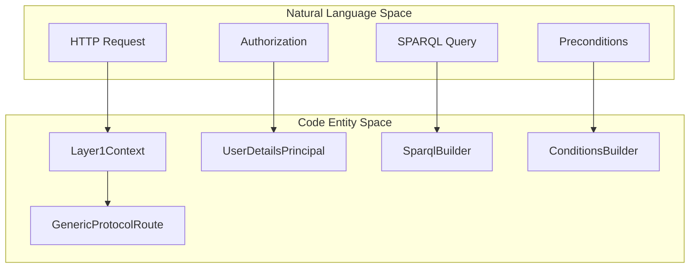
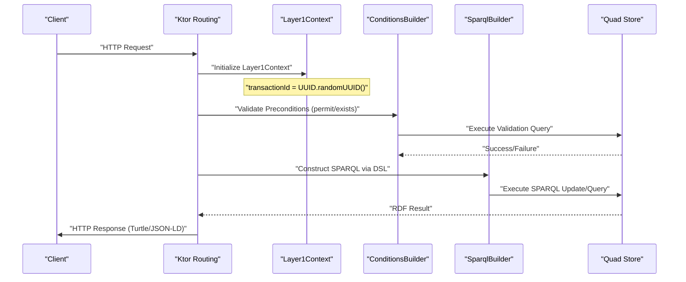

# Page: Core Framework

# Core Framework

Relevant source files

The following files were used as context for generating this wiki page:

- [src/main/kotlin/org/openmbee/flexo/mms/Conditions.kt](src/main/kotlin/org/openmbee/flexo/mms/Conditions.kt)
- [src/main/kotlin/org/openmbee/flexo/mms/Layer1Context.kt](src/main/kotlin/org/openmbee/flexo/mms/Layer1Context.kt)
- [src/main/kotlin/org/openmbee/flexo/mms/SparqlBuilder.kt](src/main/kotlin/org/openmbee/flexo/mms/SparqlBuilder.kt)
- [src/main/kotlin/org/openmbee/flexo/mms/routes/Artifacts.kt](src/main/kotlin/org/openmbee/flexo/mms/routes/Artifacts.kt)
- [src/main/kotlin/org/openmbee/flexo/mms/routes/Scratches.kt](src/main/kotlin/org/openmbee/flexo/mms/routes/Scratches.kt)
- [src/main/kotlin/org/openmbee/flexo/mms/routes/ldp/OrgRead.kt](src/main/kotlin/org/openmbee/flexo/mms/routes/ldp/OrgRead.kt)
- [src/main/kotlin/org/openmbee/flexo/mms/server/Routing.kt](src/main/kotlin/org/openmbee/flexo/mms/server/Routing.kt)
- [src/main/kotlin/org/openmbee/flexo/mms/server/StorageAbstraction.kt](src/main/kotlin/org/openmbee/flexo/mms/server/StorageAbstraction.kt)

The Core Framework provides the foundational Kotlin and Ktor components that underpin the Flexo MMS Layer 1 Service. It establishes a standardized request lifecycle, a domain-specific language (DSL) for SPARQL construction, and a robust conditions engine for enforcing business logic and access control across all API routes.

### System Overview: Natural Language to Code Entity Space

The following diagrams map high-level architectural concepts to the specific classes and files that implement them within the service.

**Diagram: Framework Entity Mapping**

Sources: [src/main/kotlin/org/openmbee/flexo/mms/Layer1Context.kt:47-50](), [src/main/kotlin/org/openmbee/flexo/mms/Conditions.kt:189-190](), [src/main/kotlin/org/openmbee/flexo/mms/SparqlBuilder.kt:101-103]()

**Diagram: Request Execution Flow**

Sources: [src/main/kotlin/org/openmbee/flexo/mms/Layer1Context.kt:64-64](), [src/main/kotlin/org/openmbee/flexo/mms/routes/Scratches.kt:19-49](), [src/main/kotlin/org/openmbee/flexo/mms/routes/ldp/OrgRead.kt:56-88]()

---

### [Layer1Context and Request Lifecycle](#2.1)

The `Layer1Context` is the central state container for every incoming request [src/main/kotlin/org/openmbee/flexo/mms/Layer1Context.kt:47-50](). It encapsulates the Ktor `ApplicationCall`, manages authentication via the `UserDetailsPrincipal` [src/main/kotlin/org/openmbee/flexo/mms/Layer1Context.kt:67-67](), and generates a unique `transactionId` used for tracing and RDF auditing [src/main/kotlin/org/openmbee/flexo/mms/Layer1Context.kt:64-64]().

Key responsibilities include:
*   **Parameter Normalization**: Standardizing path and query parameters (e.g., `orgId`, `repoId`) through the `PathParamNormalizer` and `QueryParamNormalizer` inner classes [src/main/kotlin/org/openmbee/flexo/mms/Layer1Context.kt:136-199]().
*   **Prefix Management**: Providing a `PrefixMapBuilder` to handle RDF namespaces dynamically based on the request scope [src/main/kotlin/org/openmbee/flexo/mms/Layer1Context.kt:102-117]().
*   **ETag Handling**: Parsing and validating `If-Match` and `If-None-Match` headers to ensure optimistic concurrency control [src/main/kotlin/org/openmbee/flexo/mms/Layer1Context.kt:74-75]().

For details, see [Layer1Context and Request Lifecycle](#2.1).

Sources: [src/main/kotlin/org/openmbee/flexo/mms/Layer1Context.kt:47-199]()

---

### [Conditions and Validation Engine](#2.2)

The validation engine uses a `ConditionsBuilder` DSL to define SPARQL-based requirements that must be met before an operation proceeds [src/main/kotlin/org/openmbee/flexo/mms/Conditions.kt:189-190](). This allows the service to verify resource existence and permissions within a single triplestore round-trip.

The engine supports:
*   **Requirement Composition**: Using `.append {}` to build complex condition sets from base templates like `REPO_CRUD_CONDITIONS` [src/main/kotlin/org/openmbee/flexo/mms/Conditions.kt:59-61]().
*   **Permission Enforcement**: The `permit()` function integrates with the access control system to inject permission-checking SPARQL BGPs into the request [src/main/kotlin/org/openmbee/flexo/mms/Conditions.kt:193-199]().
*   **Inspection**: If conditions fail, the engine can execute `INSPECT` patterns to determine exactly which check failed (e.g., "User does not exist" vs. "Permission denied") to return accurate HTTP status codes [src/main/kotlin/org/openmbee/flexo/mms/Conditions.kt:176-186]().

For details, see [Conditions and Validation Engine](#2.2).

Sources: [src/main/kotlin/org/openmbee/flexo/mms/Conditions.kt:6-199]()

---

### [SPARQL Builder and Parameterizer](#2.3)

To prevent SPARQL injection and simplify complex query construction, the service utilizes a `SparqlBuilder` DSL [src/main/kotlin/org/openmbee/flexo/mms/SparqlBuilder.kt:101-103](). This component allows developers to write SPARQL in a type-safe, structured manner using Kotlin blocks.

Features include:
*   **Block Scoping**: Dedicated builders for `graph`, `group`, and `values` blocks [src/main/kotlin/org/openmbee/flexo/mms/SparqlBuilder.kt:119-174]().
*   **Safe Parameterization**: Utilities like `escapeLiteral()` and `escapeIri()` ensure that user input is safely handled within query strings [src/main/kotlin/org/openmbee/flexo/mms/SparqlBuilder.kt:60-66]().
*   **Transaction Templates**: Standardized patterns like `SPARQL_INSERT_TRANSACTION` for logging request metadata into the `m-graph:Transactions` graph [src/main/kotlin/org/openmbee/flexo/mms/SparqlBuilder.kt:31-49]().

For details, see [SPARQL Builder and Parameterizer](#2.3).

Sources: [src/main/kotlin/org/openmbee/flexo/mms/SparqlBuilder.kt:1-174]()

---

### [Server Infrastructure](#2.4)

The server infrastructure leverages Ktor to provide the HTTP interface. It defines specialized routing abstractions that align with Semantic Web protocols [src/main/kotlin/org/openmbee/flexo/mms/server/Routing.kt:86-124]().

*   **LDP and GSP Support**: High-level routing functions like `linkedDataPlatformDirectContainer` and `graphStoreProtocol` simplify the implementation of Linked Data Platform and SPARQL Graph Store Protocol endpoints [src/main/kotlin/org/openmbee/flexo/mms/routes/Scratches.kt:21-109]().
*   **Content Negotiation**: Configured to handle various RDF serializations (Turtle, JSON-LD, etc.) through the `TextConverter` and `httpClient` configuration [src/main/kotlin/org/openmbee/flexo/mms/server/Routing.kt:31-82]().
*   **Storage Abstraction**: The `storageAbstractionResource` provides a standard pattern for resources that can be handled as opaque artifacts or metadata-driven objects [src/main/kotlin/org/openmbee/flexo/mms/server/StorageAbstraction.kt:102-122]().

For details, see [Server Infrastructure](#2.4).

Sources: [src/main/kotlin/org/openmbee/flexo/mms/server/Routing.kt:1-124](), [src/main/kotlin/org/openmbee/flexo/mms/server/StorageAbstraction.kt:1-172]()
