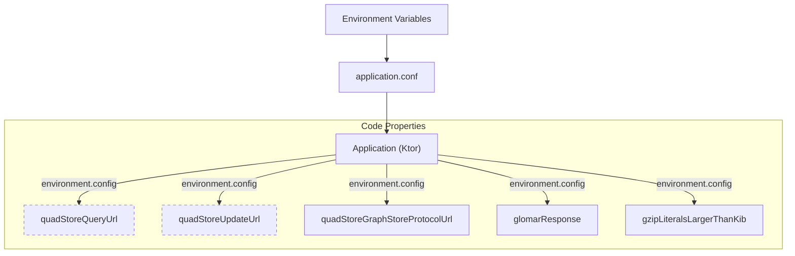
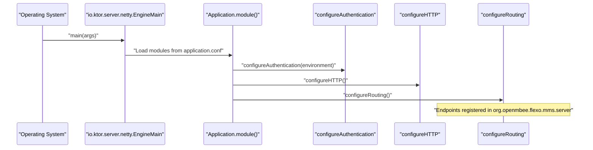

# Page: Getting Started

# Getting Started

<details>
<summary>Relevant source files</summary>

The following files were used as context for generating this wiki page:

- [.circleci/config.yml](.circleci/config.yml)
- [Dockerfile-Test](Dockerfile-Test)
- [README.md](README.md)
- [build.gradle.kts](build.gradle.kts)
- [service/blazegraph.sh](service/blazegraph.sh)
- [service/data/clean/init.trig](service/data/clean/init.trig)
- [service/flexo-mms-blazegraph.properties](service/flexo-mms-blazegraph.properties)
- [service/loaddata.sh](service/loaddata.sh)
- [service/simpleblaze.sh](service/simpleblaze.sh)
- [service/start.sh](service/start.sh)
- [service/stop.sh](service/stop.sh)
- [service/test.sh](service/test.sh)
- [settings.gradle.kts](settings.gradle.kts)
- [sonar-project.properties](sonar-project.properties)
- [src/main/kotlin/org/openmbee/flexo/mms/Application.kt](src/main/kotlin/org/openmbee/flexo/mms/Application.kt)
- [src/main/resources/application.conf.example](src/main/resources/application.conf.example)
- [src/main/resources/application.conf.test](src/main/resources/application.conf.test)
- [src/test/resources/docker-compose.yml](src/test/resources/docker-compose.yml)

</details>


This page provides technical instructions for setting up the Flexo MMS Layer 1 Service development environment, configuring the application, and performing the initial cluster bootstrap.

## Overview

The Flexo MMS Layer 1 Service is a Kotlin-based Ktor application that provides a RESTful Layer 1 interface over a SPARQL-compliant quad-store. It manages organizational metadata, repository versioning, and access control using RDF named graphs. The service uses Apache Jena for SPARQL parsing and RDF manipulation.

Sources: [src/main/kotlin/org/openmbee/flexo/mms/Application.kt:1-15](), [build.gradle.kts:56-57](), [README.md:10-18]()

## Local Development Stack

The service requires a SPARQL quad-store (e.g., Apache Jena Fuseki) and optionally a binary store service for artifacts. The simplest way to stand up the environment is using the provided `docker-compose.yml`.

### Prerequisites
- Docker and Docker Compose
- Java 21 (JDK) [build.gradle.kts:146-148]()
- Node.js (for schema generation)

### Running the Stack
Execute the following command to start the backend services:
```bash
docker-compose -f src/test/resources/docker-compose.yml up -d
```
Sources: [README.md:25-27](), [src/test/resources/docker-compose.yml:1-46]()

### Service Components

| Service | Container Name | Port | Purpose |
| :--- | :--- | :--- | :--- |
| **Quad Store** | `quad-server` | `3030` | Apache Jena Fuseki; stores all RDF metadata and model data. |
| **S3 Storage** | `minio-server` | `9000` | Object storage for large artifacts. |
| **Store Service** | `store-service` | `8081` | Mediates between Layer 1 and S3 for binary data. |

Sources: [src/test/resources/docker-compose.yml:5-41](), [README.md:29-36]()

## Environment Configuration

The application is configured via HOCON files (`application.conf`) which resolve values from environment variables.

### Key Environment Variables

| Variable | Description | Default (Dev) |
| :--- | :--- | :--- |
| `FLEXO_MMS_ROOT_CONTEXT` | The base URI for all generated MMS resources. | `http://layer1-service` |
| `FLEXO_MMS_QUERY_URL` | SPARQL 1.1 Query endpoint. | `http://localhost:3030/ds/sparql` |
| `FLEXO_MMS_UPDATE_URL` | SPARQL 1.1 Update endpoint. | `http://localhost:3030/ds/update` |
| `FLEXO_MMS_GRAPH_STORE_PROTOCOL_URL` | SPARQL 1.1 Graph Store Protocol endpoint. | `http://localhost:3030/ds/data` |
| `JWT_SECRET` | Secret key for signing/verifying JWT tokens. | `test1234` |
| `FLEXO_MMS_MAXIMUM_LITERAL_SIZE_KIB` | Limit for string literals in commit history. | `61440` |

Sources: [src/main/resources/application.conf.example:27-38](), [src/main/resources/application.conf.example:61-62](), [src/main/kotlin/org/openmbee/flexo/mms/Application.kt:73-74](), [README.md:64-69]()

### Configuration Data Flow
The following diagram illustrates how configuration flows from environment variables into the Ktor `Application` instance properties.

**Diagram: Configuration Mapping**

Sources: [src/main/kotlin/org/openmbee/flexo/mms/Application.kt:21-86](), [src/main/resources/application.conf.example:1-63]()

## Cluster Initialization

Flexo MMS is "self-bootstrapping"—it stores its own configuration, access control policies, and schema definitions as RDF within the quad-store.

### 1. Generate Schema (`cluster.trig`)
The system uses a TypeScript utility located in `deploy/` to generate a TriG file containing the initial cluster metadata and permissions.
```bash
cd deploy
npx ts-node src/main.ts http://layer1-service > ../src/test/resources/cluster.trig
```
Sources: [.circleci/config.yml:20-24](), [README.md:47-53]()

### 2. Initialization Content
The `cluster.trig` (or `init.trig` in some scripts) defines critical graphs:
- `m-graph:Schema`: MMS basic classes hierarchy (e.g., `mms:Branch`, `mms:Commit`). [service/data/clean/init.trig:19-67]()
- `m-graph:Cluster`: Declares the root cluster resource. [service/data/clean/init.trig:72-75]()
- `m-graph:AccessControl.Definitions`: Contains the `mms:Permission`, `mms:Role`, and `mms:Scope` hierarchy. [service/data/clean/init.trig:133-178]()
- `m-graph:AccessControl.Agents`: Defines the initial `root` user and `SuperAdmins` group. [service/data/clean/init.trig:80-98]()
- `m-graph:AccessControl.Policies`: Grants the `DefaultSuperAdmin` policy to the `SuperAdmins` group. [service/data/clean/init.trig:103-112]()

### 3. Loading the Data
Before the service can process requests, this data must be loaded into the quad-store. For manual setup, use the Graph Store Protocol. The repository also includes legacy scripts for Blazegraph in `service/` (e.g., `loaddata.sh`) which utilize the Blazegraph dataloader API.

```bash
# Example for Fuseki
curl -X POST -H "Content-Type: application/trig" --data-binary @src/test/resources/cluster.trig http://localhost:3030/ds/data
```
Sources: [README.md:55-58](), [service/loaddata.sh:1-18]()

## First Run Guide

### Build the Application
Use Gradle to build the service and run tests. The `build.gradle.kts` file configures the Ktor `EngineMain` as the entry point.
```bash
./gradlew build
```
Sources: [build.gradle.kts:23-25](), [Dockerfile-Test:10]()

### System Startup Sequence
The following diagram bridges the startup process from the entry point to the initialized server state.

**Diagram: Startup and Initialization Sequence**

Sources: [src/main/kotlin/org/openmbee/flexo/mms/Application.kt:8-15](), [src/main/resources/application.conf.example:47-49]()

### Verification
Once the service is running (default port `8080`), verify it is online:
```bash
curl http://localhost:8080/
```
Note: If `mms.application.glomar-response` is set to `true`, unauthorized requests may return `404 Not Found` instead of `401 Unauthorized` to obscure resource existence.

Sources: [src/main/kotlin/org/openmbee/flexo/mms/Application.kt:67-69](), [src/main/resources/application.conf.example:3-5]()
