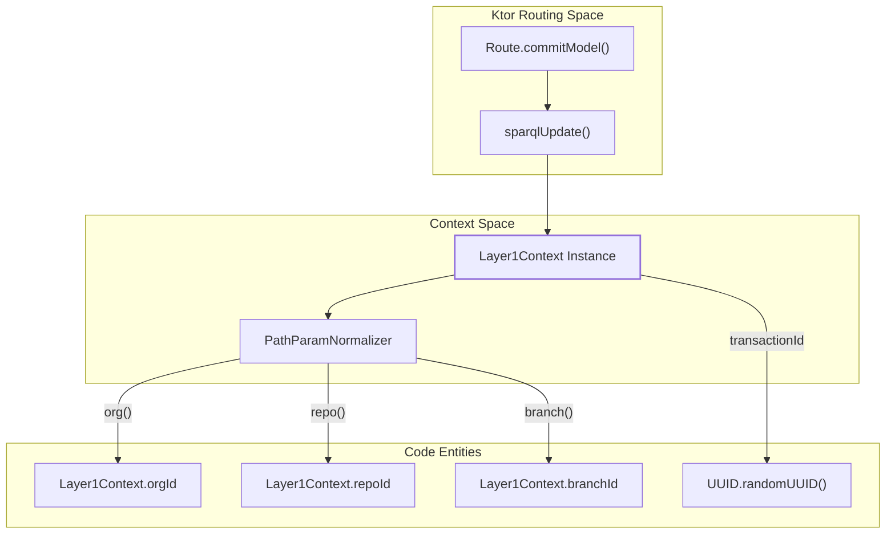
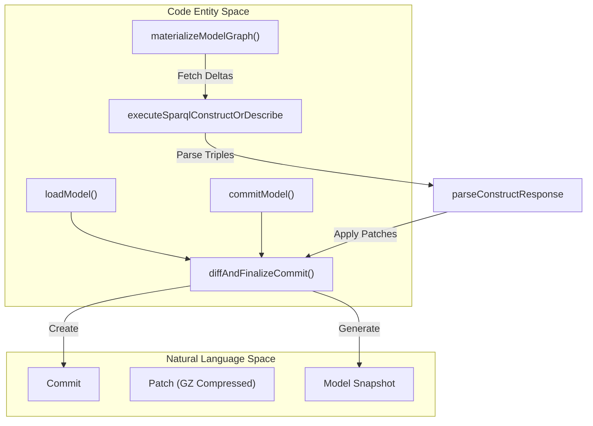

# Page: Glossary

# Glossary

Relevant source files

The following files were used as context for generating this wiki page:

- [deploy/src/main.ts](deploy/src/main.ts)
- [service/data/clean/init.trig](service/data/clean/init.trig)
- [src/main/kotlin/org/openmbee/flexo/mms/AccessControl.kt](src/main/kotlin/org/openmbee/flexo/mms/AccessControl.kt)
- [src/main/kotlin/org/openmbee/flexo/mms/Layer1Context.kt](src/main/kotlin/org/openmbee/flexo/mms/Layer1Context.kt)
- [src/main/kotlin/org/openmbee/flexo/mms/Namespaces.kt](src/main/kotlin/org/openmbee/flexo/mms/Namespaces.kt)
- [src/main/kotlin/org/openmbee/flexo/mms/routes/Groups.kt](src/main/kotlin/org/openmbee/flexo/mms/routes/Groups.kt)
- [src/main/kotlin/org/openmbee/flexo/mms/routes/Policies.kt](src/main/kotlin/org/openmbee/flexo/mms/routes/Policies.kt)
- [src/main/kotlin/org/openmbee/flexo/mms/routes/gsp/ModelLoad.kt](src/main/kotlin/org/openmbee/flexo/mms/routes/gsp/ModelLoad.kt)
- [src/main/kotlin/org/openmbee/flexo/mms/routes/ldp/GraphMaterialization.kt](src/main/kotlin/org/openmbee/flexo/mms/routes/ldp/GraphMaterialization.kt)
- [src/main/kotlin/org/openmbee/flexo/mms/routes/ldp/GroupRead.kt](src/main/kotlin/org/openmbee/flexo/mms/routes/ldp/GroupRead.kt)
- [src/main/kotlin/org/openmbee/flexo/mms/routes/sparql/ModelCommit.kt](src/main/kotlin/org/openmbee/flexo/mms/routes/sparql/ModelCommit.kt)
- [src/test/kotlin/org/openmbee/flexo/mms/AnyAny.kt](src/test/kotlin/org/openmbee/flexo/mms/AnyAny.kt)
- [src/test/kotlin/org/openmbee/flexo/mms/BranchCreate.kt](src/test/kotlin/org/openmbee/flexo/mms/BranchCreate.kt)
- [src/test/kotlin/org/openmbee/flexo/mms/LockCreate.kt](src/test/kotlin/org/openmbee/flexo/mms/LockCreate.kt)

This page provides definitions for codebase-specific terminology, RDF prefixes, class names, and architectural jargon used within the Flexo MMS Layer 1 Service.

## Core Concepts & Jargon

| Term | Definition | Implementation Reference |
| :--- | :--- | :--- |
| **Layer 1** | The service layer providing a RESTful API (LDP/GSP) over a raw SPARQL quad-store. It manages transactions, permissions, and versioning. | [src/main/kotlin/org/openmbee/flexo/mms/Layer1Context.kt:47-50]() |
| **Materialization** | The process of reconstructing a full model state at a specific commit by applying sequential patches to the nearest ancestor snapshot. | [src/main/kotlin/org/openmbee/flexo/mms/routes/ldp/GraphMaterialization.kt:39-40]() |
| **Squash** | An operation that collapses a linear range of commits into a single commit by computing a new diff between the start and end states. | [src/main/kotlin/org/openmbee/flexo/mms/routes/SquashCommits.kt:24-33]() |
| **Staging** | A mutable RDF graph associated with a `mms:Branch` where uncommitted changes are held before a formal commit is created. | [src/main/kotlin/org/openmbee/flexo/mms/routes/gsp/ModelLoad.kt:52-62]() |
| **Glomar Response** | A security configuration where the server responds with `404 Not Found` for unauthorized requests even if the resource exists, to avoid leaking metadata. | [src/main/resources/application.conf.example:3-5]() |
| **Artifact** | An opaque data blob (binary or text) stored in the system, associated with a repository but existing outside the versioned RDF model. | [src/main/kotlin/org/openmbee/flexo/mms/Namespaces.kt:152-152]() |
| **Ref** | An abstract pointer to a specific state in the repository. Subclasses include `mms:Branch` and `mms:Lock`. | [service/data/clean/init.trig:20-32]() |

**Sources:** [src/main/kotlin/org/openmbee/flexo/mms/Layer1Context.kt](), [src/main/kotlin/org/openmbee/flexo/mms/routes/ldp/GraphMaterialization.kt](), [src/main/kotlin/org/openmbee/flexo/mms/routes/gsp/ModelLoad.kt](), [service/data/clean/init.trig]()

---

## RDF Prefixes & Namespaces

The system uses a standardized set of prefixes for identifying resources and named graphs, managed via the `PrefixMapBuilder`.

| Prefix | IRI Pattern / Purpose | Implementation |
| :--- | :--- | :--- |
| `mms:` | Base ontology for Flexo MMS classes and properties. | [src/main/kotlin/org/openmbee/flexo/mms/Namespaces.kt:68-68]() |
| `mms-txn:` | Namespace for transaction-related properties (e.g., `stagingGraph`). | [src/main/kotlin/org/openmbee/flexo/mms/Namespaces.kt:69-69]() |
| `mor-graph:` | Named graphs within a Repository (e.g., `Metadata`). | [src/main/kotlin/org/openmbee/flexo/mms/Namespaces.kt:154-154]() |
| `morb:` | Namespace for the specific Branch resource in context. | [src/main/kotlin/org/openmbee/flexo/mms/Namespaces.kt:160-160]() |
| `morl:` | Namespace for the specific Lock resource in context. | [src/main/kotlin/org/openmbee/flexo/mms/Namespaces.kt:181-181]() |
| `morc:` | Namespace for the specific Commit resource in context. | [src/main/kotlin/org/openmbee/flexo/mms/Namespaces.kt:193-193]() |
| `mt:` | Namespace for the current Transaction resource. | [src/main/kotlin/org/openmbee/flexo/mms/Namespaces.kt:230-230]() |
| `mu:` | Namespace for the current User resource. | [src/main/kotlin/org/openmbee/flexo/mms/Namespaces.kt:111-111]() |
| `mg:` | Namespace for the current Group resource. | [src/main/kotlin/org/openmbee/flexo/mms/Namespaces.kt:119-119]() |

**Sources:** [src/main/kotlin/org/openmbee/flexo/mms/Namespaces.kt:57-235](), [deploy/src/main.ts:153-164]()

---

## Code Entity Mapping

The following diagrams bridge the gap between natural language concepts and the specific classes or functions that implement them.

### Request Execution & Context Flow
This diagram shows how a request is transformed into a `Layer1Context` and how parameters are normalized.

**Sources:** [src/main/kotlin/org/openmbee/flexo/mms/Layer1Context.kt:47-64](), [src/main/kotlin/org/openmbee/flexo/mms/Layer1Context.kt:136-155](), [src/main/kotlin/org/openmbee/flexo/mms/routes/sparql/ModelCommit.kt:14-20]()

### Commit & Materialization Logic
This diagram maps the versioning concepts to the materialization pipeline and commit finalization.

**Sources:** [src/main/kotlin/org/openmbee/flexo/mms/routes/gsp/ModelLoad.kt:71-76](), [src/main/kotlin/org/openmbee/flexo/mms/routes/sparql/ModelCommit.kt:60-65](), [src/main/kotlin/org/openmbee/flexo/mms/routes/ldp/GraphMaterialization.kt:39-40](), [src/main/kotlin/org/openmbee/flexo/mms/routes/ldp/GraphMaterialization.kt:160-169]()

---

## Key Classes & Implementation Details

### Layer1Context
The central object for every request. It manages the lifecycle of a transaction, including:
* **`transactionId`**: A unique UUID generated per request [src/main/kotlin/org/openmbee/flexo/mms/Layer1Context.kt:64]().
* **`prefixes`**: A dynamic `PrefixMapBuilder` that constructs CURIEs based on the current IDs (org, repo, branch, etc.) [src/main/kotlin/org/openmbee/flexo/mms/Layer1Context.kt:102-117]().
* **`PathParamNormalizer`**: A helper to extract and validate IDs from the URL path [src/main/kotlin/org/openmbee/flexo/mms/Layer1Context.kt:136-199]().

### Access Control Model
The authorization system is based on an RDF-defined hierarchy of Agents, Policies, Roles, and Permissions.
* **`Permission`**: Granular actions (Create, Read, Update, Delete) mapped to Scopes [src/main/kotlin/org/openmbee/flexo/mms/AccessControl.kt:40-97]().
* **`Scope`**: The resource level at which a permission is granted (Cluster, Org, Repo, Branch, etc.) [src/main/kotlin/org/openmbee/flexo/mms/AccessControl.kt:12-28]().
* **`permittedActionSparqlBgp`**: Generates the SPARQL Basic Graph Pattern (BGP) required to enforce permissions by joining the user's groups and policies in the triplestore [src/main/kotlin/org/openmbee/flexo/mms/AccessControl.kt:115-185]().
* **`mms:implies`**: A property used in the ontology to define permission inheritance (e.g., `Update` implies `Read`) [deploy/src/main.ts:102-105]().

### Transaction & Mutex Pattern
Operations that modify branch state (like `loadModel` or `commitModel`) use a transactional approach:
1. **`createBranchModifyingTransaction`**: Initializes a transaction record in the `m-graph:Transactions` graph [src/main/kotlin/org/openmbee/flexo/mms/routes/gsp/ModelLoad.kt:37]().
2. **`validateBranchModifyingTransaction`**: Verifies preconditions and retrieves current staging/base commit information [src/main/kotlin/org/openmbee/flexo/mms/routes/sparql/ModelCommit.kt:39-48]().
3. **`deleteTransaction`**: Cleans up the transaction record after completion or failure [src/main/kotlin/org/openmbee/flexo/mms/routes/sparql/ModelCommit.kt:82]().

**Sources:** [src/main/kotlin/org/openmbee/flexo/mms/Layer1Context.kt](), [src/main/kotlin/org/openmbee/flexo/mms/AccessControl.kt](), [src/main/kotlin/org/openmbee/flexo/mms/routes/sparql/ModelCommit.kt](), [deploy/src/main.ts]()