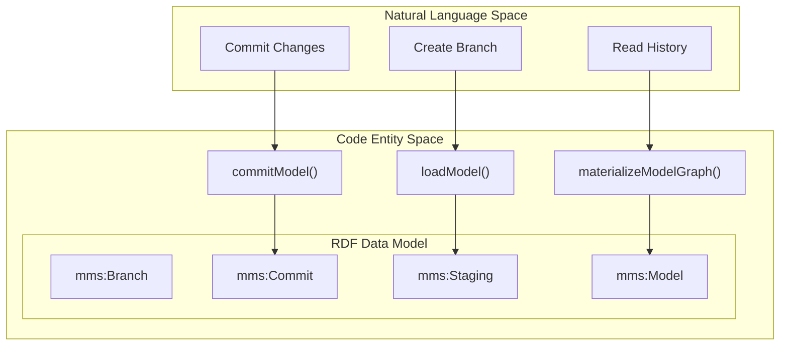
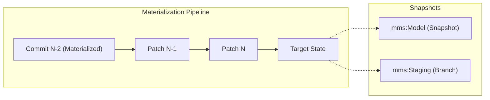

# Page: Graph Materialization and Versioning

# Graph Materialization and Versioning

Relevant source files

The following files were used as context for generating this wiki page:

- [src/main/kotlin/org/openmbee/flexo/mms/routes/gsp/ModelLoad.kt](src/main/kotlin/org/openmbee/flexo/mms/routes/gsp/ModelLoad.kt)
- [src/main/kotlin/org/openmbee/flexo/mms/routes/ldp/GraphMaterialization.kt](src/main/kotlin/org/openmbee/flexo/mms/routes/ldp/GraphMaterialization.kt)
- [src/main/kotlin/org/openmbee/flexo/mms/routes/sparql/ModelCommit.kt](src/main/kotlin/org/openmbee/flexo/mms/routes/sparql/ModelCommit.kt)
- [src/test/kotlin/org/openmbee/flexo/mms/BranchCreate.kt](src/test/kotlin/org/openmbee/flexo/mms/BranchCreate.kt)
- [src/test/kotlin/org/openmbee/flexo/mms/LockCreate.kt](src/test/kotlin/org/openmbee/flexo/mms/LockCreate.kt)

The Flexo MMS Layer 1 Service implements a versioning system that allows for granular tracking of model changes over time. Instead of storing a full copy of the model for every change, the system uses a **Commit and Patch** mechanism. This page provides a high-level overview of how the system manages model history, reconstructs state through materialization, and differentiates between mutable staging environments and immutable snapshots.

### Core Concepts

The versioning architecture relies on the following key entities:
*   **mms:Commit**: Represents a point in time in the repository history, linked to its parent(s) to form a Directed Acyclic Graph (DAG) [src/main/kotlin/org/openmbee/flexo/mms/routes/ldp/GraphMaterialization.kt:84-85]().
*   **mms:Patch**: A compressed SPARQL Update string representing the diff between a commit and its parent [src/main/kotlin/org/openmbee/flexo/mms/routes/ldp/GraphMaterialization.kt:180-191]().
*   **mms:Snapshot**: A reference to a specific RDF graph in the quad-store. Snapshots are categorized into `mms:Staging` (mutable, for branches) and `mms:Model` (immutable, for locks/materialized history) [src/main/kotlin/org/openmbee/flexo/mms/routes/gsp/ModelLoad.kt:66-67](), [src/main/kotlin/org/openmbee/flexo/mms/routes/ldp/GraphMaterialization.kt:46-47]().

### High-Level Versioning Workflow

The following diagram illustrates how the system transitions between natural language concepts (like "Branching") and the underlying code entities and RDF structures.

**Model Versioning Entity Map**

Sources: [src/main/kotlin/org/openmbee/flexo/mms/routes/gsp/ModelLoad.kt:17-23](), [src/main/kotlin/org/openmbee/flexo/mms/routes/sparql/ModelCommit.kt:14-20](), [src/main/kotlin/org/openmbee/flexo/mms/routes/ldp/GraphMaterialization.kt:39-49]()

---

### Commit and Patch Internals

When a user updates a model via SPARQL (`commitModel`) or GSP (`loadModel`), the system does not simply overwrite the graph. It identifies the current `stagingGraphIri` and the `baseCommitIri` [src/main/kotlin/org/openmbee/flexo/mms/routes/gsp/ModelLoad.kt:40-45](). The `diffAndFinalizeCommit` function (documented in child pages) computes the delta, stores it as a patch, and updates the branch metadata.

To prevent race conditions during this process, the system uses a **Transaction Mutex** pattern. A transaction node is created via `createBranchModifyingTransaction` [src/main/kotlin/org/openmbee/flexo/mms/routes/sparql/ModelCommit.kt:37](), ensuring only one modification happens at a time for a specific branch.

For details on the diff algorithm and patch compression, see [Commit and Patch Internals](#5.1).

**Sources:** [src/main/kotlin/org/openmbee/flexo/mms/routes/gsp/ModelLoad.kt:37-76](), [src/main/kotlin/org/openmbee/flexo/mms/routes/sparql/ModelCommit.kt:37-65]()

---

### Graph Materialization Pipeline

Materialization is the process of reconstructing the full state of a model at a specific commit. The `materializeModelGraph` function handles this through an optimized pipeline:

1.  **Cache Check**: It first checks if a `mms:Model` snapshot already exists for that commit [src/main/kotlin/org/openmbee/flexo/mms/routes/ldp/GraphMaterialization.kt:41-62]().
2.  **Ancestor Search**: If not, it finds the nearest ancestor commit that *does* have a materialized graph and copies it to the target graph [src/main/kotlin/org/openmbee/flexo/mms/routes/ldp/GraphMaterialization.kt:65-114]().
3.  **Patch Application**: It retrieves all intermediate patches (`mms:patch`) between that ancestor and the target commit [src/main/kotlin/org/openmbee/flexo/mms/routes/ldp/GraphMaterialization.kt:125-158](), applying them in chronological order [src/main/kotlin/org/openmbee/flexo/mms/routes/ldp/GraphMaterialization.kt:178-191]().
4.  **Snapshotting**: The resulting graph is saved as a new `mms:Model` snapshot to accelerate future requests for that commit.

For details on the SPARQL reconstruction logic, see [Graph Materialization Pipeline](#5.2).

**Sources:** [src/main/kotlin/org/openmbee/flexo/mms/routes/ldp/GraphMaterialization.kt:39-200]()

---

### Staging vs. Model Snapshots

The system distinguishes between two types of graph snapshots to balance performance and data integrity:

| Feature | Staging Snapshot (`mms:Staging`) | Model Snapshot (`mms:Model`) |
| :--- | :--- | :--- |
| **Mutability** | Mutable (Target of `loadModel` / `commitModel`) | Immutable (Read-only record) |
| **Association** | Linked to a `mms:Branch` [src/main/kotlin/org/openmbee/flexo/mms/routes/gsp/ModelLoad.kt:67-68]() | Linked to a `mms:Commit` [src/main/kotlin/org/openmbee/flexo/mms/routes/ldp/GraphMaterialization.kt:47-48]() |
| **Persistence** | Volatile; replaced during commit [src/main/kotlin/org/openmbee/flexo/mms/routes/gsp/ModelLoad.kt:95-96]() | Permanent; cached for history [src/main/kotlin/org/openmbee/flexo/mms/routes/ldp/GraphMaterialization.kt:61-62]() |

When a commit is finalized, the current staging graph is typically dropped [src/main/kotlin/org/openmbee/flexo/mms/routes/gsp/ModelLoad.kt:94-96]() after its state has been captured and a new commit record created.

**Versioning Pipeline Diagram**

Sources: [src/main/kotlin/org/openmbee/flexo/mms/routes/ldp/GraphMaterialization.kt:125-191](), [src/main/kotlin/org/openmbee/flexo/mms/routes/gsp/ModelLoad.kt:40-76]()

---

### Squash Operations

To maintain a clean history, the system supports squashing linear ranges of commits. Tests verify that the materialization logic correctly handles cases where intermediate "auto-created" locks or snapshots are deleted, forcing the pipeline to traverse further back in history to reconstruct state [src/test/kotlin/org/openmbee/flexo/mms/LockCreate.kt:147-176](). This ensures that even if history is "cleaned" or squashed, the model state remains reconstructible from the root or the nearest available snapshot.

**Sources:** [src/test/kotlin/org/openmbee/flexo/mms/LockCreate.kt:147-179](), [src/test/kotlin/org/openmbee/flexo/mms/BranchCreate.kt:137-169]()
