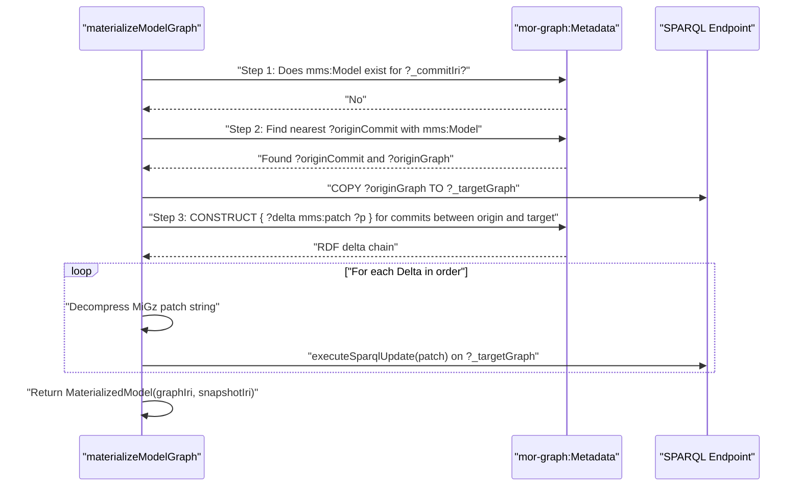
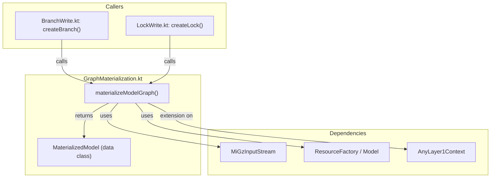

# Page: Graph Materialization Pipeline

# Graph Materialization Pipeline

Relevant source files

The following files were used as context for generating this wiki page:

- [src/main/kotlin/org/openmbee/flexo/mms/Store.kt](src/main/kotlin/org/openmbee/flexo/mms/Store.kt)
- [src/main/kotlin/org/openmbee/flexo/mms/routes/ldp/BranchWrite.kt](src/main/kotlin/org/openmbee/flexo/mms/routes/ldp/BranchWrite.kt)
- [src/main/kotlin/org/openmbee/flexo/mms/routes/ldp/GraphMaterialization.kt](src/main/kotlin/org/openmbee/flexo/mms/routes/ldp/GraphMaterialization.kt)
- [src/main/kotlin/org/openmbee/flexo/mms/routes/ldp/LockWrite.kt](src/main/kotlin/org/openmbee/flexo/mms/routes/ldp/LockWrite.kt)
- [src/test/kotlin/org/openmbee/flexo/mms/BranchCreate.kt](src/test/kotlin/org/openmbee/flexo/mms/BranchCreate.kt)
- [src/test/kotlin/org/openmbee/flexo/mms/LockCreate.kt](src/test/kotlin/org/openmbee/flexo/mms/LockCreate.kt)

The **Graph Materialization Pipeline** is the core mechanism for reconstructing the state of a model at any specific point in its commit history. Since the Flexo MMS Layer 1 Service stores changes as compressed SPARQL patches (`mms:patch`) rather than full graph snapshots for every commit, the system must be able to "materialize" a full RDF graph by traversing the commit tree, finding a base state, and applying intermediate deltas in chronological order.

## The `materializeModelGraph` Function

The primary entry point for this logic is the `materializeModelGraph` function [src/main/kotlin/org/openmbee/flexo/mms/routes/ldp/GraphMaterialization.kt:39-39](). This function is designed to be idempotent: if a materialized graph already exists for the requested commit, it is reused; otherwise, it is generated and cached as a new `mms:Model` snapshot.

### Pipeline Logic Flow

The materialization process follows a four-step sequence:

1.  **Check Cache**: Queries the `mor-graph:Metadata` graph to see if any `mms:Lock` or snapshot already points to an `mms:Model` for the target `commitIri` [src/main/kotlin/org/openmbee/flexo/mms/routes/ldp/GraphMaterialization.kt:41-62]().
2.  **Find Nearest Ancestor**: If no cache exists, the system searches the commit history (`mms:parent+`) for the closest ancestor that *does* have a materialized `mms:Model` snapshot. It uses a `FILTER NOT EXISTS` pattern to ensure it finds the most recent materialized ancestor [src/main/kotlin/org/openmbee/flexo/mms/routes/ldp/GraphMaterialization.kt:65-122]().
3.  **Collect Deltas**: The system identifies all intermediate commits between the found ancestor and the target commit, retrieving their associated `mms:patch` data via a `CONSTRUCT` query [src/main/kotlin/org/openmbee/flexo/mms/routes/ldp/GraphMaterialization.kt:125-165]().
4.  **Sequential Application**: The patches (compressed SPARQL Update strings) are decompressed and applied one-by-one to a copy of the ancestor's graph to produce the final state [src/main/kotlin/org/openmbee/flexo/mms/routes/ldp/GraphMaterialization.kt:168-200]().

### Data Flow Diagram

The following diagram illustrates how the `materializeModelGraph` function interacts with the SPARQL store to reconstruct a graph.

**Graph Reconstruction Sequence**

Sources: [src/main/kotlin/org/openmbee/flexo/mms/routes/ldp/GraphMaterialization.kt:39-200]()

## Implementation Details

### Ancestor Discovery
The discovery of the "nearest" ancestor is performed using a SPARQL `FILTER NOT EXISTS` pattern to ensure the system doesn't skip over a more recent snapshot. It looks for an `originCommit` such that no `heirCommit` exists between the target and the origin that also has a materialized model snapshot [src/main/kotlin/org/openmbee/flexo/mms/routes/ldp/GraphMaterialization.kt:88-96]().

### Patch Application
Patches are stored as GZIP-compressed SPARQL Update strings using the `MiGz` library [src/main/kotlin/org/openmbee/flexo/mms/routes/ldp/GraphMaterialization.kt:3-3](). During materialization, the system:
1.  Iterates through the commits from oldest to newest by following the `mms:parent` chain [src/main/kotlin/org/openmbee/flexo/mms/routes/ldp/GraphMaterialization.kt:178-182]().
2.  Extracts the `mms:patch` literal from the `mms:CommitData` [src/main/kotlin/org/openmbee/flexo/mms/routes/ldp/GraphMaterialization.kt:185-189]().
3.  Decompresses the byte array into a UTF-8 string [src/main/kotlin/org/openmbee/flexo/mms/routes/ldp/GraphMaterialization.kt:193-196]().
4.  Executes the resulting SPARQL Update against the target graph [src/main/kotlin/org/openmbee/flexo/mms/routes/ldp/GraphMaterialization.kt:199-199]().

### Integration with Branch and Lock Creation
The materialization pipeline is triggered whenever a new reference (Branch or Lock) is created from a specific commit or another reference.

| Target Resource | Function | Role of Materialization |
| :--- | :--- | :--- |
| **Branch** | `createBranch` | Materializes the source commit's graph and copies it to a new `mms:Staging` graph [src/main/kotlin/org/openmbee/flexo/mms/routes/ldp/BranchWrite.kt:70-75](). |
| **Lock** | `createLock` | Materializes the source commit's graph and creates an immutable `mms:Model` snapshot [src/main/kotlin/org/openmbee/flexo/mms/routes/ldp/LockWrite.kt:65-66](). |

Sources: [src/main/kotlin/org/openmbee/flexo/mms/routes/ldp/BranchWrite.kt:68-75](), [src/main/kotlin/org/openmbee/flexo/mms/routes/ldp/LockWrite.kt:63-66]()

## Code Entity Mapping

The following diagram bridges the functional requirements of materialization to the specific Kotlin classes and functions in the codebase.

**Code Entity Association**

Sources: [src/main/kotlin/org/openmbee/flexo/mms/routes/ldp/GraphMaterialization.kt:22-39](), [src/main/kotlin/org/openmbee/flexo/mms/routes/ldp/BranchWrite.kt:70-70](), [src/main/kotlin/org/openmbee/flexo/mms/routes/ldp/LockWrite.kt:65-65]()

## Impact of Squash Operations

The `squashCommits` operation interacts with the materialization pipeline by essentially "pre-materializing" the difference between two points in history. It computes a new diff between two materialized graphs and replaces the patch of the destination commit with a single squashed update. This optimizes future materialization calls by reducing the number of intermediate deltas that must be applied.

Sources: [src/test/kotlin/org/openmbee/flexo/mms/BranchCreate.kt:137-168](), [src/test/kotlin/org/openmbee/flexo/mms/LockCreate.kt:101-145]()
