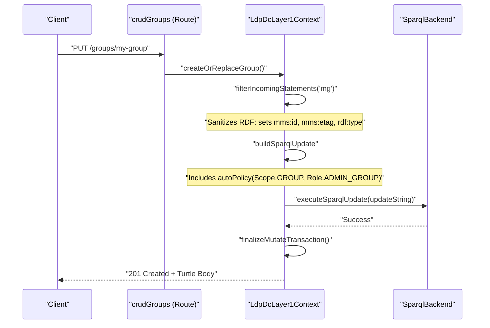
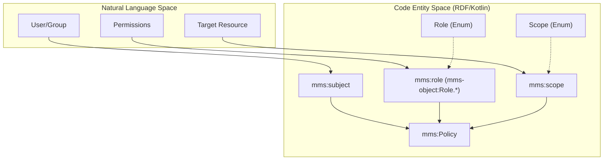

# Page: Groups and Policies API

# Groups and Policies API

Relevant source files

The following files were used as context for generating this wiki page:

- [deploy/src/main.ts](deploy/src/main.ts)
- [src/main/kotlin/org/openmbee/flexo/mms/AccessControl.kt](src/main/kotlin/org/openmbee/flexo/mms/AccessControl.kt)
- [src/main/kotlin/org/openmbee/flexo/mms/routes/Groups.kt](src/main/kotlin/org/openmbee/flexo/mms/routes/Groups.kt)
- [src/main/kotlin/org/openmbee/flexo/mms/routes/Policies.kt](src/main/kotlin/org/openmbee/flexo/mms/routes/Policies.kt)
- [src/main/kotlin/org/openmbee/flexo/mms/routes/ldp/AnyMutate.kt](src/main/kotlin/org/openmbee/flexo/mms/routes/ldp/AnyMutate.kt)
- [src/main/kotlin/org/openmbee/flexo/mms/routes/ldp/GroupRead.kt](src/main/kotlin/org/openmbee/flexo/mms/routes/ldp/GroupRead.kt)
- [src/main/kotlin/org/openmbee/flexo/mms/routes/ldp/GroupWrite.kt](src/main/kotlin/org/openmbee/flexo/mms/routes/ldp/GroupWrite.kt)
- [src/main/kotlin/org/openmbee/flexo/mms/routes/ldp/PolicyWrite.kt](src/main/kotlin/org/openmbee/flexo/mms/routes/ldp/PolicyWrite.kt)
- [src/test/kotlin/org/openmbee/flexo/mms/GroupAny.kt](src/test/kotlin/org/openmbee/flexo/mms/GroupAny.kt)
- [src/test/kotlin/org/openmbee/flexo/mms/GroupLdpDc.kt](src/test/kotlin/org/openmbee/flexo/mms/GroupLdpDc.kt)

The Groups and Policies API provides RESTful endpoints for managing access control subjects and the rules that govern their permissions at runtime. This system allows for the dynamic definition of user groups and the assignment of roles to those groups (or individual users) within specific scopes.

## 1. Overview and Slug Validation

The service implements a Linked Data Platform (LDP) approach for managing `mms:Group` and `mms:Policy` resources. A key requirement for group management is compatibility with external identity providers.

### LDAP-Compatible Slugs
Group identifiers (slugs) must conform to a specific regex to ensure they can represent LDAP Distinguished Names (DNs) or other complex identifiers often found in enterprise directory services.
*   **Regex**: `[/?&=,._\pL0-9-]{3,256}` [src/main/kotlin/org/openmbee/flexo/mms/AccessControl.kt:3-3]().
*   **Validation**: This regex is enforced during routing for both collection-level and member-level group endpoints using the `legalSlugRegex` property of the `linkedDataPlatformDirectContainer` [src/main/kotlin/org/openmbee/flexo/mms/routes/Groups.kt:21-21](), [src/main/kotlin/org/openmbee/flexo/mms/routes/Groups.kt:45-45]().

## 2. Group Management

Groups are collections of users (Agents) that can be targeted by policies. They are stored in the `m-graph:AccessControl.Agents` named graph [src/main/kotlin/org/openmbee/flexo/mms/routes/ldp/GroupWrite.kt:132-134]().

### API Endpoints
| Method | Path | Description |
| :--- | :--- | :--- |
| `GET` | `/groups` | Lists all groups the requester is permitted to read [src/main/kotlin/org/openmbee/flexo/mms/routes/Groups.kt:29-31](). |
| `POST` | `/groups` | Creates a new group with a server-generated or client-provided slug [src/main/kotlin/org/openmbee/flexo/mms/routes/Groups.kt:34-40](). |
| `GET` | `/groups/{groupId}` | Retrieves metadata for a specific group [src/main/kotlin/org/openmbee/flexo/mms/routes/Groups.kt:59-61](). |
| `PUT` | `/groups/{groupId}` | Creates or replaces a specific group [src/main/kotlin/org/openmbee/flexo/mms/routes/Groups.kt:64-66](). |

### Data Flow: Creating a Group
The following diagram illustrates the transition from a REST request to the SPARQL update that persists a group.

**Group Creation Flow**

**Sources:** [src/main/kotlin/org/openmbee/flexo/mms/routes/Groups.kt:64-66](), [src/main/kotlin/org/openmbee/flexo/mms/routes/ldp/GroupWrite.kt:37-67](), [src/main/kotlin/org/openmbee/flexo/mms/routes/ldp/GroupWrite.kt:118-156]()

## 3. Policy Management

Policies (`mms:Policy`) bind a **Subject** (User or Group) to one or more **Roles** within a specific **Scope**. Policies are stored in the `m-graph:AccessControl.Policies` named graph [src/main/kotlin/org/openmbee/flexo/mms/routes/ldp/PolicyWrite.kt:148-150]().

### Policy Structure
A valid policy submission must include:
1.  `mms:subject`: The URI of the user or group [src/main/kotlin/org/openmbee/flexo/mms/routes/ldp/PolicyWrite.kt:47-47]().
2.  `mms:scope`: The URI representing the resource or cluster level [src/main/kotlin/org/openmbee/flexo/mms/routes/ldp/PolicyWrite.kt:50-50]().
3.  `mms:role`: One or more URIs of defined roles (e.g., `mms-object:Role.AdminRepo`) [src/main/kotlin/org/openmbee/flexo/mms/routes/ldp/PolicyWrite.kt:53-53]().

These are validated and sanitized during the `createOrReplacePolicy` execution [src/main/kotlin/org/openmbee/flexo/mms/routes/ldp/PolicyWrite.kt:43-65]().

### Auto-Policy Mechanism
When a new resource (like a Group or Org) is created, the system can automatically generate a policy granting the creator administrative rights over that resource. This is handled via the `autoPolicy` function within the `txn` block of a SPARQL update [src/main/kotlin/org/openmbee/flexo/mms/routes/ldp/GroupWrite.kt:128-128]().

**Entity Mapping: Policy Components**

**Sources:** [src/main/kotlin/org/openmbee/flexo/mms/routes/ldp/PolicyWrite.kt:43-65](), [src/main/kotlin/org/openmbee/flexo/mms/AccessControl.kt:100-112](), [src/main/kotlin/org/openmbee/flexo/mms/AccessControl.kt:12-28]()

## 4. Implementation Details

### Runtime Read Operations
Reading groups or policies involves a SPARQL `CONSTRUCT` query that joins the agent/policy data with permission checks. The `permittedActionSparqlBgp` function generates the necessary graph patterns to ensure the requester has `READ_GROUP` or `READ_POLICY` permissions on the `CLUSTER` scope [src/main/kotlin/org/openmbee/flexo/mms/routes/ldp/GroupRead.kt:32-35]().

### Condition Evaluation
Before a group or policy is modified, the service evaluates several conditions:
1.  **Existence**: Using `groupExists()` or `policyExists()` [src/main/kotlin/org/openmbee/flexo/mms/routes/ldp/GroupWrite.kt:82-82](), [src/main/kotlin/org/openmbee/flexo/mms/routes/ldp/PolicyWrite.kt:98-98]().
2.  **Permissions**:
    *   `CREATE_GROUP` / `CREATE_POLICY` for new resources [src/main/kotlin/org/openmbee/flexo/mms/routes/ldp/GroupWrite.kt:113-113](), [src/main/kotlin/org/openmbee/flexo/mms/routes/ldp/PolicyWrite.kt:129-129]().
    *   `UPDATE_GROUP` / `UPDATE_POLICY` for replacements [src/main/kotlin/org/openmbee/flexo/mms/routes/ldp/GroupWrite.kt:108-108](), [src/main/kotlin/org/openmbee/flexo/mms/routes/ldp/PolicyWrite.kt:124-124]().
3.  **ETag Preconditions**: If the request contains `If-Match`, the current `mms:etag` in the graph must match the provided value [src/main/kotlin/org/openmbee/flexo/mms/routes/ldp/GroupWrite.kt:92-101]().

### SPARQL Update Structure
Updates for groups and policies follow a standard pattern:
1.  **DELETE**: Removes existing triples if `replaceExisting` is true [src/main/kotlin/org/openmbee/flexo/mms/routes/ldp/GroupWrite.kt:119-123]().
2.  **INSERT**: Adds the new resource triples and the transaction metadata [src/main/kotlin/org/openmbee/flexo/mms/routes/ldp/GroupWrite.kt:124-135]().
3.  **WHERE**: Enforces the conditions (Permissions and ETags) [src/main/kotlin/org/openmbee/flexo/mms/routes/ldp/GroupWrite.kt:136-139]().

### Initialization Schema
The initial set of users, groups, and policies is defined in the deployment schema. For example, a `SuperAdmins` group is initialized with a default policy granting cluster-wide administrative roles [deploy/src/main.ts:194-219]().

**Sources:** [src/main/kotlin/org/openmbee/flexo/mms/routes/ldp/GroupWrite.kt:70-140](), [src/main/kotlin/org/openmbee/flexo/mms/routes/ldp/PolicyWrite.kt:86-156](), [src/main/kotlin/org/openmbee/flexo/mms/routes/ldp/GroupRead.kt:13-60](), [deploy/src/main.ts:177-219]()
