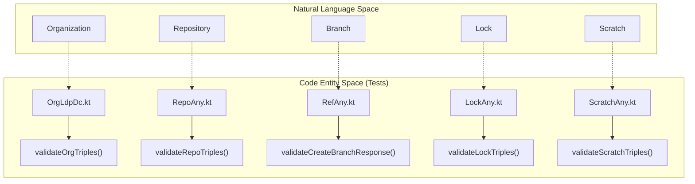
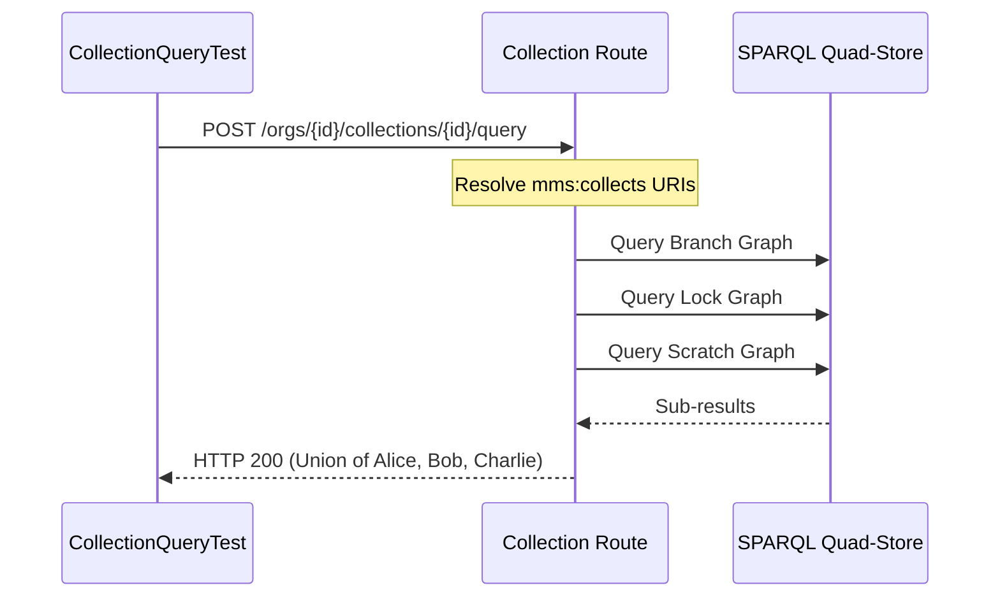

# Page: Integration Test Suites

# Integration Test Suites

Relevant source files

The following files were used as context for generating this wiki page:

- [src/main/kotlin/org/openmbee/flexo/mms/routes/Branches.kt](src/main/kotlin/org/openmbee/flexo/mms/routes/Branches.kt)
- [src/main/kotlin/org/openmbee/flexo/mms/routes/SquashCommits.kt](src/main/kotlin/org/openmbee/flexo/mms/routes/SquashCommits.kt)
- [src/main/kotlin/org/openmbee/flexo/mms/routes/sparql/RepoQuery.kt](src/main/kotlin/org/openmbee/flexo/mms/routes/sparql/RepoQuery.kt)
- [src/test/kotlin/org/openmbee/flexo/mms/BranchRead.kt](src/test/kotlin/org/openmbee/flexo/mms/BranchRead.kt)
- [src/test/kotlin/org/openmbee/flexo/mms/CollectionQueryTest.kt](src/test/kotlin/org/openmbee/flexo/mms/CollectionQueryTest.kt)
- [src/test/kotlin/org/openmbee/flexo/mms/CommitAny.kt](src/test/kotlin/org/openmbee/flexo/mms/CommitAny.kt)
- [src/test/kotlin/org/openmbee/flexo/mms/CommitLdpDc.kt](src/test/kotlin/org/openmbee/flexo/mms/CommitLdpDc.kt)
- [src/test/kotlin/org/openmbee/flexo/mms/GroupAny.kt](src/test/kotlin/org/openmbee/flexo/mms/GroupAny.kt)
- [src/test/kotlin/org/openmbee/flexo/mms/GroupLdpDc.kt](src/test/kotlin/org/openmbee/flexo/mms/GroupLdpDc.kt)
- [src/test/kotlin/org/openmbee/flexo/mms/LockAny.kt](src/test/kotlin/org/openmbee/flexo/mms/LockAny.kt)
- [src/test/kotlin/org/openmbee/flexo/mms/LockQuery.kt](src/test/kotlin/org/openmbee/flexo/mms/LockQuery.kt)
- [src/test/kotlin/org/openmbee/flexo/mms/ModelAny.kt](src/test/kotlin/org/openmbee/flexo/mms/ModelAny.kt)
- [src/test/kotlin/org/openmbee/flexo/mms/ModelCommit.kt](src/test/kotlin/org/openmbee/flexo/mms/ModelCommit.kt)
- [src/test/kotlin/org/openmbee/flexo/mms/ModelLoad.kt](src/test/kotlin/org/openmbee/flexo/mms/ModelLoad.kt)
- [src/test/kotlin/org/openmbee/flexo/mms/ModelQuery.kt](src/test/kotlin/org/openmbee/flexo/mms/ModelQuery.kt)
- [src/test/kotlin/org/openmbee/flexo/mms/ModelRead.kt](src/test/kotlin/org/openmbee/flexo/mms/ModelRead.kt)
- [src/test/kotlin/org/openmbee/flexo/mms/OrgAny.kt](src/test/kotlin/org/openmbee/flexo/mms/OrgAny.kt)
- [src/test/kotlin/org/openmbee/flexo/mms/OrgLdpDc.kt](src/test/kotlin/org/openmbee/flexo/mms/OrgLdpDc.kt)
- [src/test/kotlin/org/openmbee/flexo/mms/PolicyCreate.kt](src/test/kotlin/org/openmbee/flexo/mms/PolicyCreate.kt)
- [src/test/kotlin/org/openmbee/flexo/mms/RefAny.kt](src/test/kotlin/org/openmbee/flexo/mms/RefAny.kt)
- [src/test/kotlin/org/openmbee/flexo/mms/RepoAny.kt](src/test/kotlin/org/openmbee/flexo/mms/RepoAny.kt)
- [src/test/kotlin/org/openmbee/flexo/mms/RepoQuery.kt](src/test/kotlin/org/openmbee/flexo/mms/RepoQuery.kt)
- [src/test/kotlin/org/openmbee/flexo/mms/ScratchAny.kt](src/test/kotlin/org/openmbee/flexo/mms/ScratchAny.kt)
- [src/test/kotlin/org/openmbee/flexo/mms/ScratchLdpDc.kt](src/test/kotlin/org/openmbee/flexo/mms/ScratchLdpDc.kt)
- [src/test/kotlin/org/openmbee/flexo/mms/ScratchLoad.kt](src/test/kotlin/org/openmbee/flexo/mms/ScratchLoad.kt)
- [src/test/kotlin/org/openmbee/flexo/mms/ScratchQuery.kt](src/test/kotlin/org/openmbee/flexo/mms/ScratchQuery.kt)
- [src/test/kotlin/org/openmbee/flexo/mms/SquashCommits.kt](src/test/kotlin/org/openmbee/flexo/mms/SquashCommits.kt)
- [src/test/kotlin/org/openmbee/flexo/mms/util/Requests.kt](src/test/kotlin/org/openmbee/flexo/mms/util/Requests.kt)

This page describes the integration test coverage for the Flexo MMS Layer 1 Service. The test suite is designed to validate the end-to-end behavior of the service, ensuring that RDF resources are correctly managed, access control policies are enforced, and SPARQL-based operations (commits, queries, materialization, and squashing) function as expected.

## Test Infrastructure Overview

The integration tests leverage the `Ktor` `testApplication` framework to simulate HTTP requests against a running instance of the service. Tests are organized into classes that typically inherit from a base "Any" class (e.g., `RepoAny`, `RefAny`) which provides common setup logic, such as creating prerequisite Organizations or Repositories.

### Key Base Classes
- **`OrgAny`**: Provides setup for Organization-related tests [src/test/kotlin/org/openmbee/flexo/mms/OrgAny.kt:54-77]().
- **`RepoAny`**: Inherits from `OrgAny` and ensures a parent Organization exists before Repository tests run [src/test/kotlin/org/openmbee/flexo/mms/RepoAny.kt:108-138]().
- **`RefAny`**: Inherits from `RepoAny` and ensures a parent Repository exists for Branch and Lock tests [src/test/kotlin/org/openmbee/flexo/mms/RefAny.kt:16-41]().
- **`ModelAny`**: Extends `RefAny` to provide shared SPARQL update and load data for model-level testing [src/test/kotlin/org/openmbee/flexo/mms/ModelAny.kt:9-22]().

### Data Flow and Validation
Tests utilize a `TriplesAsserter` DSL to validate the RDF content of HTTP responses. This ensures that every resource creation or update results in the correct triples being stored in the quad-store. The `httpRequest` utility in `Requests.kt` automatically handles authentication using `rootAuth` or `anonAuth` to test permission enforcement [src/test/kotlin/org/openmbee/flexo/mms/util/Requests.kt:82-110]().

**System Entity Mapping Diagram**
This diagram bridges the natural language resource concepts to the code entities responsible for validating them in the test suite.

*Sources: [src/test/kotlin/org/openmbee/flexo/mms/OrgAny.kt:11-32](), [src/test/kotlin/org/openmbee/flexo/mms/RepoAny.kt:14-47](), [src/test/kotlin/org/openmbee/flexo/mms/RefAny.kt:43-73](), [src/test/kotlin/org/openmbee/flexo/mms/LockAny.kt:11-29](), [src/test/kotlin/org/openmbee/flexo/mms/ScratchAny.kt:50-72]()*

---

## Resource-Specific Test Suites

### Organizations (Org)
Organization tests validate CRUD operations and Linked Data Platform (LDP) compliance.
- **Validation**: Ensures the presence of `mms:Org` type, `mms:id`, and `dct:title` [src/test/kotlin/org/openmbee/flexo/mms/OrgAny.kt:20-31]().
- **LDP Compliance**: `OrgLdpDc` tests the `DirectContainer` behavior, including POST/PUT/GET and ETag handling [src/test/kotlin/org/openmbee/flexo/mms/OrgLdpDc.kt:11-53]().

### Repositories (Repo)
Repository tests cover the initialization of a repository, including its metadata graph and the default `master` branch.
- **Metadata**: Validates that a new repository creates a `master` branch pointing to an initial commit [src/test/kotlin/org/openmbee/flexo/mms/RepoAny.kt:50-70]().
- **Queries**: `RepoQuery` tests metadata graph retrieval and SPARQL queries against the repository's internal state [src/test/kotlin/org/openmbee/flexo/mms/RepoQuery.kt:15-103]().

### Branches and Locks
These tests focus on the lifecycle of references (`mms:Ref`).
- **Branches**: Validates branch creation from existing commits or other branches, ensuring the `mms:Branch` type and associated `mms:commit` pointer are correct [src/test/kotlin/org/openmbee/flexo/mms/RefAny.kt:43-73]().
- **Locks**: Validates immutable snapshots. `LockAny` ensures a lock correctly points to a specific `mms:Commit` and its materialized `mms:Snapshot` [src/test/kotlin/org/openmbee/flexo/mms/LockAny.kt:11-29]().

### Model Operations (Commit, Load, Query)
Model tests verify the core transactional logic of the service.
- **Commit**: `ModelCommit` tests SPARQL updates on branches, verifying that multiple operations (insert, delete, delete-where) result in a single new commit and correct final graph state [src/test/kotlin/org/openmbee/flexo/mms/ModelCommit.kt:51-108]().
- **Load**: `ModelLoad` tests the bulk `PUT` of Turtle data to the `/graph` endpoint, verifying that the system correctly computes diffs between the new state and the previous commit [src/test/kotlin/org/openmbee/flexo/mms/ModelLoad.kt:42-117]().
- **Query**: Validates SPARQL SELECT/ASK/CONSTRUCT queries against branches or locks [src/test/kotlin/org/openmbee/flexo/mms/RepoQuery.kt:28-44]().

### Squash Commits
The `SquashCommits` test suite validates the ability to collapse a range of commits into a single patch.
- **Linearity**: Verifies that squashing fails (400) if there is no linear commit path between the source and destination locks [src/test/kotlin/org/openmbee/flexo/mms/SquashCommits.kt:94-129]().
- **Integrity**: Ensures that after a squash, the model graph state remains identical to the state at the destination lock prior to the squash [src/test/kotlin/org/openmbee/flexo/mms/SquashCommits.kt:12-92]().

### Scratches
Scratches are tested as temporary workspaces.
- **Interaction**: `ScratchLoad` and `ScratchQuery` verify that scratches behave as isolated RDF graphs within a repository [src/test/kotlin/org/openmbee/flexo/mms/ScratchAny.kt:50-72]().
- **Persistence**: Validates that triples inserted into a scratch graph via GSP or SPARQL Update are retrievable [src/test/kotlin/org/openmbee/flexo/mms/ScratchAny.kt:50-72]().

### Collections
Collection tests focus on the aggregation of multiple references into a single queryable virtual graph.
- **Union Queries**: Verifies that a collection can aggregate data from a branch, a lock, and a scratch simultaneously, returning a union of results [src/test/kotlin/org/openmbee/flexo/mms/CollectionQueryTest.kt:94-135]().
- **Cross-Repo Support**: Validates that collections can span multiple repositories within the same organization [src/test/kotlin/org/openmbee/flexo/mms/CollectionQueryTest.kt:25-58]().

**Collection Query Data Flow**

*Sources: [src/test/kotlin/org/openmbee/flexo/mms/CollectionQueryTest.kt:94-135](), [src/test/kotlin/org/openmbee/flexo/mms/CollectionAny.kt:41-71]()*

---

## Access Control and Groups
Integration tests verify that the system's authorization model is applied to all resource operations.
- **Groups**: `GroupLdpDc` tests the management of user groups and slug validation [src/test/kotlin/org/openmbee/flexo/mms/GroupLdpDc.kt:1-20]().
- **Auto-Policies**: Most "Created" validation functions (e.g., `validateCreatedRepoTriples`) check that the system automatically generates an ownership policy for the resource creator [src/test/kotlin/org/openmbee/flexo/mms/RepoAny.kt:85-97](), [src/test/kotlin/org/openmbee/flexo/mms/OrgAny.kt:43-48]().

## Test Execution Summary

| Resource | Test Class | Key Functionality |
| :--- | :--- | :--- |
| **Org** | `OrgLdpDc` | CRUD, LDP Direct Container, Metadata validation |
| **Repo** | `RepoQuery` | Metadata graph access, SPARQL queries on repo state |
| **Branch** | `BranchRead` | Branch lifecycle, Materialization checks |
| **Lock** | `LockQuery` | Immutable snapshot querying |
| **Model** | `ModelCommit` | SPARQL Update based commits and graph integrity |
| **Model** | `ModelLoad` | Bulk PUT graph updates and diff computation |
| **Squash** | `SquashCommits` | Linear commit range collapsing and patch replacement |
| **Collection** | `CollectionQueryTest` | Virtual graph aggregation across refs/repos |
| **Scratch** | `ScratchLdpDc` | Workspace creation, GSP/SPARQL updates |
| **Group** | `GroupLdpDc` | Group management and slug validation |

*Sources: [src/test/kotlin/org/openmbee/flexo/mms/OrgLdpDc.kt:11-12](), [src/test/kotlin/org/openmbee/flexo/mms/RepoQuery.kt:15](), [src/test/kotlin/org/openmbee/flexo/mms/CollectionQueryTest.kt:11](), [src/test/kotlin/org/openmbee/flexo/mms/ModelCommit.kt:11](), [src/test/kotlin/org/openmbee/flexo/mms/ModelLoad.kt:15](), [src/test/kotlin/org/openmbee/flexo/mms/SquashCommits.kt:10]()*
