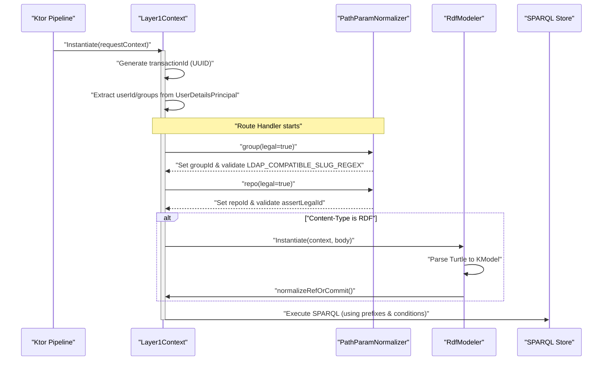
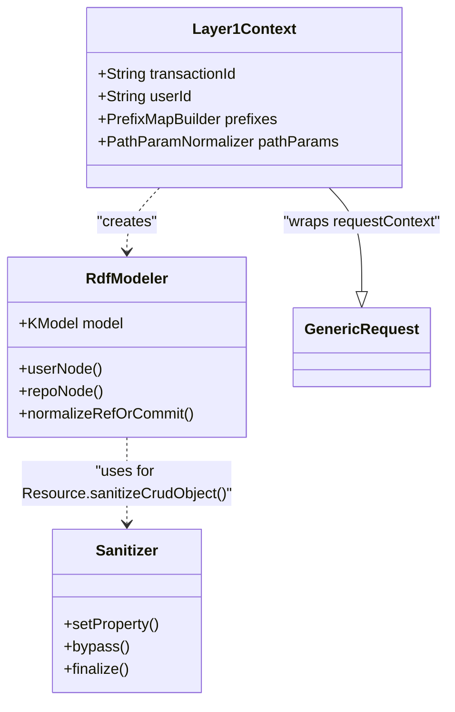

# Page: Layer1Context and Request Lifecycle

# Layer1Context and Request Lifecycle

Relevant source files

The following files were used as context for generating this wiki page:

- [src/main/kotlin/org/openmbee/flexo/mms/EntityTags.kt](src/main/kotlin/org/openmbee/flexo/mms/EntityTags.kt)
- [src/main/kotlin/org/openmbee/flexo/mms/Layer1Context.kt](src/main/kotlin/org/openmbee/flexo/mms/Layer1Context.kt)

The `Layer1Context` class is the central orchestrator for every request within the Flexo MMS Layer 1 Service. It encapsulates the state of an HTTP request, including authentication, resource identifiers, and ETag preconditions, while providing a bridge to the underlying SPARQL execution pipeline.

## The Layer1Context Class

The `Layer1Context` [src/main/kotlin/org/openmbee/flexo/mms/Layer1Context.kt:47-50]() is a generic class that wraps a `TRequestContext` (extending `GenericRequest`) and a `TResponseContext` (extending `GenericResponse`). It is instantiated for every incoming request to provide a consistent environment for route handlers.

### Key Responsibilities
1.  **Identity Management**: Extracts `userId` and `groups` from the `UserDetailsPrincipal` [src/main/kotlin/org/openmbee/flexo/mms/Layer1Context.kt:67-71]().
2.  **Transaction Tracking**: Generates a unique `transactionId` (UUID) used for logging and correlating SPARQL updates [src/main/kotlin/org/openmbee/flexo/mms/Layer1Context.kt:64]().
3.  **Resource Identification**: Stores IDs for various MMS resources (Org, Repo, Branch, etc.) parsed from path parameters [src/main/kotlin/org/openmbee/flexo/mms/Layer1Context.kt:90-101]().
4.  **Precondition Handling**: Parses `If-Match` and `If-None-Match` headers into `EtagQualifier` objects for optimistic concurrency control [src/main/kotlin/org/openmbee/flexo/mms/Layer1Context.kt:74-75]().

### Request Lifecycle Diagram

This diagram illustrates how a request flows from the Ktor server into the `Layer1Context` and through the normalization phases.

**Diagram: Request Initialization and Normalization**

Sources: [src/main/kotlin/org/openmbee/flexo/mms/Layer1Context.kt:47-117](), [src/main/kotlin/org/openmbee/flexo/mms/Layer1Context.kt:136-199](), [src/main/kotlin/org/openmbee/flexo/mms/Layer1Context.kt:64-71]()

---

## Parameter Normalization

The context uses inner classes `PathParamNormalizer` and `QueryParamNormalizer` to safely extract and validate parameters.

### Path Parameters
The `PathParamNormalizer` [src/main/kotlin/org/openmbee/flexo/mms/Layer1Context.kt:136]() provides methods for each resource type (e.g., `group()`, `org()`, `repo()`, `branch()`).
-   **Validation**: When `legal=true` is passed, it invokes `assertLegalId()` to ensure the ID matches required patterns (e.g., `LDAP_COMPATIBLE_SLUG_REGEX` for groups) [src/main/kotlin/org/openmbee/flexo/mms/Layer1Context.kt:137-140]().
-   **Strictness**: Missing required parameters like `groupId` or `commitId` result in an `Http400Exception` [src/main/kotlin/org/openmbee/flexo/mms/Layer1Context.kt:138-158]().

### Prefix Mapping
The `prefixes` property [src/main/kotlin/org/openmbee/flexo/mms/Layer1Context.kt:102-117]() dynamically generates a `PrefixMapBuilder` based on the currently parsed IDs. This ensures that SPARQL queries are constructed using the correct IRIs for the specific organization, repository, or branch in scope.

Sources: [src/main/kotlin/org/openmbee/flexo/mms/Layer1Context.kt:102-199]()

---

## ETag Preconditions and Concurrency

The service implements HTTP/1.1 optimistic concurrency using ETags. The `Layer1Context` facilitates this by parsing headers and injecting them into the SPARQL execution pipeline.

| Header | Code Entity | Purpose |
| :--- | :--- | :--- |
| `If-Match` | `ifMatch` | Ensures the resource version matches the provided ETag before modification [src/main/kotlin/org/openmbee/flexo/mms/Layer1Context.kt:74](). |
| `If-None-Match` | `ifNoneMatch` | Ensures the resource has changed (or doesn't exist) before proceeding [src/main/kotlin/org/openmbee/flexo/mms/Layer1Context.kt:75](). |

### Precondition Injection
The extension function `injectPreconditions()` [src/main/kotlin/org/openmbee/flexo/mms/EntityTags.kt:33-49]() converts these headers into SPARQL `VALUES` blocks and `FILTER` statements:
-   `ifMatch` results in a `values ?__mms_etag { ... }` block [src/main/kotlin/org/openmbee/flexo/mms/EntityTags.kt:35-39]().
-   `ifNoneMatch` results in a `filter(?__mms_etag != ?__mms_etagNot)` check [src/main/kotlin/org/openmbee/flexo/mms/EntityTags.kt:41-46]().

These are typically evaluated within a `ConditionsBuilder` via `assertPreconditions()` [src/main/kotlin/org/openmbee/flexo/mms/EntityTags.kt:50-64]().

Sources: [src/main/kotlin/org/openmbee/flexo/mms/EntityTags.kt:10-64](), [src/main/kotlin/org/openmbee/flexo/mms/Layer1Context.kt:74-75]()

---

## RDF Modeling and Sanitization

When a request contains an RDF body (e.g., PUT or POST), the `RdfModeler` is used to bridge the raw Turtle/JSON-LD content into the system's logic.

### RdfModeler
The `RdfModeler` [src/main/kotlin/org/openmbee/flexo/mms/RdfModeler.kt:19]() creates a `KModel` using the prefixes from the `Layer1Context`. It provides helper methods to locate specific nodes in the input graph:
-   `userNode()`, `orgNode()`, `repoNode()`, etc., which resolve the correct IRI based on the context's parameters [src/main/kotlin/org/openmbee/flexo/mms/RdfModeler.kt:30-72]().
-   `normalizeRefOrCommit()`: Extracts source information from `mms:ref` or `mms:commit` predicates and stores them in the context [src/main/kotlin/org/openmbee/flexo/mms/RdfModeler.kt:78-108]().

### Sanitizer
To prevent users from overwriting system-managed metadata, the `Sanitizer` [src/main/kotlin/org/openmbee/flexo/mms/Sanitizer.kt:19]() is employed.
-   **Forbidden Namespaces**: It prevents setting properties in restricted namespaces like `rdf:`, `rdfs:`, `owl:`, and `mms:` [src/main/kotlin/org/openmbee/flexo/mms/Sanitizer.kt:10-16]().
-   **Mandatory Values**: Handlers can use `setProperty()` to force specific triples (e.g., ensuring a resource's IRI matches the URL it was posted to) while stripping any conflicting values provided by the user [src/main/kotlin/org/openmbee/flexo/mms/Sanitizer.kt:25-57]().

**Diagram: Entity Mapping**

Sources: [src/main/kotlin/org/openmbee/flexo/mms/RdfModeler.kt:19-150](), [src/main/kotlin/org/openmbee/flexo/mms/Sanitizer.kt:19-112](), [src/main/kotlin/org/openmbee/flexo/mms/Layer1Context.kt:47-50]()

---

## SPARQL Execution Pipeline

The final stage of the request lifecycle involves executing SPARQL against the quad-store.

1.  **Directive Replacement**: The context supports `# @values {PARAM_ID}` directives in hardcoded SPARQL strings, which are replaced with escaped literals at runtime using `replaceValuesDirectives()` [src/main/kotlin/org/openmbee/flexo/mms/Layer1Context.kt:31-37]().
2.  **Pipeline Integration**: The context is passed into the `ConditionsEngine` to validate that the user has permissions and that the target resources exist before any update is committed.
3.  **Response Generation**: Once the SPARQL operation completes, the `responseContext` [src/main/kotlin/org/openmbee/flexo/mms/Layer1Context.kt:49]() is used to build the final RDF response, often including the `transactionId` as part of the response metadata.

Sources: [src/main/kotlin/org/openmbee/flexo/mms/Layer1Context.kt:31-37](), [src/main/kotlin/org/openmbee/flexo/mms/Layer1Context.kt:47-50]()
