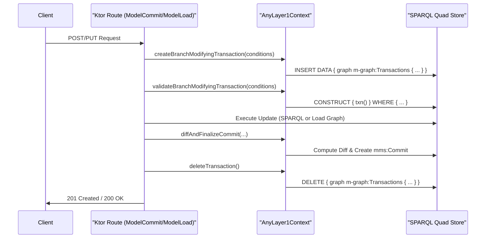
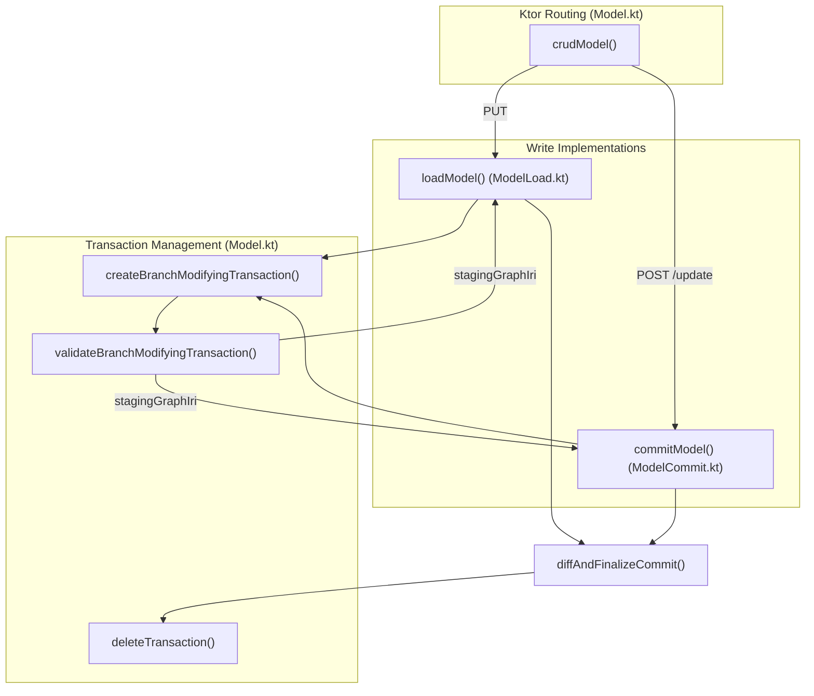

# Page: Model Graph Operations

# Model Graph Operations

Relevant source files

The following files were used as context for generating this wiki page:

- [src/main/kotlin/org/openmbee/flexo/mms/routes/Model.kt](src/main/kotlin/org/openmbee/flexo/mms/routes/Model.kt)
- [src/main/kotlin/org/openmbee/flexo/mms/routes/gsp/ModelLoad.kt](src/main/kotlin/org/openmbee/flexo/mms/routes/gsp/ModelLoad.kt)
- [src/main/kotlin/org/openmbee/flexo/mms/routes/gsp/ModelRead.kt](src/main/kotlin/org/openmbee/flexo/mms/routes/gsp/ModelRead.kt)
- [src/main/kotlin/org/openmbee/flexo/mms/routes/sparql/ModelCommit.kt](src/main/kotlin/org/openmbee/flexo/mms/routes/sparql/ModelCommit.kt)
- [src/main/kotlin/org/openmbee/flexo/mms/routes/sparql/ScratchQuery.kt](src/main/kotlin/org/openmbee/flexo/mms/routes/sparql/ScratchQuery.kt)
- [src/test/kotlin/org/openmbee/flexo/mms/BranchRead.kt](src/test/kotlin/org/openmbee/flexo/mms/BranchRead.kt)
- [src/test/kotlin/org/openmbee/flexo/mms/LockQuery.kt](src/test/kotlin/org/openmbee/flexo/mms/LockQuery.kt)
- [src/test/kotlin/org/openmbee/flexo/mms/ModelAny.kt](src/test/kotlin/org/openmbee/flexo/mms/ModelAny.kt)
- [src/test/kotlin/org/openmbee/flexo/mms/ModelCommit.kt](src/test/kotlin/org/openmbee/flexo/mms/ModelCommit.kt)
- [src/test/kotlin/org/openmbee/flexo/mms/ModelLoad.kt](src/test/kotlin/org/openmbee/flexo/mms/ModelLoad.kt)
- [src/test/kotlin/org/openmbee/flexo/mms/ModelQuery.kt](src/test/kotlin/org/openmbee/flexo/mms/ModelQuery.kt)
- [src/test/kotlin/org/openmbee/flexo/mms/ModelRead.kt](src/test/kotlin/org/openmbee/flexo/mms/ModelRead.kt)
- [src/test/kotlin/org/openmbee/flexo/mms/PolicyCreate.kt](src/test/kotlin/org/openmbee/flexo/mms/PolicyCreate.kt)
- [src/test/kotlin/org/openmbee/flexo/mms/RepoQuery.kt](src/test/kotlin/org/openmbee/flexo/mms/RepoQuery.kt)
- [src/test/kotlin/org/openmbee/flexo/mms/util/Requests.kt](src/test/kotlin/org/openmbee/flexo/mms/util/Requests.kt)

Model Graph Operations provide the primary interface for reading and writing RDF data within the Flexo MMS. These operations support the Graph Store Protocol (GSP) for bulk loads and reads, as well as SPARQL Update for fine-grained modifications. All mutating operations on branches are governed by a transactional lifecycle that ensures data integrity and generates commit history.

## Transactional Lifecycle

Modifying a model (via `loadModel` or `commitModel`) requires a multi-step transactional process to manage concurrency and maintain the commit chain. The system uses a mutex pattern in the `m-graph:Transactions` graph to prevent race conditions on the same branch.

### Transaction Flow
1.  **Create Transaction**: `createBranchModifyingTransaction` attempts to insert a transaction record including a mutex for the branch. It fails if another transaction is active for that `morb:` [src/main/kotlin/org/openmbee/flexo/mms/routes/Model.kt:80-101]().
2.  **Validate Transaction**: `validateBranchModifyingTransaction` retrieves the transaction details (staging graph, base commit, etc.) and ensures all preconditions (like ETags) are met [src/main/kotlin/org/openmbee/flexo/mms/routes/Model.kt:110-127](). If the conditions pass but no transaction exists (indicating a conflict), it throws a `409 Conflict` [src/main/kotlin/org/openmbee/flexo/mms/routes/Model.kt:122-126]().
3.  **Perform Operation**: The model is updated (either via SPARQL Update or bulk GSP PUT).
4.  **Diff and Finalize**: `diffAndFinalizeCommit` computes the delta between the new state and the previous state, creates a new `mms:Commit` resource, and updates the branch metadata [src/main/kotlin/org/openmbee/flexo/mms/routes/gsp/ModelLoad.kt:71-76]().
5.  **Cleanup**: `deleteTransaction` removes the transaction record and the temporary staging graphs [src/main/kotlin/org/openmbee/flexo/mms/routes/Model.kt:207-220]().

**Model Mutation Sequence**

Sources: [src/main/kotlin/org/openmbee/flexo/mms/routes/Model.kt:80-127](), [src/main/kotlin/org/openmbee/flexo/mms/routes/gsp/ModelLoad.kt:17-102]()

## Model Read Operations

Reading a model graph can be performed via GSP `GET` or `HEAD` requests. The system supports reading from branches, locks, and scratches [src/main/kotlin/org/openmbee/flexo/mms/routes/gsp/ModelRead.kt:11-15]().

### Target Graph Resolution
The `readModel` function determines the target graph based on the `RefType` [src/main/kotlin/org/openmbee/flexo/mms/routes/gsp/ModelRead.kt:29-39]():
*   **Branches**: Resolves using `BRANCH_QUERY_CONDITIONS` against the branch IRI [src/main/kotlin/org/openmbee/flexo/mms/routes/gsp/ModelRead.kt:30-32]().
*   **Locks**: Resolves using `LOCK_QUERY_CONDITIONS` against the lock IRI [src/main/kotlin/org/openmbee/flexo/mms/routes/gsp/ModelRead.kt:33-35]().
*   **Scratches**: Targets the specific scratch graph IRI: `mor-graph:Scratch.$scratchId` [src/main/kotlin/org/openmbee/flexo/mms/routes/gsp/ModelRead.kt:36-38]().

### Implementation: `readModel`
The `readModel` function handles GSP requests for branches, locks, and scratches [src/main/kotlin/org/openmbee/flexo/mms/routes/gsp/ModelRead.kt:17-66]().

| Method | Functionality |
| :--- | :--- |
| `HEAD` | Validates existence and permissions, returns `200 OK` without body [src/main/kotlin/org/openmbee/flexo/mms/routes/gsp/ModelRead.kt:42-44](). |
| `GET` | Executes a `CONSTRUCT { ?s ?p ?o }` query against the resolved target graph and returns Turtle [src/main/kotlin/org/openmbee/flexo/mms/routes/gsp/ModelRead.kt:46-65](). |

Sources: [src/main/kotlin/org/openmbee/flexo/mms/routes/gsp/ModelRead.kt:11-66]()

## Model Write Operations

### Bulk Load (`loadModel`)
The `loadModel` function implements the GSP `PUT` operation for branches [src/main/kotlin/org/openmbee/flexo/mms/routes/gsp/ModelLoad.kt:17-102]().

1.  **Staging**: It creates a new temporary graph IRI: `mor-graph:Load.$transactionId` [src/main/kotlin/org/openmbee/flexo/mms/routes/gsp/ModelLoad.kt:48]().
2.  **Load**: Uses `loadGraph` to ingest the request body into the temporary graph [src/main/kotlin/org/openmbee/flexo/mms/routes/gsp/ModelLoad.kt:51]().
3.  **Update**: Generates a commit update that swaps the branch's staging graph pointer to the new graph [src/main/kotlin/org/openmbee/flexo/mms/routes/gsp/ModelLoad.kt:53-70]().
4.  **Finalize**: Calls `diffAndFinalizeCommit` to calculate what changed relative to the previous `stagingGraphIri` [src/main/kotlin/org/openmbee/flexo/mms/routes/gsp/ModelLoad.kt:71-76]().
5.  **No-Change Handling**: If `diffAndFinalizeCommit` returns blank (no changes), it drops the temporary graph and returns [src/main/kotlin/org/openmbee/flexo/mms/routes/gsp/ModelLoad.kt:77-84]().

### SPARQL Update (`commitModel`)
The `commitModel` function allows partial updates to a branch using SPARQL [src/main/kotlin/org/openmbee/flexo/mms/routes/sparql/ModelCommit.kt:14-85]().

1.  **Parse**: Parses the user's SPARQL Update string into an AST using `UpdateFactory` [src/main/kotlin/org/openmbee/flexo/mms/routes/sparql/ModelCommit.kt:22-26]().
2.  **Rewrite**: The update is rewritten to target the branch's `stagingGraphIri` (aliased as `__mms_model`) [src/main/kotlin/org/openmbee/flexo/mms/routes/sparql/ModelCommit.kt:50-58]().
3.  **Execute**: The rewritten SPARQL is executed against the quad-store [src/main/kotlin/org/openmbee/flexo/mms/routes/sparql/ModelCommit.kt:55-58]().
4.  **Finalize**: A new commit is generated representing the delta of the update [src/main/kotlin/org/openmbee/flexo/mms/routes/sparql/ModelCommit.kt:60-65]().

**Code Entity Mapping: Write Operations**

Sources: [src/main/kotlin/org/openmbee/flexo/mms/routes/gsp/ModelLoad.kt:17-102](), [src/main/kotlin/org/openmbee/flexo/mms/routes/sparql/ModelCommit.kt:14-85](), [src/main/kotlin/org/openmbee/flexo/mms/routes/Model.kt:22-71]()

## Model Route Definitions

The `crudModel` function registers the Graph Store Protocol endpoints for both branches and locks [src/main/kotlin/org/openmbee/flexo/mms/routes/Model.kt:22-71]().

*   **Branches**: Supports `HEAD`, `GET`, and `PUT` (load) [src/main/kotlin/org/openmbee/flexo/mms/routes/Model.kt:24-38]().
*   **Locks**: Supports `HEAD` and `GET` only; mutations are not allowed [src/main/kotlin/org/openmbee/flexo/mms/routes/Model.kt:57-70]().
*   **Scratches**: SPARQL query operations on scratches are handled via `queryScratch` [src/main/kotlin/org/openmbee/flexo/mms/routes/sparql/ScratchQuery.kt:13-24]().

Sources: [src/main/kotlin/org/openmbee/flexo/mms/routes/Model.kt:22-71](), [src/main/kotlin/org/openmbee/flexo/mms/routes/sparql/ScratchQuery.kt:13-24]()
