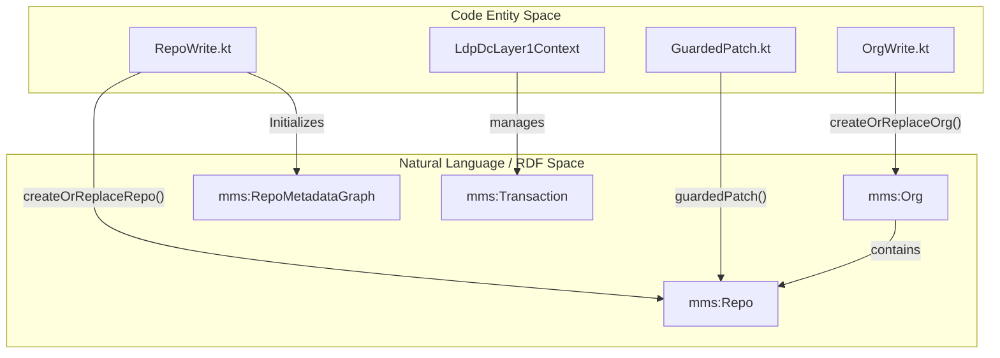
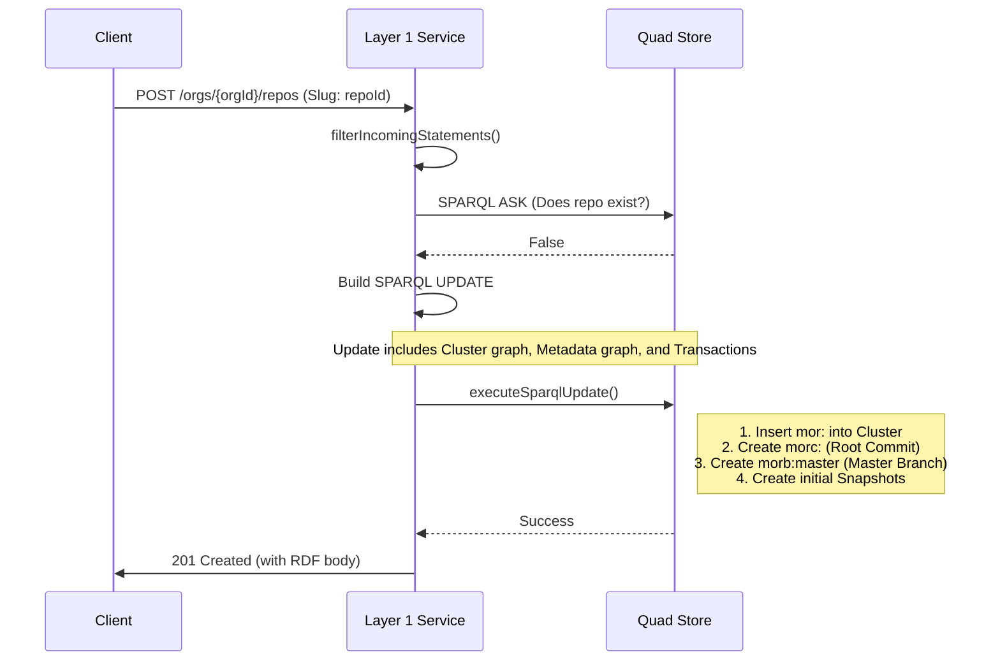

# Page: Organizations and Repositories

# Organizations and Repositories

Relevant source files

The following files were used as context for generating this wiki page:

- [src/main/kotlin/org/openmbee/flexo/mms/routes/Repos.kt](src/main/kotlin/org/openmbee/flexo/mms/routes/Repos.kt)
- [src/main/kotlin/org/openmbee/flexo/mms/routes/gsp/RepoRead.kt](src/main/kotlin/org/openmbee/flexo/mms/routes/gsp/RepoRead.kt)
- [src/main/kotlin/org/openmbee/flexo/mms/routes/ldp/BranchRead.kt](src/main/kotlin/org/openmbee/flexo/mms/routes/ldp/BranchRead.kt)
- [src/main/kotlin/org/openmbee/flexo/mms/routes/ldp/LockRead.kt](src/main/kotlin/org/openmbee/flexo/mms/routes/ldp/LockRead.kt)
- [src/main/kotlin/org/openmbee/flexo/mms/routes/ldp/OrgWrite.kt](src/main/kotlin/org/openmbee/flexo/mms/routes/ldp/OrgWrite.kt)
- [src/main/kotlin/org/openmbee/flexo/mms/routes/ldp/RepoRead.kt](src/main/kotlin/org/openmbee/flexo/mms/routes/ldp/RepoRead.kt)
- [src/main/kotlin/org/openmbee/flexo/mms/routes/ldp/RepoWrite.kt](src/main/kotlin/org/openmbee/flexo/mms/routes/ldp/RepoWrite.kt)
- [src/test/kotlin/org/openmbee/flexo/mms/OrgAny.kt](src/test/kotlin/org/openmbee/flexo/mms/OrgAny.kt)
- [src/test/kotlin/org/openmbee/flexo/mms/OrgLdpDc.kt](src/test/kotlin/org/openmbee/flexo/mms/OrgLdpDc.kt)
- [src/test/kotlin/org/openmbee/flexo/mms/RepoAny.kt](src/test/kotlin/org/openmbee/flexo/mms/RepoAny.kt)

This page documents the lifecycle management of Organizations and Repositories within the Flexo MMS Layer 1 Service. These resources are managed following Linked Data Platform (LDP) principles, utilizing the `m-graph:Cluster` and repository-specific metadata graphs to store state and configuration.

## Overview of Resource Lifecycle

Organizations (`mms:Org`) serve as the top-level containers for Repositories (`mms:Repo`). Creating a repository is a complex operation that involves not only registering the repo in the cluster graph but also initializing its internal metadata graph, which includes the root commit, the master branch, and initial snapshots.

### Entity Relationship Diagram
The following diagram illustrates the relationship between code entities and the RDF resources they manage.

"Entity Relationship: Code to RDF"

Sources: [src/main/kotlin/org/openmbee/flexo/mms/routes/ldp/OrgWrite.kt:45-45](), [src/main/kotlin/org/openmbee/flexo/mms/routes/ldp/RepoWrite.kt:78-78](), [src/main/kotlin/org/openmbee/flexo/mms/routes/Repos.kt:90-96]()

---

## Organizations (Orgs)

Organizations are the primary administrative boundary. They are stored in the `m-graph:Cluster` named graph.

### Creation and Replacement
The `createOrReplaceOrg` function handles both `POST` (creation) and `PUT` (idempotent creation or replacement) requests.

1.  **Statement Filtering**: Incoming RDF is filtered to ensure only allowed predicates are set. Predicates like `mms:id`, `mms:etag`, and `rdf:type` are sanitized and forced to system-defined values [src/main/kotlin/org/openmbee/flexo/mms/routes/ldp/OrgWrite.kt:47-57]().
2.  **Condition Evaluation**: The system checks if the org already exists. If the intent is ambiguous (e.g., a `PUT` without clear "must-exist" headers), it probes the store using a `SPARQL ASK` query [src/main/kotlin/org/openmbee/flexo/mms/routes/ldp/OrgWrite.kt:60-75]().
3.  **Permissions**: Creating an org requires `Permission.CREATE_ORG` at the `Scope.CLUSTER` level. Replacing one requires `Permission.UPDATE_ORG` [src/main/kotlin/org/openmbee/flexo/mms/routes/ldp/OrgWrite.kt:78-86]().
4.  **Auto-Policy**: Upon creation, an `autoPolicy` is generated, granting the creator `Role.ADMIN_ORG` over the new organization [src/main/kotlin/org/openmbee/flexo/mms/routes/ldp/OrgWrite.kt:139-139]().

### Read Operations
Org metadata is retrieved via `GET` or `HEAD` requests. The service constructs a SPARQL query that includes the organization's properties and the security context (permitted actions) [src/main/kotlin/org/openmbee/flexo/mms/routes/ldp/OrgWrite.kt:170-191]().

Sources: [src/main/kotlin/org/openmbee/flexo/mms/routes/ldp/OrgWrite.kt:1-195]()

---

## Repositories (Repos)

Repositories are children of Organizations. Creating a repository triggers the initialization of the repository's versioning infrastructure.

### Repository Initialization Flow
When `createOrReplaceRepo` is called, the system executes a multi-graph SPARQL update.

"Repository Creation Data Flow"

Sources: [src/main/kotlin/org/openmbee/flexo/mms/routes/ldp/RepoWrite.kt:78-230]()

### Key Components of Repo Creation
*   **Root Commit**: A commit of type `mms:Commit` is created in the `mor-graph:Metadata` graph to serve as the base of the history tree [src/main/kotlin/org/openmbee/flexo/mms/routes/ldp/RepoWrite.kt:211-212]().
*   **Master Branch**: A default branch named `master` is initialized, pointing to the root commit [src/main/kotlin/org/openmbee/flexo/mms/routes/ldp/RepoWrite.kt:217-221]().
*   **Permissions**: Creating a repo requires `Permission.CREATE_REPO` on the parent Org scope. The creator is automatically granted `Role.ADMIN_REPO` and `Role.ADMIN_BRANCH` [src/main/kotlin/org/openmbee/flexo/mms/routes/ldp/RepoWrite.kt:115-124](), [src/main/kotlin/org/openmbee/flexo/mms/routes/ldp/RepoWrite.kt:184-187]().
*   **Existence Guards**: The system enforces that neither the repository IRI nor its specific metadata graph (`mor-graph:Metadata`) exist before creation [src/main/kotlin/org/openmbee/flexo/mms/routes/ldp/RepoWrite.kt:10-38]().

### Guarded PATCH Updates
Repository metadata can be updated using `PATCH` requests. These are "guarded" to prevent users from modifying system-critical properties.

*   **Function**: `guardedPatch()` is invoked within the repository route [src/main/kotlin/org/openmbee/flexo/mms/routes/Repos.kt:90-96]().
*   **Preconditions**: PATCH operations enforce ETag checks. The update will only succeed if the `mms:etag` in the graph matches the `If-Match` header provided by the client, as defined in `REPO_UPDATE_CONDITIONS` [src/main/kotlin/org/openmbee/flexo/mms/routes/Repos.kt:76-87]().

Sources: [src/main/kotlin/org/openmbee/flexo/mms/routes/ldp/RepoWrite.kt:1-230](), [src/main/kotlin/org/openmbee/flexo/mms/routes/Repos.kt:74-96]()

---

## API Routing and Implementation

The routing for these resources is defined in `Repos.kt`, utilizing the `linkedDataPlatformDirectContainer` and `graphStoreProtocol` abstractions.

### Route Mapping
| Method | Path | Controller Function | Description |
| :--- | :--- | :--- | :--- |
| `GET` | `/orgs/{orgId}/repos` | `getRepos(allRepos=true)` | List all repos in an org [src/main/kotlin/org/openmbee/flexo/mms/routes/Repos.kt:35-37]() |
| `POST` | `/orgs/{orgId}/repos` | `createOrReplaceRepo()` | Create a new repository [src/main/kotlin/org/openmbee/flexo/mms/routes/Repos.kt:40-46]() |
| `GET` | `/orgs/{orgId}/repos/{repoId}` | `getRepos()` | Get metadata for a specific repo [src/main/kotlin/org/openmbee/flexo/mms/routes/Repos.kt:63-66]() |
| `PATCH` | `/orgs/{orgId}/repos/{repoId}` | `guardedPatch()` | Update repo metadata [src/main/kotlin/org/openmbee/flexo/mms/routes/Repos.kt:74-96]() |
| `GET` | `/orgs/{orgId}/repos/{repoId}/graph`| `readRepo()` | GSP endpoint for repo metadata graph [src/main/kotlin/org/openmbee/flexo/mms/routes/Repos.kt:105-108]() |

### Metadata Read Logic
Reads for both Orgs and Repos use a "Construct" pattern to return both the resource triples and the authorization context.
*   **SPARQL_BGP_REPO**: Defines the pattern for matching repository triples in `m-graph:Cluster` [src/main/kotlin/org/openmbee/flexo/mms/routes/ldp/RepoRead.kt:14-28]().
*   **permittedActionSparqlBgp**: Dynamically injects SPARQL patterns to ensure the requesting user has `Permission.READ_REPO` [src/main/kotlin/org/openmbee/flexo/mms/routes/ldp/RepoRead.kt:25-27]().
*   **GSP Read**: The `readRepo` function provides access to the full `mor-graph:Metadata` graph via the Graph Store Protocol [src/main/kotlin/org/openmbee/flexo/mms/routes/gsp/RepoRead.kt:12-48]().

Sources: [src/main/kotlin/org/openmbee/flexo/mms/routes/Repos.kt:20-113](), [src/main/kotlin/org/openmbee/flexo/mms/routes/ldp/RepoRead.kt:1-106](), [src/main/kotlin/org/openmbee/flexo/mms/routes/gsp/RepoRead.kt:1-49]()
