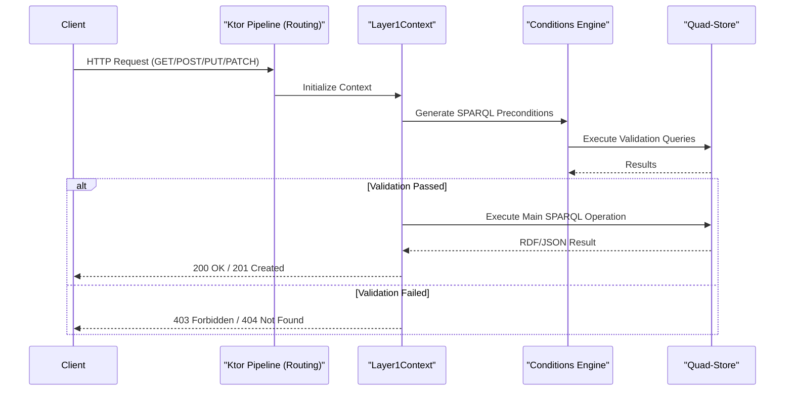

# Page: Overview

# Overview

<details>
<summary>Relevant source files</summary>

The following files were used as context for generating this wiki page:

- [.circleci/config.yml](.circleci/config.yml)
- [README.md](README.md)
- [deploy/README.md](deploy/README.md)
- [diagrams/mms5-access-control.png](diagrams/mms5-access-control.png)
- [diagrams/mms5-cluster.png](diagrams/mms5-cluster.png)
- [diagrams/mms5-commits.png](diagrams/mms5-commits.png)
- [diagrams/mms5-graphs.png](diagrams/mms5-graphs.png)
- [diagrams/mms5-versioning.png](diagrams/mms5-versioning.png)
- [docs/index.rst](docs/index.rst)
- [resource/crud.postman_collection.json](resource/crud.postman_collection.json)
- [sonar-project.properties](sonar-project.properties)
- [src/main/kotlin/org/openmbee/flexo/mms/Application.kt](src/main/kotlin/org/openmbee/flexo/mms/Application.kt)
- [src/main/resources/application.conf.example](src/main/resources/application.conf.example)
- [src/main/resources/application.conf.test](src/main/resources/application.conf.test)

</details>


The **Flexo MMS Layer 1 Service** is the core API component of the Open-MBEE Flexo MMS ecosystem. It provides a RESTful interface for managing organizations, repositories, and versioned model data, backed by a SPARQL 1.1 compliant quad-store.

## Purpose and Scope

Flexo MMS Layer 1 acts as a mediation layer between high-level engineering data management concepts (like branching, committing, and access control) and the underlying RDF quad-store. It ensures data integrity through a transactional commit lifecycle and enforces fine-grained permissions via a SPARQL-based authorization engine.

Key responsibilities include:
*   **Version Control**: Implementing a Git-like branching and committing model for RDF graphs.
*   **Access Control**: Managing agents, roles, and permissions to secure resources at various scopes.
*   **Graph Materialization**: Reconstructing specific model states from a history of patches and snapshots.
*   **LDP/GSP Support**: Providing standard Linked Data Platform and Graph Store Protocol endpoints.

For details on the system architecture and data model, see [Architecture Overview](#1.2).

## System Context

Flexo MMS Layer 1 fits into the larger ecosystem by coordinating with quad-stores (e.g., Apache Jena Fuseki) and optional storage services for large artifacts.

### Code-to-System Mapping
The following diagram bridges the conceptual services with the actual code entities and configuration keys used to interact with them.

**Service Interaction Diagram**
```mermaid
graph TD
    subgraph "Flexo_MMS_Layer_1 (Ktor_Application)"
        [Application.module] --> [configureRouting]
        [configureRouting] --> [Layer1Context]
        [Layer1Context] --> [SparqlClient]
    end

    subgraph "External_Quad-Store (e.g.,_Fuseki)"
        [SparqlClient] -- "FLEXO_MMS_QUERY_URL" --> [SPARQL_Query_Endpoint]
        [SparqlClient] -- "FLEXO_MMS_UPDATE_URL" --> [SPARQL_Update_Endpoint]
        [SparqlClient] -- "FLEXO_MMS_GRAPH_STORE_PROTOCOL_URL" --> [GSP_Endpoint]
    end

    subgraph "Storage_Services"
        [Layer1Context] -- "FLEXO_MMS_STORE_SERVICE_URL" --> [Store_Service]
    end

    [Application.module]:::code
    [Layer1Context]:::code
    
    classDef code font-family:monospace;
```
**Sources:** [src/main/kotlin/org/openmbee/flexo/mms/Application.kt:11-15](), [src/main/kotlin/org/openmbee/flexo/mms/Application.kt:21-45](), [docs/index.rst:16-41]()

## Core Architecture

The service follows a tiered architecture where every request is wrapped in a `Layer1Context`. This context manages the lifecycle of a request, including authentication via JWT and the generation of SPARQL "preconditions" to ensure the state of the quad-store meets the requirements for an operation (e.g., checking if a branch exists before committing to it).

**Request Processing Flow**

**Sources:** [src/main/kotlin/org/openmbee/flexo/mms/Application.kt:67-69](), [docs/index.rst:71-74](), [src/test/resources/application.conf.test:3-4]()

## Key Resource Concepts

The service manages several primary resource types, organized hierarchically. Operations on these resources are often guarded by ETag checks and SPARQL-based permissions.

| Resource | Description | Code Route Pattern |
| :--- | :--- | :--- |
| **Organization** | Top-level container for repositories and global policies. | `/orgs/{orgId}` |
| **Repository** | A collection of related model data, branches, and commits. | `/orgs/{orgId}/repos/{repoId}` |
| **Branch** | A mutable pointer to a commit, allowing for "staging" model data. | `.../branches/{branchId}` |
| **Commit** | An immutable snapshot of changes (ins/del) at a point in time. | `.../commits/{commitId}` |
| **Lock** | An immutable reference to a specific commit (similar to a tag). | `.../locks/{lockId}` |

For a full guide on setting up these resources locally, see [Getting Started](#1.1).

## Configuration and Deployment

The service is configured primarily through environment variables defined in `application.conf` that specify the connection to the quad-store and security settings.

*   **Initialization**: The quad-store must be initialized with a `cluster.trig` file. This is generated using the `deploy/src/main.ts` utility which produces the necessary RDF objects and access control definitions for a new deployment.
*   **Performance**: For production, it is recommended to separate `FLEXO_MMS_QUERY_URL` (read-only replicas) from `FLEXO_MMS_UPDATE_URL` (write master) to offload read traffic.
*   **CI/CD**: The project uses CircleCI to automate schema generation, testing via a multi-container Docker network, and deployment of snapshot/release images to DockerHub.

**Sources:** [docs/index.rst:91-112](), [docs/index.rst:117-130](), [deploy/README.md:1-31](), [.circleci/config.yml:1-57]()

---

## Child Pages
*   **[Getting Started](#1.1)**: Setup instructions, environment configuration, local development stack, and first-run guide.
*   **[Architecture Overview](#1.2)**: Describes the tiered architecture, RDF data model, named graph structure, and service component relationships.
