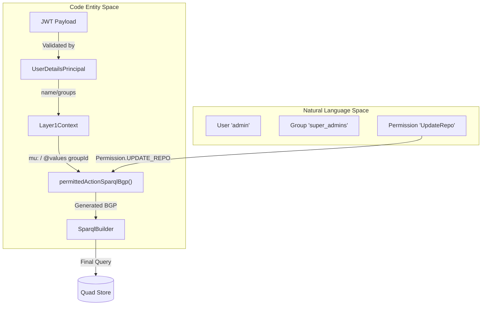
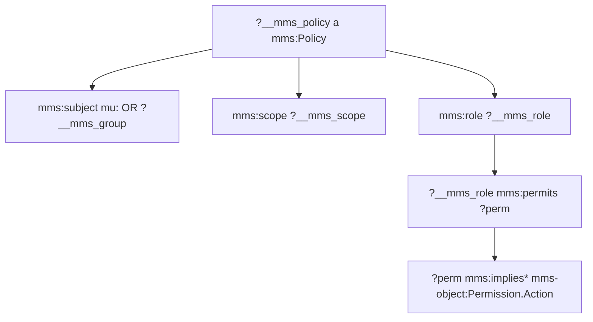
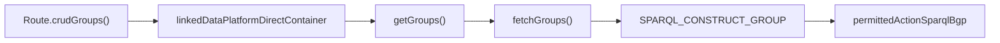

# Page: Runtime Permission Enforcement

# Runtime Permission Enforcement

Relevant source files

The following files were used as context for generating this wiki page:

- [deploy/src/main.ts](deploy/src/main.ts)
- [src/main/kotlin/org/openmbee/flexo/mms/AccessControl.kt](src/main/kotlin/org/openmbee/flexo/mms/AccessControl.kt)
- [src/main/kotlin/org/openmbee/flexo/mms/Sanitizer.kt](src/main/kotlin/org/openmbee/flexo/mms/Sanitizer.kt)
- [src/main/kotlin/org/openmbee/flexo/mms/routes/Groups.kt](src/main/kotlin/org/openmbee/flexo/mms/routes/Groups.kt)
- [src/main/kotlin/org/openmbee/flexo/mms/routes/Policies.kt](src/main/kotlin/org/openmbee/flexo/mms/routes/Policies.kt)
- [src/main/kotlin/org/openmbee/flexo/mms/routes/ldp/GroupRead.kt](src/main/kotlin/org/openmbee/flexo/mms/routes/ldp/GroupRead.kt)
- [src/main/kotlin/org/openmbee/flexo/mms/server/Authentication.kt](src/main/kotlin/org/openmbee/flexo/mms/server/Authentication.kt)

The Flexo MMS Layer 1 Service utilizes a SPARQL-based authorization model that enforces permissions at query time. Instead of a separate authorization layer, the service injects Basic Graph Patterns (BGPs) into SPARQL queries and updates to verify that the requesting agent has the necessary roles and permissions within the appropriate scope.

## SPARQL-Based Authorization Model

The authorization logic is built directly into the RDF quad-store. Permissions are evaluated by checking for the existence of `mms:Policy` resources that link an agent (User or Group) to a `mms:Role`, which in turn permits specific `mms:Permission`s over a `mms:Scope`.

### Key Components

| Component | Description | Code Entity |
| --- | --- | --- |
| **Agent** | The subject of a policy, either a `mms:User` or `mms:Group`. | [deploy/src/main.ts:269-276]() |
| **Permission** | An atomic action defined by a `Crud` type and a `Scope`. | [src/main/kotlin/org/openmbee/flexo/mms/AccessControl.kt:40-97]() |
| **Scope** | The resource level where the permission applies (Cluster, Org, Repo, etc.). | [src/main/kotlin/org/openmbee/flexo/mms/AccessControl.kt:12-28]() |
| **Role** | A collection of permissions (e.g., `AdminRepo`). | [src/main/kotlin/org/openmbee/flexo/mms/AccessControl.kt:100-112]() |
| **Policy** | Links a subject (Agent) to roles and a specific scope IRI. | [deploy/src/main.ts:203-219]() |

### Permission Enforcement Flow

The following diagram illustrates how a request's JWT is translated into a SPARQL BGP that enforces access control.

**Request Authorization Data Flow**

Sources: [src/main/kotlin/org/openmbee/flexo/mms/server/Authentication.kt:23-35](), [src/main/kotlin/org/openmbee/flexo/mms/AccessControl.kt:115-185]()

## Permitted Action BGP Generation

The function `permittedActionSparqlBgp` is the core of the enforcement engine. It generates a SPARQL string that must match for the query to return results.

### Implementation Details
The function performs the following logic within the generated BGP:
1.  **Identity Resolution**: It matches the user IRI (`mu:`) or any of the user's groups (passed via a SPARQL `VALUES` block) against the `mms:subject` of a policy [src/main/kotlin/org/openmbee/flexo/mms/AccessControl.kt:127-157]().
2.  **Scope Intersection**: It restricts the policy search to the relevant scope IRIs (e.g., the specific Repo IRI and its parents like Org and Cluster) by iterating through `Scope.values()` [src/main/kotlin/org/openmbee/flexo/mms/AccessControl.kt:161-165]().
3.  **Permission Hierarchy**: It traverses the ontology in `m-graph:AccessControl.Definitions` to ensure the policy's role permits the requested action, accounting for permission implication (e.g., `mms:implies*`) [src/main/kotlin/org/openmbee/flexo/mms/AccessControl.kt:173-183]().

**BGP Structure for Permission Check**

Sources: [src/main/kotlin/org/openmbee/flexo/mms/AccessControl.kt:115-185]()

## Read Context Generation

When performing `GET` or `HEAD` operations, the service uses `generateReadContextBgp` to include metadata about why access was granted.

This function generates a BGP that:
-   Creates a `mms:Context` resource with a URN based on the subject context [src/main/kotlin/org/openmbee/flexo/mms/AccessControl.kt:190]().
-   Links the specific `mms:Policy` that satisfied the request [src/main/kotlin/org/openmbee/flexo/mms/AccessControl.kt:192]().
-   Records the ETag of the resource and the permission checked [src/main/kotlin/org/openmbee/flexo/mms/AccessControl.kt:191-193]().

This context is typically used in `CONSTRUCT` queries, such as in `fetchGroups`, to return authorization metadata to the client [src/main/kotlin/org/openmbee/flexo/mms/routes/ldp/GroupRead.kt:38-60]().

Sources: [src/main/kotlin/org/openmbee/flexo/mms/AccessControl.kt:187-199](), [src/main/kotlin/org/openmbee/flexo/mms/routes/ldp/GroupRead.kt:38-60]()

## Integration with Routing and Sanitization

Permissions are checked during the request lifecycle in various route handlers. For example, in `GroupRead.kt`, the `SPARQL_BGP_GROUP` includes a call to `permittedActionSparqlBgp` to ensure the user has `READ_GROUP` permissions [src/main/kotlin/org/openmbee/flexo/mms/routes/ldp/GroupRead.kt:32-35]().

Additionally, the `Sanitizer` class ensures that users cannot manually set restricted MMS properties during `PUT` or `POST` operations, preventing escalation of privileges by modifying the access control triples directly [src/main/kotlin/org/openmbee/flexo/mms/Sanitizer.kt:10-16]().

**Authorization in Group Routes**

Sources: [src/main/kotlin/org/openmbee/flexo/mms/routes/Groups.kt:18-41](), [src/main/kotlin/org/openmbee/flexo/mms/routes/ldp/GroupRead.kt:66-98]()

## JWT Authentication Integration

The Ktor `configureAuthentication` block extracts user identity from the `Authorization: Bearer <JWT>` header.

1.  **Validation**: The JWT is validated against the configured secret, audience, and issuer [src/main/kotlin/org/openmbee/flexo/mms/server/Authentication.kt:17-22]().
2.  **Principal Creation**: A `UserDetailsPrincipal` is created containing the `name` (username) and `groups` claims [src/main/kotlin/org/openmbee/flexo/mms/server/Authentication.kt:23-30]().
3.  **Context Injection**: The `Layer1Context` retrieves these values, which are then used by the `SparqlParameterizer` to populate the `mu:` prefix and the `VALUES ?__mms_groupId` block in the authorization BGPs [src/main/kotlin/org/openmbee/flexo/mms/AccessControl.kt:143-146]().

Sources: [src/main/kotlin/org/openmbee/flexo/mms/server/Authentication.kt:9-36](), [src/main/kotlin/org/openmbee/flexo/mms/AccessControl.kt:115-157]()
