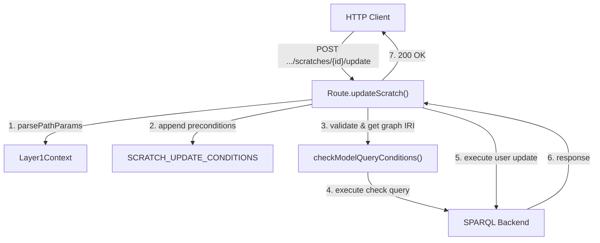
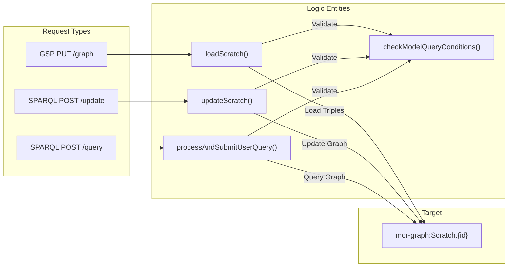

# Page: Scratches

# Scratches

Relevant source files

The following files were used as context for generating this wiki page:

- [src/main/kotlin/org/openmbee/flexo/mms/UserQuery.kt](src/main/kotlin/org/openmbee/flexo/mms/UserQuery.kt)
- [src/main/kotlin/org/openmbee/flexo/mms/routes/gsp/ScratchLoad.kt](src/main/kotlin/org/openmbee/flexo/mms/routes/gsp/ScratchLoad.kt)
- [src/main/kotlin/org/openmbee/flexo/mms/routes/ldp/ScratchRead.kt](src/main/kotlin/org/openmbee/flexo/mms/routes/ldp/ScratchRead.kt)
- [src/main/kotlin/org/openmbee/flexo/mms/routes/ldp/ScratchWrite.kt](src/main/kotlin/org/openmbee/flexo/mms/routes/ldp/ScratchWrite.kt)
- [src/main/kotlin/org/openmbee/flexo/mms/routes/sparql/ScratchUpdate.kt](src/main/kotlin/org/openmbee/flexo/mms/routes/sparql/ScratchUpdate.kt)
- [src/test/kotlin/org/openmbee/flexo/mms/ScratchAny.kt](src/test/kotlin/org/openmbee/flexo/mms/ScratchAny.kt)
- [src/test/kotlin/org/openmbee/flexo/mms/ScratchLdpDc.kt](src/test/kotlin/org/openmbee/flexo/mms/ScratchLdpDc.kt)
- [src/test/kotlin/org/openmbee/flexo/mms/ScratchLoad.kt](src/test/kotlin/org/openmbee/flexo/mms/ScratchLoad.kt)
- [src/test/kotlin/org/openmbee/flexo/mms/ScratchQuery.kt](src/test/kotlin/org/openmbee/flexo/mms/ScratchQuery.kt)
- [src/test/kotlin/org/openmbee/flexo/mms/ScratchRead.kt](src/test/kotlin/org/openmbee/flexo/mms/ScratchRead.kt)
- [src/test/kotlin/org/openmbee/flexo/mms/ScratchUpdate.kt](src/test/kotlin/org/openmbee/flexo/mms/ScratchUpdate.kt)

Scratches are temporary RDF graph workspaces within a repository. Unlike branches, they do not maintain a history of commits; instead, they provide a single named graph that can be updated via SPARQL or overwritten via the Graph Store Protocol (GSP). Scratches are ideal for intermediate calculations, temporary data staging, or user-specific sandboxes.

## Scratch Architecture and Data Flow

Scratches exist as resources within a Repository. Their metadata is stored in the Repository's metadata graph (`mor-graph:Metadata`), while the actual model data resides in a dedicated scratch graph.

### Component Interaction Diagram

This diagram illustrates how a SPARQL Update request to a scratch is handled by the system components.

**Title: Scratch SPARQL Update Flow**

Sources: [src/main/kotlin/org/openmbee/flexo/mms/routes/sparql/ScratchUpdate.kt:14-56](), [src/main/kotlin/org/openmbee/flexo/mms/UserQuery.kt:36-126]()

### Resource Mapping

| Resource Type | Metadata Graph | Data Graph IRI Pattern |
| :--- | :--- | :--- |
| **Scratch** | `mor-graph:Metadata` | `mor-graph:Scratch.{scratchId}` |

Sources: [src/main/kotlin/org/openmbee/flexo/mms/routes/sparql/ScratchUpdate.kt:37-37](), [src/main/kotlin/org/openmbee/flexo/mms/routes/gsp/ScratchLoad.kt:22-22]()

---

## CRUD Operations (LDP)

Scratches are managed as Linked Data Platform (LDP) resources. The service provides a Direct Container at `/orgs/{orgId}/repos/{repoId}/scratches` for managing these resources.

### Creation and Replacement
The `createOrReplaceScratch` function handles both `POST` (creation with slug) and `PUT` (idempotent creation or replacement) [src/main/kotlin/org/openmbee/flexo/mms/routes/ldp/ScratchWrite.kt:48-200]().

1.  **Permission Check**: Checks for `Permission.CREATE_SCRATCH` or `Permission.UPDATE_SCRATCH` permissions at the `Scope.REPO` level [src/main/kotlin/org/openmbee/flexo/mms/routes/ldp/ScratchWrite.kt:80-132]().
2.  **Auto-Policy**: Upon creation, the system automatically creates a policy granting the creator `Role.ADMIN_SCRATCH` for that specific scratch scope [src/main/kotlin/org/openmbee/flexo/mms/routes/ldp/ScratchWrite.kt:145-147]().
3.  **Metadata Storage**: Triples describing the scratch (e.g., `mms:id`, `mms:etag`) are stored in `mor-graph:Metadata` [src/main/kotlin/org/openmbee/flexo/mms/routes/ldp/ScratchWrite.kt:152-161]().

### Metadata Retrieval
Users can retrieve scratch metadata using `GET` or `HEAD` on the scratch resource or the scratches container.
*   **Container GET**: Returns a list of all scratches in the repo via `getScratches(allScratches=true)` [src/main/kotlin/org/openmbee/flexo/mms/routes/ldp/ScratchRead.kt:93-98]().
*   **Resource GET**: Returns metadata for a specific scratch, including its `mms:etag` and creation timestamps [src/main/kotlin/org/openmbee/flexo/mms/routes/ldp/ScratchRead.kt:46-78]().

### Deletion
The `deleteScratch` function removes the scratch graph from the triplestore [src/main/kotlin/org/openmbee/flexo/mms/routes/ldp/ScratchWrite.kt:205-221]().
1. **Auth Check**: Verifies the scratch exists and the user has `Permission.DELETE_SCRATCH` [src/main/kotlin/org/openmbee/flexo/mms/routes/ldp/ScratchWrite.kt:207-217]().
2. **Graph Removal**: Executes `deleteGraph` on the specific scratch IRI [src/main/kotlin/org/openmbee/flexo/mms/routes/ldp/ScratchWrite.kt:212-212]().

Sources: [src/main/kotlin/org/openmbee/flexo/mms/routes/ldp/ScratchWrite.kt:48-221](), [src/main/kotlin/org/openmbee/flexo/mms/routes/ldp/ScratchRead.kt:46-98]()

---

## Model Data Operations

Model data within a scratch is accessed via the `/graph`, `/query`, and `/update` sub-routes.

### Graph Store Protocol (GSP)
The `/graph` endpoint allows for bulk operations on the scratch's RDF data.
*   **PUT**: Overwrites the scratch graph with the provided RDF payload. This is implemented in `loadScratch()` which uses `loadGraph` to push data into `${prefixes["mor-graph"]}Scratch.$scratchId` [src/main/kotlin/org/openmbee/flexo/mms/routes/gsp/ScratchLoad.kt:10-26]().

### SPARQL Query and Update
Scratches support standard SPARQL operations.
*   **Query**: Handled via `processAndSubmitUserQuery`. If the reference IRI corresponds to a scratch (`mors`), the system resolves the target graph IRI to the specific scratch graph [src/main/kotlin/org/openmbee/flexo/mms/UserQuery.kt:135-142]().
*   **Update**: Handled in `updateScratch()`. The user's SPARQL Update AST is prepared and executed against the scratch's named graph [src/main/kotlin/org/openmbee/flexo/mms/routes/sparql/ScratchUpdate.kt:14-56]().

**Title: Scratch Model Access Logic**

Sources: [src/main/kotlin/org/openmbee/flexo/mms/routes/gsp/ScratchLoad.kt:10-26](), [src/main/kotlin/org/openmbee/flexo/mms/routes/sparql/ScratchUpdate.kt:14-56](), [src/main/kotlin/org/openmbee/flexo/mms/UserQuery.kt:133-160]()

---

## Conditions and Security

Access to scratches is governed by the `SCRATCH_QUERY_CONDITIONS` and `SCRATCH_UPDATE_CONDITIONS`.

*   **Existence**: Operations typically verify that the scratch exists in metadata. For example, `scratchNotExists` is used during creation to prevent conflicts [src/main/kotlin/org/openmbee/flexo/mms/routes/ldp/ScratchWrite.kt:13-26]().
*   **Permissions**: 
    *   `Permission.READ_SCRATCH` for GET/HEAD/Query [src/main/kotlin/org/openmbee/flexo/mms/routes/ldp/ScratchRead.kt:25-27]().
    *   `Permission.UPDATE_SCRATCH` for PUT/PATCH/Update [src/main/kotlin/org/openmbee/flexo/mms/routes/sparql/ScratchUpdate.kt:27-27]().
    *   `Permission.DELETE_SCRATCH` for deleting the scratch [src/main/kotlin/org/openmbee/flexo/mms/routes/ldp/ScratchWrite.kt:215-215]().
*   **Preconditions**: Update operations support ETag-based optimistic locking by appending `assertPreconditions` to the condition group, ensuring the scratch metadata hasn't changed since the client last read it [src/main/kotlin/org/openmbee/flexo/mms/routes/sparql/ScratchUpdate.kt:27-36]().

Sources: [src/main/kotlin/org/openmbee/flexo/mms/routes/ldp/ScratchWrite.kt:13-132](), [src/main/kotlin/org/openmbee/flexo/mms/routes/sparql/ScratchUpdate.kt:27-36](), [src/main/kotlin/org/openmbee/flexo/mms/routes/ldp/ScratchRead.kt:25-41]()
