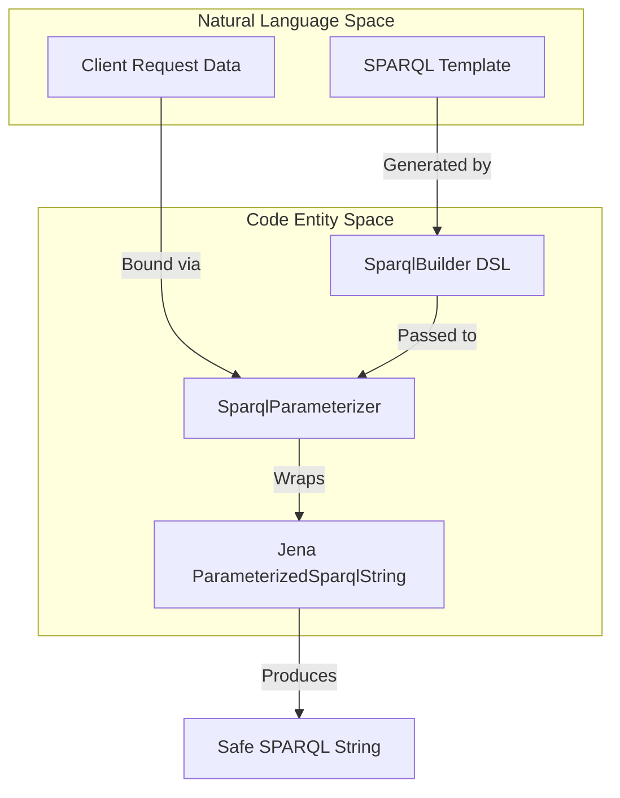
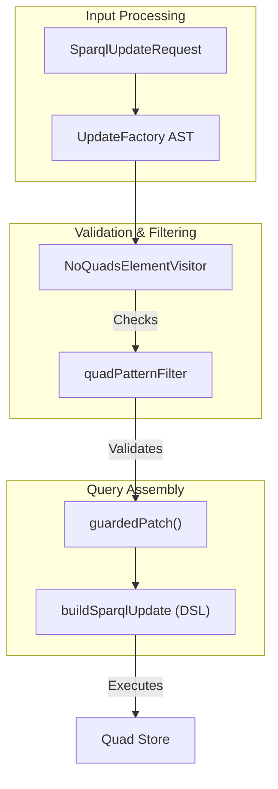

# Page: SPARQL Builder and Parameterizer

# SPARQL Builder and Parameterizer

Relevant source files

The following files were used as context for generating this wiki page:

- [src/main/kotlin/org/openmbee/flexo/mms/GuardedPatch.kt](src/main/kotlin/org/openmbee/flexo/mms/GuardedPatch.kt)
- [src/main/kotlin/org/openmbee/flexo/mms/SparqlBuilder.kt](src/main/kotlin/org/openmbee/flexo/mms/SparqlBuilder.kt)
- [src/main/kotlin/org/openmbee/flexo/mms/SparqlParameterizer.kt](src/main/kotlin/org/openmbee/flexo/mms/SparqlParameterizer.kt)
- [src/main/kotlin/org/openmbee/flexo/mms/UpdateActions.kt](src/main/kotlin/org/openmbee/flexo/mms/UpdateActions.kt)
- [src/main/kotlin/org/openmbee/flexo/mms/UpdateRewriter.kt](src/main/kotlin/org/openmbee/flexo/mms/UpdateRewriter.kt)
- [src/main/kotlin/org/openmbee/flexo/mms/routes/ldp/OrgRead.kt](src/main/kotlin/org/openmbee/flexo/mms/routes/ldp/OrgRead.kt)

The Flexo MMS Layer 1 Service provides a sophisticated suite of utilities for constructing, parameterizing, and safely executing SPARQL queries and updates. This system ensures that all database interactions are type-safe, protected against injection, and compliant with the MMS transaction and access control models.

## SparqlBuilder DSL

The `SparqlBuilder` is a Kotlin DSL used to programmatically construct SPARQL queries and updates. It provides a structured way to build complex patterns while maintaining readability and correct indentation.

### Key Classes and Structure
- **`SparqlBuilder`**: The base abstract class managing the `StringBuilder` and indentation logic [src/main/kotlin/org/openmbee/flexo/mms/SparqlBuilder.kt:101-113]().
- **`PatternBuilder`**: Extends `SparqlBuilder` to provide high-level SPARQL constructs like `graph {}` and `group {}` [src/main/kotlin/org/openmbee/flexo/mms/SparqlBuilder.kt:115-134]().
- **`WhereBuilder`**: Specialized for the `WHERE` clause, including helper functions for transaction matching [src/main/kotlin/org/openmbee/flexo/mms/SparqlBuilder.kt:176-204]().
- **`UpdateBuilder`**: Used for `INSERT`, `DELETE`, and `DELETE WHERE` operations [src/main/kotlin/org/openmbee/flexo/mms/SparqlBuilder.kt:225-240]().

### Transaction Integration
The builder includes a `txn()` function that automatically injects the standard MMS transaction pattern into queries. This ensures that operations are linked to the current request's transaction ID and metadata [src/main/kotlin/org/openmbee/flexo/mms/SparqlBuilder.kt:31-49]().

| Function | Purpose |
| :--- | :--- |
| `raw()` | Appends raw SPARQL strings with automatic indentation [src/main/kotlin/org/openmbee/flexo/mms/SparqlBuilder.kt:104-108](). |
| `graph(uri) {}` | Wraps a block in a `GRAPH <uri> { ... }` block [src/main/kotlin/org/openmbee/flexo/mms/SparqlBuilder.kt:119-125](). |
| `txn()` | Injects transaction metadata matching for the current request [src/main/kotlin/org/openmbee/flexo/mms/SparqlBuilder.kt:206-213](). |
| `txnOrInspections()` | A complex pattern used to fetch transaction results or deduce which conditions failed if the transaction did not commit [src/main/kotlin/org/openmbee/flexo/mms/SparqlBuilder.kt:180-204](). |

**Sources:** [src/main/kotlin/org/openmbee/flexo/mms/SparqlBuilder.kt:1-240]()

---

## SparqlParameterizer

The `SparqlParameterizer` is a wrapper around Apache Jena's `ParameterizedSparqlString`. It provides a fluent API for binding variables to IRIs, Literals, or Datatyped values, preventing SPARQL injection [src/main/kotlin/org/openmbee/flexo/mms/SparqlParameterizer.kt:7-12]().

### Usage Flow
1. **Initialize**: Create with a base SPARQL string and optional prefix map.
2. **Bind**: Use `iri()`, `literal()`, or `datatyped()` to replace variables (e.g., `?_repo`) with safe values [src/main/kotlin/org/openmbee/flexo/mms/SparqlParameterizer.kt:22-44]().
3. **Execute**: The `toString()` method produces the final valid SPARQL string [src/main/kotlin/org/openmbee/flexo/mms/SparqlParameterizer.kt:46-48]().

### Code-to-Logic Mapping: Parameterization
Title: SPARQL Parameterization Data Flow

**Sources:** [src/main/kotlin/org/openmbee/flexo/mms/SparqlParameterizer.kt:7-53](), [src/main/kotlin/org/openmbee/flexo/mms/SparqlBuilder.kt:101-113]()

---

## Guarded Patch and UpdateRewriter

The `guardedPatch` system is a critical security and integrity component. It allows users to submit standard SPARQL `PATCH` updates (INSERT/DELETE/WHERE) while the service rewrites them to enforce strict constraints.

### The Rewriting Process
When a `PATCH` request is received, the service:
1. **Parses**: The user's SPARQL Update is parsed into an AST using `UpdateFactory` [src/main/kotlin/org/openmbee/flexo/mms/GuardedPatch.kt:46-50]().
2. **Filters**: The `quadPatternFilter` ensures that all subjects in the update match the resource being patched and that no forbidden predicates are modified [src/main/kotlin/org/openmbee/flexo/mms/GuardedPatch.kt:16-33]().
3. **Validates**: The `NoQuadsElementVisitor` ensures the user has not included unauthorized `GRAPH` or `SERVICE` blocks [src/main/kotlin/org/openmbee/flexo/mms/UpdateRewriter.kt:28-89]().
4. **Reconstructs**: The service builds a new, "guarded" SPARQL update that includes the user's changes alongside ETag checks and transaction metadata [src/main/kotlin/org/openmbee/flexo/mms/GuardedPatch.kt:121-162]().

### Guarded Patch Components
Title: Guarded Patch Architecture

### Constraints Enforced
- **Subject Locking**: All subjects in the user's `DELETE` or `INSERT` blocks must exactly match the IRI of the resource (e.g., the Org or Repo IRI) [src/main/kotlin/org/openmbee/flexo/mms/GuardedPatch.kt:21-23]().
- **Forbidden Predicates**: Users cannot modify system-managed properties (e.g., `mms:etag`) directly via patch [src/main/kotlin/org/openmbee/flexo/mms/GuardedPatch.kt:27-29]().
- **No Variables in Subjects**: Variables are disallowed in the subject position of update quads to prevent broad, accidental deletions [src/main/kotlin/org/openmbee/flexo/mms/GuardedPatch.kt:18-20]().

**Sources:** [src/main/kotlin/org/openmbee/flexo/mms/GuardedPatch.kt:16-162](), [src/main/kotlin/org/openmbee/flexo/mms/UpdateRewriter.kt:29-113]()

---

## Update Actions Utilities

The `UpdateActions.kt` file provides higher-level abstractions for common update patterns, particularly for deleting complex repository objects and their dependencies.

### Key Functions
- **`dropRepoObject`**: A generic utility to delete an object from the metadata graph and record the deletion in the transaction graph [src/main/kotlin/org/openmbee/flexo/mms/UpdateActions.kt:37-62]().
- **`dropLock`**: Handles the deletion of a lock, including its associated snapshot and the underlying RDF graph if no other locks refer to it [src/main/kotlin/org/openmbee/flexo/mms/UpdateActions.kt:76-103]().
- **`anyDanglingNodes`**: Adds a `FILTER NOT EXISTS` pattern to identify nodes that are no longer reachable [src/main/kotlin/org/openmbee/flexo/mms/UpdateActions.kt:10-16]().

**Sources:** [src/main/kotlin/org/openmbee/flexo/mms/UpdateActions.kt:3-104]()
