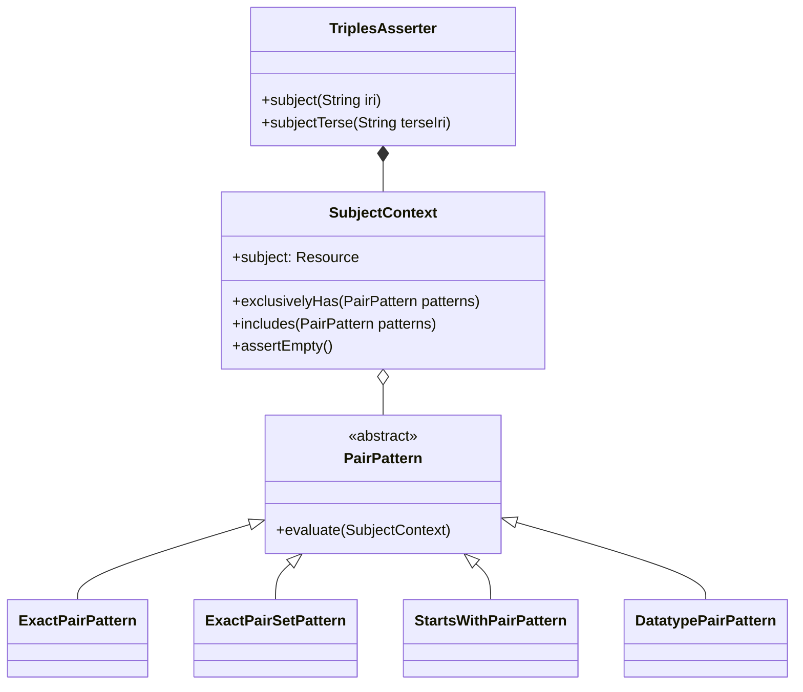
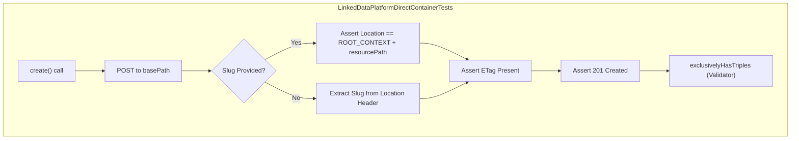

# Page: Test Infrastructure and Utilities

# Test Infrastructure and Utilities

Relevant source files

The following files were used as context for generating this wiki page:

- [src/test/kotlin/org/openmbee/flexo/mms/RepoLdpDc.kt](src/test/kotlin/org/openmbee/flexo/mms/RepoLdpDc.kt)
- [src/test/kotlin/org/openmbee/flexo/mms/util/Common.kt](src/test/kotlin/org/openmbee/flexo/mms/util/Common.kt)
- [src/test/kotlin/org/openmbee/flexo/mms/util/Environment.kt](src/test/kotlin/org/openmbee/flexo/mms/util/Environment.kt)
- [src/test/kotlin/org/openmbee/flexo/mms/util/Helper.kt](src/test/kotlin/org/openmbee/flexo/mms/util/Helper.kt)
- [src/test/kotlin/org/openmbee/flexo/mms/util/LinkedDataPlatform.kt](src/test/kotlin/org/openmbee/flexo/mms/util/LinkedDataPlatform.kt)
- [src/test/kotlin/org/openmbee/flexo/mms/util/RdfAssertions.kt](src/test/kotlin/org/openmbee/flexo/mms/util/RdfAssertions.kt)
- [src/test/kotlin/org/openmbee/flexo/mms/util/RemoteBackend.kt](src/test/kotlin/org/openmbee/flexo/mms/util/RemoteBackend.kt)
- [src/test/kotlin/org/openmbee/flexo/mms/util/SparqlBackend.kt](src/test/kotlin/org/openmbee/flexo/mms/util/SparqlBackend.kt)
- [src/test/resources/test.env](src/test/resources/test.env)

The Flexo MMS Layer 1 Service utilizes a robust testing infrastructure built on **Kotest** and **Ktor's Server Testing** facilities. The infrastructure provides a Domain Specific Language (DSL) for RDF assertions, automated JWT authentication, and abstractions for interacting with SPARQL backends.

## Kotest and JUnit5 Setup

The testing suite uses `CommonSpec`, which inherits from Kotest's `StringSpec`. It manages the lifecycle of the SPARQL backend and ensures a clean state for every test case.

*   **Backend Lifecycle**: The `beforeSpec` and `afterSpec` functions handle starting and stopping the SPARQL backend [src/test/kotlin/org/openmbee/flexo/mms/util/Common.kt:26-29](), [src/test/kotlin/org/openmbee/flexo/mms/util/Common.kt:67-70]().
*   **State Reset**: Before each test, `beforeEach` executes a `drop all` SPARQL update via `UpdateExecutionHTTP` [src/test/kotlin/org/openmbee/flexo/mms/util/Common.kt:31-35]() and re-initializes the cluster using the `cluster.trig` file via the Graph Store Protocol (GSP) using `RDFConnection` [src/test/kotlin/org/openmbee/flexo/mms/util/Common.kt:38-41]().
*   **Reporting**: After each test, `afterEach` dumps the entire dataset to a `.trig` file in `build/reports/tests/trig/` for debugging purposes, utilizing `RDFDataMgr.write` [src/test/kotlin/org/openmbee/flexo/mms/util/Common.kt:43-65]().

Sources: [src/test/kotlin/org/openmbee/flexo/mms/util/Common.kt:16-71]()

## SPARQL Backend Abstractions

The service abstracts the underlying quad-store via the `SparqlBackend` interface, allowing tests to run against different environments.

| Class | Description |
| :--- | :--- |
| `SparqlBackend` | Interface defining methods to retrieve Query, Update, Master Query, and GSP URLs [src/test/kotlin/org/openmbee/flexo/mms/util/SparqlBackend.kt:6-39](). |
| `RemoteBackend` | Implementation that retrieves backend URLs from environment variables such as `FLEXO_MMS_QUERY_URL` and `FLEXO_MMS_GRAPH_STORE_PROTOCOL_URL` [src/test/kotlin/org/openmbee/flexo/mms/util/RemoteBackend.kt:4-24](). |

Sources: [src/test/kotlin/org/openmbee/flexo/mms/util/RemoteBackend.kt:4-24](), [src/test/kotlin/org/openmbee/flexo/mms/util/SparqlBackend.kt:1-39]()

## Resource Creation and Helper Functions

`Helper.kt` provides high-level `suspend` functions for `ApplicationTestBuilder` to simplify resource setup during integration tests. These helpers typically perform an `httpPut` and assert a `201 Created` status.

*   **Organizational Units**: `createOrg(orgId, orgName)` [src/test/kotlin/org/openmbee/flexo/mms/util/Helper.kt:12-20]().
*   **Repositories**: `createRepo(orgPath, repoId, repoName)` [src/test/kotlin/org/openmbee/flexo/mms/util/Helper.kt:22-30]().
*   **Branches and Locks**: `createBranch` [src/test/kotlin/org/openmbee/flexo/mms/util/Helper.kt:42-51]() and `createLock` [src/test/kotlin/org/openmbee/flexo/mms/util/Helper.kt:53-61](), including variations to create from specific commit IRIs [src/test/kotlin/org/openmbee/flexo/mms/util/Helper.kt:63-82]().
*   **Model Operations**: `commitModel` (SPARQL Update) [src/test/kotlin/org/openmbee/flexo/mms/util/Helper.kt:110-116]() and `loadModel` (GSP PUT) [src/test/kotlin/org/openmbee/flexo/mms/util/Helper.kt:118-124]().
*   **Prefix Management**: `includeAllTestPrefixes` and `withAllTestPrefixes` ensure consistent RDF prefix availability in test bodies [src/test/kotlin/org/openmbee/flexo/mms/util/Helper.kt:144-168]().

Sources: [src/test/kotlin/org/openmbee/flexo/mms/util/Helper.kt:12-168]()

## RDF Assertions and TriplesAsserter

The `RdfAssertions.kt` file provides a DSL for verifying the contents of RDF responses using Apache Jena.

### Core Functions
*   **Subject Selection**: `subject(iri)` focuses the assertion context on a specific resource [src/test/kotlin/org/openmbee/flexo/mms/util/RdfAssertions.kt:179]().
*   **Triple Verification**:
    *   `exclusivelyHas(...)`: Asserts that the subject has exactly the provided predicate-object pairs and removes them from the model to check for extraneous triples [src/test/kotlin/org/openmbee/flexo/mms/util/RdfAssertions.kt:55-69]().
    *   `includes(...)`: Asserts the existence of specific triples without requiring them to be the only ones present [src/test/kotlin/org/openmbee/flexo/mms/util/RdfAssertions.kt:214]().

### Pair Patterns
Custom patterns allow for flexible matching:
*   `exactly`: Matches an exact `RDFNode`, string literal, or a set of nodes [src/test/kotlin/org/openmbee/flexo/mms/util/RdfAssertions.kt:147-157]().
*   `startsWith`: Matches if the URI or literal starts with the given string [src/test/kotlin/org/openmbee/flexo/mms/util/RdfAssertions.kt:118-144, 163-169]().
*   `hasDatatype`: Matches the XSD datatype of a literal [src/test/kotlin/org/openmbee/flexo/mms/util/RdfAssertions.kt:98-112, 159-161]().

### Entity Mapping
Title: RDF Assertion DSL Mapping

Sources: [src/test/kotlin/org/openmbee/flexo/mms/util/RdfAssertions.kt:48-220]()

## Linked Data Platform (LDP) Helpers

The `LinkedDataPlatformDirectContainerTests` class in `LinkedDataPlatform.kt` automates the testing of LDP compliance for container resources.

It validates:
*   **LDP 4.2.1.3**: Presence of `ETag` header in responses [src/test/kotlin/org/openmbee/flexo/mms/util/LinkedDataPlatform.kt:88-90]().
*   **LDP 5.2.3.1**: Presence of `Location` header pointing to the new resource and `201 Created` status [src/test/kotlin/org/openmbee/flexo/mms/util/LinkedDataPlatform.kt:92-118]().
*   **Preconditions**: Rejection of conflicting headers defined in `CONFLICTING_PRECONDITIONS` (e.g., `If-Match` and `If-None-Match` both set to `*`) [src/test/kotlin/org/openmbee/flexo/mms/util/LinkedDataPlatform.kt:23-40, 158-176]().
*   **Slug Handling**: Correct behavior when the `Slug` header is provided or omitted [src/test/kotlin/org/openmbee/flexo/mms/util/LinkedDataPlatform.kt:98-115]().

Title: LDP Test Execution Logic

Sources: [src/test/kotlin/org/openmbee/flexo/mms/util/LinkedDataPlatform.kt:17-193](), [src/test/kotlin/org/openmbee/flexo/mms/RepoLdpDc.kt:11-68]()
