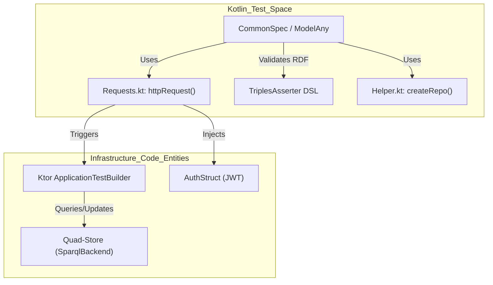
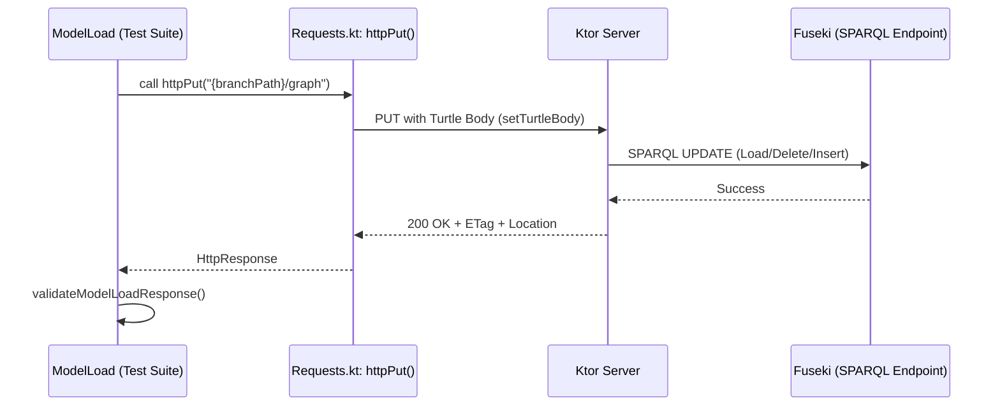

# Page: Testing

# Testing

Relevant source files

The following files were used as context for generating this wiki page:

- [src/test/kotlin/org/openmbee/flexo/mms/ModelAny.kt](src/test/kotlin/org/openmbee/flexo/mms/ModelAny.kt)
- [src/test/kotlin/org/openmbee/flexo/mms/ModelLoad.kt](src/test/kotlin/org/openmbee/flexo/mms/ModelLoad.kt)
- [src/test/kotlin/org/openmbee/flexo/mms/ModelRead.kt](src/test/kotlin/org/openmbee/flexo/mms/ModelRead.kt)
- [src/test/kotlin/org/openmbee/flexo/mms/PolicyCreate.kt](src/test/kotlin/org/openmbee/flexo/mms/PolicyCreate.kt)
- [src/test/kotlin/org/openmbee/flexo/mms/RepoQuery.kt](src/test/kotlin/org/openmbee/flexo/mms/RepoQuery.kt)
- [src/test/kotlin/org/openmbee/flexo/mms/util/Helper.kt](src/test/kotlin/org/openmbee/flexo/mms/util/Helper.kt)
- [src/test/kotlin/org/openmbee/flexo/mms/util/Requests.kt](src/test/kotlin/org/openmbee/flexo/mms/util/Requests.kt)

The Flexo MMS Layer 1 Service employs a comprehensive testing strategy centered on high-level integration tests that exercise the Ktor server and its interaction with a SPARQL quad-store. The test suite is designed to validate the RDF data model, access control enforcement, and the transactional integrity of model operations.

### Testing Strategy and Infrastructure

The service uses **Kotest** as the primary testing framework, running on the **JUnit 5** platform [build.gradle.kts:40-44](). Tests are executed against a live quad-store (typically Apache Jena Fuseki) to ensure that SPARQL queries and updates behave as expected in a real environment.

The testing infrastructure provides several key abstractions:
*   **Ktor Test Application**: Utilizes `testApplication` to spin up an in-memory version of the server for request routing [src/test/kotlin/org/openmbee/flexo/mms/ModelLoad.kt:43-44]().
*   **Authentication Utilities**: The `AuthStruct` and `authorization` helpers generate valid JWT Bearer tokens for different personas like `root`, `admin`, and `anon` to test permission enforcement [src/test/kotlin/org/openmbee/flexo/mms/util/Requests.kt:19-55]().
*   **RDF Assertions**: A custom DSL (`TriplesAsserter`) allows for expressive assertions on RDF responses, supporting checks for specific triples, data types, and exclusive graph contents [src/test/kotlin/org/openmbee/flexo/mms/PolicyCreate.kt:16-38]().
*   **HTTP Helpers**: Extension functions like `httpPut`, `httpPost`, and `setTurtleBody` simplify the construction of RESTful requests against the LDP and GSP endpoints [src/test/kotlin/org/openmbee/flexo/mms/util/Requests.kt:62-80](), [src/test/kotlin/org/openmbee/flexo/mms/util/Requests.kt:112-129]().

For details on the utility classes and DSLs, see [Test Infrastructure and Utilities](#7.1).

#### Test Environment Relationship
The following diagram illustrates how the test environment connects the Kotlin test suites to the underlying infrastructure components.

**Test Entity Mapping**

Sources: [src/test/kotlin/org/openmbee/flexo/mms/util/Requests.kt:82-110](), [src/test/kotlin/org/openmbee/flexo/mms/util/Helper.kt:22-30](), [src/test/kotlin/org/openmbee/flexo/mms/ModelLoad.kt:15-50]()

---

### Integration Test Suites

Integration tests are organized by resource type and functional area. These suites verify the end-to-end lifecycle of MMS resources, from initial creation to complex versioning operations.

Key test areas include:
*   **Resource CRUD**: Validating the creation and management of Organizations, Repositories, and Policies [src/test/kotlin/org/openmbee/flexo/mms/PolicyCreate.kt:67-132]().
*   **Model Operations**: Testing `ModelLoad` (PUT to `/graph`), `ModelCommit` (POST to `/update`), and `ModelRead` (GET/HEAD on `/graph`) to ensure model state is correctly persisted and retrieved [src/test/kotlin/org/openmbee/flexo/mms/ModelLoad.kt:42-117](), [src/test/kotlin/org/openmbee/flexo/mms/ModelRead.kt:25-84]().
*   **Repository Queries**: Testing SPARQL query execution at the repository level, including queries against specific locks or branches [src/test/kotlin/org/openmbee/flexo/mms/RepoQuery.kt:28-44]().
*   **Concurrency**: Ensuring that conflicting updates to the same branch result in `409 Conflict` status codes via the transaction mutex mechanism [src/test/kotlin/org/openmbee/flexo/mms/ModelLoad.kt:118-129]().
*   **Access Control**: Verifying that anonymous or unauthorized requests are rejected with appropriate status codes (e.g., `403 Forbidden`) while `root` requests succeed [src/test/kotlin/org/openmbee/flexo/mms/util/Requests.kt:83-101]().

For a full breakdown of the test coverage, see [Integration Test Suites](#7.2).

#### Model Operation Flow
This diagram maps the high-level "Model Load" action to the specific test functions and HTTP methods used in the codebase.

**Model Load Execution Path**

Sources: [src/test/kotlin/org/openmbee/flexo/mms/ModelLoad.kt:16-50](), [src/test/kotlin/org/openmbee/flexo/mms/util/Requests.kt:62-66](), [src/test/kotlin/org/openmbee/flexo/mms/util/Requests.kt:121-123]()

---

### CI/CD and Containerization

The project uses a multi-container setup for automated testing in CI environments. This is defined in `docker-compose.yml`, which orchestrates the necessary backend services for the integration tests.

| Component | Image | Purpose |
| :--- | :--- | :--- |
| **Quad Store** | `atomgraph/fuseki:4.7` | Primary RDF storage for metadata and models. |
| **Store Service** | `openmbee/flexo-mms-store-service` | Manages artifact persistence. |
| **Test Runner** | `openjdk:17.0.2-jdk-slim` | Executes the Kotest suite via `./gradlew test`. |

The `Dockerfile-Test` builds the service and executes the test suite within this network, ensuring all dependencies are available.

Sources: [src/test/kotlin/org/openmbee/flexo/mms/util/Helper.kt:176-180](), [build.gradle.kts:40-44]()
