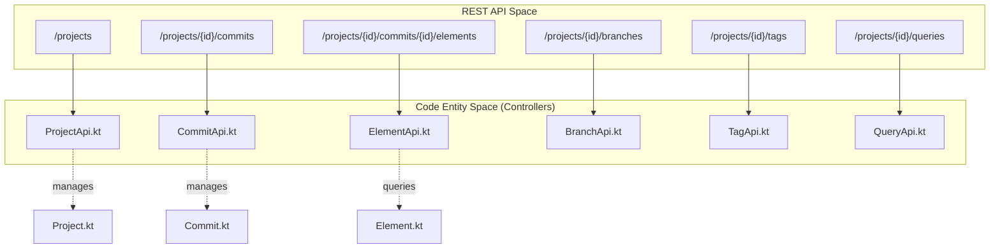
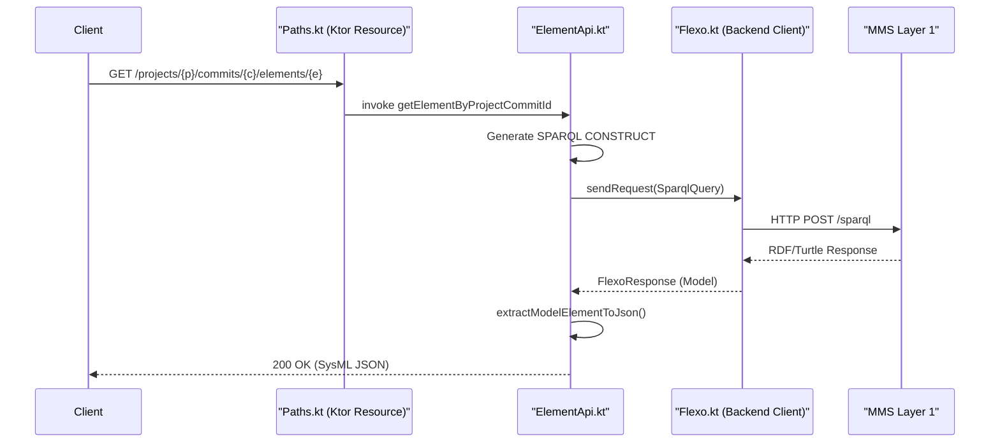

# Page: API Reference

# API Reference

Relevant source files

The following files were used as context for generating this wiki page:

- [Dockerfile](Dockerfile)
- [README.md](README.md)
- [docker-compose/env/flexo-sysmlv2.env](docker-compose/env/flexo-sysmlv2.env)
- [settings.gradle.kts](settings.gradle.kts)
- [src/main/kotlin/org/openmbee/flexo/sysmlv2/Paths.kt](src/main/kotlin/org/openmbee/flexo/sysmlv2/Paths.kt)
- [src/main/kotlin/org/openmbee/flexo/sysmlv2/models/DataIdentityRequest.kt](src/main/kotlin/org/openmbee/flexo/sysmlv2/models/DataIdentityRequest.kt)
- [src/main/kotlin/org/openmbee/flexo/sysmlv2/models/Identified.kt](src/main/kotlin/org/openmbee/flexo/sysmlv2/models/Identified.kt)

The Flexo MMS SysML v2 service exposes a RESTful API that implements the [Systems Modeling API and Services](https://github.com/Systems-Modeling/SysML-v2-API-Services) specification. The service acts as a Platform Specific Model (PSM) layer, translating standard SysML v2 API calls into SPARQL queries and updates executed against a Flexo MMS Layer 1 graph store [README.md:1-5]().

All endpoints are defined using Ktor's type-safe routing via the `Paths` object [src/main/kotlin/org/openmbee/flexo/sysmlv2/Paths.kt:22-22]().

### API Domain Overview

The following diagram maps the high-level functional domains to their respective implementation classes and URL patterns.

**API Domain Mapping**

Sources: [README.md:39-75](), [src/main/kotlin/org/openmbee/flexo/sysmlv2/Paths.kt:22-198]()

---

### Functional Domains

#### [Project API](#3.1)
The Project API handles the lifecycle of SysML v2 projects [README.md:58-62](). It maps SysML projects to MMS Repository resources. Key features include a "soft-delete" pattern and a fetch-then-update logic for `PUT` requests to ensure consistency with the underlying triplestore.
*   **Base Pattern:** `/projects`
*   **Key Operations:** `getProjects`, `postProject`, `deleteProjectById`.
*   **For details, see [Project API](#3.1).**

#### [Commit API](#3.2)
The Commit API manages the version history of a project [README.md:45-49](). It processes `CommitRequest` payloads and translates them into incremental SPARQL `UPDATE` operations or full Turtle `PUT` replacements. It also handles the conversion of JSON literals into RDF types.
*   **Base Pattern:** `/projects/{projectId}/commits`
*   **Key Operations:** `postCommitByProject`, `getCommitsByProject`, `getChangeByProjectCommitId`.
*   **For details, see [Commit API](#3.2).**

#### [Element API](#3.3)
This API is responsible for retrieving model data [README.md:52-55](). It utilizes complex SPARQL `CONSTRUCT` queries to rebuild SysML v2 JSON structures from RDF graphs. It includes logic for identifying root elements and handling project usages (inter-project references).
*   **Base Pattern:** `/projects/{projectId}/commits/{commitId}/elements`
*   **Key Operations:** `getElementsByProjectCommit`, `getRootsByProjectCommit`, `getElementByProjectCommitId`.
*   **For details, see [Element API](#3.3).**

#### [Branch and Tag APIs](#3.4)
These APIs manage pointers to specific commits [README.md:41-44, 72-75](). Branches allow for divergent development paths, while Tags (implemented using the MMS Lock-as-Tag pattern) provide immutable snapshots.
*   **Base Pattern:** `/projects/{projectId}/branches` and `/projects/{projectId}/tags`
*   **Key Operations:** `postBranchByProject`, `postTagByProject`, `getBranchesByProject`.
*   **For details, see [Branch and Tag APIs](#3.4).**

#### [Query API](#3.5)
The Query API provides both ad-hoc search capabilities and CRUD operations for saved queries [README.md:63-70](). It features a translation engine that converts `PrimitiveConstraint` and `CompositeConstraint` objects into valid SPARQL `FILTER` clauses.
*   **Base Pattern:** `/projects/{projectId}/queries`
*   **Key Operations:** `getQueryResultsByProjectIdQueryPost`, `postQueryByProject`, `runQuery`.
*   **For details, see [Query API](#3.5).**

#### [Relationship, Diff/Merge, and Meta APIs](#3.6)
This section covers specialized endpoints for navigating directional relationships, performing model comparisons (Diff), and accessing metadata about supported datatypes [README.md:50-51, 56-57, 71-71](). Note that Diff and Merge are currently implemented as stubs.
*   **Key Operations:** `getRelationshipsByProjectCommitRelatedElement`, `diff`, `getDatatypes`.
*   **For details, see [Relationship, Diff/Merge, and Meta APIs](#3.6).**

---

### Request Pipeline

The following diagram illustrates how a standard request (e.g., fetching an element) flows through the system from the REST endpoint to the Layer 1 backend.

**Request Flow: REST to SPARQL**

Sources: [src/main/kotlin/org/openmbee/flexo/sysmlv2/Paths.kt:138-138](), [README.md:52-52](), [docker-compose/env/flexo-sysmlv2.env:1-3]()
