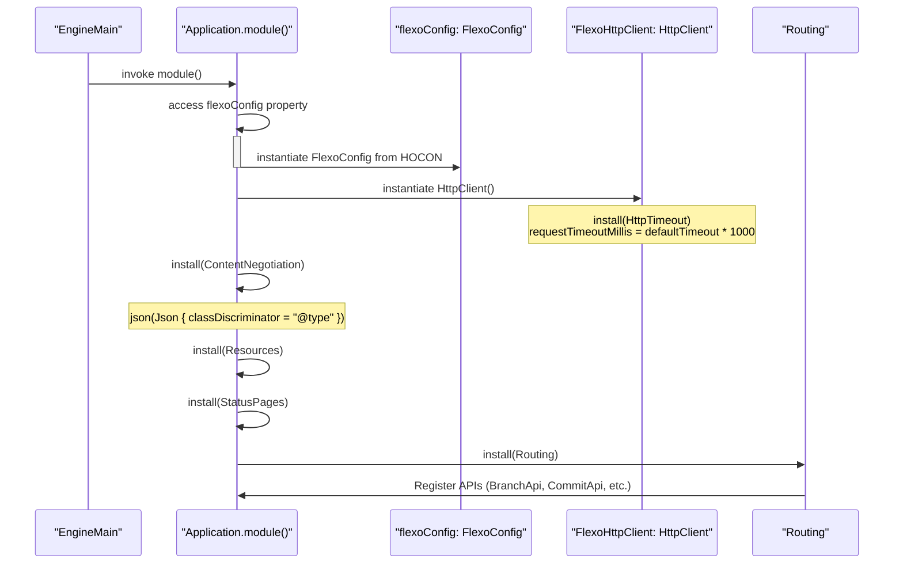
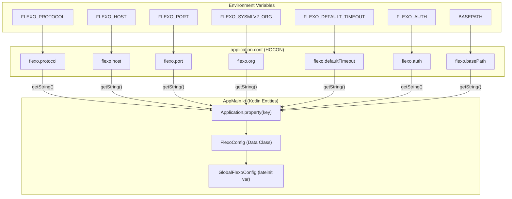

# Page: Application Bootstrap and Configuration

# Application Bootstrap and Configuration

Relevant source files

The following files were used as context for generating this wiki page:

- [src/main/kotlin/org/openmbee/flexo/sysmlv2/AppMain.kt](src/main/kotlin/org/openmbee/flexo/sysmlv2/AppMain.kt)
- [src/main/kotlin/org/openmbee/flexo/sysmlv2/Http.kt](src/main/kotlin/org/openmbee/flexo/sysmlv2/Http.kt)
- [src/main/resources/application.conf.example](src/main/resources/application.conf.example)
- [src/test/resources/application.test.conf](src/test/resources/application.test.conf)

This page details the initialization sequence and configuration management of the Flexo SysML v2 service. The application uses the Ktor framework, employing a modular configuration approach that maps environment variables to type-safe Kotlin objects via HOCON files.

## Application Entry Point

The service entry point is defined in `AppMain.kt`. It utilizes Ktor's `EngineMain` to launch a Netty server based on configurations provided in `application.conf` [src/main/kotlin/org/openmbee/flexo/sysmlv2/AppMain.kt:24-24]().

The core logic resides in the `Application.module()` extension function [src/main/kotlin/org/openmbee/flexo/sysmlv2/AppMain.kt:27-88](). This function is responsible for:

1.  **Configuration Loading**: Initializing the `GlobalFlexoConfig` by calling the `flexoConfig` extension property [src/main/kotlin/org/openmbee/flexo/sysmlv2/AppMain.kt:28-28]().
2.  **HTTP Client Setup**: Creating a shared `FlexoHttpClient` with a configurable request timeout derived from `GlobalFlexoConfig.defaultTimeout` [src/main/kotlin/org/openmbee/flexo/sysmlv2/AppMain.kt:29-33]().
3.  **Plugin Installation**: Configuring middleware for content negotiation, compression, resources, and error handling [src/main/kotlin/org/openmbee/flexo/sysmlv2/AppMain.kt:34-74]().
4.  **Routing**: Initializing the API route groups under a configurable `basePath` [src/main/kotlin/org/openmbee/flexo/sysmlv2/AppMain.kt:75-87]().

### Bootstrap Sequence Diagram

The following diagram illustrates the initialization flow from the `main` function through the Ktor `Application.module`.

**Bootstrap Lifecycle**

Sources: [src/main/kotlin/org/openmbee/flexo/sysmlv2/AppMain.kt:24-88]()

## Configuration Management

The application uses a `FlexoConfig` data class to store backend-related settings, such as connection details for the Flexo Layer 1 service and the target organization [src/main/kotlin/org/openmbee/flexo/sysmlv2/AppMain.kt:101-109]().

### FlexoConfig Properties
| Property | Type | Description | Default (if not set) |
| :--- | :--- | :--- | :--- |
| `protocol` | `URLProtocol` | Connection protocol (HTTP/HTTPS) to Layer 1. | `http` |
| `host` | `String` | Hostname of the Layer 1 service. | `localhost` |
| `port` | `Int` | Port number of the Layer 1 service. | `8080` |
| `org` | `String` | The MMS Organization ID used as a namespace. | `sysmlv2` |
| `defaultTimeout` | `Long` | Request timeout in seconds for the internal HTTP client. | `60,000L` (ms) |
| `auth` | `String` | Default Authorization header value. | `""` |
| `basePath` | `String` | URL prefix for all SysML v2 API endpoints. | `""` |

Sources: [src/main/kotlin/org/openmbee/flexo/sysmlv2/AppMain.kt:101-109](), [src/main/kotlin/org/openmbee/flexo/sysmlv2/AppMain.kt:114-124]()

### Environment Mapping

Configuration is resolved via the `Application.flexoConfig` extension property [src/main/kotlin/org/openmbee/flexo/sysmlv2/AppMain.kt:114-124](). This property reads from the Ktor environment configuration, which is populated by `application.conf`.

**Configuration Mapping Diagram**

Sources: [src/main/kotlin/org/openmbee/flexo/sysmlv2/AppMain.kt:94-124](), [src/main/resources/application.conf.example:14-30]()

## Middleware and Plugin Order

The application installs several Ktor plugins to handle the request/response pipeline. The installation order in `Application.module()` determines the processing sequence [src/main/kotlin/org/openmbee/flexo/sysmlv2/AppMain.kt:34-74]().

1.  **DefaultHeaders**: Adds standard HTTP headers (e.g., Server, Date) [src/main/kotlin/org/openmbee/flexo/sysmlv2/AppMain.kt:34-34]().
2.  **CallLogging**: Logs incoming requests for monitoring [src/main/kotlin/org/openmbee/flexo/sysmlv2/AppMain.kt:35-35]().
3.  **ContentNegotiation**: Configures `kotlinx.serialization` for JSON [src/main/kotlin/org/openmbee/flexo/sysmlv2/AppMain.kt:44-56]().
    *   `isLenient = true`
    *   `prettyPrint = true`
    *   `ignoreUnknownKeys = true`
    *   `classDiscriminator = "@type"`: Crucial for SysML v2 polymorphism where types are identified by the `@type` key.
4.  **AutoHeadResponse**: Automatically provides responses to HEAD requests for any GET route [src/main/kotlin/org/openmbee/flexo/sysmlv2/AppMain.kt:57-57]().
5.  **Compression**: Enables Gzip/Deflate based on `ApplicationCompressionConfiguration` [src/main/kotlin/org/openmbee/flexo/sysmlv2/AppMain.kt:58-58]().
6.  **Resources**: Enables type-safe routing using the `@Resource` annotation [src/main/kotlin/org/openmbee/flexo/sysmlv2/AppMain.kt:60-60]().
7.  **StatusPages**: Global exception handling that maps specific Kotlin exceptions to HTTP status codes [src/main/kotlin/org/openmbee/flexo/sysmlv2/AppMain.kt:61-74]().
    *   `InvalidSysmlSerializationError` -> `400 Bad Request`
    *   `BadRequestException` -> `400 Bad Request`
    *   `NotImplementedError` -> `501 Not Implemented`
    *   `Throwable` -> `500 Internal Server Error`
8.  **Routing**: The final step where all API controllers (e.g., `ProjectApi`, `CommitApi`) are registered under the `GlobalFlexoConfig.basePath` [src/main/kotlin/org/openmbee/flexo/sysmlv2/AppMain.kt:75-87]().

Sources: [src/main/kotlin/org/openmbee/flexo/sysmlv2/AppMain.kt:27-88]()
