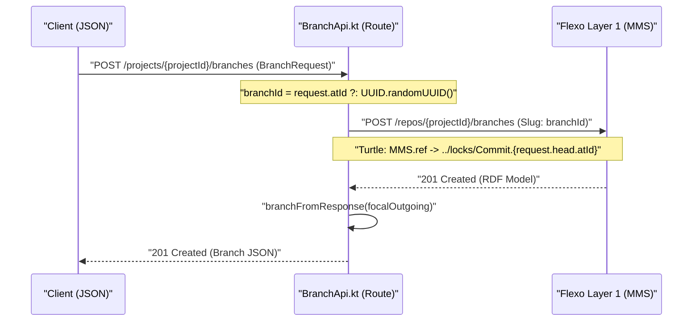
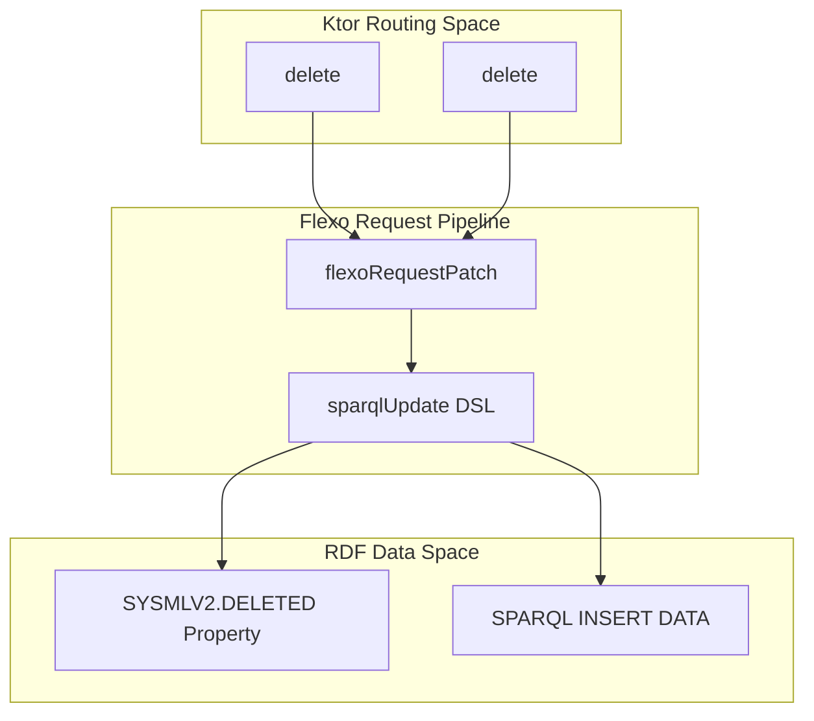

# Page: Branch and Tag APIs

# Branch and Tag APIs

<details>
<summary>Relevant source files</summary>

The following files were used as context for generating this wiki page:

- [src/main/kotlin/org/openmbee/flexo/sysmlv2/apis/BranchApi.kt](src/main/kotlin/org/openmbee/flexo/sysmlv2/apis/BranchApi.kt)
- [src/main/kotlin/org/openmbee/flexo/sysmlv2/apis/TagApi.kt](src/main/kotlin/org/openmbee/flexo/sysmlv2/apis/TagApi.kt)
- [src/main/kotlin/org/openmbee/flexo/sysmlv2/models/TagRequest.kt](src/main/kotlin/org/openmbee/flexo/sysmlv2/models/TagRequest.kt)

</details>


The Branch and Tag APIs provide the infrastructure for version control branching and point-in-time labeling within the SysML v2 service. These APIs map SysML v2 concepts to the underlying Flexo MMS Layer 1 "Branch" and "Lock" resources.

## Branch API

The Branch API manages mutable lines of development. In the underlying MMS architecture, a Branch is a first-class resource that points to a specific commit history.

### Implementation and Data Flow
The `BranchApi.kt` file defines the routing and logic for branch operations. It utilizes the `flexoRequest*` DSL to communicate with the Layer 1 service and transforms RDF responses into SysML v2 `Branch` models.

#### Branch Mapping
The `branchFromResponse` function [src/main/kotlin/org/openmbee/flexo/sysmlv2/apis/BranchApi.kt:34-52]() is a key mapper that converts a map of RDF properties (`Map<Property, Set<RDFNode>>`) into a Kotlin `Branch` object.
- **Commit Reference**: It extracts the `MMS.commit` [src/main/kotlin/org/openmbee/flexo/sysmlv2/apis/BranchApi.kt:39-39]() to populate both the `referencedCommit` and `head` fields [src/main/kotlin/org/openmbee/flexo/sysmlv2/apis/BranchApi.kt:48-50]().
- **Metadata**: It maps `DCTerms.title` to the branch name [src/main/kotlin/org/openmbee/flexo/sysmlv2/apis/BranchApi.kt:49-49]() and `MMS.created` to the creation timestamp [src/main/kotlin/org/openmbee/flexo/sysmlv2/apis/BranchApi.kt:43-46]().

### Operations
| Operation | Method | Endpoint | Behavior |
| :--- | :--- | :--- | :--- |
| List Branches | `GET` | `/projects/{projectId}/branches` | Fetches all branches for a project. It filters out the "master" branch and any branches marked as deleted via SPARQL [src/main/kotlin/org/openmbee/flexo/sysmlv2/apis/BranchApi.kt:78-95](). |
| Get Branch | `GET` | `/projects/{projectId}/branches/{branchId}` | Retrieves metadata for a specific branch [src/main/kotlin/org/openmbee/flexo/sysmlv2/apis/BranchApi.kt:97-112](). |
| Create Branch | `POST` | `/projects/{projectId}/branches` | Creates a new branch pointing to a specific commit. It uses the `Slug` header to set the branch ID [src/main/kotlin/org/openmbee/flexo/sysmlv2/apis/BranchApi.kt:114-138](). |
| Delete Branch | `DELETE` | `/projects/{projectId}/branches/{branchId}` | Implements a **soft-delete** pattern by inserting a `SYSMLV2.DELETED` triple [src/main/kotlin/org/openmbee/flexo/sysmlv2/apis/BranchApi.kt:55-76](). |

**Sources:** [src/main/kotlin/org/openmbee/flexo/sysmlv2/apis/BranchApi.kt:34-138]()

### Branch Creation Flow
The following diagram illustrates the mapping between SysML v2 API calls and the underlying Flexo Layer 1 requests.

**Branch Creation Request Flow**

**Sources:** [src/main/kotlin/org/openmbee/flexo/sysmlv2/apis/BranchApi.kt:114-138]()

---

## Tag API

Tags in SysML v2 represent immutable snapshots of the model at a specific commit. In Flexo MMS, these are implemented using the **Lock-as-Tag** pattern.

### Lock-as-Tag Pattern
While MMS uses "Locks" to represent various state-freezes, the SysML v2 service filters these to expose only user-defined tags.
- **Internal Locks**: MMS creates internal locks for every commit, prefixed with `Commit.` [src/main/kotlin/org/openmbee/flexo/sysmlv2/apis/TagApi.kt:108-108]().
- **User Tags**: These are locks created via the Tag API without the internal prefix, effectively serving as aliases for specific commits.

### Implementation Details
The `TagApi.kt` file manages the lifecycle of these tags.

#### Tag Mapping
The `tagFromResponse` function [src/main/kotlin/org/openmbee/flexo/sysmlv2/apis/TagApi.kt:34-52]() performs the RDF-to-Model transformation:
- It maps the `MMS.commit` property from the Layer 1 Lock resource to the `taggedCommit` and `referencedCommit` fields of the SysML v2 `Tag` object [src/main/kotlin/org/openmbee/flexo/sysmlv2/apis/TagApi.kt:39-49]().

#### Filtering Logic
When listing tags via `getTagsByProject`, the service explicitly excludes:
1. Internal Flexo-created locks (starting with `Commit.`) [src/main/kotlin/org/openmbee/flexo/sysmlv2/apis/TagApi.kt:108-108]().
2. Resources marked with the `SYSMLV2.DELETED` property [src/main/kotlin/org/openmbee/flexo/sysmlv2/apis/TagApi.kt:108-108]().

**Sources:** [src/main/kotlin/org/openmbee/flexo/sysmlv2/apis/TagApi.kt:34-113]()

---

## Soft-Delete via SPARQL PATCH

Both Branch and Tag APIs implement a soft-delete mechanism rather than a hard destructive delete. This ensures auditability and prevents accidental data loss in the triplestore.

### Mechanism
When a `DELETE` request is received, the service performs a `PATCH` operation on the resource in Layer 1. It executes a SPARQL UPDATE to insert a specific deletion triple:

```sparql
insert data {
    <> <https://www.omg.org/spec/SysML/v2/deleted> true .
}
```
[src/main/kotlin/org/openmbee/flexo/sysmlv2/apis/BranchApi.kt:60-64](), [src/main/kotlin/org/openmbee/flexo/sysmlv2/apis/TagApi.kt:60-64]()

### Code-to-System Entity Mapping
The following diagram bridges the SysML v2 delete routes to the SPARQL implementation.

**Soft-Delete Execution Model**

**Sources:** [src/main/kotlin/org/openmbee/flexo/sysmlv2/apis/BranchApi.kt:55-66](), [src/main/kotlin/org/openmbee/flexo/sysmlv2/apis/TagApi.kt:55-66]()

---

## Data Models and Requests

Branch and Tag operations rely on specific request models to define the target state.

- **BranchRequest**: Contains the `name` and the `head` commit [src/main/kotlin/org/openmbee/flexo/sysmlv2/models/BranchRequest.kt]().
- **TagRequest**: Contains the `name` and the `taggedCommit` [src/main/kotlin/org/openmbee/flexo/sysmlv2/models/TagRequest.kt:30-35]().

When creating a Tag, the `taggedCommit` is mapped to an MMS reference pointing to a lock resource named `./Commit.{id}` [src/main/kotlin/org/openmbee/flexo/sysmlv2/apis/TagApi.kt:125-125](), whereas a Branch points to `../locks/Commit.{id}` [src/main/kotlin/org/openmbee/flexo/sysmlv2/apis/BranchApi.kt:126-126]().

**Sources:** [src/main/kotlin/org/openmbee/flexo/sysmlv2/models/TagRequest.kt:30-35](), [src/main/kotlin/org/openmbee/flexo/sysmlv2/apis/BranchApi.kt:126-126](), [src/main/kotlin/org/openmbee/flexo/sysmlv2/apis/TagApi.kt:125-125]()
