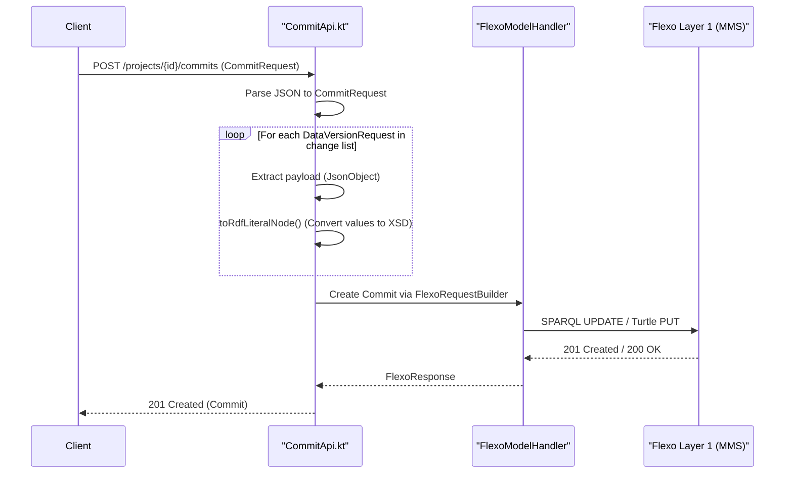
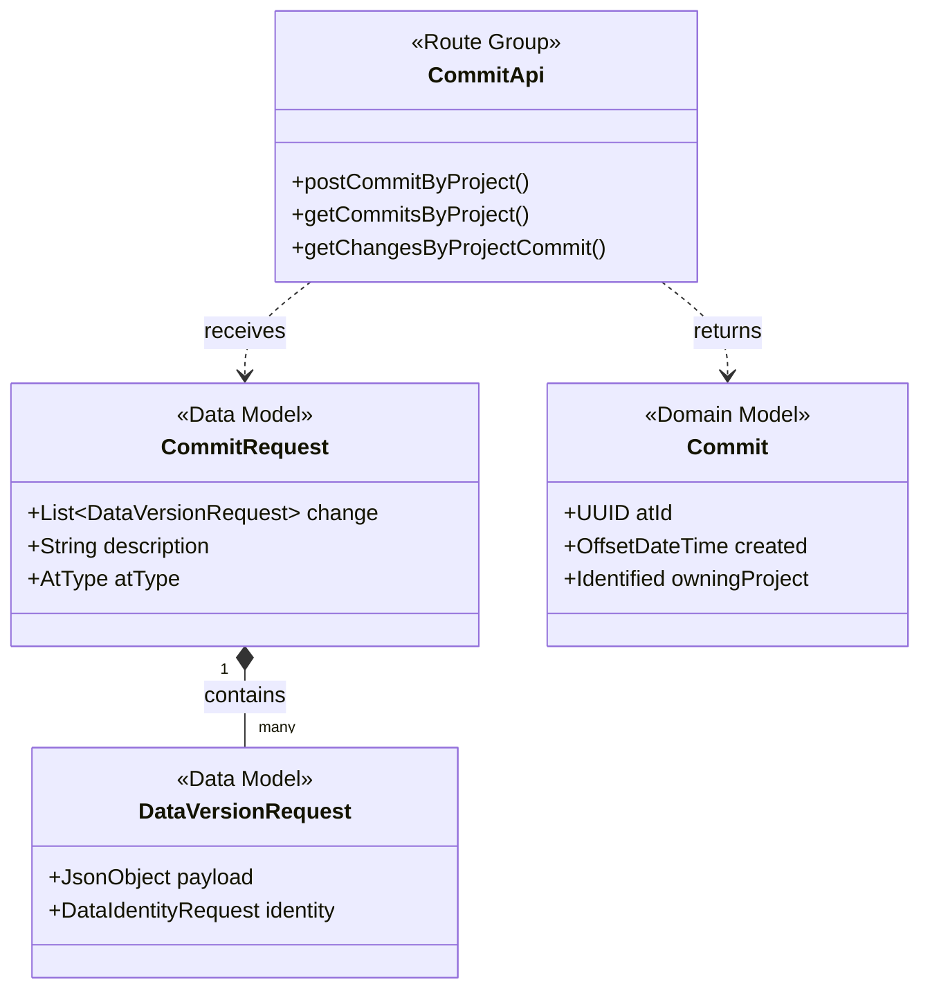

# Page: Commit API

# Commit API

Relevant source files

The following files were used as context for generating this wiki page:

- [src/main/kotlin/org/openmbee/flexo/sysmlv2/apis/CommitApi.kt](src/main/kotlin/org/openmbee/flexo/sysmlv2/apis/CommitApi.kt)
- [src/main/kotlin/org/openmbee/flexo/sysmlv2/models/CommitRequest.kt](src/main/kotlin/org/openmbee/flexo/sysmlv2/models/CommitRequest.kt)
- [src/main/kotlin/org/openmbee/flexo/sysmlv2/models/DataVersionRequest.kt](src/main/kotlin/org/openmbee/flexo/sysmlv2/models/DataVersionRequest.kt)
- [src/test/kotlin/org/openmbee/flexo/sysmlv2/ApplicationTest.kt](src/test/kotlin/org/openmbee/flexo/sysmlv2/ApplicationTest.kt)
- [src/test/resources/PartsTreeRedefinition.json](src/test/resources/PartsTreeRedefinition.json)

The Commit API manages the lifecycle of changes within a SysML v2 project. It provides endpoints for retrieving commit history, inspecting specific data versions, and submitting new changesets. The API bridges the SysML v2 `CommitRequest` model with the underlying Flexo MMS Layer 1 versioning system, utilizing both incremental SPARQL updates and full graph replacements.

## Overview and Data Flow

The Commit API handles the transition of model states. When a user submits a `CommitRequest`, the service processes a list of `DataVersionRequest` objects, each containing a SysML v2 element payload. These are transformed into RDF and persisted to the triple store via the Flexo Backend.

### Commit Submission Lifecycle

The following diagram illustrates the flow from a JSON `CommitRequest` to the persistence layer in the Flexo Backend.

**Diagram: Commit Request Processing**

Sources: [src/main/kotlin/org/openmbee/flexo/sysmlv2/apis/CommitApi.kt:208-253](), [src/main/kotlin/org/openmbee/flexo/sysmlv2/models/CommitRequest.kt:30-35]()

## Key Functions and Implementation

### Commit Mapping
The `commitFromModel` extension function converts RDF properties retrieved from the Flexo backend into a SysML v2 `Commit` data model.

*   **Function**: `FlexoModelHandler.commitFromModel` [src/main/kotlin/org/openmbee/flexo/sysmlv2/apis/CommitApi.kt:39-56]()
*   **Logic**: It extracts the commit UUID from the IRI suffix using `uriSuffix`, parses the `MMS.submitted` timestamp, and maps `DCTerms.description` to the SysML description field.
*   **Owning Project**: The project is associated via an `Identified` object using the provided `projectUuid` [src/main/kotlin/org/openmbee/flexo/sysmlv2/apis/CommitApi.kt:50-50]().

### JSON-to-RDF Conversion
To store SysML elements as RDF literals in the triplestore, the API provides a utility to map JSON primitives to XSD datatypes.

*   **Function**: `JsonPrimitive.toRdfLiteralNode` [src/main/kotlin/org/openmbee/flexo/sysmlv2/apis/CommitApi.kt:58-72]()
*   **Type Mapping**:
    | JSON Type | XSD Datatype | Implementation Detail |
    | :--- | :--- | :--- |
    | String | `xsd:string` | `jsonPrimitive.isString` [src/main/kotlin/org/openmbee/flexo/sysmlv2/apis/CommitApi.kt:60-62]() |
    | Boolean | `xsd:boolean` | `jsonPrimitive.booleanOrNull != null` [src/main/kotlin/org/openmbee/flexo/sysmlv2/apis/CommitApi.kt:63-65]() |
    | Number/Other | `xsd:decimal` | Default fallback [src/main/kotlin/org/openmbee/flexo/sysmlv2/apis/CommitApi.kt:67-67]() |

Sources: [src/main/kotlin/org/openmbee/flexo/sysmlv2/apis/CommitApi.kt:39-72]()

## API Endpoints

### Get Commit History
Retrieves a list of all commits for a specific project.
*   **Route**: `get<Paths.getCommitsByProject>` [src/main/kotlin/org/openmbee/flexo/sysmlv2/apis/CommitApi.kt:197-206]()
*   **Implementation**: Utilizes `FlexoRequestBuilder` to fetch commit resources from the backend and maps them using `commitFromModel`.

### Get Changes by Commit
Retrieves the specific `DataVersion` objects associated with a commit.
*   **Routes**: 
    *   `get<Paths.getChangesByProjectCommit>` [src/main/kotlin/org/openmbee/flexo/sysmlv2/apis/CommitApi.kt:122-195]()
    *   `get<Paths.getChangeByProjectCommitId>` [src/main/kotlin/org/openmbee/flexo/sysmlv2/apis/CommitApi.kt:75-120]()
*   **Note**: These endpoints currently utilize hardcoded example JSON strings for `DataVersion` response simulation [src/main/kotlin/org/openmbee/flexo/sysmlv2/apis/CommitApi.kt:76-118](), which are decoded using `Json.decodeFromString<DataVersion>()` [src/main/kotlin/org/openmbee/flexo/sysmlv2/apis/CommitApi.kt:119-119]().

### Post Commit (Create)
The primary write endpoint for the SysML v2 API.
*   **Route**: `post<Paths.postCommitByProject>` [src/main/kotlin/org/openmbee/flexo/sysmlv2/apis/CommitApi.kt:208-253]()
*   **Payload**: `CommitRequest` containing a `change` list of `DataVersionRequest` [src/main/kotlin/org/openmbee/flexo/sysmlv2/models/CommitRequest.kt:30-35]().
*   **Persistence Strategy**:
    1.  The request is received as a `CommitRequest` object.
    2.  The service iterates through the `change` list.
    3.  Each `DataVersionRequest` contains an `identity` (UUID) and a `payload` (the element data as a `JsonObject`) [src/main/kotlin/org/openmbee/flexo/sysmlv2/models/DataVersionRequest.kt:30-35]().
    4.  The service constructs a commit to the backend, which may involve incremental SPARQL updates or a full Turtle PUT depending on the `FlexoRequestBuilder` configuration.

Sources: [src/main/kotlin/org/openmbee/flexo/sysmlv2/apis/CommitApi.kt:75-253](), [src/main/kotlin/org/openmbee/flexo/sysmlv2/models/DataVersionRequest.kt:30-35](), [src/main/kotlin/org/openmbee/flexo/sysmlv2/models/CommitRequest.kt:30-35]()

## Code Entity Space Mapping

The following diagram maps the conceptual "Commit" and "Data Version" to the specific Kotlin classes and Ktor routes defined in the implementation.

**Diagram: Code Entity Mapping**

Sources: [src/main/kotlin/org/openmbee/flexo/sysmlv2/apis/CommitApi.kt:74-75](), [src/main/kotlin/org/openmbee/flexo/sysmlv2/models/CommitRequest.kt:30-44](), [src/main/kotlin/org/openmbee/flexo/sysmlv2/models/DataVersionRequest.kt:30-44]()

## Testing Commit Operations

Integration tests for the Commit API are located in `ApplicationTest.kt`. These tests demonstrate the end-to-end flow of posting a SysML v2 payload.

*   **Fixture**: `PartsTreeRedefinition.json` is used as a standard payload for testing complex commit structures [src/test/kotlin/org/openmbee/flexo/sysmlv2/ApplicationTest.kt:29-29]().
*   **Test Case**: `testStore()` performs a `POST` to `/projects/{id}/commits` with a `changeJson` string containing multiple `DataVersion` entries [src/test/kotlin/org/openmbee/flexo/sysmlv2/ApplicationTest.kt:65-69]().
*   **Verification**: The test environment bootstraps a default `sysmlv2` organization and repository in the Flexo backend before executing the commit [src/test/kotlin/org/openmbee/flexo/sysmlv2/ApplicationTest.kt:148-168]().

Sources: [src/test/kotlin/org/openmbee/flexo/sysmlv2/ApplicationTest.kt:23-74](), [src/test/resources/PartsTreeRedefinition.json:1-1]()
