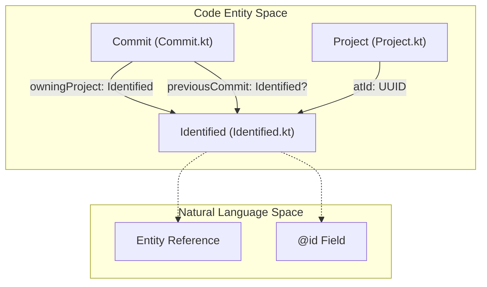
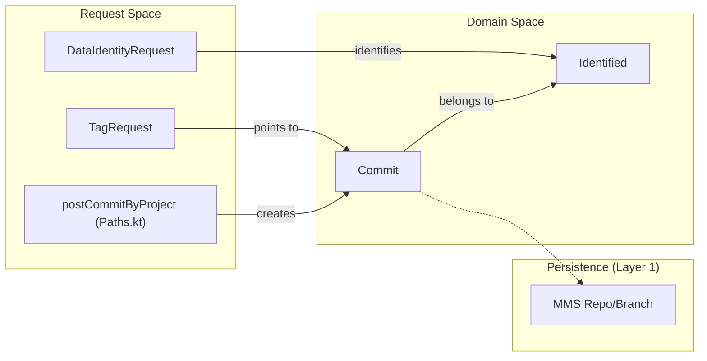

# Page: Core Domain Models

# Core Domain Models

Relevant source files

The following files were used as context for generating this wiki page:

- [src/main/kotlin/org/openmbee/flexo/sysmlv2/Paths.kt](src/main/kotlin/org/openmbee/flexo/sysmlv2/Paths.kt)
- [src/main/kotlin/org/openmbee/flexo/sysmlv2/models/Commit.kt](src/main/kotlin/org/openmbee/flexo/sysmlv2/models/Commit.kt)
- [src/main/kotlin/org/openmbee/flexo/sysmlv2/models/DataIdentityRequest.kt](src/main/kotlin/org/openmbee/flexo/sysmlv2/models/DataIdentityRequest.kt)
- [src/main/kotlin/org/openmbee/flexo/sysmlv2/models/Identified.kt](src/main/kotlin/org/openmbee/flexo/sysmlv2/models/Identified.kt)
- [src/main/kotlin/org/openmbee/flexo/sysmlv2/models/TagRequest.kt](src/main/kotlin/org/openmbee/flexo/sysmlv2/models/TagRequest.kt)

The `flexo-mms-sysmlv2` service utilizes a set of Kotlin data classes that represent the core entities of the SysML v2 REST/HTTP Platform Specific Model (PSM). These models are primarily auto-generated from the SysML v2 OpenAPI specification and are annotated for JSON serialization using `kotlinx.serialization`. They serve as the primary data transfer objects (DTOs) between the service and its clients, as well as the intermediate representation before data is persisted into the underlying RDF quad store.

## Entity Hierarchy and Identification

The foundation of the domain model is the `Identified` class. In the SysML v2 API, almost every resource is uniquely identified by a UUID, which is mapped to the `@id` field in JSON-LD.

### Identified
The `Identified` class is a simple wrapper for a UUID, used extensively to represent references to other entities without nesting the full object.

| Field | JSON Name | Type | Description |
| :--- | :--- | :--- | :--- |
| `atId` | `@id` | `java.util.UUID` | The unique identifier for the entity. |

**Diagram: Identification and Referencing**
This diagram shows how `Identified` serves as the base reference type for complex models like `Commit`.

Sources: [src/main/kotlin/org/openmbee/flexo/sysmlv2/models/Identified.kt:26-30](), [src/main/kotlin/org/openmbee/flexo/sysmlv2/models/Commit.kt:34-44]()

## Project and Versioning Models

Versioning in SysML v2 is managed through a hierarchy of Projects, Commits, Branches, and Tags. These entities are accessed via the `Paths.kt` resource definitions which define the RESTful structure.

### Commit
A `Commit` represents a snapshot of data at a specific point in time. It is immutable and contains metadata about its creation and its position in the version history.

*   **Fields**:
    *   `atId`: The UUID of the commit.
    *   `atType`: Always set to `Commit.AtType.Commit`.
    *   `created`: Timestamp of the commit (uses `OffsetDateTimeSerializer`).
    *   `description`: Human-readable text describing the changes.
    *   `owningProject`: An `Identified` reference to the parent Project.
    *   `previousCommit`: An optional `Identified` reference to the parent commit in the history.

### TagRequest
While `Tag` objects represent persistent named pointers to commits, the `TagRequest` model is used when clients create new tags.

*   **Fields**:
    *   `name`: The string label for the tag.
    *   `taggedCommit`: An `Identified` object pointing to the specific `Commit` being tagged.
    *   `atType`: Optional discriminator, defaults to `Tag`.

Sources: [src/main/kotlin/org/openmbee/flexo/sysmlv2/models/Commit.kt:34-53](), [src/main/kotlin/org/openmbee/flexo/sysmlv2/models/TagRequest.kt:30-44](), [src/main/kotlin/org/openmbee/flexo/sysmlv2/Paths.kt:83-102]()

## Data Identity and Versioning

SysML v2 distinguishes between the identity of a data element (which remains constant) and the specific version of that data (which changes per commit).

### DataIdentityRequest
This model is used to specify the identity of an element, typically during creation or update operations.

| Field | JSON Name | Type | Description |
| :--- | :--- | :--- | :--- |
| `atId` | `@id` | `String` | The persistent identity URI or UUID. |
| `atType` | `@type` | `DataIdentityRequest.AtType?` | Enum value `DataIdentity`. |

**Diagram: Data Identity vs. Commit Flow**
This diagram bridges the request models to the logical flow of versioning and how they are routed through `Paths.kt`.

Sources: [src/main/kotlin/org/openmbee/flexo/sysmlv2/models/DataIdentityRequest.kt:28-42](), [src/main/kotlin/org/openmbee/flexo/sysmlv2/models/TagRequest.kt:30-35](), [src/main/kotlin/org/openmbee/flexo/sysmlv2/Paths.kt:102-102]()

## Serialization and Custom Types

The domain models rely on custom serializers to handle types that are not natively supported by the standard JSON-LD mapping or the `kotlinx.serialization` library.

1.  **UUID Serialization**: Applied at the file level via `@file:UseSerializers(UUIDSerializer::class)`. This ensures that the `java.util.UUID` type is correctly converted to and from its string representation in JSON.
2.  **DateTime Serialization**: The `Commit` model uses `OffsetDateTimeSerializer` to handle ISO-8601 formatted timestamps for the `created` field.
3.  **URI Serialization**: Used for complex path parameters and URI-based fields, ensuring compliance with the SysML v2 PSM requirements.
4.  **Enums**: Most models contain nested `AtType` enums to handle the `@type` field required by the SysML v2 PSM. These enums use `@SerialName` to ensure the JSON output matches the expected SysML v2 strings (e.g., "Commit", "DataIdentity", "Tag").

Sources: [src/main/kotlin/org/openmbee/flexo/sysmlv2/models/Identified.kt:12-19](), [src/main/kotlin/org/openmbee/flexo/sysmlv2/models/Commit.kt:12-20](), [src/main/kotlin/org/openmbee/flexo/sysmlv2/models/DataIdentityRequest.kt:12-19](), [src/main/kotlin/org/openmbee/flexo/sysmlv2/Paths.kt:12-20]()
