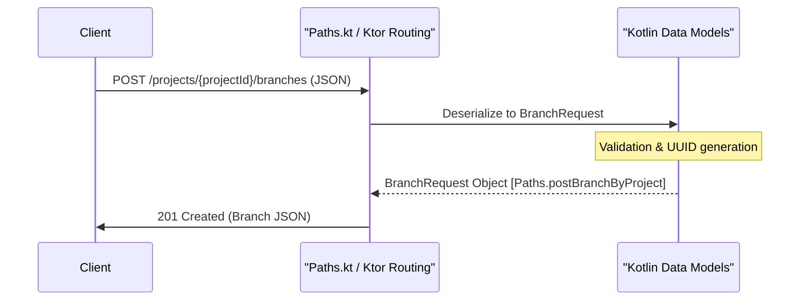

# Page: Data Models

# Data Models

<details>
<summary>Relevant source files</summary>

The following files were used as context for generating this wiki page:

- [resources/openapi.json](resources/openapi.json)
- [src/main/kotlin/org/openmbee/flexo/sysmlv2/Paths.kt](src/main/kotlin/org/openmbee/flexo/sysmlv2/Paths.kt)
- [src/main/kotlin/org/openmbee/flexo/sysmlv2/models/BranchRequest.kt](src/main/kotlin/org/openmbee/flexo/sysmlv2/models/BranchRequest.kt)
- [src/main/kotlin/org/openmbee/flexo/sysmlv2/models/DataIdentityRequest.kt](src/main/kotlin/org/openmbee/flexo/sysmlv2/models/DataIdentityRequest.kt)
- [src/main/kotlin/org/openmbee/flexo/sysmlv2/models/Identified.kt](src/main/kotlin/org/openmbee/flexo/sysmlv2/models/Identified.kt)
- [src/main/kotlin/org/openmbee/flexo/sysmlv2/models/ProjectRequest.kt](src/main/kotlin/org/openmbee/flexo/sysmlv2/models/ProjectRequest.kt)

</details>


This section provides an overview of the Kotlin data model classes used in the `flexo-mms-sysmlv2` service. These models represent the Platform Specific Model (PSM) for the Systems Modeling API and Services [resources/openapi.json:1-7]().

The codebase uses `kotlinx-serialization` to handle the conversion between JSON payloads and Kotlin objects. Most models are auto-generated from the SysML v2 OpenAPI specification to ensure strict compliance with the standard [src/main/kotlin/org/openmbee/flexo/sysmlv2/models/ProjectRequest.kt:8-11]().

## Model Categories

The data models are broadly categorized into two groups:
1.  **Core Domain Models**: Represent persisted entities like Projects, Branches, Commits, and Elements.
2.  **Request Models**: Specialized structures used for `POST`, `PUT`, and `PATCH` operations, often containing optional fields or references for object creation.

### Data Model Mapping Overview

The following diagram illustrates how the system maps high-level SysML v2 concepts to the generated Kotlin classes.

**Concept to Code Entity Mapping**
```mermaid
graph TD
    subgraph "Natural Language Space"
        "Project Concept"
        "Branching/Versioning"
        "Model Element"
        "Change Set"
        "Identity"
    end

    subgraph "Code Entity Space"
        "Project"["Project.kt / ProjectRequest"]
        "Branch"["Branch.kt / BranchRequest"]
        "Element"["Element.kt / DataVersion"]
        "Commit"["Commit.kt / CommitRequest"]
        "Identity"["Identified.kt / DataIdentityRequest"]
    end

    "Project Concept" --> "Project"
    "Branching/Versioning" --> "Branch"
    "Model Element" --> "Element"
    "Change Set" --> "Commit"
    "Identity" --> "Identity"
```
Sources: [src/main/kotlin/org/openmbee/flexo/sysmlv2/models/ProjectRequest.kt:29-38](), [src/main/kotlin/org/openmbee/flexo/sysmlv2/models/BranchRequest.kt:28-36](), [src/main/kotlin/org/openmbee/flexo/sysmlv2/models/Identified.kt:27-30]()

## Serialization and Identifiers

A core aspect of the SysML v2 API is the use of JSON-LD style identifiers. Most models inherit or include an `@id` field, which is mapped in Kotlin using the `@SerialName("@id")` annotation [src/main/kotlin/org/openmbee/flexo/sysmlv2/models/Identified.kt:27-30]().

### UUID Handling
While the API treats identifiers as strings/URIs, the implementation frequently uses `java.util.UUID` for internal logic. A custom `UUIDSerializer` is applied at the file level to these models to handle the transformation during JSON serialization [src/main/kotlin/org/openmbee/flexo/sysmlv2/models/Identified.kt:12](), [src/main/kotlin/org/openmbee/flexo/sysmlv2/models/ProjectRequest.kt:12]().

| Kotlin Class | Key Field | Serial Name | Type |
| :--- | :--- | :--- | :--- |
| `Identified` | `atId` | `@id` | `UUID` |
| `ProjectRequest` | `atId` | `@id` | `UUID?` |
| `BranchRequest` | `atId` | `@id` | `UUID?` |
| `DataIdentityRequest` | `atId` | `@id` | `String` |

Sources: [src/main/kotlin/org/openmbee/flexo/sysmlv2/models/Identified.kt:27-30](), [src/main/kotlin/org/openmbee/flexo/sysmlv2/models/ProjectRequest.kt:32-33](), [src/main/kotlin/org/openmbee/flexo/sysmlv2/models/BranchRequest.kt:32-33](), [src/main/kotlin/org/openmbee/flexo/sysmlv2/models/DataIdentityRequest.kt:29-30]()

## Relationship to API Endpoints

The models are tightly coupled with the `openapi.json` paths and the Ktor `Paths.kt` resource definitions. For example, a `POST` to `/projects` is handled by the `postProject` operation [resources/openapi.json:80-85](), which utilizes `ProjectRequest` [src/main/kotlin/org/openmbee/flexo/sysmlv2/models/ProjectRequest.kt:30](). Similarly, branch creation via `postBranchByProject` requires a `BranchRequest` [src/main/kotlin/org/openmbee/flexo/Paths.kt:55]().

**Request-Response Lifecycle**

Sources: [resources/openapi.json:80-121](), [src/main/kotlin/org/openmbee/flexo/sysmlv2/models/ProjectRequest.kt:29-38](), [src/main/kotlin/org/openmbee/flexo/sysmlv2/Paths.kt:55-57]()

## Child Pages

For detailed field-level documentation and logic regarding specific models, refer to the following sub-pages:

*   **[Core Domain Models](#4.1)**: Documents the primary SysML v2 entity classes: `Project`, `Branch`, `Tag`, `Commit`, `DataVersion`, `DataIdentity`, `Element`, `Relationship`, and `Identified` — their fields, serialization names, and enum types.
*   **[Request Models and Constraint System](#4.2)**: Documents `CommitRequest`, `DataVersionRequest`, `DataIdentityRequest`, `BranchRequest`, `ProjectRequest`, `QueryRequest`, and the `Constraint` hierarchy (PrimitiveConstraint, CompositeConstraint) used for query filtering.
