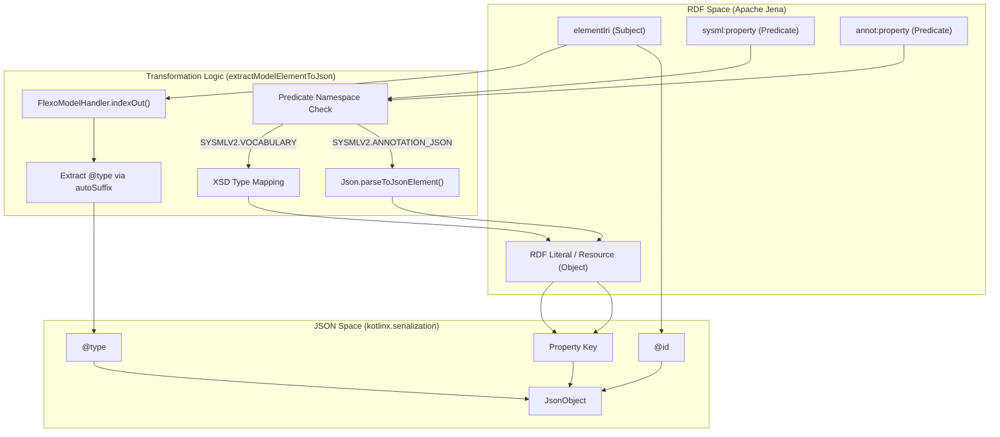
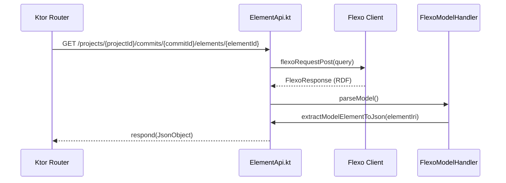

# Page: Element API

# Element API

Relevant source files

The following files were used as context for generating this wiki page:

- [src/main/kotlin/org/openmbee/flexo/sysmlv2/apis/ElementApi.kt](src/main/kotlin/org/openmbee/flexo/sysmlv2/apis/ElementApi.kt)

The Element API is responsible for retrieving and transforming SysML v2 model elements from the underlying RDF triplestore into the JSON format defined by the SysML v2 REST API specification. This involves complex SPARQL `CONSTRUCT` queries, a specialized RDF-to-JSON transformation pipeline, and handling of JSON-serialized annotations stored within the RDF graph.

## SPARQL Query Generation

To retrieve elements, the API generates SPARQL `CONSTRUCT` queries that target specific IRIs or sets of elements. These queries ensure that all relevant properties (predicates) and values (objects) for a given element are returned in a single RDF graph response from the Flexo backend.

### Key Query Functions

| Function | Purpose | Implementation |
| :--- | :--- | :--- |
| `modelElementConstructQuery` | Generates a query to fetch all triples where a specific element is the subject. | [src/main/kotlin/org/openmbee/flexo/sysmlv2/apis/ElementApi.kt:25-36]() |
| `listElementsConstructQuery` | Fetches a paginated list of elements, ordering them by their `sysml:elementId`. | [src/main/kotlin/org/openmbee/flexo/sysmlv2/apis/ElementApi.kt:38-61]() |

**Sources:** [src/main/kotlin/org/openmbee/flexo/sysmlv2/apis/ElementApi.kt:25-61]()

## Transformation Pipeline: RDF to JSON

The core of the Element API is the `extractModelElementToJson` function. This function transforms an Apache Jena `Model` (representing a set of RDF triples) into a SysML v2 compliant `JsonObject`.

### Data Flow: Element Extraction

The following diagram illustrates how an RDF subject and its properties are mapped to a JSON structure.

**RDF-to-JSON Mapping Flow**

**Sources:** [src/main/kotlin/org/openmbee/flexo/sysmlv2/apis/ElementApi.kt:70-156]()

### Type Mapping and Annotation Handling

The transformation logic distinguishes between standard SysML v2 vocabulary and JSON annotations:

1.  **Standard Vocabulary:** Properties in the `SYSMLV2.VOCABULARY` namespace are mapped based on their RDF object type. Literals are converted to JSON primitives using `XSD` types (boolean, integer, decimal/double) [src/main/kotlin/org/openmbee/flexo/sysmlv2/apis/ElementApi.kt:107-112]().
2.  **JSON Annotations:** Properties in the `SYSMLV2.ANNOTATION_JSON` namespace represent complex structures (like arrays or nested objects) that were serialized as strings in RDF. The pipeline parses these strings back into `JsonElement` objects using `Json.parseToJsonElement` [src/main/kotlin/org/openmbee/flexo/sysmlv2/apis/ElementApi.kt:135-139]().
3.  **Deduplication:** The `seenArrays` list prevents standard property mapping from overwriting properties already processed via the JSON annotation logic [src/main/kotlin/org/openmbee/flexo/sysmlv2/apis/ElementApi.kt:83]().

**Sources:** [src/main/kotlin/org/openmbee/flexo/sysmlv2/apis/ElementApi.kt:93-154]()

## API Endpoints and Routing

The `ElementApi()` extension function on `Route` defines the HTTP endpoints for interacting with SysML v2 elements.

**Element API Routing and Execution**

### Route Implementation Details

| Route | Logic | Code Reference |
| :--- | :--- | :--- |
| `getElementByProjectCommitId` | Fetches a single element by ID at a specific commit. Uses `modelElementConstructQuery`. | [src/main/kotlin/org/openmbee/flexo/sysmlv2/apis/ElementApi.kt:160-181]() |
| `getElementsByProjectCommit` | Fetches all elements in a project at a specific commit. Iterates through all subjects in the returned model. | [src/main/kotlin/org/openmbee/flexo/sysmlv2/apis/ElementApi.kt:184-207]() |
| `postProjectUsage` | Identifies the root element (project usage) by looking for a subject with `sysml:elementId` matching the project ID. | [src/main/kotlin/org/openmbee/flexo/sysmlv2/apis/ElementApi.kt:209-245]() |

**Sources:** [src/main/kotlin/org/openmbee/flexo/sysmlv2/apis/ElementApi.kt:158-246]()

### Root Element Identification

In SysML v2, the project itself is often represented as a root element. The `postProjectUsage` endpoint implements a specific search strategy to find this root:
1. It queries the graph for all subjects using a `flexoRequestGet` on the commit's graph endpoint [src/main/kotlin/org/openmbee/flexo/sysmlv2/apis/ElementApi.kt:216-218]().
2. It searches for a subject whose `sysml:elementId` property matches the `projectId` provided in the path [src/main/kotlin/org/openmbee/flexo/sysmlv2/apis/ElementApi.kt:232-234]().
3. Once found, it applies the `extractModelElementToJson` transformation to that specific subject [src/main/kotlin/org/openmbee/flexo/sysmlv2/apis/ElementApi.kt:235]().

**Sources:** [src/main/kotlin/org/openmbee/flexo/sysmlv2/apis/ElementApi.kt:209-245]()

## Error Handling

The API uses a custom `InvalidTripleError` to handle malformed RDF data during the transformation process. This error captures the subject IRI, predicate, and the problematic RDF node to provide detailed debugging information when the triplestore contains data that does not conform to the expected SysML v2 structure.

**Sources:** [src/main/kotlin/org/openmbee/flexo/sysmlv2/apis/ElementApi.kt:63-69]()
