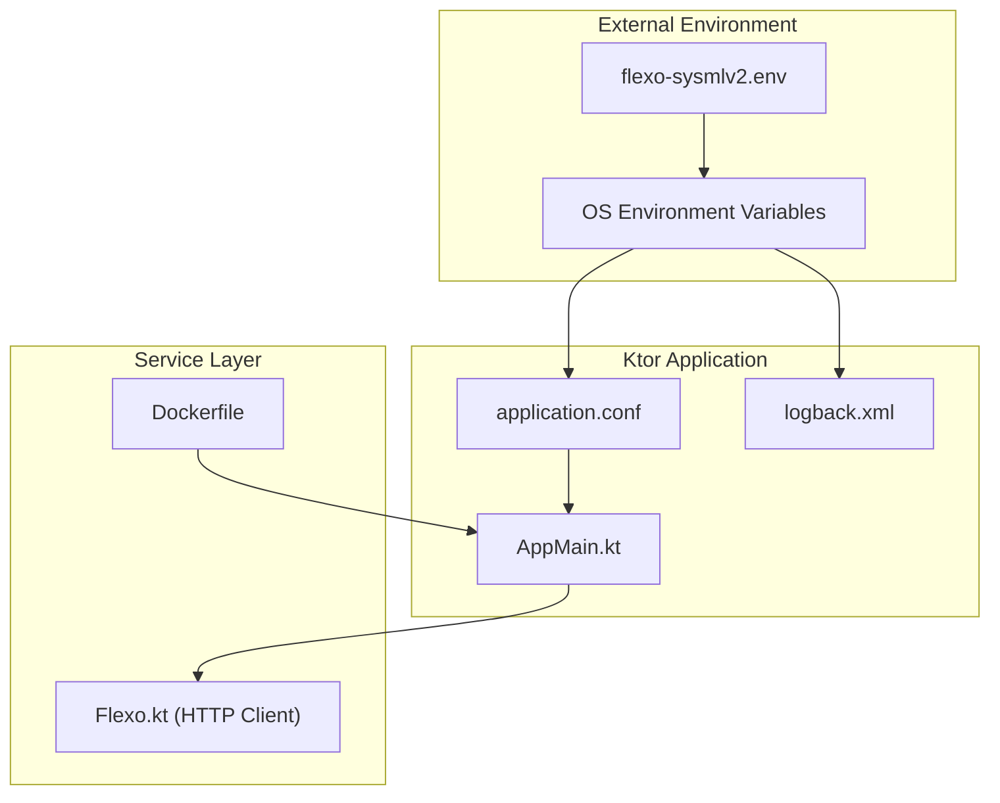
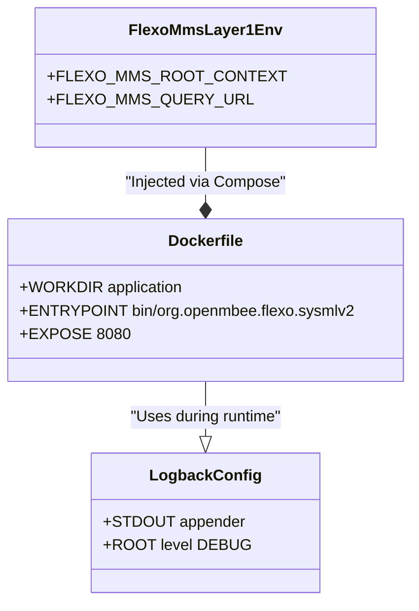

# Page: Environment Configuration Reference

# Environment Configuration Reference

Relevant source files

The following files were used as context for generating this wiki page:

- [Dockerfile](Dockerfile)
- [README.md](README.md)
- [docker-compose/README.md](docker-compose/README.md)
- [docker-compose/env/flexo-mms-auth.env](docker-compose/env/flexo-mms-auth.env)
- [docker-compose/env/flexo-mms-jwt.env](docker-compose/env/flexo-mms-jwt.env)
- [docker-compose/env/flexo-mms-layer1.env](docker-compose/env/flexo-mms-layer1.env)
- [docker-compose/env/flexo-mms-store.env](docker-compose/env/flexo-mms-store.env)
- [docker-compose/env/flexo-sysmlv2.env](docker-compose/env/flexo-sysmlv2.env)
- [settings.gradle.kts](settings.gradle.kts)
- [src/main/resources/logback.xml](src/main/resources/logback.xml)

This page provides a comprehensive reference for the environment variables and configuration settings used by the Flexo MMS SysML v2 service and its underlying Layer 1 infrastructure. The system utilizes HOCON configuration (via Ktor) and environment files to manage connections between the SysML v2 adapter, the Flexo MMS Layer 1 service, and the RDF quad store.

## Configuration Architecture

The application configuration is managed through a hierarchy of property overrides. The primary configuration file `application.conf` (mapped from `application.conf.example`) defines default values and maps them to environment variables using the `${?VAR_NAME}` syntax.

### Configuration Data Flow
The diagram below illustrates how environment variables flow into the Kotlin application and are consumed by the system.

**Configuration Injection Diagram**

**Sources:** [docker-compose/env/flexo-sysmlv2.env:1-6](), [src/main/resources/logback.xml:1-15](), [Dockerfile:1-12]()

---

## 1. SysML v2 Service Configuration

These variables control the behavior of the SysML v2 adapter service itself. They are primarily defined in `docker-compose/env/flexo-sysmlv2.env`.

| Variable | Default | Description |
| :--- | :--- | :--- |
| `FLEXO_PROTOCOL` | `http` | The protocol used to communicate with the Flexo MMS Layer 1 service. [docker-compose/env/flexo-sysmlv2.env:2-2]() |
| `FLEXO_HOST` | `layer1-service` | The hostname or IP address of the Flexo MMS Layer 1 service. [docker-compose/env/flexo-sysmlv2.env:1-1]() |
| `FLEXO_PORT` | `8080` | The port on which the Flexo MMS Layer 1 service is listening. [docker-compose/env/flexo-sysmlv2.env:3-3]() |
| `FLEXO_SYSMLV2_ORG` | `sysmlv2` | The organization ID in Flexo MMS where SysML v2 projects are stored. [docker-compose/env/flexo-sysmlv2.env:4-4]() |
| `FLEXO_AUTH` | `Bearer eyJhbG...` | The Bearer token used for authenticating with Layer 1. Defaults to a long-lived dev token. [docker-compose/env/flexo-sysmlv2.env:5-5]() |

**Sources:** [docker-compose/env/flexo-sysmlv2.env:1-6](), [docker-compose/README.md:28-31]()

---

## 2. Flexo MMS Layer 1 & Quad Store Settings

The SysML v2 service relies on a functional Flexo MMS Layer 1 deployment. The following variables are defined in `docker-compose/env/flexo-mms-layer1.env` to configure the Layer 1 service's connection to the RDF triplestore.

### Layer 1 Connection (`flexo-mms-layer1.env`)
| Variable | Description |
| :--- | :--- |
| `FLEXO_MMS_ROOT_CONTEXT` | The base URI for the Flexo metadata and links. Usually `http://layer1-service`. [docker-compose/env/flexo-mms-layer1.env:1-1]() |
| `FLEXO_MMS_QUERY_URL` | SPARQL Query endpoint of the quad store (e.g., `http://quad-server:3030/ds/sparql`). [docker-compose/env/flexo-mms-layer1.env:2-2]() |
| `FLEXO_MMS_UPDATE_URL` | SPARQL Update endpoint of the quad store. [docker-compose/env/flexo-mms-layer1.env:3-3]() |
| `FLEXO_MMS_GRAPH_STORE_PROTOCOL_URL` | Graph Store Protocol (GSP) endpoint for RDF graph operations. [docker-compose/env/flexo-mms-layer1.env:4-4]() |

**Sources:** [docker-compose/env/flexo-mms-layer1.env:1-5](), [docker-compose/README.md:9-13]()

### Object Storage (`flexo-mms-store.env`)
Layer 1 uses S3-compatible storage for binary payloads.
| Variable | Description |
| :--- | :--- |
| `S3_ENDPOINT` | Endpoint for the storage service (e.g., MinIO). [docker-compose/env/flexo-mms-store.env:1-1]() |
| `AWS_ACCESS_KEY_ID` | Access key for S3. [docker-compose/env/flexo-mms-store.env:3-3]() |

**Sources:** [docker-compose/env/flexo-mms-store.env:1-5]()

---

## 3. Security and Authentication

The service uses JWT (JSON Web Tokens) for secure communication and LDAP for user management within the OpenMBEE ecosystem.

### JWT Configuration (`flexo-mms-jwt.env`)
These settings must match between the SysML v2 service and the Layer 1 service to ensure token validation succeeds.

| Variable | Description |
| :--- | :--- |
| `JWT_DOMAIN` | The issuer domain for the JWT. [docker-compose/env/flexo-mms-jwt.env:1-1]() |
| `JWT_AUDIENCE` | The intended audience (e.g., `flexo-mms-audience`). [docker-compose/env/flexo-mms-jwt.env:2-2]() |
| `JWT_SECRET` | The signing key used for token verification. [docker-compose/env/flexo-mms-jwt.env:4-4]() |

**Sources:** [docker-compose/env/flexo-mms-jwt.env:1-5]()

### LDAP Configuration (`flexo-mms-auth.env`)
Configures the connection to the directory service for user and group resolution.

| Variable | Description |
| :--- | :--- |
| `LDAP_LOCATION` | URI of the LDAP server. [docker-compose/env/flexo-mms-auth.env:1-1]() |
| `LDAP_USER_NAMESPACE` | URI prefix for user resources (e.g., `ldap/user/`). [docker-compose/env/flexo-mms-auth.env:4-4]() |
| `LDAP_GROUP_STORE_URI` | SPARQL endpoint where group-to-user mappings are stored. [docker-compose/env/flexo-mms-auth.env:8-8]() |

**Sources:** [docker-compose/env/flexo-mms-auth.env:1-10]()

---

## 4. Implementation Detail: Runtime Environment

The application is containerized using a multi-stage Docker build. The runtime environment is based on `openjdk:17.0.2-jdk-slim`.

**Code-to-Runtime Mapping Diagram**

**Sources:** [Dockerfile:1-12](), [src/main/resources/logback.xml:1-15](), [docker-compose/env/flexo-mms-layer1.env:1-5]()

### Key Considerations
1.  **Organization Namespace**: The `FLEXO_SYSMLV2_ORG` (defaulting to `sysmlv2`) defines the top-level container. For a fresh setup, this organization must be created in Layer 1 using the provided Postman collection. [docker-compose/README.md:20-28]()
2.  **Auth Persistence**: The `FLEXO_AUTH` token in `flexo-sysmlv2.env` is valid until Jan 2026. [docker-compose/README.md:30-30]()
3.  **Logging**: The logging level for the service is controlled via `logback.xml`. By default, it is set to `DEBUG` for the root logger, while Jetty and Netty are restricted to `INFO`. [src/main/resources/logback.xml:8-14]()
4.  **Database Initialization**: For local Fuseki deployments, the database is initialized using `mount/cluster.trig`. [docker-compose/README.md:11-13]()

**Sources:** [docker-compose/README.md:1-32](), [src/main/resources/logback.xml:1-15]()
