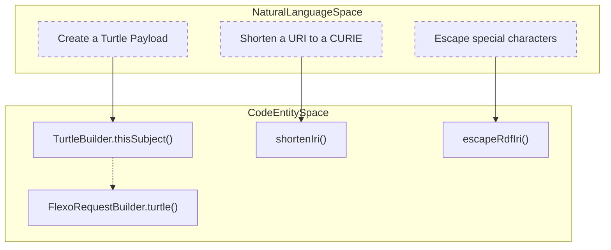
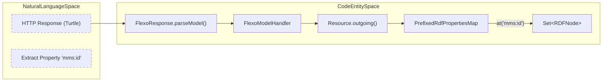

# Page: Flexo Backend Client Layer

# Flexo Backend Client Layer

Relevant source files

The following files were used as context for generating this wiki page:

- [src/main/kotlin/org/openmbee/flexo/sysmlv2/Flexo.kt](src/main/kotlin/org/openmbee/flexo/sysmlv2/Flexo.kt)
- [src/main/kotlin/org/openmbee/flexo/sysmlv2/Http.kt](src/main/kotlin/org/openmbee/flexo/sysmlv2/Http.kt)

The Flexo Backend Client Layer provides the core infrastructure for interacting with the Flexo MMS Layer 1 service. It abstracts the complexities of authenticated HTTP communication, RDF serialization/deserialization, and SPARQL query construction into a type-safe Kotlin DSL.

## Core Request Lifecycle

The interaction with the backend is managed primarily through `FlexoRequestBuilder` and `FlexoResponse`. This layer handles the translation of high-level model operations into specific HTTP requests directed at the Flexo MMS API.

### FlexoRequestBuilder
The `FlexoRequestBuilder` class [src/main/kotlin/org/openmbee/flexo/sysmlv2/Flexo.kt:124-127]() is responsible for assembling the components of an outgoing request. It utilizes the `FlexoConfig` [src/main/kotlin/org/openmbee/flexo/sysmlv2/Flexo.kt:126-126]() to resolve target host, port, and protocol details.

Key features include:
*   **Organization Scoping**: The `orgPath()` function [src/main/kotlin/org/openmbee/flexo/sysmlv2/Flexo.kt:143-145]() automatically prefixes paths with the configured organization (e.g., `/orgs/{orgId}/...`).
*   **Payload DSLs**: It provides specialized methods for setting the request body using different RDF formats:
    *   `turtle { ... }`: Sets `Content-Type` to `text/turtle` and initializes a `TurtleBuilder` [src/main/kotlin/org/openmbee/flexo/sysmlv2/Flexo.kt:151-155]().
    *   `sparqlQuery { ... }`: Sets `Content-Type` to `application/sparql-query` [src/main/kotlin/org/openmbee/flexo/sysmlv2/Flexo.kt:157-161]().
    *   `sparqlUpdate { ... }`: Sets `Content-Type` to `application/sparql-update` [src/main/kotlin/org/openmbee/flexo/sysmlv2/Flexo.kt:163-167]().

### FlexoResponse and Parsing Pipeline
Once a request is executed, the resulting `HttpResponse` is wrapped in a `FlexoResponse` [src/main/kotlin/org/openmbee/flexo/sysmlv2/Flexo.kt:198-200](). This class manages the RDF parsing pipeline using Apache Jena.

The `parseModel` function [src/main/kotlin/org/openmbee/flexo/sysmlv2/Flexo.kt:217-217]() detects the `Content-Type` of the response (defaulting to Turtle) and uses `RDFParser` to populate an in-memory Jena `Model` [src/main/kotlin/org/openmbee/flexo/sysmlv2/Flexo.kt:219-222]().

**Request-Response Data Flow**

| Component | Role | Code Entity |
| :--- | :--- | :--- |
| **Request Builder** | Configures URL, Headers, and Body | `FlexoRequestBuilder` [src/main/kotlin/org/openmbee/flexo/sysmlv2/Flexo.kt:124]() |
| **Payload DSL** | Generates Turtle/SPARQL strings | `TurtleBuilder` [src/main/kotlin/org/openmbee/flexo/sysmlv2/Flexo.kt:112]() |
| **Response Wrapper** | Checks status and triggers parsing | `FlexoResponse` [src/main/kotlin/org/openmbee/flexo/sysmlv2/Flexo.kt:198]() |
| **Model Handler** | Provides traversal logic over RDF | `FlexoModelHandler` [src/main/kotlin/org/openmbee/flexo/sysmlv2/Flexo.kt:217]() |

**Sources:** [src/main/kotlin/org/openmbee/flexo/sysmlv2/Flexo.kt:124-222]()

---

## RDF and SPARQL DSLs

The system uses a Domain Specific Language (DSL) approach to construct RDF data and SPARQL queries, ensuring that generated strings are properly escaped and formatted.

### TurtleBuilder
`TurtleBuilder` [src/main/kotlin/org/openmbee/flexo/sysmlv2/Flexo.kt:112]() allows for the creation of Turtle RDF payloads. The `thisSubject` function [src/main/kotlin/org/openmbee/flexo/sysmlv2/Flexo.kt:113-118]() is commonly used to define properties for the "base" URI (represented as `<>`) of the request.

### IRI and Literal Utilities
To ensure RDF validity, several utility functions handle escaping and shortening:
*   **`escapeRdfIri`**: Hex-encodes characters that are illegal in IRIs (e.g., spaces, `<>`, `{}`) [src/main/kotlin/org/openmbee/flexo/sysmlv2/Flexo.kt:41-53]().
*   **`shortenIri`**: Attempts to convert a full IRI into a CURIE (prefix:localName) using available `PrefixMapping` [src/main/kotlin/org/openmbee/flexo/sysmlv2/Flexo.kt:55-65](). It handles `urn:` schemes and specifically maps `rdf:type` to `a` [src/main/kotlin/org/openmbee/flexo/sysmlv2/Flexo.kt:56-59]().
*   **`Node.stringify`**: An extension function on Jena `Node` that converts the node to its SPARQL/Turtle string representation, handling literals (with XSD type support), variables, and URIs [src/main/kotlin/org/openmbee/flexo/sysmlv2/Flexo.kt:68-91]().

**From Natural Language to Code: RDF Construction**

**Sources:** [src/main/kotlin/org/openmbee/flexo/sysmlv2/Flexo.kt:41-118]()

---

## RDF Traversal Infrastructure

After parsing a response into a Jena Model, the backend uses specialized handlers and maps to traverse the graph and extract data into Kotlin objects.

### FlexoModelHandler
`FlexoModelHandler` and its subclass `FlexoModelHandlerWithFocalNode` [src/main/kotlin/org/openmbee/flexo/sysmlv2/Flexo.kt:209-213]() wrap the resulting RDF graph. `FlexoModelHandlerWithFocalNode` is specifically used when a response includes a `Location` header, allowing the system to immediately focus on the resource that was just created or modified (e.g., via `parseLdp`) [src/main/kotlin/org/openmbee/flexo/sysmlv2/Flexo.kt:209-214]().

### PrefixedRdfPropertiesMap
Defined in `RdfPrefixes.kt`, the `PrefixedRdfPropertiesMap` [src/main/kotlin/org/openmbee/flexo/sysmlv2/RdfPrefixes.kt:10-13]() allows for querying a resource's properties using prefixed strings (CURIEs) instead of full Jena `Property` objects.

*   **`at(key: String)`**: Looks up a set of RDF nodes associated with a prefixed key [src/main/kotlin/org/openmbee/flexo/sysmlv2/RdfPrefixes.kt:15-17]().
*   **`Resource.outgoing()`**: An extension function that converts all properties of a Jena `Resource` into a `PrefixedRdfPropertiesMap` for easy access [src/main/kotlin/org/openmbee/flexo/sysmlv2/RdfPrefixes.kt:39-47]().

**From Natural Language to Code: Data Extraction**

**Sources:** [src/main/kotlin/org/openmbee/flexo/sysmlv2/Flexo.kt:198-214](), [src/main/kotlin/org/openmbee/flexo/sysmlv2/RdfPrefixes.kt:10-47]()
