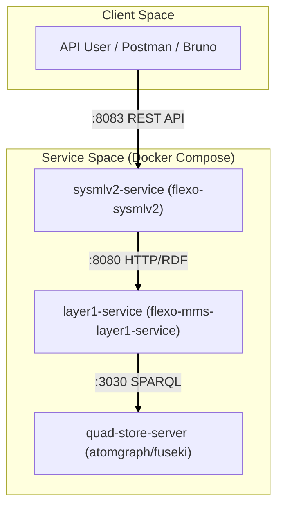
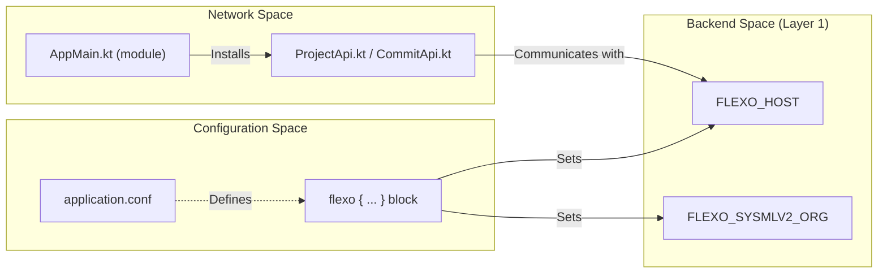

# Page: Getting Started

# Getting Started

<details>
<summary>Relevant source files</summary>

The following files were used as context for generating this wiki page:

- [Dockerfile](Dockerfile)
- [README.md](README.md)
- [bruno/create flexo org.bru](bruno/create flexo org.bru)
- [docker-compose/docker-compose.yml](docker-compose/docker-compose.yml)
- [docker-compose/env/flexo-sysmlv2.env](docker-compose/env/flexo-sysmlv2.env)
- [settings.gradle.kts](settings.gradle.kts)
- [src/main/resources/application.conf.example](src/main/resources/application.conf.example)
- [src/test/resources/application.test.conf](src/test/resources/application.test.conf)

</details>


This page provides a technical guide for setting up and running the `flexo-mms-sysmlv2` microservice. It covers environment configuration, build processes using Gradle, and deployment strategies using Docker and Docker Compose.

## 1. Environment Configuration

The service uses a layered configuration approach. The primary configuration is defined in HOCON format within `application.conf`. For local development, this file should be initialized from the provided example.

### 1.1 Configuration Files
- **Example Template**: `src/main/resources/application.conf.example` [src/main/resources/application.conf.example:1-30]()
- **Active Config**: `src/main/resources/application.conf` (must be created by the user) [README.md:13-13]()
- **Test Config**: `src/test/resources/application.test.conf` [src/test/resources/application.test.conf:1-24]()

### 1.2 Key Environment Variables
The configuration supports overrides via environment variables, which is the preferred method for Docker deployments.

| Variable | Description | Default |
| :--- | :--- | :--- |
| `FLEXO_PROTOCOL` | Protocol for Layer 1 communication | `http` |
| `FLEXO_HOST` | Hostname of the Flexo Layer 1 service | `localhost` |
| `FLEXO_PORT` | Port of the Flexo Layer 1 service | `8080` |
| `FLEXO_SYSMLV2_ORG` | The MMS Organization ID used for SysML v2 data | `sysmlv2` |
| `FLEXO_AUTH` | Bearer token for authenticated requests to Layer 1 | (empty) |
| `FLEXO_DEFAULT_TIMEOUT` | Timeout in seconds for backend requests | `1800` |

Sources: [src/main/resources/application.conf.example:14-30](), [docker-compose/env/flexo-sysmlv2.env:1-6]()

---

## 2. Local Development Setup

### 2.1 Prerequisites
- **JDK 17**: Required for building and running the JVM application [README.md:7-8]().
- **Node.js**: Required for running the OpenAPI preprocessing script `preprocess.js` [README.md:83-84]().

### 2.2 Build and Run
To run the service locally without Docker:

1. **Initialize Configuration**:
   ```bash
   cp src/main/resources/application.conf.example src/main/resources/application.conf
   ```
2. **Execute via Gradle**:
   ```bash
   ./gradlew run
   ```
   The server will start at `localhost:8080` by default as defined in the configuration [src/main/resources/application.conf.example:4-4](), [README.md:15-17]().

### 2.3 Code Generation Workflow
The project is based on a stub server generated from the SysML v2 API Services specification. If the API spec changes, the `gen-server.sh` script (referenced in the build system) handles the regeneration process.

**Data Flow for Generation:**
1. **Fetch**: Downloads `openapi.json` from the SysML-v2-API-Services repository [README.md:81-81]().
2. **Preprocess**: Executes `preprocess.js` to resolve `$id` keys that conflict with the OpenAPI Generator [README.md:83-85]().
3. **Generate**: Runs `openapi-generator-cli` using the `kotlin-server` generator [README.md:5-5]().

Sources: [README.md:1-17](), [README.md:81-87]()

---

## 3. Docker Deployment

### 3.1 Dockerfile Structure
The `Dockerfile` uses a multi-stage build to minimize the final image size.

1. **Build Stage**: Uses `openjdk:17.0.2-jdk-slim` as the base image to run `./gradlew installDist` [Dockerfile:1-4]().
2. **Runtime Stage**: Copies the installed distribution from `application/build/install/org.openmbee.flexo.sysmlv2/` and sets the entrypoint to the generated binary `./bin/org.openmbee.flexo.sysmlv2` [Dockerfile:6-10]().
3. **Exposure**: Exposes port `8080` [Dockerfile:11-11]().

### 3.2 Docker Compose Stack
The repository includes a complete stack in the `docker-compose/` directory to stand up the SysML v2 service along with its dependencies (Layer 1 and a Quad Store).

**System Component Interaction:**

Title: Docker Compose Service Orchestration


Sources: [Dockerfile:1-12](), [README.md:21-25](), [docker-compose/docker-compose.yml:1-43]()

---

## 4. Initial Organization Setup

Before the SysML v2 service can store data, the target Organization (defined by `FLEXO_SYSMLV2_ORG`) must exist in the Flexo Layer 1 backend.

### 4.1 Bootstrapping the Org
1. **Deploy Stack**: Run `docker compose -f ./docker-compose/docker-compose.yml up -d` [README.md:24-24]().
2. **Authentication**: Use the pre-configured Bearer token provided in the environment files [docker-compose/env/flexo-sysmlv2.env:5-5]().
3. **Create Org**: Execute a `PUT` request to `{{flexoHost}}/orgs/sysmlv2` with the organization metadata [bruno/create flexo org.bru:7-23]().

### 4.2 Data Initialization
For local Fuseki deployments, the system can be bootstrapped with metadata using the `cluster.trig` file, which is mounted to the quad-store container [docker-compose/docker-compose.yml:10-12]().

Sources: [docker-compose/docker-compose.yml:1-43](), [docker-compose/env/flexo-sysmlv2.env:4-5](), [bruno/create flexo org.bru:1-28]()

---

## 5. Implementation Mapping

The following diagram bridges the high-level system components to the specific code entities and configuration keys used in the implementation.

Title: Code and Configuration Entity Mapping


Sources: [src/main/resources/application.conf.example:1-30](), [README.md:39-75](), [src/test/resources/application.test.conf:1-24](), [settings.gradle.kts:1-1]()
