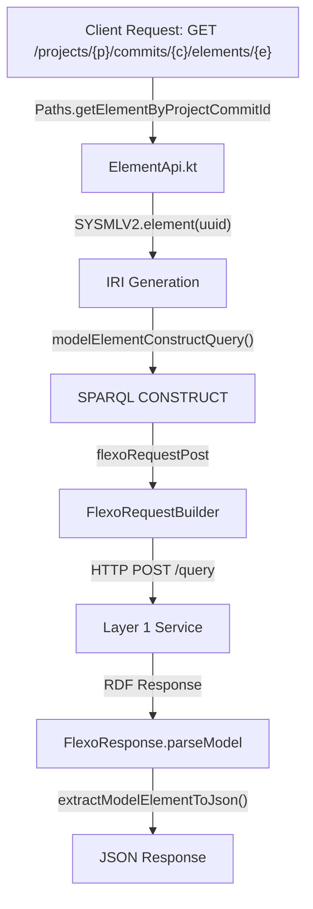
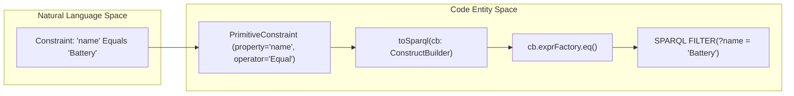

# Page: Glossary

# Glossary

Relevant source files

The following files were used as context for generating this wiki page:

- [Dockerfile](Dockerfile)
- [README.md](README.md)
- [docker-compose/docker-compose.yml](docker-compose/docker-compose.yml)
- [docker-compose/env/flexo-sysmlv2.env](docker-compose/env/flexo-sysmlv2.env)
- [settings.gradle.kts](settings.gradle.kts)
- [src/main/kotlin/org/openmbee/flexo/sysmlv2/Flexo.kt](src/main/kotlin/org/openmbee/flexo/sysmlv2/Flexo.kt)
- [src/main/kotlin/org/openmbee/flexo/sysmlv2/Namespaces.kt](src/main/kotlin/org/openmbee/flexo/sysmlv2/Namespaces.kt)
- [src/main/kotlin/org/openmbee/flexo/sysmlv2/apis/CommitApi.kt](src/main/kotlin/org/openmbee/flexo/sysmlv2/apis/CommitApi.kt)
- [src/main/kotlin/org/openmbee/flexo/sysmlv2/apis/ElementApi.kt](src/main/kotlin/org/openmbee/flexo/sysmlv2/apis/ElementApi.kt)
- [src/main/kotlin/org/openmbee/flexo/sysmlv2/apis/QueryApi.kt](src/main/kotlin/org/openmbee/flexo/sysmlv2/apis/QueryApi.kt)

This page provides definitions for codebase-specific terms, domain concepts, and architectural components within the `flexo-mms-sysmlv2` service. It serves as a technical reference for onboarding engineers to understand how SysML v2 concepts map to the underlying Flexo MMS Layer 1 and RDF implementations.

## Domain Concepts

### Project
In the SysML v2 API context, a **Project** represents a top-level container for modeling data. In the implementation, a Project maps directly to an **MMS Repo** resource `[src/main/kotlin/org/openmbee/flexo/sysmlv2/Namespaces.kt:86-86]()`.
*   **Implementation**: Projects are managed via `ProjectApi.kt`. When a project is created, the service also initializes a default branch and a "scratch" space for saved queries `[src/main/kotlin/org/openmbee/flexo/sysmlv2/apis/QueryApi.kt:125-125]()`.
*   **Soft Delete**: Projects are not physically removed; instead, a triple `<projectIri> sysml:deleted true` is inserted via SPARQL UPDATE `[src/main/kotlin/org/openmbee/flexo/sysmlv2/Namespaces.kt:17-17]()`.

### Commit
A **Commit** represents a discrete change set in a project's history. It corresponds to an `mms:Commit` resource `[src/main/kotlin/org/openmbee/flexo/sysmlv2/Namespaces.kt:93-93]()`.
*   **Data Consistency**: Commits are immutable. To retrieve elements at a specific point in time, the service queries the MMS "Lock" associated with that commit `[src/main/kotlin/org/openmbee/flexo/sysmlv2/apis/ElementApi.kt:165-165]()`.
*   **Mapping**: The `commitFromModel` function transforms RDF properties (like `mms:submitted`) into a `Commit` data model `[src/main/kotlin/org/openmbee/flexo/sysmlv2/apis/CommitApi.kt:39-56]()`.

### Element
An **Element** is the fundamental unit of data in SysML v2 (e.g., Parts, Actions, Constraints).
*   **Storage**: Elements are stored as RDF triples in the quad store using the `https://www.omg.org/spec/SysML#` namespace `[src/main/kotlin/org/openmbee/flexo/sysmlv2/Namespaces.kt:12-12]()`.
*   **Serialization**: The service converts RDF graph segments into SysML v2 JSON structures using `extractModelElementToJson()`, which handles both standard vocabulary properties and `annotation:json` literals `[src/main/kotlin/org/openmbee/flexo/sysmlv2/apis/ElementApi.kt:70-156]()`.

### Scratch Space
A specialized MMS container used to store non-versioned or service-managed metadata, such as saved query definitions.
*   **Usage**: The `QueryApi` uses the `/scratches/queries` path to store and retrieve `Query` objects via SPARQL Update and Construct queries `[src/main/kotlin/org/openmbee/flexo/sysmlv2/apis/QueryApi.kt:126-133]()`.

Sources: `[src/main/kotlin/org/openmbee/flexo/sysmlv2/Namespaces.kt:1-182]()`, `[src/main/kotlin/org/openmbee/flexo/sysmlv2/apis/CommitApi.kt:39-56]()`, `[src/main/kotlin/org/openmbee/flexo/sysmlv2/apis/ElementApi.kt:70-165]()`, `[src/main/kotlin/org/openmbee/flexo/sysmlv2/apis/QueryApi.kt:125-133]()`

---

## Technical Infrastructure

### Flexo Backend Client
The `Flexo.kt` file defines the core communication layer between this microservice and the Flexo MMS Layer 1 service.

| Class/Function | Description | Source |
| :--- | :--- | :--- |
| `FlexoRequestBuilder` | A DSL for building authenticated HTTP requests to Layer 1, supporting Turtle, SPARQL Query, and SPARQL Update payloads. | `[src/main/kotlin/org/openmbee/flexo/sysmlv2/Flexo.kt:124-196]()` |
| `FlexoResponse` | Wraps the Ktor `HttpResponse` and provides helpers like `parseModel` to turn RDF responses into Apache Jena Models. | `[src/main/kotlin/org/openmbee/flexo/sysmlv2/Flexo.kt:198-217]()` |
| `FlexoModelHandler` | Provides utility functions for navigating a Jena Model, such as `indexOut` for property lookups. | `[src/main/kotlin/org/openmbee/flexo/sysmlv2/Flexo.kt:233-255]()` |
| `TurtleBuilder` | A DSL for generating Turtle RDF strings within a `FlexoRequestBuilder`. | `[src/main/kotlin/org/openmbee/flexo/sysmlv2/Flexo.kt:112-118]()` |

### RDF Namespaces
The service relies on several key namespaces defined in `Namespaces.kt`:
*   **SYSMLV2**: `https://www.omg.org/spec/SysML#` (Vocabulary) and `urn:sysmlv2:` (Internal IDs) `[src/main/kotlin/org/openmbee/flexo/sysmlv2/Namespaces.kt:10-18]()`.
*   **MMS**: `https://mms.openmbee.org/rdf/ontology/` (Flexo MMS Layer 1 ontology) `[src/main/kotlin/org/openmbee/flexo/sysmlv2/Namespaces.kt:76-182]()`.
*   **Prefix Mapping**: `DEFAULT_PREFIX_MAPPING` provides a standard set of prefixes (rdf, rdfs, mms, sysml) for shortening IRIs during serialization `[src/main/kotlin/org/openmbee/flexo/sysmlv2/Namespaces.kt:48-74]()`.

### Data Flow: Request to RDF
The following diagram illustrates how a Natural Language/API request for an Element is transformed into code entities and SPARQL queries.

**Element Retrieval Pipeline**

Sources: `[src/main/kotlin/org/openmbee/flexo/sysmlv2/apis/ElementApi.kt:158-181]()`, `[src/main/kotlin/org/openmbee/flexo/sysmlv2/Flexo.kt:157-161]()`, `[src/main/kotlin/org/openmbee/flexo/sysmlv2/Namespaces.kt:19-21]()`

---

## Query & Constraint System

The service implements a translation layer between SysML v2 `Constraint` objects and SPARQL filters.

### Constraint Types
1.  **PrimitiveConstraint**: Filters by a single property, operator, and value. Supported operators include `Equal`, `Less_Than`, etc. `[src/main/kotlin/org/openmbee/flexo/sysmlv2/apis/QueryApi.kt:39-94]()`.
2.  **CompositeConstraint**: Combines multiple constraints using logical `and`/`or` operators `[src/main/kotlin/org/openmbee/flexo/sysmlv2/apis/QueryApi.kt:95-113]()`.

### Implementation Mapping
The `QueryApi.kt` uses the Apache Jena `ConstructBuilder` to programmatically build queries from these constraints.

**Constraint to SPARQL Mapping**

Sources: `[src/main/kotlin/org/openmbee/flexo/sysmlv2/apis/QueryApi.kt:39-113]()`, `[src/main/kotlin/org/openmbee/flexo/sysmlv2/apis/CommitApi.kt:58-72]()`

---

## Deployment Acronyms

| Term | Definition |
| :--- | :--- |
| **L1 (Layer 1)** | The `flexo-mms-layer1-service`, which handles low-level RDF graph management, versioning, and access control `[docker-compose/docker-compose.yml:16-26]()`. |
| **Fuseki** | The Apache Jena SPARQL server used as the underlying quad store `[docker-compose/docker-compose.yml:4-14]()`. |
| **JWT** | JSON Web Token. Used for authentication between the SysML v2 service and Layer 1 `[docker-compose/env/flexo-sysmlv2.env:5-5]()`. |
| **PSM** | Platform Specific Model. Refers to the REST/HTTP implementation of the SysML v2 standard `[README.md:3-3]()`. |

Sources: `[docker-compose/docker-compose.yml:1-43]()`, `[README.md:1-5]()`, `[docker-compose/env/flexo-sysmlv2.env:1-6]()`