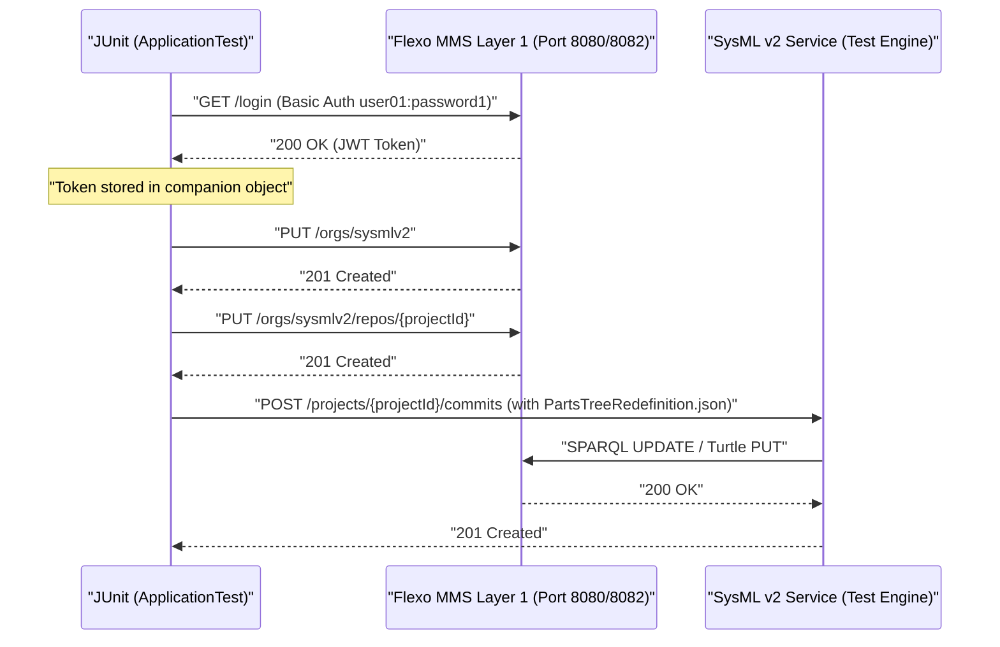
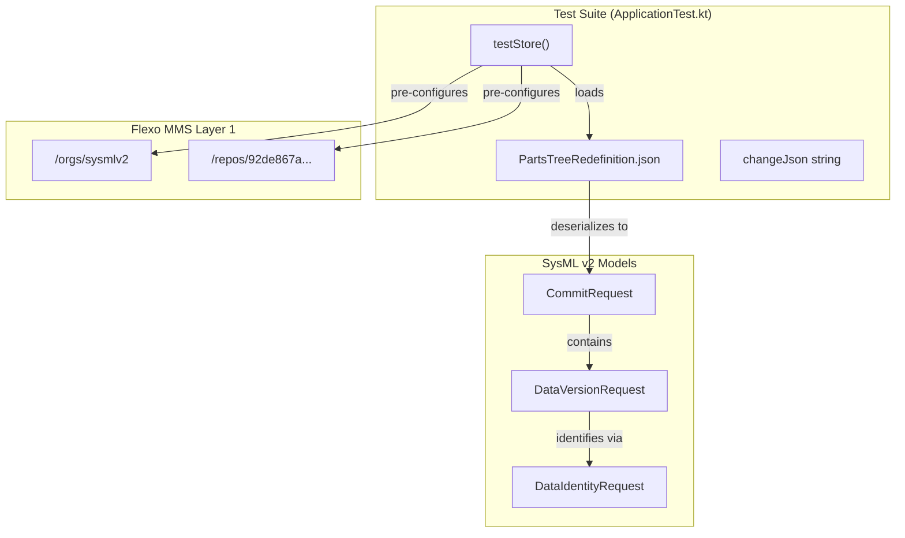

# Page: Integration Tests

# Integration Tests

Relevant source files

The following files were used as context for generating this wiki page:

- [src/main/kotlin/org/openmbee/flexo/sysmlv2/models/CommitRequest.kt](src/main/kotlin/org/openmbee/flexo/sysmlv2/models/CommitRequest.kt)
- [src/main/kotlin/org/openmbee/flexo/sysmlv2/models/DataVersionRequest.kt](src/main/kotlin/org/openmbee/flexo/sysmlv2/models/DataVersionRequest.kt)
- [src/main/resources/application.conf.example](src/main/resources/application.conf.example)
- [src/test/kotlin/org/openmbee/flexo/sysmlv2/ApplicationTest.kt](src/test/kotlin/org/openmbee/flexo/sysmlv2/ApplicationTest.kt)
- [src/test/resources/PartsTreeRedefinition.json](src/test/resources/PartsTreeRedefinition.json)
- [src/test/resources/application.test.conf](src/test/resources/application.test.conf)

Integration testing for the `flexo-mms-sysmlv2` service is primarily implemented in `ApplicationTest.kt`. These tests are designed to validate the end-to-end lifecycle of SysML v2 requests, ensuring that the service correctly interacts with the Flexo MMS Layer 1 (L1) backend and the underlying RDF triplestore.

## Overview of ApplicationTest

The `ApplicationTest` class utilizes the Ktor `testApplication` engine to bootstrap a live instance of the service for testing [src/test/kotlin/org/openmbee/flexo/sysmlv2/ApplicationTest.kt:21-24](). It focuses on verifying the `Commit API` and `Element API` by submitting complex SysML v2 JSON-LD payloads and asserting successful persistence and retrieval.

### Test Environment Bootstrapping

The integration tests assume a running environment, typically provided by a local Docker Compose stack (e.g., Fuseki and Flexo L1).

1.  **Configuration**: The test engine is initialized using `application.test.conf` [src/test/kotlin/org/openmbee/flexo/sysmlv2/ApplicationTest.kt:25-27](). This configuration file mirrors the standard `application.conf` but targets test-specific ports and environment settings [src/test/resources/application.test.conf:1-24]().
2.  **Authentication**: A `BeforeAll` setup routine handles authentication against a local Flexo L1 instance to obtain a JWT token [src/test/kotlin/org/openmbee/flexo/sysmlv2/ApplicationTest.kt:129-147]().
3.  **Infrastructure Preparation**: The setup routine pre-creates the necessary organization and repository structures in the L1 service that the SysML v2 service expects to find [src/test/kotlin/org/openmbee/flexo/sysmlv2/ApplicationTest.kt:150-176]().

### Data Flow: Test Setup to Execution

The following diagram illustrates how the test environment transitions from a clean state to an initialized state ready for SysML v2 requests.

**Test Initialization Sequence**

Sources: [src/test/kotlin/org/openmbee/flexo/sysmlv2/ApplicationTest.kt:129-178](), [src/test/kotlin/org/openmbee/flexo/sysmlv2/ApplicationTest.kt:31-35]()

## Key Test Components

### 1. JWT Token Setup
The `token` variable in the `companion object` is initialized during the `@BeforeAll` phase. It simulates a user login by sending a Basic Auth request to the Flexo L1 login endpoint (`http://localhost:8082/login`) [src/test/kotlin/org/openmbee/flexo/sysmlv2/ApplicationTest.kt:133-147](). This token is then injected into the `Authorization` header of every subsequent request made by the test `client` [src/test/kotlin/org/openmbee/flexo/sysmlv2/ApplicationTest.kt:32]().

### 2. Test Fixtures (PartsTreeRedefinition.json)
The test suite uses a significant JSON fixture named `PartsTreeRedefinition.json`. This file contains a large `CommitRequest` payload [src/main/kotlin/org/openmbee/flexo/sysmlv2/models/CommitRequest.kt:30-35]() consisting of multiple `DataVersion` objects [src/main/kotlin/org/openmbee/flexo/sysmlv2/models/DataVersionRequest.kt:30-35]().

*   **Content**: It defines complex SysML v2 structures including `OwningMembership`, `MembershipImport`, `AttributeUsage`, and `Subsetting` [src/test/resources/PartsTreeRedefinition.json:1-10]().
*   **Usage**: The content is loaded via the class loader and posted to the `/commits` endpoint to test the service's ability to process and store high-fidelity SysML v2 models [src/test/kotlin/org/openmbee/flexo/sysmlv2/ApplicationTest.kt:29-35]().

### 3. Change Payload Testing
In addition to the static fixture, the test `testStore` defines an inline `changeJson` string [src/test/kotlin/org/openmbee/flexo/sysmlv2/ApplicationTest.kt:79-126](). This payload tests the `DataVersion` update logic by providing new versions for specific identities (e.g., "Spacecraft System" and "ConnectionDefinitions") [src/test/kotlin/org/openmbee/flexo/sysmlv2/ApplicationTest.kt:82-110]().

## Integration Logic

The `testStore` function performs a sequence of operations to validate the state of the system:

| Step | Operation | Endpoint | Purpose |
| :--- | :--- | :--- | :--- |
| 1 | POST | `/projects/{id}/commits` | Initial ingest of `PartsTreeRedefinition.json` [src/test/kotlin/org/openmbee/flexo/sysmlv2/ApplicationTest.kt:31-35]() |
| 2 | POST | `/projects/{id}/commits` | Update existing elements using `changeJson` [src/test/kotlin/org/openmbee/flexo/sysmlv2/ApplicationTest.kt:65-69]() |
| 3 | GET | `/projects/{id}/commits/{id}/elements` | Verify elements are retrievable after commit [src/test/kotlin/org/openmbee/flexo/sysmlv2/ApplicationTest.kt:70-72]() |

### Code Entity Mapping

The following diagram maps the test logic to the internal data models and the external Layer 1 API.

**Entity Mapping and Data Flow**

Sources: [src/test/kotlin/org/openmbee/flexo/sysmlv2/ApplicationTest.kt:21-74](), [src/main/kotlin/org/openmbee/flexo/sysmlv2/models/CommitRequest.kt:30-35](), [src/main/kotlin/org/openmbee/flexo/sysmlv2/models/DataVersionRequest.kt:30-35]()

## Running Tests Against Local Stack

To run these tests successfully, a local environment must be active. This is typically achieved using the provided Docker Compose configurations.

1.  **Start Infrastructure**: Run `docker-compose up` to start Fuseki and the Flexo L1 service.
2.  **Verify Ports**: 
    *   Flexo L1 (API): `localhost:8080` [src/test/kotlin/org/openmbee/flexo/sysmlv2/ApplicationTest.kt:150]()
    *   Flexo L1 (Auth/Login): `localhost:8082` [src/test/kotlin/org/openmbee/flexo/sysmlv2/ApplicationTest.kt:134]()
3.  **Execute**: Run `./gradlew test`. The `ApplicationTest` will automatically attempt to authenticate and seed the `sysmlv2` organization before executing the SysML-specific API tests.

Sources: [src/test/kotlin/org/openmbee/flexo/sysmlv2/ApplicationTest.kt:1-181](), [src/test/resources/application.test.conf:1-24]()
