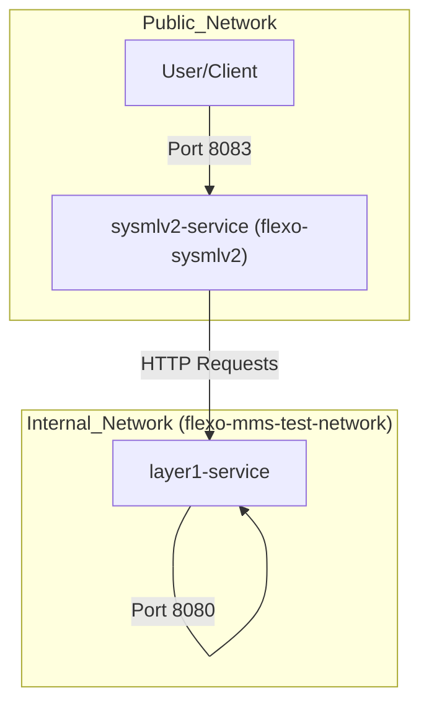
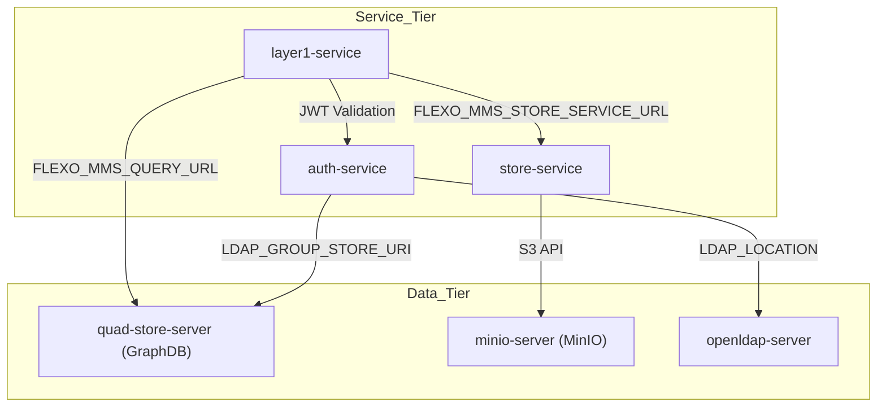

# Page: OpenMBEE Cloud and GraphDB Deployments

# OpenMBEE Cloud and GraphDB Deployments

Relevant source files

The following files were used as context for generating this wiki page:

- [docker-compose/docker-compose-graphdb.yml](docker-compose/docker-compose-graphdb.yml)
- [docker-compose/docker-compose-openmbee.yml](docker-compose/docker-compose-openmbee.yml)
- [docker-compose/env/flexo-mms-auth-graphdb.env](docker-compose/env/flexo-mms-auth-graphdb.env)
- [docker-compose/env/flexo-mms-layer1-graphdb.env](docker-compose/env/flexo-mms-layer1-graphdb.env)
- [docker-compose/env/flexo-mms-quad-store-graphdb.env](docker-compose/env/flexo-mms-quad-store-graphdb.env)

This page documents the alternative deployment configurations for the Flexo SysML v2 service, specifically focusing on integration with the OpenMBEE Cloud ecosystem and the Ontotext GraphDB triplestore. While the local development setup typically uses Apache Jena Fuseki, these configurations allow for enterprise-grade scalability and integration with existing OpenMBEE Layer 1 infrastructure.

## OpenMBEE Cloud Deployment

The OpenMBEE Cloud deployment model is designed for scenarios where the Flexo MMS Layer 1 service is already managed externally or deployed as a standalone container. This configuration simplifies the stack by focusing only on the `sysmlv2-service` and its immediate dependency, the `layer1-service`.

### Infrastructure Components

In this setup, defined in `docker-compose-openmbee.yml`, the SysML v2 service interacts with a pre-configured Layer 1 instance.

| Service | Image | Role |
| :--- | :--- | :--- |
| `sysmlv2-service` | `openmbee/flexo-sysmlv2:v0.1.1` | The SysML v2 API shim that translates SysML v2 REST calls to SPARQL/MMS commands. |
| `layer1-service` | `openmbee/flexo-mms-layer1-service:v0.2.2` | The Flexo MMS Layer 1 core providing repository management and RDF persistence. |

### Data Flow and Connectivity

The `sysmlv2-service` depends on `layer1-service` [docker-compose/docker-compose-openmbee.yml:21-22](). It communicates with Layer 1 using the configuration provided in `./env/flexo-sysmlv2.env` [docker-compose/docker-compose-openmbee.yml:19-20]().

**Cloud Deployment Topology**

**Sources:**
- [docker-compose/docker-compose-openmbee.yml:5-24]()
- [docker-compose/docker-compose-openmbee.yml:26-29]()

---

## GraphDB Triplestore Deployment

The GraphDB deployment variant replaces the default Fuseki quad-store with Ontotext GraphDB. This configuration is more complex as it involves the full suite of Flexo MMS microservices, including authentication and binary storage.

### Service Architecture

The `docker-compose-graphdb.yml` file defines a comprehensive stack including:

1.  **Quad Store**: `ontotext/graphdb:10.3.0` serves as the RDF triplestore [docker-compose/docker-compose-graphdb.yml:21-24]().
2.  **Auth Service**: Manages permissions and LDAP integration [docker-compose/docker-compose-graphdb.yml:42-45]().
3.  **Store Service**: Handles large-scale data storage, backed by MinIO [docker-compose/docker-compose-graphdb.yml:55-58]().
4.  **LDAP**: `openldap-server` provides user management for the Auth service [docker-compose/docker-compose-graphdb.yml:5-8]().

### GraphDB Configuration

The GraphDB instance is tuned via environment variables and specific command-line flags to optimize RDF processing.

*   **Memory Allocation**: Configured via `JAVA_TOOL_OPTIONS` to use 8GB heap [docker-compose/env/flexo-mms-quad-store-graphdb.env:1-1]().
*   **Page Cache**: Enabled via the `-Dgraphdb.global.page.cache=true` command [docker-compose/docker-compose-graphdb.yml:27-27]().

### Service Dependencies and Environment Mapping

The `layer1-service` in this mode is configured to point its SPARQL endpoints to the GraphDB repository named `openmbee`.

| Environment Variable | Value | Purpose |
| :--- | :--- | :--- |
| `FLEXO_MMS_QUERY_URL` | `http://quad-server:7200/repositories/openmbee` | SPARQL Query endpoint [docker-compose/env/flexo-mms-layer1-graphdb.env:3-3](). |
| `FLEXO_MMS_UPDATE_URL` | `http://quad-server:7200/repositories/openmbee/statements` | SPARQL Update endpoint [docker-compose/env/flexo-mms-layer1-graphdb.env:4-4](). |
| `FLEXO_MMS_GRAPH_STORE_PROTOCOL_URL` | `http://quad-server:7200/repositories/openmbee/rdf-graphs/service` | Graph Store Protocol (GSP) endpoint [docker-compose/env/flexo-mms-layer1-graphdb.env:5-5](). |

**GraphDB Stack Communication**

**Sources:**
- [docker-compose/docker-compose-graphdb.yml:21-80]()
- [docker-compose/env/flexo-mms-layer1-graphdb.env:1-6]()
- [docker-compose/env/flexo-mms-auth-graphdb.env:1-9]()

---

## Key Differences from Local Fuseki Setup

The primary differences between the local setup and these deployments lie in the authentication flow and the SPARQL endpoint structure.

### 1. Authentication and LDAP
In the GraphDB deployment, the `auth-service` is integrated with LDAP. The environment file `flexo-mms-auth-graphdb.env` defines the LDAP search patterns and the location of the group store within GraphDB [docker-compose/env/flexo-mms-auth-graphdb.env:1-9]().

### 2. SPARQL Endpoint Paths
GraphDB uses a specific URL structure for its repositories (`/repositories/{repoID}`) which differs from the standard Fuseki structure (`/{datasetID}/sparql`).

*   **GraphDB Query**: `http://quad-server:7200/repositories/openmbee` [docker-compose/env/flexo-mms-layer1-graphdb.env:3-3]()
*   **GraphDB Update**: `http://quad-server:7200/repositories/openmbee/statements` [docker-compose/env/flexo-mms-layer1-graphdb.env:4-4]()

### 3. Binary Storage
Unlike the local setup which may use in-memory or simple file storage, the GraphDB/Full stack uses a dedicated `store-service` [docker-compose/docker-compose-graphdb.yml:55-58]() backed by `minio-server` [docker-compose/docker-compose-graphdb.yml:31-34](). This is configured in `layer1-service` via the `FLEXO_MMS_STORE_SERVICE_URL` [docker-compose/env/flexo-mms-layer1-graphdb.env:2-2]().

**Sources:**
- [docker-compose/env/flexo-mms-layer1-graphdb.env:1-6]()
- [docker-compose/env/flexo-mms-auth-graphdb.env:1-10]()
- [docker-compose/docker-compose-graphdb.yml:5-80]()
