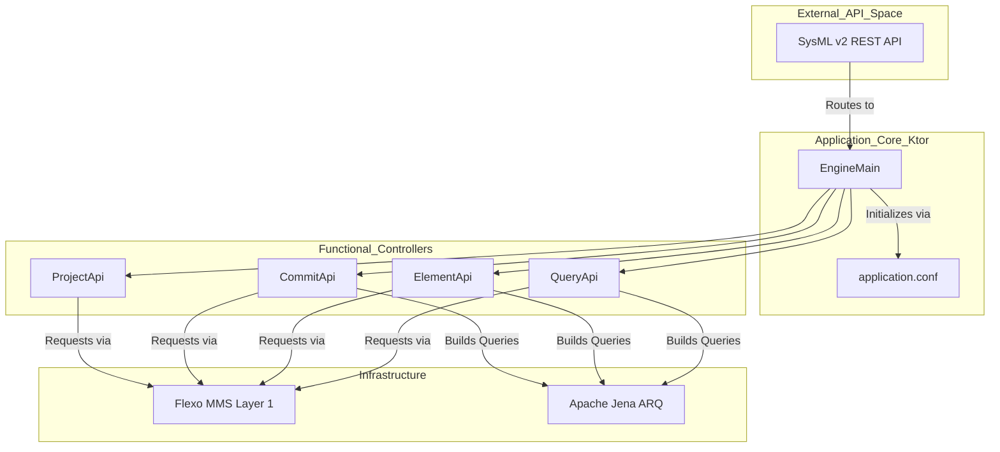
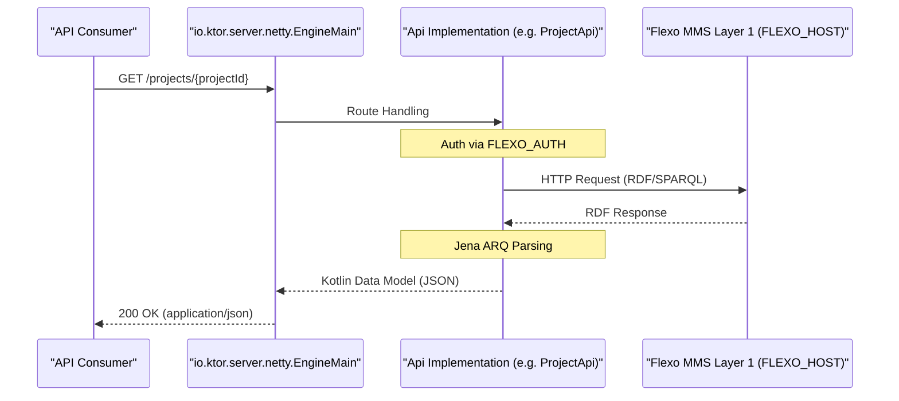

# Page: Overview

# Overview

Relevant source files

The following files were used as context for generating this wiki page:

- [Dockerfile](Dockerfile)
- [LICENSE](LICENSE)
- [README.md](README.md)
- [build.gradle.kts](build.gradle.kts)
- [docker-compose/env/flexo-sysmlv2.env](docker-compose/env/flexo-sysmlv2.env)
- [settings.gradle.kts](settings.gradle.kts)

The **Flexo MMS SysML v2 Microservice** is a REST/HTTP Platform Specific Model (PSM) implementation of the [Systems Modeling API and Services](https://github.com/Systems-Modeling/SysML-v2-API-Services) specification. It acts as a specialized adapter within the OpenMBEE ecosystem, providing a SysML v2 compliant interface on top of the Flexo Model Management System (MMS) Layer 1 [[README.md:1-5]]().

The service is built using **Kotlin** and the **Ktor** framework, leveraging **Apache Jena** for RDF and SPARQL operations to manage model data stored in a triplestore [[build.gradle.kts:15-63]]().

### Role in OpenMBEE Ecosystem

This microservice serves as the bridge between the standardized SysML v2 API and the underlying Flexo MMS infrastructure. It translates SysML v2 domain concepts (like Projects, Commits, and Elements) into RDF-based graph patterns and MMS repository operations.

Project metadata and model elements are organized under a specific organization namespace, typically configured via the `FLEXO_SYSMLV2_ORG` environment variable [[docker-compose/env/flexo-sysmlv2.env:4]]().

### Key Architectural Concepts

The application follows a layered architecture designed for high-performance graph data management:

1.  **API Routing Layer**: Uses Ktor's `Resources` plugin to define type-safe endpoints corresponding to the SysML v2 specification [[build.gradle.kts:44-45]]().
2.  **Logic Layer**: Implements domain-specific logic for version control (branching, tagging, committing) and model traversal.
3.  **Flexo Client Layer**: Manages authenticated communication with the Flexo MMS Layer 1 service using Ktor's `HttpClient` [[build.gradle.kts:23-25]]().
4.  **Data Persistence**: While the service is stateless, it persists model data as RDF quads in a triplestore (e.g., Apache Jena Fuseki or GraphDB) via the MMS Layer 1.

#### System Component Mapping

The following diagram maps high-level system components to their respective code entities and configuration symbols.

**Component to Code Entity Map**

Sources: [[build.gradle.kts:5-6]](), [[build.gradle.kts:60-63]](), [[README.md:13-17]]()

### Service Navigation and API Groups

The service exposes several API groups that implement the SysML v2 functional domains. Each group handles specific aspects of the modeling lifecycle [[README.md:39-75]]().

| API Group | Primary Responsibility | Key Implementation Area |
| :--- | :--- | :--- |
| **Project** | CRUD operations for model containers. | `ProjectApi` |
| **Commit** | Managing version history and data changes. | `CommitApi` |
| **Element** | Accessing specific model elements and roots. | `ElementApi` |
| **Branch/Tag** | Reference management and snapshots. | `BranchApi`, `TagApi` |
| **Query** | Ad-hoc and saved SPARQL-based filtering. | `QueryApi` |

**Request Pipeline Diagram**

Sources: [[build.gradle.kts:5-6]](), [[build.gradle.kts:27-29]](), [[docker-compose/env/flexo-sysmlv2.env:1-5]]()

### Wiki Navigation

This documentation is structured to guide you from setup to deep architectural understanding:

*   **[Getting Started](#1.1)**: Step-by-step guide for setting up and running the service locally or via Docker, including build instructions and environment configuration.
*   **[Project Structure and Build System](#1.2)**: Explains the Gradle build configuration, Kotlin/JVM toolchain, and the OpenAPI code-generation workflow.
*   **System Architecture**: Overview of the layered architecture, RDF/SPARQL data model, and request pipeline.
*   **API Reference**: Documentation of all REST API endpoint groups (Project, Commit, Element, Query, etc.).
*   **Data Models**: Details on the Kotlin data model classes generated from the SysML v2 OpenAPI spec.
*   **Deployment and Infrastructure**: Overview of containerized deployment, Docker Compose configurations, and environment variables.

For details on setting up your environment, see **[Getting Started](#1.1)**.
For details on the technical stack and build process, see **[Project Structure and Build System](#1.2)**.
