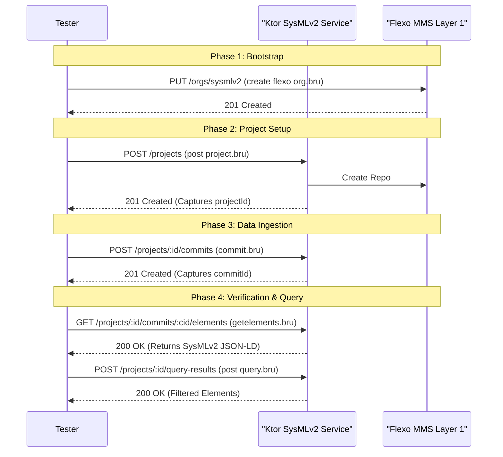

# Page: Postman and Bruno API Collections

# Postman and Bruno API Collections

<details>
<summary>Relevant source files</summary>

The following files were used as context for generating this wiki page:

- [bruno/bruno.json](bruno/bruno.json)
- [bruno/collection.bru](bruno/collection.bru)
- [bruno/commit.bru](bruno/commit.bru)
- [bruno/create flexo org.bru](bruno/create flexo org.bru)
- [bruno/create query.bru](bruno/create query.bru)
- [bruno/getbranches.bru](bruno/getbranches.bru)
- [bruno/getcommits.bru](bruno/getcommits.bru)
- [bruno/getelements.bru](bruno/getelements.bru)
- [bruno/getprojects.bru](bruno/getprojects.bru)
- [bruno/post project.bru](bruno/post project.bru)
- [bruno/post query.bru](bruno/post query.bru)
- [docker-compose/flexo-sysmlv2.postman_collection.json](docker-compose/flexo-sysmlv2.postman_collection.json)

</details>


This page documents the API collections provided for the `flexo-mms-sysmlv2` service. These collections facilitate manual testing, endpoint exploration, and automated workflow validation for developers. The repository includes both a Postman collection and a Bruno collection, which mirror each other's functionality and structure.

## Overview of Collections

The collections are designed to interact with both the SysML v2 API layer (typically on port `8083`) and the underlying Flexo MMS Layer 1 (typically on port `8080`). They include pre-configured requests for the entire lifecycle of a SysML v2 project, from organization creation to complex querying.

| Tool | Location | Description |
| :--- | :--- | :--- |
| **Postman** | `docker-compose/flexo-sysmlv2.postman_collection.json` | A single-file JSON collection containing all requests and test scripts. |
| **Bruno** | `bruno/` | A directory-based collection where each request is a separate `.bru` file, better suited for version control. |

**Sources:**
- [docker-compose/flexo-sysmlv2.postman_collection.json:1-8]()
- [bruno/bruno.json:1-9]()
- [bruno/collection.bru:1-23]()

## Collection Variables and Environment Setup

Both collections rely on variables to manage host addresses and dynamic IDs (like `projectId` or `commitId`) generated during a testing session.

### Variable Definitions
The following variables are defined at the collection level:

| Variable | Default Value | Purpose |
| :--- | :--- | :--- |
| `host` | `http://localhost:8083` | The address of the SysML v2 service. |
| `flexoHost` | `http://localhost:8080` | The address of the Flexo MMS Layer 1 service. |
| `projectId` | (Dynamic) | UUID of the project created during the session. |
| `commitId` | (Dynamic) | UUID of the most recent commit. |
| `defaultBranchId`| (Dynamic) | The ID of the `main` branch created with a project. |
| `queryId` | (Dynamic) | The ID of a saved query. |

**Sources:**
- [bruno/collection.bru:9-22]()
- [docker-compose/flexo-sysmlv2.postman_collection.json:52-54]()

### Variable Flow Diagram
This diagram illustrates how data flows from response bodies into collection variables to chain requests.

Title: API Variable Propagation Workflow
```mermaid
graph TD
    subgraph "Postman/Bruno Variable Store"
        VAR_PROJ["projectId"]
        VAR_COMM["commitId"]
        VAR_BRAN["defaultBranchId"]
    end

    REQ_PROJ["POST /projects"] -->| "JSON Response" | SCR_PROJ["Post-response Script"]
    SCR_PROJ -->| "set('@id')" | VAR_PROJ
    SCR_PROJ -->| "set('defaultBranch.@id')" | VAR_BRAN

    REQ_COMM["POST /projects/:id/commits"] -->| "JSON Response" | SCR_COMM["Post-response Script"]
    SCR_COMM -->| "set('@id')" | VAR_COMM

    VAR_PROJ -.->| "Used in URL" | REQ_COMM
    VAR_COMM -.->| "Used in URL" | REQ_ELEM["GET /projects/:id/commits/:commitId/elements"]
```
**Sources:**
- [docker-compose/flexo-sysmlv2.postman_collection.json:70-77]()
- [bruno/post project.bru:25-28]()
- [bruno/commit.bru:8-10]()

## Authentication Configuration

Authentication is primarily handled via Bearer tokens. While the SysML v2 API endpoints often inherit authentication settings, the underlying Flexo MMS requests require explicit tokens for administrative setup.

### Token Setup
The collections include a hardcoded JWT token in the "create flexo org" request, which corresponds to the `super_admins` group required for administrative tasks in Layer 1.

*   **Token Payload:** Includes `username: user01` and `groups: ["super_admins"]`.
*   **Postman Implementation:** Defined in the `auth` block of the request [docker-compose/flexo-sysmlv2.postman_collection.json:24-33]().
*   **Bruno Implementation:** Defined in `auth:bearer` block [bruno/create flexo org.bru:17-19]().

**Sources:**
- [docker-compose/flexo-sysmlv2.postman_collection.json:24-33]()
- [bruno/create flexo org.bru:17-19]()

## Key Request Groups

### 1. Initialization (Flexo Layer)
Before using the SysML v2 API, a corresponding organization must exist in the Flexo MMS.
*   **Request:** `PUT {{flexoHost}}/orgs/sysmlv2`
*   **Payload:** Turtle RDF `<> dct:title "sysml2"@en .`
*   **Purpose:** Bootstraps the organizational namespace in the triplestore.

**Sources:**
- [bruno/create flexo org.bru:7-23]()
- [docker-compose/flexo-sysmlv2.postman_collection.json:10-60]()

### 2. Project Management
These requests map to the logic handled in `ProjectApi.kt`.
*   **Post Project:** Creates a new SysML v2 project and captures the `projectId` and `defaultBranchId` from the response [bruno/post project.bru:25-28]().
*   **Update Project:** Demonstrates the `PUT` operation to modify project metadata like `name` and `description` [docker-compose/flexo-sysmlv2.postman_collection.json:185-193]().

**Sources:**
- [bruno/post project.bru:1-33]()
- [docker-compose/flexo-sysmlv2.postman_collection.json:65-110]()
- [docker-compose/flexo-sysmlv2.postman_collection.json:163-206]()

### 3. Commit and Element Operations
The `commit` request contains a complex `CommitRequest` JSON payload with multiple `DataVersion` objects, representing the SysML v2 model state.
*   **Commit:** Sends a `POST` to `/projects/{{projectId}}/commits`. The payload includes `OwningMembership`, `MembershipImport`, and `AttributeUsage` types [bruno/commit.bru:13-115]().
*   **Get Elements:** Retrieves all elements at a specific commit using `GET /projects/{{projectId}}/commits/{{commitId}}/elements` [bruno/getelements.bru:7-11]().
*   **Get Commits:** Retrieves the commit history for a project [bruno/getcommits.bru:7-11]().

**Sources:**
- [bruno/commit.bru:1-115]()
- [bruno/getelements.bru:1-16]()
- [bruno/getcommits.bru:1-61]()

### 4. Query API
Demonstrates the use of `CompositeConstraint` and `PrimitiveConstraint` to filter model elements through the `QueryApi.kt` endpoints.
*   **Post Query:** Executes an ad-hoc query via `POST /projects/{{projectId}}/query-results` [bruno/post query.bru:7-11]().
*   **Create Query:** Persists a query definition to scratch space via `POST /projects/{{projectId}}/queries` [bruno/create query.bru:7-11]().
*   **Example Constraint:** Filters for elements where `@type` is `NamespaceImport` or `owningRelatedElement` matches a specific ID [bruno/create query.bru:18-32]().

**Sources:**
- [bruno/post query.bru:1-37]()
- [bruno/create query.bru:1-41]()

## End-to-End Testing Workflow

The following diagram maps the logical testing sequence to the specific requests defined in the collections.

Title: SysML v2 API End-to-End Workflow


**Sources:**
- [bruno/create flexo org.bru:1-28]()
- [bruno/post project.bru:1-25]()
- [bruno/commit.bru:1-115]()
- [bruno/getelements.bru:1-16]()
- [bruno/post query.bru:1-37]()
