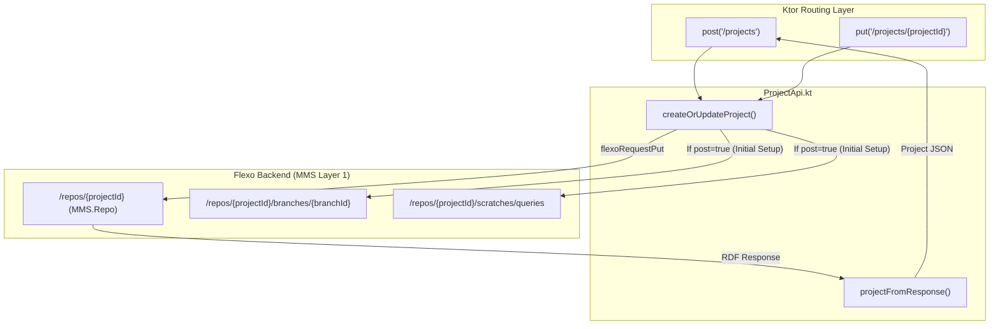

# Page: Project API

# Project API

Relevant source files

The following files were used as context for generating this wiki page:

- [resources/openapi.json](resources/openapi.json)
- [src/main/kotlin/org/openmbee/flexo/sysmlv2/apis/ProjectApi.kt](src/main/kotlin/org/openmbee/flexo/sysmlv2/apis/ProjectApi.kt)
- [src/main/kotlin/org/openmbee/flexo/sysmlv2/models/BranchRequest.kt](src/main/kotlin/org/openmbee/flexo/sysmlv2/models/BranchRequest.kt)
- [src/main/kotlin/org/openmbee/flexo/sysmlv2/models/ProjectRequest.kt](src/main/kotlin/org/openmbee/flexo/sysmlv2/models/ProjectRequest.kt)

The Project API provides the administrative and structural endpoints for managing SysML v2 projects. It maps SysML v2 project concepts to Flexo MMS Layer 1 **Repositories** (Repos). This section details the implementation of CRUD operations, the mapping between RDF and JSON models, and the internal logic for project initialization.

## Overview of Project Management

In the Flexo MMS architecture, a `Project` is a high-level container that corresponds to an MMS Repo. The Project API handles the lifecycle of these containers, including creating the necessary default branch and scratch spaces required for SysML v2 compliance.

### Data Flow: SysML v2 to MMS Repo

The following diagram illustrates how a SysML v2 `ProjectRequest` is transformed and routed through the `ProjectApi.kt` to the underlying Flexo MMS backend.

**Project Creation Logic**

**Sources:** [src/main/kotlin/org/openmbee/flexo/sysmlv2/apis/ProjectApi.kt:49-99](), [src/main/kotlin/org/openmbee/flexo/sysmlv2/apis/ProjectApi.kt:164-177]()

---

## Core Implementation Details

### Project RDF Mapping
The `projectFromResponse` function serves as the primary mapper between the RDF graph returned by the Flexo backend and the SysML v2 `Project` data model.

*   **ID Mapping**: Maps `MMS.id` to `atId` [src/main/kotlin/org/openmbee/flexo/sysmlv2/apis/ProjectApi.kt:34]().
*   **Branch Mapping**: Maps `SYSMLV2.DEFAULT_BRANCH_ID` to the `defaultBranch` property [src/main/kotlin/org/openmbee/flexo/sysmlv2/apis/ProjectApi.kt:35]().
*   **Metadata Mapping**: Extracts `DCTerms.title` for the name and `DCTerms.description` [src/main/kotlin/org/openmbee/flexo/sysmlv2/apis/ProjectApi.kt:44-45]().

**Sources:** [src/main/kotlin/org/openmbee/flexo/sysmlv2/apis/ProjectApi.kt:32-47]()

### Project Initialization (`createOrUpdateProject`)
When a project is created, the service performs several sequential operations to ensure the repository is ready for SysML v2 data:
1.  **Create Repo**: Executes a `PUT` to `/repos/{projectUuid}` with metadata [src/main/kotlin/org/openmbee/flexo/sysmlv2/apis/ProjectApi.kt:54-64]().
2.  **Initialize Default Branch**: Creates a branch resource (defaulting to a random UUID if not specified) and points it to `./master` [src/main/kotlin/org/openmbee/flexo/sysmlv2/apis/ProjectApi.kt:72-80]().
3.  **Setup Query Scratchpad**: Creates a scratch space at `/scratches/queries` to store saved SysML v2 queries [src/main/kotlin/org/openmbee/flexo/sysmlv2/apis/ProjectApi.kt:85-92]().

**Sources:** [src/main/kotlin/org/openmbee/flexo/sysmlv2/apis/ProjectApi.kt:49-99]()

---

## Endpoint Specifications

### GET /projects
Retrieves all projects that have not been soft-deleted.
*   **Implementation**: Fetches all subjects of type `MMS.Repo` [src/main/kotlin/org/openmbee/flexo/sysmlv2/apis/ProjectApi.kt:144-147]().
*   **Filtering**: Uses `filterDrop` to exclude any resources that possess the `SYSMLV2.DELETED` property [src/main/kotlin/org/openmbee/flexo/sysmlv2/apis/ProjectApi.kt:155-157]().

### PUT /projects/{projectId}
Updates an existing project. This endpoint implements a **fetch-then-update** pattern to ensure partial updates do not overwrite existing data if certain fields (like `description` or `defaultBranch`) are omitted from the request body [src/main/kotlin/org/openmbee/flexo/sysmlv2/apis/ProjectApi.kt:180-191]().

### DELETE /projects/{projectId}
Implements a **Soft-Delete** pattern. Instead of removing the repository from the triple store, it issues a SPARQL `INSERT DATA` patch to set a `deleted` flag.
*   **Logic**: Adds `<> <${SYSMLV2.DELETED.uri}> true` to the repository resource [src/main/kotlin/org/openmbee/flexo/sysmlv2/apis/ProjectApi.kt:103-113]().

**Sources:** [src/main/kotlin/org/openmbee/flexo/sysmlv2/apis/ProjectApi.kt:103-124](), [src/main/kotlin/org/openmbee/flexo/sysmlv2/apis/ProjectApi.kt:144-161](), [src/main/kotlin/org/openmbee/flexo/sysmlv2/apis/ProjectApi.kt:180-191]()

---

## Entity Mapping Reference

The following table associates SysML v2 API concepts with the internal code entities and their corresponding MMS/RDF properties.

| SysML v2 Concept | Code Entity | RDF Property / MMS Path |
| :--- | :--- | :--- |
| **Project** | `Project` | `MMS.Repo` |
| **Project ID** | `projectUuid` | `MMS.id` |
| **Project Name** | `ProjectRequest.name` | `DCTerms.title` |
| **Default Branch** | `defaultBranch` | `SYSMLV2.DEFAULT_BRANCH_ID` |
| **Soft Delete Flag** | N/A | `SYSMLV2.DELETED` |
| **Query Storage** | N/A | `/repos/{id}/scratches/queries` |

**Sources:** [src/main/kotlin/org/openmbee/flexo/sysmlv2/apis/ProjectApi.kt:32-47](), [src/main/kotlin/org/openmbee/flexo/sysmlv2/apis/ProjectApi.kt:58-62](), [src/main/kotlin/org/openmbee/flexo/sysmlv2/apis/ProjectApi.kt:110]()

## Request Models

The API utilizes the following data classes for payload handling:
*   `ProjectRequest`: Used for creating and updating projects. Includes optional `@id`, `name`, `description`, and `defaultBranch` [src/main/kotlin/org/openmbee/flexo/sysmlv2/models/ProjectRequest.kt:30-38]().
*   `BranchRequest`: Used for creating branches, requiring a `head` commit and `name` [src/main/kotlin/org/openmbee/flexo/sysmlv2/models/BranchRequest.kt:29-36]().

**Sources:** [src/main/kotlin/org/openmbee/flexo/sysmlv2/models/ProjectRequest.kt:1-47](), [src/main/kotlin/org/openmbee/flexo/sysmlv2/models/BranchRequest.kt:1-45]()
