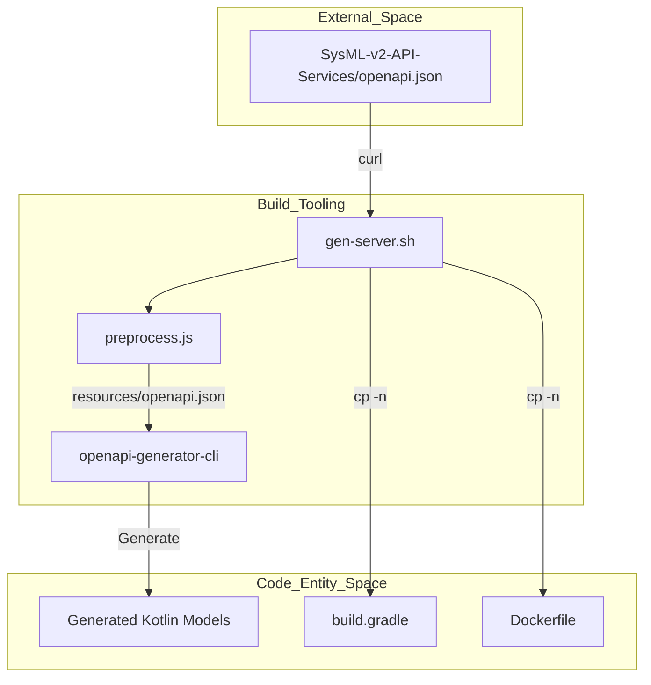
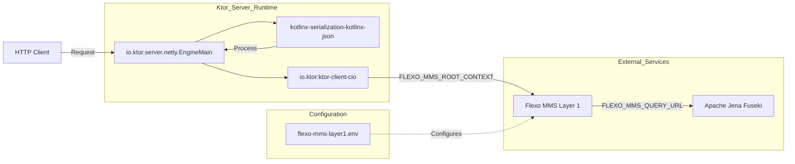

# Page: Project Structure and Build System

# Project Structure and Build System

Relevant source files

The following files were used as context for generating this wiki page:

- [.gitignore](.gitignore)
- [build.gradle.kts](build.gradle.kts)
- [docker-compose/README.md](docker-compose/README.md)
- [docker-compose/env/flexo-mms-layer1.env](docker-compose/env/flexo-mms-layer1.env)
- [gen-server.sh](gen-server.sh)
- [src/main/resources/logback.xml](src/main/resources/logback.xml)

This page details the technical foundation of the `flexo-mms-sysmlv2` service, covering the Gradle build configuration, the Kotlin/JVM toolchain, core library dependencies, and the automated workflow for generating SysML v2 domain models from OpenAPI specifications.

## Build Configuration and Toolchain

The project is built using **Gradle 8.10.2** [build.gradle.kts:65-68]() and targets **Java 17** [build.gradle.kts:70-72](). It leverages the **Kotlin 2.1.21** compiler with the JVM toolchain specifically configured for compatibility [build.gradle.kts:15-16, 73-75]().

The application is packaged as a Ktor server using the `io.ktor.server.netty.EngineMain` as the entry point [build.gradle.kts:4-6]().

### Key Plugins
- `application`: Provides support for creating executable JVM applications [build.gradle.kts:14]().
- `kotlin("jvm")`: Configures Kotlin for the JVM platform [build.gradle.kts:15]().
- `kotlin("plugin.serialization")`: Enables the `kotlinx-serialization` compiler plugin for type-safe JSON/RDF mapping [build.gradle.kts:16]().

### Dependency Stack
The service relies on three primary pillars for its functionality:

| Category | Library | Purpose |
| :--- | :--- | :--- |
| **Web Framework** | Ktor (2.3.13) | Provides the HTTP server (Netty), routing, authentication, and client for Layer 1 communication [build.gradle.kts:22-45](). |
| **Semantic Web** | Apache Jena (4.10.0) | Used for RDF graph manipulation (`jena-arq`) and programmatic SPARQL construction (`jena-querybuilder`) [build.gradle.kts:60-62](). |
| **Serialization** | kotlinx-serialization | Handles JSON-to-Kotlin object mapping for API requests and responses [build.gradle.kts:27](). |
| **Logging** | Logback (1.5.18) | Standard logging implementation configured via `logback.xml` [build.gradle.kts:49](), [src/main/resources/logback.xml:1-15](). |

**Sources:** [build.gradle.kts:1-81](), [src/main/resources/logback.xml:1-15]()

---

## OpenAPI Code Generation Workflow

The project uses a semi-automated workflow to stay in sync with the official SysML v2 API specifications. The `gen-server.sh` script automates the retrieval and processing of the SysML v2 OpenAPI document to generate Kotlin data models.

### Generation Pipeline
1. **Fetch**: Downloads the latest `openapi.json` from the official `Systems-Modeling/SysML-v2-API-Services` repository [gen-server.sh:3-4, 19]().
2. **Preprocess**: Executes `preprocess.js` via Node.js to clean or modify the spec for compatibility [gen-server.sh:19]().
3. **Generate**: Invokes `openapi-generator-cli` using the `kotlin-server` generator [gen-server.sh:26-31]().
4. **Distribute**: Moves generated models into the `src/main/kotlin/` directory and copies build/deployment configuration files if they do not already exist [gen-server.sh:47-52]().

### Data Model Structure
Generated models represent the SysML v2 domain entities. These classes use `kotlinx.serialization` annotations to handle mapping between Kotlin properties and JSON-LD keys. The generator is configured with the package name `org.openmbee.flexo.sysmlv2` [gen-server.sh:30]().

### Model Generation Data Flow
This diagram illustrates how the external SysML v2 specification is transformed into the internal Kotlin entity space.

**Title: OpenAPI to Kotlin Entity Mapping**

**Sources:** [gen-server.sh:1-53]()

---

## Project Structure and Data Flow

The codebase is organized to separate the generated API contract from the manual implementation of the Flexo/MMS logic.

### Directory Layout
- `src/main/kotlin/`: Contains the Kotlin source code, including generated models and the Ktor application logic [gen-server.sh:47]().
- `resources/`: Holds the `openapi.json` spec and `logback.xml` configuration [gen-server.sh:4](), [src/main/resources/logback.xml:1]().
- `docker-compose/`: Contains environment configuration files (`.env`) for connecting to Layer 1 services and triplestores like Fuseki or GraphDB [docker-compose/env/flexo-mms-layer1.env:1-5](), [docker-compose/README.md:1-15]().

### Runtime Request Flow
This diagram bridges the Ktor server components defined in the build system to the infrastructure used for persistence and communication.

**Title: Request Handling and Infrastructure Flow**

**Sources:** [build.gradle.kts:5, 25, 27](), [docker-compose/env/flexo-mms-layer1.env:1-2](), [docker-compose/README.md:9-13]()
