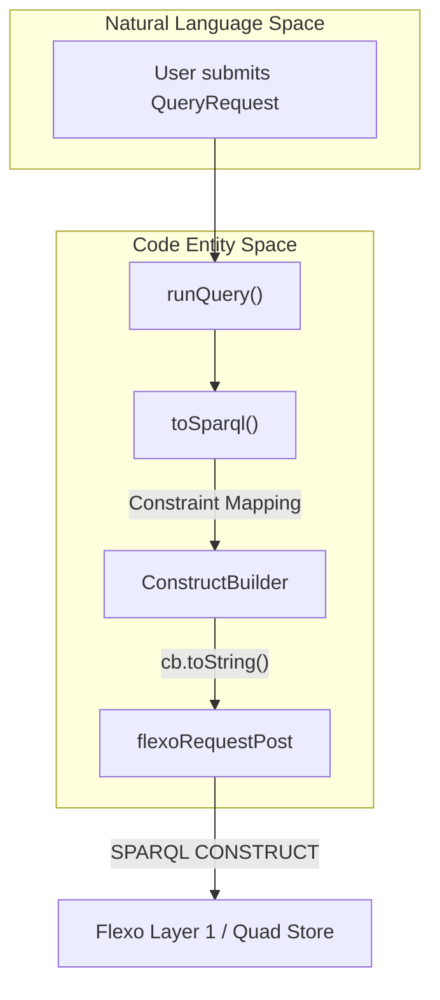
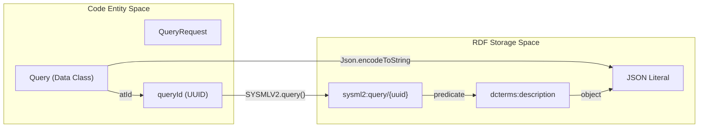

# Page: Query API

# Query API

Relevant source files

The following files were used as context for generating this wiki page:

- [src/main/kotlin/org/openmbee/flexo/sysmlv2/apis/QueryApi.kt](src/main/kotlin/org/openmbee/flexo/sysmlv2/apis/QueryApi.kt)
- [src/main/kotlin/org/openmbee/flexo/sysmlv2/models/CompositeConstraint.kt](src/main/kotlin/org/openmbee/flexo/sysmlv2/models/CompositeConstraint.kt)
- [src/main/kotlin/org/openmbee/flexo/sysmlv2/models/Constraint.kt](src/main/kotlin/org/openmbee/flexo/sysmlv2/models/Constraint.kt)
- [src/main/kotlin/org/openmbee/flexo/sysmlv2/models/PrimitiveConstraint.kt](src/main/kotlin/org/openmbee/flexo/sysmlv2/models/PrimitiveConstraint.kt)
- [src/main/kotlin/org/openmbee/flexo/sysmlv2/models/Query.kt](src/main/kotlin/org/openmbee/flexo/sysmlv2/models/Query.kt)
- [src/main/kotlin/org/openmbee/flexo/sysmlv2/models/QueryRequest.kt](src/main/kotlin/org/openmbee/flexo/sysmlv2/models/QueryRequest.kt)

The Query API provides the infrastructure for executing ad-hoc searches against SysML v2 models and managing saved query definitions. It implements a translation layer that converts SysML v2 `Constraint` objects into SPARQL `FILTER` expressions and manages query persistence within the MMS "scratch" space.

## Query Translation Logic

The core of the Query API is the recursive translation of SysML v2 constraints into Apache Jena SPARQL expressions. This is handled by extension functions on the `Constraint` hierarchy.

### PrimitiveConstraint Translation
`PrimitiveConstraint.toSparql(cb: ConstructBuilder)` converts individual property comparisons into SPARQL `FILTER` clauses [src/main/kotlin/org/openmbee/flexo/sysmlv2/apis/QueryApi.kt:39-94]().

*   **Property Mapping**: Maps SysML v2 properties like `@id` and `@type` to their respective RDF equivalents (`sysml2:elementId` and `rdf:type`). Other properties are prefixed with the SysML v2 namespace [src/main/kotlin/org/openmbee/flexo/sysmlv2/apis/QueryApi.kt:43-47]().
*   **Value Handling**: Supports `JsonObject` (referencing other elements via `@id`), `JsonPrimitive` (literals or types), and `JsonNull` (checking for existence/non-existence) [src/main/kotlin/org/openmbee/flexo/sysmlv2/apis/QueryApi.kt:49-65]().
*   **Optional Matching**: If a value is `JsonNull`, the translation uses `cb.addOptional` to check for the absence of a property in the graph [src/main/kotlin/org/openmbee/flexo/sysmlv2/apis/QueryApi.kt:66-67]().
*   **Operators**: Implements standard comparison operators via Jena's `ExprFactory`: `Equal`, `Less_Than`, `Less_Than_Equal`, `Greater_Than`, and `Greater_Than_Equal` [src/main/kotlin/org/openmbee/flexo/sysmlv2/apis/QueryApi.kt:72-92]().
*   **Inversion**: If the `inverse` flag is set to true, the resulting expression is wrapped in a `not()` [src/main/kotlin/org/openmbee/flexo/sysmlv2/apis/QueryApi.kt:93]().

### CompositeConstraint Translation
`CompositeConstraint.toSparql(cb: ConstructBuilder)` handles logical groupings of constraints [src/main/kotlin/org/openmbee/flexo/sysmlv2/apis/QueryApi.kt:95-113]().

*   **Recursion**: Iterates through the `constraint` list, calling `toSparql` on nested `PrimitiveConstraint` or `CompositeConstraint` objects [src/main/kotlin/org/openmbee/flexo/sysmlv2/apis/QueryApi.kt:98-105]().
*   **Logical Reduction**: Uses the Jena `ExprFactory` to reduce the list of expressions using `and` or `or` operators based on the `CompositeConstraint.Operator` [src/main/kotlin/org/openmbee/flexo/sysmlv2/apis/QueryApi.kt:107-112]().

**Sources:**
* [src/main/kotlin/org/openmbee/flexo/sysmlv2/apis/QueryApi.kt:39-113]()
* [src/main/kotlin/org/openmbee/flexo/sysmlv2/models/PrimitiveConstraint.kt:30-55]()
* [src/main/kotlin/org/openmbee/flexo/sysmlv2/models/CompositeConstraint.kt:31-44]()

## Execution Lifecycle (`runQuery`)

The `runQuery` function orchestrates the execution of a `QueryRequest` against a specific project and version (branch or commit) [src/main/kotlin/org/openmbee/flexo/sysmlv2/apis/QueryApi.kt:138-168]().

### Execution Flow Diagram

The following diagram illustrates the transformation from a SysML v2 `QueryRequest` to a SPARQL `CONSTRUCT` query executed against the Flexo backend.

Title: Query Execution Flow

**Sources:**
* [src/main/kotlin/org/openmbee/flexo/sysmlv2/apis/QueryApi.kt:138-168]()

### Version Resolution
If no `commitId` is provided, the system fetches the project details to identify the `SYSMLV2.DEFAULT_BRANCH_ID` (defaulting to "master") [src/main/kotlin/org/openmbee/flexo/sysmlv2/apis/QueryApi.kt:141-150]().
*   **Branch Query Path**: `/repos/{projectId}/branches/{branchId}/query` [src/main/kotlin/org/openmbee/flexo/sysmlv2/apis/QueryApi.kt:160]()
*   **Commit Query Path**: `/repos/{projectId}/locks/Commit.{commitId}/query` [src/main/kotlin/org/openmbee/flexo/sysmlv2/apis/QueryApi.kt:161]()

### Query Construction
The engine uses Apache Jena's `ConstructBuilder` to build a graph-returning query:
1.  **Template**: `CONSTRUCT { ?e ?p ?o } WHERE { ?e ?p ?o }` [src/main/kotlin/org/openmbee/flexo/sysmlv2/apis/QueryApi.kt:151-152]().
2.  **Prefixes**: Adds standard SysML v2 prefix mappings [src/main/kotlin/org/openmbee/flexo/sysmlv2/apis/QueryApi.kt:153]().
3.  **Filter**: The translated `Expr` from the constraint tree is added via `cb.addFilter(filter)` [src/main/kotlin/org/openmbee/flexo/sysmlv2/apis/QueryApi.kt:159]().

**Sources:**
* [src/main/kotlin/org/openmbee/flexo/sysmlv2/apis/QueryApi.kt:138-168]()

## Saved Queries (CRUD)

Saved queries are persisted in a specialized "scratch" space within the MMS repository, separate from the versioned model data.

### Storage Pattern
Queries are stored as JSON strings within RDF literals using the `DCTerms.description` property [src/main/kotlin/org/openmbee/flexo/sysmlv2/apis/QueryApi.kt:124]().

| Operation | Implementation Details | Target Path |
| :--- | :--- | :--- |
| **Create/Update** | `createOrUpdateQuery`: Uses `UpdateBuilder` to delete existing query triples and insert new JSON payload [src/main/kotlin/org/openmbee/flexo/sysmlv2/apis/QueryApi.kt:115-136](). | `/repos/{projectId}/scratches/queries/update` |
| **Read** | `getQuery`: Executes a `CONSTRUCT` query for the specific query URI and parses the response via `queryFromResponse` [src/main/kotlin/org/openmbee/flexo/sysmlv2/apis/QueryApi.kt:170-192](). | `/repos/{projectId}/scratches/queries/query` |

### Data Association Diagram

This diagram shows how saved query entities in the code relate to the underlying RDF storage structure in the MMS.

Title: Saved Query Data Mapping

**Sources:**
* [src/main/kotlin/org/openmbee/flexo/sysmlv2/apis/QueryApi.kt:115-136]()
* [src/main/kotlin/org/openmbee/flexo/sysmlv2/models/Query.kt:33-41]()

## Key Data Models

| Class | Purpose | Source |
| :--- | :--- | :--- |
| `QueryRequest` | Payload for executing ad-hoc queries or defining new ones. Contains `select` fields and a `where` constraint. | [src/main/kotlin/org/openmbee/flexo/sysmlv2/models/QueryRequest.kt:28-33]() |
| `Query` | The persisted representation of a query, including its unique ID and owning project. | [src/main/kotlin/org/openmbee/flexo/sysmlv2/models/Query.kt:33-41]() |
| `Constraint` | Sealed base class for the recursive constraint system. | [src/main/kotlin/org/openmbee/flexo/sysmlv2/models/Constraint.kt:22]() |
| `PrimitiveConstraint` | Leaf node in a constraint tree representing a single property comparison. | [src/main/kotlin/org/openmbee/flexo/sysmlv2/models/PrimitiveConstraint.kt:30-36]() |
| `CompositeConstraint` | Branch node in a constraint tree combining multiple constraints via `and`/`or`. | [src/main/kotlin/org/openmbee/flexo/sysmlv2/models/CompositeConstraint.kt:31-34]() |

**Sources:**
* [src/main/kotlin/org/openmbee/flexo/sysmlv2/models/QueryRequest.kt:28-33]()
* [src/main/kotlin/org/openmbee/flexo/sysmlv2/models/Query.kt:33-41]()
* [src/main/kotlin/org/openmbee/flexo/sysmlv2/models/Constraint.kt:22]()
* [src/main/kotlin/org/openmbee/flexo/sysmlv2/models/PrimitiveConstraint.kt:30-36]()
* [src/main/kotlin/org/openmbee/flexo/sysmlv2/models/CompositeConstraint.kt:31-34]()
