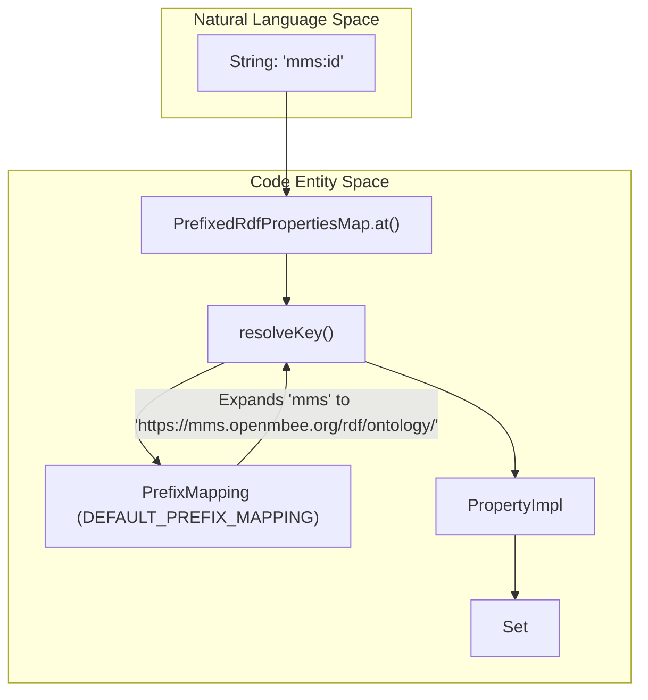
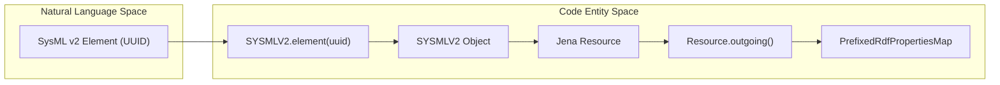

# Page: RDF Namespaces and Prefix Mappings

# RDF Namespaces and Prefix Mappings

Relevant source files

The following files were used as context for generating this wiki page:

- [src/main/kotlin/org/openmbee/flexo/sysmlv2/Namespaces.kt](src/main/kotlin/org/openmbee/flexo/sysmlv2/Namespaces.kt)
- [src/main/kotlin/org/openmbee/flexo/sysmlv2/RdfPrefixes.kt](src/main/kotlin/org/openmbee/flexo/sysmlv2/RdfPrefixes.kt)
- [src/main/kotlin/org/openmbee/flexo/sysmlv2/infrastructure/Serializers.kt](src/main/kotlin/org/openmbee/flexo/sysmlv2/infrastructure/Serializers.kt)

This page documents the RDF namespace definitions, prefix mappings, and utility classes used to manage semantic data within the flexo-mms-sysmlv2 service. The system relies on Apache Jena for RDF modeling and uses a structured set of URIs to bridge SysML v2 domain concepts with the underlying MMS (Model Management System) Layer 1 storage.

## Overview of Namespaces

The service defines three primary categories of namespaces:
1.  **SYSMLV2**: Domain-specific URIs for SysML v2 elements, types, and annotations.
2.  **MMS**: Ontology and object URIs for the Model Management System (Layer 1).
3.  **ROOT_CONTEXT**: The base URI for the local Layer 1 service instance, defined as `http://layer1-service` [src/main/kotlin/org/openmbee/flexo/sysmlv2/Namespaces.kt:8-8]().

### SYSMLV2 Namespace
The `SYSMLV2` object provides constants and factory functions for generating URIs related to the SysML v2 specification. It defines the base URN for elements and the official OMG SysML vocabulary URL.

| Constant/Function | Value / Purpose |
| :--- | :--- |
| `BASE` | `urn:sysmlv2:` [src/main/kotlin/org/openmbee/flexo/sysmlv2/Namespaces.kt:11-11]() |
| `VOCABULARY` | `https://www.omg.org/spec/SysML#` [src/main/kotlin/org/openmbee/flexo/sysmlv2/Namespaces.kt:12-12]() |
| `ELEMENT` | `${BASE}element:` used for individual model elements [src/main/kotlin/org/openmbee/flexo/sysmlv2/Namespaces.kt:13-13]() |
| `ANNOTATION_JSON` | `${BASE}annotation:json:` used for storing serialized JSON metadata [src/main/kotlin/org/openmbee/flexo/sysmlv2/Namespaces.kt:15-15]() |
| `element(uuid)` | Generates a `Resource` for a specific element UUID [src/main/kotlin/org/openmbee/flexo/sysmlv2/Namespaces.kt:19-21]() |
| `type(type)` | Generates a `Resource` for a SysML v2 meta-type [src/main/kotlin/org/openmbee/flexo/sysmlv2/Namespaces.kt:22-24]() |
| `prop(id)` | Generates a `Property` within the SysML vocabulary [src/main/kotlin/org/openmbee/flexo/sysmlv2/Namespaces.kt:28-30]() |

Sources: [src/main/kotlin/org/openmbee/flexo/sysmlv2/Namespaces.kt:10-34]()

### MMS Namespace
The `MMS` object encapsulates the ontology used by the Flexo MMS Layer 1. It defines classes (e.g., `Org`, `Repo`, `Commit`) and properties (e.g., `commitId`, `parent`, `data`) required to interact with the version-controlled quad store.

*   **Classes**: Includes `MMS.Org`, `MMS.Repo`, `MMS.Branch`, and `MMS.Commit` [src/main/kotlin/org/openmbee/flexo/sysmlv2/Namespaces.kt:85-94]().
*   **Transaction Properties**: The `MMS.TXN` nested object includes `stagingGraph`, `baseModel`, and `insGraph` used during SPARQL UPDATE operations [src/main/kotlin/org/openmbee/flexo/sysmlv2/Namespaces.kt:167-181]().
*   **Metadata Graphs**: References for `RepoMetadataGraph`, `SnapshotGraph`, and `CollectionMetadataGraph` [src/main/kotlin/org/openmbee/flexo/sysmlv2/Namespaces.kt:106-108]().

Sources: [src/main/kotlin/org/openmbee/flexo/sysmlv2/Namespaces.kt:76-182]()

## Prefix Mappings

The system utilizes Apache Jena's `PrefixMapping` to simplify SPARQL query generation and RDF serialization.

### SYSMLV2_PREFIX_MAPPING
A specialized mapping containing standard RDF prefixes and SysML v2 specific prefixes like `sysml`, `elmt`, and `json` [src/main/kotlin/org/openmbee/flexo/sysmlv2/Namespaces.kt:35-47]().

### DEFAULT_PREFIX_MAPPING
The `DEFAULT_PREFIX_MAPPING` object aggregates `SYSMLV2_PREFIX_MAPPING` with service-specific mappings for MMS and the local root context.

**Prefix Map Configuration**
| Prefix | Namespace URI |
| :--- | :--- |
| `sysml` | `https://www.omg.org/spec/SysML#` |
| `elmt` | `urn:sysmlv2:element:` |
| `json` | `urn:sysmlv2:annotation:json:` |
| `mms` | `https://mms.openmbee.org/rdf/ontology/` |
| `m` | `http://layer1-service/` (ROOT_CONTEXT) |
| `m-graph`| `http://layer1-service/graphs/` |
| `m-org` | `http://layer1-service/orgs/` |

Sources: [src/main/kotlin/org/openmbee/flexo/sysmlv2/Namespaces.kt:48-74]()

## Graph Traversal with PrefixedRdfPropertiesMap

To facilitate easy navigation of RDF models returned by the Layer 1 service, the project implements a specialized map structure: `PrefixedRdfPropertiesMap`.

### Class Implementation
`PrefixedRdfPropertiesMap` extends a standard `HashMap` but adds the ability to resolve keys using CURIEs (Compressed URIs) based on the defined `PrefixMapping`.

*   **`at(key: String)`**: This function allows developers to retrieve a set of `RDFNode` objects using a prefixed string (e.g., `at("mms:commitId")`) instead of a full `Property` object [src/main/kotlin/org/openmbee/flexo/sysmlv2/RdfPrefixes.kt:15-17]().
*   **`resolveKey(key: String)`**: Internally handles URI expansion. It supports angle-bracketed URIs (e.g., `<http://.../>`), prefixed strings, or raw URIs preceded by `>` [src/main/kotlin/org/openmbee/flexo/sysmlv2/RdfPrefixes.kt:20-28]().

### Extension Functions
The `RdfPrefixes.kt` file provides extension functions to streamline data extraction from Jena `Resource` objects:

*   **`Resource.outgoing()`**: Converts all properties of a resource into a `PrefixedRdfPropertiesMap` for fluent access [src/main/kotlin/org/openmbee/flexo/sysmlv2/RdfPrefixes.kt:39-47]().
*   **`Set<RDFNode>?.literal()`**: Safely extracts the first node in a set as a string literal [src/main/kotlin/org/openmbee/flexo/sysmlv2/RdfPrefixes.kt:31-33]().
*   **`Set<RDFNode>?.resource()`**: Safely extracts the first node in a set as a Jena `Resource` [src/main/kotlin/org/openmbee/flexo/sysmlv2/RdfPrefixes.kt:35-37]().

Sources: [src/main/kotlin/org/openmbee/flexo/sysmlv2/RdfPrefixes.kt:10-47]()

## Implementation Diagrams

### RDF Property Resolution Flow
This diagram illustrates how a string-based CURIE is resolved to an RDF Property and used to fetch data from a model.

Title: "CURIE Resolution in PrefixedRdfPropertiesMap"

Sources: [src/main/kotlin/org/openmbee/flexo/sysmlv2/RdfPrefixes.kt:10-29](), [src/main/kotlin/org/openmbee/flexo/sysmlv2/Namespaces.kt:48-74]()

### Resource Mapping Architecture
This diagram shows the relationship between SysML v2 domain elements and the RDF mapping infrastructure.

Title: "SysML v2 Element to RDF Mapping"

Sources: [src/main/kotlin/org/openmbee/flexo/sysmlv2/Namespaces.kt:10-34](), [src/main/kotlin/org/openmbee/flexo/sysmlv2/RdfPrefixes.kt:39-47]()

## Data Serialization Infrastructure
The project also includes custom serializers for common Java/Kotlin types to ensure they are handled correctly during JSON/RDF transitions.

*   **`URISerializer`**: Handles `java.net.URI` [src/main/kotlin/org/openmbee/flexo/sysmlv2/infrastructure/Serializers.kt:24-34]().
*   **`UUIDSerializer`**: Handles `java.util.UUID` [src/main/kotlin/org/openmbee/flexo/sysmlv2/infrastructure/Serializers.kt:35-45]().
*   **`OffsetDateTimeSerializer`**: Handles ISO-8601 date-time strings [src/main/kotlin/org/openmbee/flexo/sysmlv2/infrastructure/Serializers.kt:13-23]().

Sources: [src/main/kotlin/org/openmbee/flexo/sysmlv2/infrastructure/Serializers.kt:1-56]()
