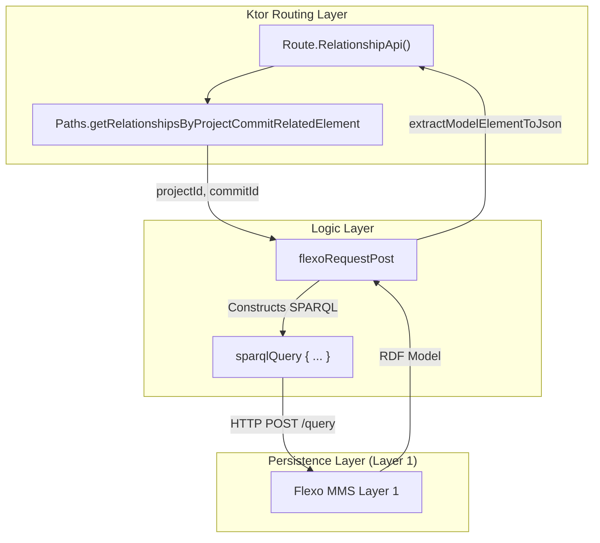
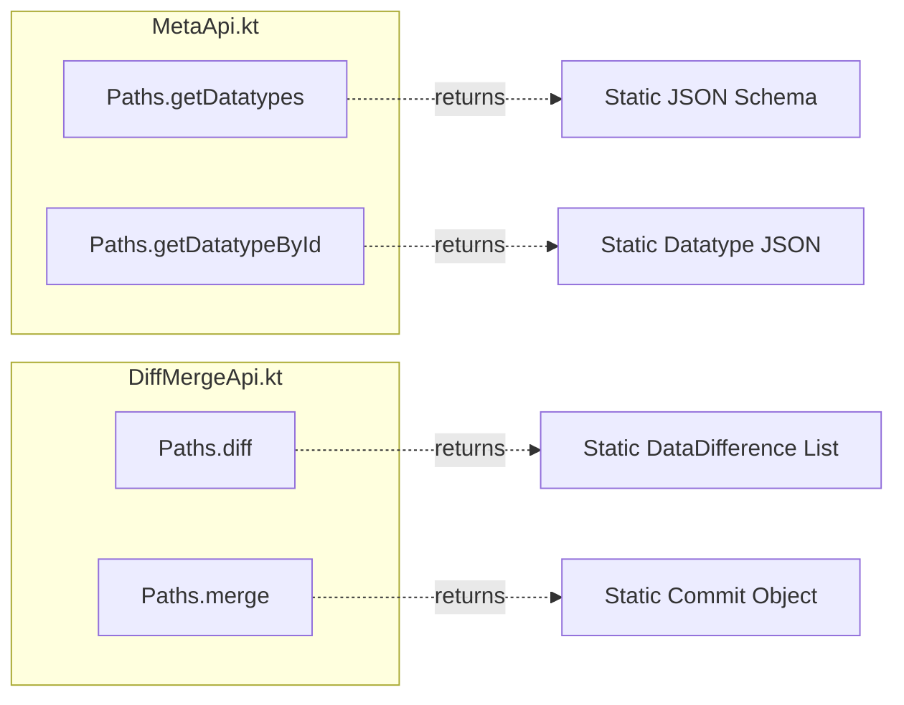

# Page: Relationship, Diff/Merge, and Meta APIs

# Relationship, Diff/Merge, and Meta APIs

Relevant source files

The following files were used as context for generating this wiki page:

- [docker-compose/env/flexo-mms-layer1-openmbee.env](docker-compose/env/flexo-mms-layer1-openmbee.env)
- [docker-compose/mount/cluster.trig](docker-compose/mount/cluster.trig)
- [docker-compose/mount/openmbee.sparql](docker-compose/mount/openmbee.sparql)
- [src/main/kotlin/org/openmbee/flexo/sysmlv2/apis/DiffMergeApi.kt](src/main/kotlin/org/openmbee/flexo/sysmlv2/apis/DiffMergeApi.kt)
- [src/main/kotlin/org/openmbee/flexo/sysmlv2/apis/MetaApi.kt](src/main/kotlin/org/openmbee/flexo/sysmlv2/apis/MetaApi.kt)
- [src/main/kotlin/org/openmbee/flexo/sysmlv2/apis/RelationshipApi.kt](src/main/kotlin/org/openmbee/flexo/sysmlv2/apis/RelationshipApi.kt)

This page documents the implementation and status of three distinct API groups within the `flexo-mms-sysmlv2` service: the **Relationship API**, the **Diff/Merge API**, and the **Meta API**. While the Relationship API provides functional SPARQL-based traversal of model connections, the Diff/Merge and Meta APIs currently serve as stubbed endpoints to maintain compatibility with the SysML v2 REST specification.

## 1. Relationship API

The Relationship API is responsible for querying directional relationships between elements within a specific commit context of a project. Unlike simple element retrieval, this API focuses on the connectivity and topology of the SysML v2 model.

### Implementation and Data Flow
The implementation in `RelationshipApi.kt` utilizes a `flexoRequestPost` block to construct and send `CONSTRUCT` queries that target specific SysML v2 relationship properties [src/main/kotlin/org/openmbee/flexo/sysmlv2/apis/RelationshipApi.kt:46-60]().

*   **Directional Queries**: The API supports retrieving relationships where a specific element is either the source or the target via a `direction` query parameter [src/main/kotlin/org/openmbee/flexo/sysmlv2/apis/RelationshipApi.kt:26-45]().
    *   `in`: Relationships where the element is the `sysml:target` [src/main/kotlin/org/openmbee/flexo/sysmlv2/apis/RelationshipApi.kt:27-30]().
    *   `out`: Relationships where the element is the `sysml:source` [src/main/kotlin/org/openmbee/flexo/sysmlv2/apis/RelationshipApi.kt:31-34]().
    *   `both` (default): A `union` of both incoming and outgoing relationships [src/main/kotlin/org/openmbee/flexo/sysmlv2/apis/RelationshipApi.kt:38-44]().
*   **Contextual Scoping**: Queries are scoped to a specific `projectId` and `commitId` by targeting the MMS lock corresponding to that commit [src/main/kotlin/org/openmbee/flexo/sysmlv2/apis/RelationshipApi.kt:47]().
*   **Data Transformation**: The service executes the SPARQL query against the Flexo MMS Layer 1 backend. If successful, it parses the RDF model and iterates through subjects to generate JSON-LD via `extractModelElementToJson` [src/main/kotlin/org/openmbee/flexo/sysmlv2/apis/RelationshipApi.kt:68-74]().

### Key Functions
| Function | Route/Endpoint | Description |
| :--- | :--- | :--- |
| `RelationshipApi` | `Paths.getRelationshipsByProjectCommitRelatedElement` | Entry point for relationship queries filtered by a related element ID [src/main/kotlin/org/openmbee/flexo/sysmlv2/apis/RelationshipApi.kt:25](). |

### Relationship Retrieval Logic
The following diagram illustrates how a request for relationships is translated from a Ktor route into a SPARQL query against the triplestore.

**Diagram: Relationship Query Pipeline**

**Sources:** [src/main/kotlin/org/openmbee/flexo/sysmlv2/apis/RelationshipApi.kt:23-77]()

---

## 2. Diff and Merge APIs

The Diff and Merge APIs are defined in `DiffMergeApi.kt`. In the current version of the codebase, these endpoints are **stubs** that return hardcoded example JSON responses to satisfy the API contract [src/main/kotlin/org/openmbee/flexo/sysmlv2/apis/DiffMergeApi.kt:34-218]().

### Status and Stub Responses
*   **Diff API**: Intended to compare two versions of model data. The current implementation for `Paths.diff` returns a static array of `DataDifference` objects containing example `baseData` and `compareData` [src/main/kotlin/org/openmbee/flexo/sysmlv2/apis/DiffMergeApi.kt:36-186]().
*   **Merge API**: Intended to perform a merge operation between branches or commits. Currently, it returns a stubbed `Commit` object representing a successful merge result [src/main/kotlin/org/openmbee/flexo/sysmlv2/apis/DiffMergeApi.kt:189-215]().

**Sources:** [src/main/kotlin/org/openmbee/flexo/sysmlv2/apis/DiffMergeApi.kt:34-218]()

---

## 3. Meta API

The Meta API provides metadata about the datatypes used within the Systems Modeling API. Like the Diff/Merge API, this is currently a **stub implementation** used for schema discovery and specification compliance.

### Implementation Details
The `MetaApi.kt` file defines two primary GET routes:
1.  **Get Datatypes**: `Paths.getDatatypes` returns a JSON object describing the schema and definitions available in the system [src/main/kotlin/org/openmbee/flexo/sysmlv2/apis/MetaApi.kt:49-57]().
2.  **Get Datatype by ID**: `Paths.getDatatypeById` returns a detailed JSON Schema for a specific datatype, including properties, requirements, and additional metadata [src/main/kotlin/org/openmbee/flexo/sysmlv2/apis/MetaApi.kt:30-47]().

**Diagram: Meta and Stub API Structure**

**Sources:** [src/main/kotlin/org/openmbee/flexo/sysmlv2/apis/MetaApi.kt:28-59](), [src/main/kotlin/org/openmbee/flexo/sysmlv2/apis/DiffMergeApi.kt:34-218]()

---

## Summary of API Implementation Status

| API Group | File | Status | Backend Interaction |
| :--- | :--- | :--- | :--- |
| **Relationship** | `RelationshipApi.kt` | **Fully Implemented** | Executes SPARQL CONSTRUCT queries via `flexoRequestPost` [src/main/kotlin/org/openmbee/flexo/sysmlv2/apis/RelationshipApi.kt:46-60](). |
| **Diff** | `DiffMergeApi.kt` | **Stub** | Returns static `exampleContentString` [src/main/kotlin/org/openmbee/flexo/sysmlv2/apis/DiffMergeApi.kt:37](). |
| **Merge** | `DiffMergeApi.kt` | **Stub** | Returns static `exampleContentString` [src/main/kotlin/org/openmbee/flexo/sysmlv2/apis/DiffMergeApi.kt:190](). |
| **Meta** | `MetaApi.kt` | **Stub** | Returns static JSON Schema strings [src/main/kotlin/org/openmbee/flexo/sysmlv2/apis/MetaApi.kt:31](). |

**Sources:** [src/main/kotlin/org/openmbee/flexo/sysmlv2/apis/RelationshipApi.kt:1-77](), [src/main/kotlin/org/openmbee/flexo/sysmlv2/apis/DiffMergeApi.kt:1-218](), [src/main/kotlin/org/openmbee/flexo/sysmlv2/apis/MetaApi.kt:1-60]()
