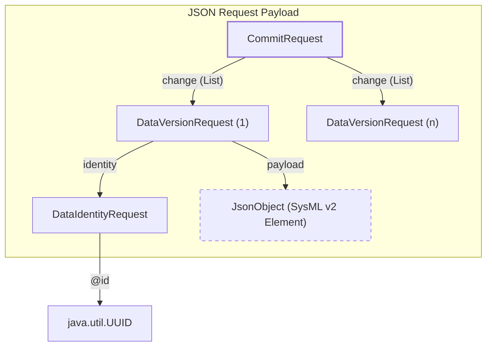

# Page: Request Models and Constraint System

# Request Models and Constraint System

<details>
<summary>Relevant source files</summary>

The following files were used as context for generating this wiki page:

- [resources/openapi.json](resources/openapi.json)
- [src/main/kotlin/org/openmbee/flexo/sysmlv2/models/BranchRequest.kt](src/main/kotlin/org/openmbee/flexo/sysmlv2/models/BranchRequest.kt)
- [src/main/kotlin/org/openmbee/flexo/sysmlv2/models/CommitRequest.kt](src/main/kotlin/org/openmbee/flexo/sysmlv2/models/CommitRequest.kt)
- [src/main/kotlin/org/openmbee/flexo/sysmlv2/models/CompositeConstraint.kt](src/main/kotlin/org/openmbee/flexo/sysmlv2/models/CompositeConstraint.kt)
- [src/main/kotlin/org/openmbee/flexo/sysmlv2/models/Constraint.kt](src/main/kotlin/org/openmbee/flexo/sysmlv2/models/Constraint.kt)
- [src/main/kotlin/org/openmbee/flexo/sysmlv2/models/DataVersionRequest.kt](src/main/kotlin/org/openmbee/flexo/sysmlv2/models/DataVersionRequest.kt)
- [src/main/kotlin/org/openmbee/flexo/sysmlv2/models/PrimitiveConstraint.kt](src/main/kotlin/org/openmbee/flexo/sysmlv2/models/PrimitiveConstraint.kt)
- [src/main/kotlin/org/openmbee/flexo/sysmlv2/models/ProjectRequest.kt](src/main/kotlin/org/openmbee/flexo/sysmlv2/models/ProjectRequest.kt)
- [src/main/kotlin/org/openmbee/flexo/sysmlv2/models/Query.kt](src/main/kotlin/org/openmbee/flexo/sysmlv2/models/Query.kt)
- [src/main/kotlin/org/openmbee/flexo/sysmlv2/models/QueryRequest.kt](src/main/kotlin/org/openmbee/flexo/sysmlv2/models/QueryRequest.kt)
- [src/test/kotlin/org/openmbee/flexo/sysmlv2/ApplicationTest.kt](src/test/kotlin/org/openmbee/flexo/sysmlv2/ApplicationTest.kt)
- [src/test/resources/PartsTreeRedefinition.json](src/test/resources/PartsTreeRedefinition.json)

</details>


This page documents the data models used for client-to-server communication in the flexo-mms-sysmlv2 service. These models, primarily defined in the `org.openmbee.flexo.sysmlv2.models` package, represent the structure of payloads for creating or updating SysML v2 entities and for defining complex queries via the Constraint system.

## Request Model Hierarchy

The request models are Kotlin data classes generated from the SysML v2 OpenAPI specification [resources/openapi.json:1-7](). They are designed to be serialized to and from JSON using `kotlinx.serialization` [src/main/kotlin/org/openmbee/flexo/sysmlv2/models/ProjectRequest.kt:18-19](). All request models utilize the `UUIDSerializer` for handling `java.util.UUID` types within the JSON payloads [src/main/kotlin/org/openmbee/flexo/sysmlv2/models/ProjectRequest.kt:12](), [src/main/kotlin/org/openmbee/flexo/sysmlv2/models/BranchRequest.kt:12]().

### Project and Branch Requests

These models are used to initialize or modify top-level organizational structures.

| Class | Purpose | Key Fields |
| :--- | :--- | :--- |
| `ProjectRequest` | Create/Update a Project | `name`, `description`, `atId` (optional UUID), `defaultBranch` [src/main/kotlin/org/openmbee/flexo/sysmlv2/models/ProjectRequest.kt:30-38]() |
| `BranchRequest` | Create a new Branch | `name`, `head` (Identified commit), `atId` (optional UUID) [src/main/kotlin/org/openmbee/flexo/sysmlv2/models/BranchRequest.kt:29-36]() |

Sources: [src/main/kotlin/org/openmbee/flexo/sysmlv2/models/ProjectRequest.kt:30-38](), [src/main/kotlin/org/openmbee/flexo/sysmlv2/models/BranchRequest.kt:29-36]()

### Commit and Data Requests

The `CommitRequest` is the primary vehicle for ingesting SysML v2 element data. It contains a list of `DataVersionRequest` objects, each representing a specific element version and its associated payload.

**Data Flow: Commit Request Structure**
The following diagram illustrates how a `CommitRequest` JSON payload is structured for processing by the Commit API.

Title: Commit Request Structure


*   **`CommitRequest`**: Wraps a collection of changes. It includes an optional `description` and a mandatory `change` list of `DataVersionRequest` [src/main/kotlin/org/openmbee/flexo/sysmlv2/models/CommitRequest.kt:30-35]().
*   **`DataVersionRequest`**: Represents a single element's state. It contains the `payload` (a `JsonObject` containing the actual SysML v2 element properties like `name` or `owningNamespace`) and an `identity` [src/main/kotlin/org/openmbee/flexo/sysmlv2/models/DataVersionRequest.kt:30-35]().
*   **`DataIdentityRequest`**: A simple wrapper for the `@id` (UUID) of the element being versioned [src/main/kotlin/org/openmbee/flexo/sysmlv2/models/DataVersionRequest.kt:34]().

Sources: [src/main/kotlin/org/openmbee/flexo/sysmlv2/models/CommitRequest.kt:30-35](), [src/main/kotlin/org/openmbee/flexo/sysmlv2/models/DataVersionRequest.kt:30-35](), [src/test/kotlin/org/openmbee/flexo/sysmlv2/ApplicationTest.kt:80-125]()

## Constraint System

The Constraint system provides a type-safe way to define filters for the Query API. It uses a polymorphic hierarchy to represent logical expressions that are eventually translated into SPARQL patterns.

### Constraint Hierarchy

The base of the system is the `Constraint` sealed class [src/main/kotlin/org/openmbee/flexo/sysmlv2/models/Constraint.kt:22]().

1.  **`PrimitiveConstraint`**: Represents a single comparison. It includes an `operator` (Equal, Greater_Than, etc.), a `property` string, and a list of `value` elements [src/main/kotlin/org/openmbee/flexo/sysmlv2/models/PrimitiveConstraint.kt:30-36]().
2.  **`CompositeConstraint`**: Groups other `Constraint` objects using logical `and` or `or` operators [src/main/kotlin/org/openmbee/flexo/sysmlv2/models/CompositeConstraint.kt:31-34]().

### Query Request Integration

The `QueryRequest` object uses the `Constraint` hierarchy in its `where` clause to filter elements during query execution.

| Field | Type | Description |
| :--- | :--- | :--- |
| `select` | `List<String>?` | The list of properties/variables to return [src/main/kotlin/org/openmbee/flexo/sysmlv2/models/QueryRequest.kt:31](). |
| `where` | `Constraint?` | The root constraint (Primitive or Composite) used for filtering [src/main/kotlin/org/openmbee/flexo/sysmlv2/models/QueryRequest.kt:32](). |

Title: Query and Constraint Mapping
```mermaid
graph LR
    subgraph "org.openmbee.flexo.sysmlv2.models"
        QR["QueryRequest"]
        C["Constraint (Sealed)"]
        PC["PrimitiveConstraint"]
        CC["CompositeConstraint"]
    end

    QR -- "where" --> C
    C <|-- PC
    C <|-- CC
    CC -- "constraint (List)" --> C

    subgraph "SPARQL Semantics"
        SQ["SELECT ?vars WHERE { ... }"]
        FL["FILTER / Graph Pattern"]
    end

    PC -.-> FL
    CC -.-> FL
    QR -.-> SQ
```

Sources: [src/main/kotlin/org/openmbee/flexo/sysmlv2/models/QueryRequest.kt:28-33](), [src/main/kotlin/org/openmbee/flexo/sysmlv2/models/Constraint.kt:21-22](), [src/main/kotlin/org/openmbee/flexo/sysmlv2/models/PrimitiveConstraint.kt:30-55](), [src/main/kotlin/org/openmbee/flexo/sysmlv2/models/CompositeConstraint.kt:31-44]()

## Key Functions and Classes Summary

| Entity | Role | Source |
| :--- | :--- | :--- |
| `ProjectRequest` | Defines input for `/projects` POST/PUT | [src/main/kotlin/org/openmbee/flexo/sysmlv2/models/ProjectRequest.kt:30]() |
| `CommitRequest` | Defines input for `/projects/{id}/commits` POST | [src/main/kotlin/org/openmbee/flexo/sysmlv2/models/CommitRequest.kt:30]() |
| `QueryRequest` | Defines input for ad-hoc queries | [src/main/kotlin/org/openmbee/flexo/sysmlv2/models/QueryRequest.kt:28]() |
| `Constraint` | Base class for query filtering logic | [src/main/kotlin/org/openmbee/flexo/sysmlv2/models/Constraint.kt:22]() |
| `PrimitiveConstraint` | Atomic comparison logic (e.g., `=`, `>`, `<`) | [src/main/kotlin/org/openmbee/flexo/sysmlv2/models/PrimitiveConstraint.kt:30]() |
| `CompositeConstraint` | Logical composition of constraints (`and`, `or`) | [src/main/kotlin/org/openmbee/flexo/sysmlv2/models/CompositeConstraint.kt:31]() |
| `DataVersionRequest` | Encapsulates a SysML v2 element update | [src/main/kotlin/org/openmbee/flexo/sysmlv2/models/DataVersionRequest.kt:30]() |

Sources: [src/main/kotlin/org/openmbee/flexo/sysmlv2/models/ProjectRequest.kt](), [src/main/kotlin/org/openmbee/flexo/sysmlv2/models/CommitRequest.kt](), [src/main/kotlin/org/openmbee/flexo/sysmlv2/models/QueryRequest.kt](), [src/main/kotlin/org/openmbee/flexo/sysmlv2/models/Constraint.kt](), [src/main/kotlin/org/openmbee/flexo/sysmlv2/models/PrimitiveConstraint.kt](), [src/main/kotlin/org/openmbee/flexo/sysmlv2/models/CompositeConstraint.kt](), [src/main/kotlin/org/openmbee/flexo/sysmlv2/models/DataVersionRequest.kt]()
