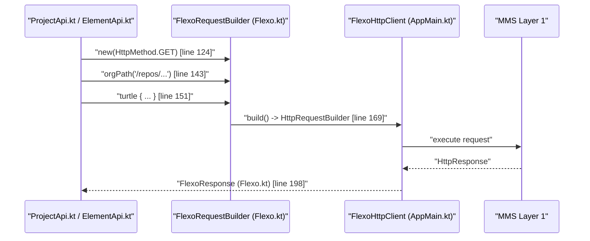

# Page: System Architecture

# System Architecture

<details>
<summary>Relevant source files</summary>

The following files were used as context for generating this wiki page:

- [Dockerfile](Dockerfile)
- [README.md](README.md)
- [docker-compose/env/flexo-sysmlv2.env](docker-compose/env/flexo-sysmlv2.env)
- [settings.gradle.kts](settings.gradle.kts)
- [src/main/kotlin/org/openmbee/flexo/sysmlv2/AppMain.kt](src/main/kotlin/org/openmbee/flexo/sysmlv2/AppMain.kt)
- [src/main/kotlin/org/openmbee/flexo/sysmlv2/Flexo.kt](src/main/kotlin/org/openmbee/flexo/sysmlv2/Flexo.kt)

</details>


The `flexo-mms-sysmlv2` service is designed as a specialized SysML v2 API adapter that sits on top of the Flexo MMS Layer 1 architecture. It translates SysML v2 RESTful requests into RDF-based operations (SPARQL and Turtle) executed against a Flexo backend. The system is built using Kotlin and the Ktor framework, leveraging Apache Jena for RDF manipulation and graph traversal.

### High-Level Component Overview

The architecture is divided into three primary layers: the **API Routing Layer**, the **Flexo Backend Client Layer**, and the **Data Transformation Layer**.

1.  **API Routing Layer**: Handles incoming HTTP requests using Ktor Resources for type-safe routing. It manages serialization of SysML v2 JSON models and maps incoming URL parameters to internal logic.
2.  **Flexo Backend Client Layer**: Encapsulates the communication with the underlying MMS Layer 1. It provides DSLs for building SPARQL queries and Turtle payloads, manages authentication, and handles the HTTP lifecycle for upstream requests.
3.  **Data Transformation Layer**: Uses Apache Jena to bridge the gap between the RDF graph data stored in the triplestore and the JSON-LD/Plain JSON structures required by the SysML v2 specification.

#### Request Pipeline Diagram
This diagram illustrates how a request flows from the external SysML v2 client through the internal components to the Flexo Backend.

```mermaid
graph TD
    subgraph "Ktor Application Space"
        [ExternalClientRequest] --> [Routing_Paths_kt]
        [Routing_Paths_kt] --> [API_Implementation_e_g_ProjectApi_kt]
        [API_Implementation_e_g_ProjectApi_kt] --> [FlexoRequestBuilder_Flexo_kt]
        [FlexoRequestBuilder_Flexo_kt] --> [FlexoHttpClient_AppMain_kt]
    end

    subgraph "Flexo MMS Layer 1"
        [FlexoHttpClient_AppMain_kt] --> [MMS_Layer_1_API]
        [MMS_Layer_1_API] --> [RDF_Quad_Store]
    end

    [API_Implementation_e_g_ProjectApi_kt] -.-> [RDF_Mapping_Namespaces_kt]
    [FlexoRequestBuilder_Flexo_kt] -.-> [Turtle_Sparql_DSL_Flexo_kt]
```

**Sources:** [src/main/kotlin/org/openmbee/flexo/sysmlv2/AppMain.kt:75-87](), [src/main/kotlin/org/openmbee/flexo/sysmlv2/Flexo.kt:124-168]()

---

### Application Bootstrap and Configuration

The service entry point is defined in `AppMain.kt`, which initializes the Ktor application and configures the `GlobalFlexoConfig` object [src/main/kotlin/org/openmbee/flexo/sysmlv2/AppMain.kt:22-28](). This configuration is populated from environment variables (e.g., `FLEXO_HOST`, `FLEXO_PORT`) via the `Application.flexoConfig` extension property [src/main/kotlin/org/openmbee/flexo/sysmlv2/AppMain.kt:114-124](). The bootstrap process installs critical plugins such as `ContentNegotiation` for JSON handling and `Resources` for type-safe routing [src/main/kotlin/org/openmbee/flexo/sysmlv2/AppMain.kt:44-60]().

For details, see [Application Bootstrap and Configuration](#2.1).

**Sources:** [src/main/kotlin/org/openmbee/flexo/sysmlv2/AppMain.kt:22-33](), [src/main/kotlin/org/openmbee/flexo/sysmlv2/AppMain.kt:101-124]()

---

### Flexo Backend Client Layer

The core of the system's interaction with the MMS is found in `Flexo.kt`. This file defines the `FlexoRequestBuilder`, which facilitates the construction of authenticated requests to the Layer 1 service [src/main/kotlin/org/openmbee/flexo/sysmlv2/Flexo.kt:124-127](). It includes specialized methods for sending RDF data:
*   `turtle { ... }`: Uses `TurtleBuilder` to create `text/turtle` payloads [src/main/kotlin/org/openmbee/flexo/sysmlv2/Flexo.kt:151-155]().
*   `sparqlQuery { ... }`: Uses `SparqlQueryBuilder` for `application/sparql-query` [src/main/kotlin/org/openmbee/flexo/sysmlv2/Flexo.kt:157-161]().
*   `sparqlUpdate { ... }`: Uses `SparqlUpdateBuilder` for `application/sparql-update` [src/main/kotlin/org/openmbee/flexo/sysmlv2/Flexo.kt:163-167]().

The `FlexoResponse` class handles the upstream results, providing a `parseModel` method that uses Apache Jena to parse RDF responses into a `Model` for further processing [src/main/kotlin/org/openmbee/flexo/sysmlv2/Flexo.kt:198-217]().

For details, see [Flexo Backend Client Layer](#2.2).

#### Code Entity Mapping: Request Lifecycle
This diagram bridges the natural language "Request Lifecycle" to specific code entities and line references.



**Sources:** [src/main/kotlin/org/openmbee/flexo/sysmlv2/Flexo.kt:124-217](), [src/main/kotlin/org/openmbee/flexo/sysmlv2/AppMain.kt:22-33]()

---

### RDF Namespaces and Data Model

Data in the system is modeled using RDF. The service centralizes the URI definitions for both the SysML v2 vocabulary and the MMS ontology.
*   **SYSMLV2**: Contains URIs for SysML v2 elements, properties, and types.
*   **MMS**: Contains URIs for MMS-specific concepts like `Org`, `Repo`, `Commit`, and `Branch`.

The system uses a `DEFAULT_PREFIX_MAPPING` to provide a standard set of prefixes used throughout the application to shorten IRIs when generating SPARQL or Turtle via `shortenIri()` [src/main/kotlin/org/openmbee/flexo/sysmlv2/Flexo.kt:55-65]().

For details, see [RDF Namespaces and Prefix Mappings](#2.3).

**Sources:** [src/main/kotlin/org/openmbee/flexo/sysmlv2/Flexo.kt:55-91]()

---

### Routing and Serialization

Routing is handled through Ktor's `Resources` plugin, with route definitions providing type-safe access to path and query parameters [src/main/kotlin/org/openmbee/flexo/sysmlv2/AppMain.kt:60-60](). Serialization is managed by `kotlinx-serialization`, configured in `AppMain.kt` to handle polymorphic SysML v2 types using the `@type` class discriminator and ignoring unknown keys to maintain compatibility with the spec [src/main/kotlin/org/openmbee/flexo/sysmlv2/AppMain.kt:45-50]().

For details, see [Type-Safe Routing and Serialization Infrastructure](#2.4).

**Sources:** [src/main/kotlin/org/openmbee/flexo/sysmlv2/AppMain.kt:44-60](), [src/main/kotlin/org/openmbee/flexo/sysmlv2/AppMain.kt:75-87]()
