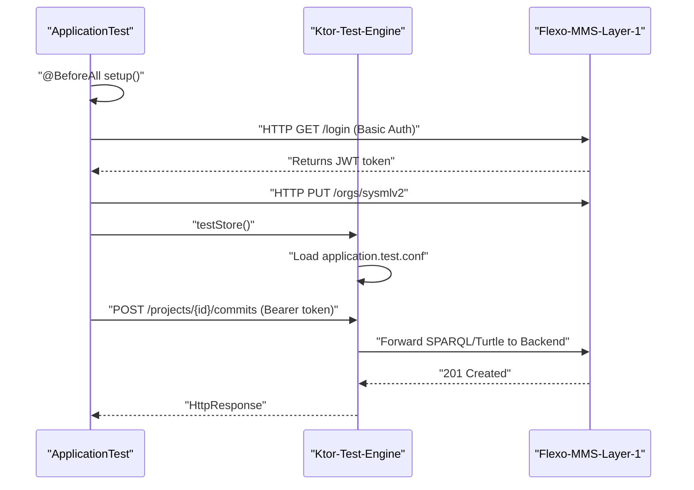

# Page: Testing and API Client Tools

# Testing and API Client Tools

<details>
<summary>Relevant source files</summary>

The following files were used as context for generating this wiki page:

- [docker-compose/flexo-sysmlv2.postman_collection.json](docker-compose/flexo-sysmlv2.postman_collection.json)
- [src/main/kotlin/org/openmbee/flexo/sysmlv2/models/CommitRequest.kt](src/main/kotlin/org/openmbee/flexo/sysmlv2/models/CommitRequest.kt)
- [src/main/kotlin/org/openmbee/flexo/sysmlv2/models/DataVersionRequest.kt](src/main/kotlin/org/openmbee/flexo/sysmlv2/models/DataVersionRequest.kt)
- [src/test/kotlin/org/openmbee/flexo/sysmlv2/ApplicationTest.kt](src/test/kotlin/org/openmbee/flexo/sysmlv2/ApplicationTest.kt)
- [src/test/resources/PartsTreeRedefinition.json](src/test/resources/PartsTreeRedefinition.json)

</details>


This page provides an overview of the testing strategy for the `flexo-mms-sysmlv2` service. The project utilizes a combination of automated integration tests and manual API exploration tools to ensure compliance with the SysML v2 REST API specification and correct interoperation with the Flexo MMS Layer 1 backend.

## Testing Strategy Overview

The testing architecture is designed to validate the transformation pipeline between SysML v2 JSON-LD payloads and the underlying RDF triplestore managed by Flexo MMS. 

### Automated Integration Tests
The primary test suite is located in `ApplicationTest.kt`. These tests use the Ktor `testApplication` engine to bootstrap the service with a test configuration and execute requests against a simulated or live environment.

Key components of the integration tests include:
*   **Service Bootstrapping**: Uses `ApplicationConfig("application.test.conf")` to initialize the Ktor pipeline [src/test/kotlin/org/openmbee/flexo/sysmlv2/ApplicationTest.kt:24-27]().
*   **Fixture Loading**: Large SysML v2 model payloads, such as `PartsTreeRedefinition.json`, are loaded from resources to test complex commit scenarios [src/test/kotlin/org/openmbee/flexo/sysmlv2/ApplicationTest.kt:29-30](), [src/test/resources/PartsTreeRedefinition.json:1-5]().
*   **Authentication Setup**: The `@BeforeAll` block handles automated login to a local Flexo MMS instance (typically on port 8082) to acquire a JWT `token`, which is then used for subsequent authorized requests [src/test/kotlin/org/openmbee/flexo/sysmlv2/ApplicationTest.kt:129-147]().
*   **Environment Preparation**: Tests automatically ensure the required `sysmlv2` organization and target repositories exist in the backend before running model operations [src/test/kotlin/org/openmbee/flexo/sysmlv2/ApplicationTest.kt:150-168]().

For details on test configuration and running fixtures, see [Integration Tests](#6.1).

### Manual Testing and Exploration
For ad-hoc testing and API exploration, the repository includes pre-configured collections for Postman and Bruno. These collections mirror the SysML v2 API structure and include variables for common parameters like `projectId` and `commitId`.

## API Client Tools

The codebase provides two primary sets of API collections to facilitate development and manual verification.

### Postman Collection
The file `flexo-sysmlv2.postman_collection.json` contains a comprehensive set of requests. It includes:
*   **Variable Management**: Post-request scripts automatically extract IDs from JSON responses (e.g., `projectId`, `defaultBranchId`) and update collection variables for use in subsequent requests [docker-compose/flexo-sysmlv2.postman_collection.json:71-76]().
*   **Authentication**: Configured for Bearer Token authentication using a shared JWT [docker-compose/flexo-sysmlv2.postman_collection.json:24-33]().
*   **Example Payloads**: Includes complex `CommitRequest` bodies containing multiple `DataVersion` objects for testing the SysML v2 commit logic [docker-compose/flexo-sysmlv2.postman_collection.json:208-230]().

### Bruno Collection
A modern, git-friendly alternative to Postman is provided in the `bruno/` directory. This collection allows developers to execute the same workflows as the Postman collection but with a local-first, filesystem-based approach that is easier to track in version control.

For details on setting up variables and authentication in these tools, see [Postman and Bruno API Collections](#6.2).

## Data Flow: From Test to Code

The following diagrams illustrate how testing entities and client tools interact with the core code classes during a typical test execution.

### Test Payload to Request Model Mapping
This diagram shows how a JSON fixture used in a test or Postman request maps to the internal Kotlin data models.

```mermaid
graph TD
    subgraph "Natural-Language-JSON-Space"
        ["PartsTreeRedefinition.json"]
        ["'change'-array-in-JSON"]
    end

    subgraph "Code-Entity-Space"
        CommitRequest["CommitRequest"]
        DataVersionRequest["DataVersionRequest"]
        DataIdentityRequest["DataIdentityRequest"]
    end

    ["PartsTreeRedefinition.json"] -- "Deserialized into" --> CommitRequest
    ["'change'-array-in-JSON"] -- "Maps to List of" --> DataVersionRequest
    DataVersionRequest -- "Contains" --> DataIdentityRequest
```
**Sources:** [src/main/kotlin/org/openmbee/flexo/sysmlv2/models/CommitRequest.kt:30-35](), [src/main/kotlin/org/openmbee/flexo/sysmlv2/models/DataVersionRequest.kt:30-35](), [src/main/kotlin/org/openmbee/flexo/sysmlv2/models/DataVersionRequest.kt:21-21]()

### Integration Test Lifecycle
This diagram illustrates the sequence of operations performed by `ApplicationTest.kt` to validate the system against a Layer 1 backend.


**Sources:** [src/test/kotlin/org/openmbee/flexo/sysmlv2/ApplicationTest.kt:24-35](), [src/test/kotlin/org/openmbee/flexo/sysmlv2/ApplicationTest.kt:129-170]()

## Summary Table of Testing Tools

| Tool | Location | Primary Purpose |
| :--- | :--- | :--- |
| **JUnit 5 / Ktor Test** | `src/test/kotlin/...` | Automated regression and integration testing of the routing and RDF logic. |
| **Postman** | `docker-compose/flexo-sysmlv2.postman_collection.json` | Manual UI-based API exploration and workflow testing. |
| **Bruno** | `bruno/` | Filesystem-based API client for collaborative development. |
| **JSON Fixtures** | `src/test/resources/` | Standardized SysML v2 model fragments for consistent test data. |

**Sources:** [src/test/kotlin/org/openmbee/flexo/sysmlv2/ApplicationTest.kt:1-21](), [docker-compose/flexo-sysmlv2.postman_collection.json:1-8](), [src/test/resources/PartsTreeRedefinition.json:1-5]()
