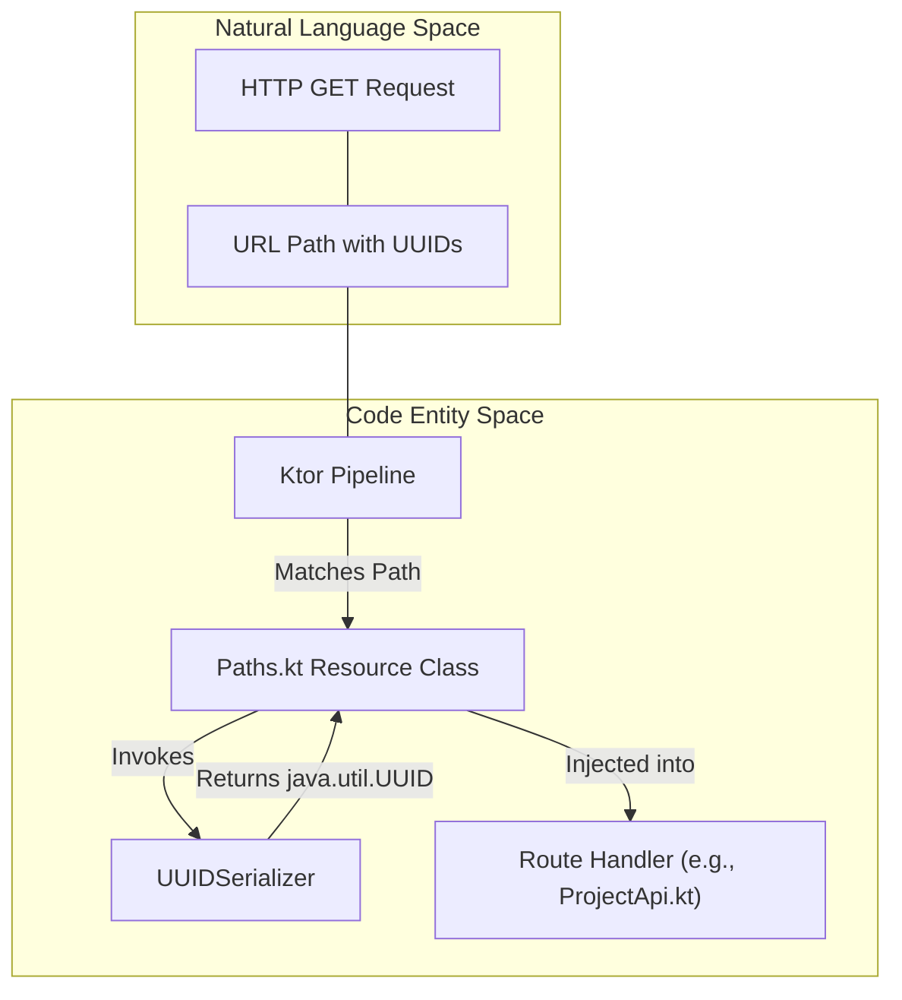
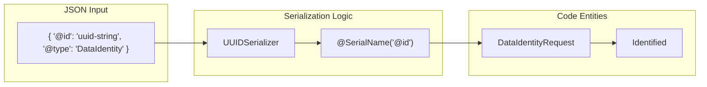

# Page: Type-Safe Routing and Serialization Infrastructure

# Type-Safe Routing and Serialization Infrastructure

Relevant source files

The following files were used as context for generating this wiki page:

- [src/main/kotlin/org/openmbee/flexo/sysmlv2/Paths.kt](src/main/kotlin/org/openmbee/flexo/sysmlv2/Paths.kt)
- [src/main/kotlin/org/openmbee/flexo/sysmlv2/RdfPrefixes.kt](src/main/kotlin/org/openmbee/flexo/sysmlv2/RdfPrefixes.kt)
- [src/main/kotlin/org/openmbee/flexo/sysmlv2/infrastructure/Serializers.kt](src/main/kotlin/org/openmbee/flexo/sysmlv2/infrastructure/Serializers.kt)
- [src/main/kotlin/org/openmbee/flexo/sysmlv2/models/DataIdentityRequest.kt](src/main/kotlin/org/openmbee/flexo/sysmlv2/models/DataIdentityRequest.kt)
- [src/main/kotlin/org/openmbee/flexo/sysmlv2/models/Identified.kt](src/main/kotlin/org/openmbee/flexo/sysmlv2/models/Identified.kt)

This section details the infrastructure supporting type-safe API routing and JSON serialization within the flexo-mms-sysmlv2 service. The system leverages Ktor’s Resources plugin for type-safe routing and `kotlinx-serialization` for handling complex data types like UUIDs and URIs, as well as polymorphic SysML v2 models.

## Type-Safe Routing with Ktor Resources

The service uses the Ktor Resources plugin to define API endpoints as type-safe Kotlin classes. This ensures that parameters (such as `projectId` or `commitId`) are automatically parsed and validated into their respective types (e.g., `java.util.UUID`) before reaching the route handler.

### Path Definitions

All routes are defined within the `Paths` object in [src/main/kotlin/org/openmbee/flexo/sysmlv2/Paths.kt:22-22](). Each route is represented by a class annotated with `@Resource` and `@Serializable`.

| API Operation | Path Pattern | Resource Class |
| :--- | :--- | :--- |
| Get Project | `/projects/{projectId}` | `getProjectById` [src/main/kotlin/org/openmbee/flexo/sysmlv2/Paths.kt:226-226]() |
| List Branches | `/projects/{projectId}/branches` | `getBranchesByProject` [src/main/kotlin/org/openmbee/flexo/sysmlv2/Paths.kt:39-39]() |
| Get Element | `/projects/{projectId}/commits/{commitId}/elements/{elementId}` | `getElementByProjectCommitId` [src/main/kotlin/org/openmbee/flexo/sysmlv2/Paths.kt:138-138]() |
| Create Commit | `/projects/{projectId}/commits` | `postCommitByProject` [src/main/kotlin/org/openmbee/flexo/sysmlv2/Paths.kt:102-102]() |

### Serialization Integration
The `Paths.kt` file applies custom serializers globally to all path parameters using the `@file:UseSerializers` annotation [src/main/kotlin/org/openmbee/flexo/sysmlv2/Paths.kt:12-12](). This allows the Ktor routing engine to handle `java.util.UUID` and `java.net.URI` types directly in the constructor of the Resource classes.

**Sources:**
- [src/main/kotlin/org/openmbee/flexo/sysmlv2/Paths.kt:12-226]()

## Custom Serializers

To bridge the gap between SysML v2 data types and JSON representations, the service implements custom serializers for Java standard library types in [src/main/kotlin/org/openmbee/flexo/sysmlv2/infrastructure/Serializers.kt]().

### UUIDSerializer
The `UUIDSerializer` handles the conversion between `java.util.UUID` objects and their canonical string representation in JSON.
- **Location:** `org.openmbee.flexo.sysmlv2.infrastructure.UUIDSerializer` [src/main/kotlin/org/openmbee/flexo/sysmlv2/infrastructure/Serializers.kt:35-35]()
- **Behavior:** It uses `UUID.fromString()` for deserialization [src/main/kotlin/org/openmbee/flexo/sysmlv2/infrastructure/Serializers.kt:39-39]() and `encoder.encodeString(value.toString())` for serialization [src/main/kotlin/org/openmbee/flexo/sysmlv2/infrastructure/Serializers.kt:43-43]().

### URISerializer
The `URISerializer` manages `java.net.URI` types, ensuring that IRIs used within the SysML v2 model are correctly formatted as strings in JSON payloads.
- **Location:** `org.openmbee.flexo.sysmlv2.infrastructure.URISerializer` [src/main/kotlin/org/openmbee/flexo/sysmlv2/infrastructure/Serializers.kt:24-24]()
- **Behavior:** It wraps `URI.create()` [src/main/kotlin/org/openmbee/flexo/sysmlv2/infrastructure/Serializers.kt:28-28]() and `value.toString()` [src/main/kotlin/org/openmbee/flexo/sysmlv2/infrastructure/Serializers.kt:32-32]().

### Additional Serializers
- **OffsetDateTimeSerializer**: Handles ISO-8601 date-time strings [src/main/kotlin/org/openmbee/flexo/sysmlv2/infrastructure/Serializers.kt:13-23]().
- **BigDecimalSerializer**: Handles high-precision decimal numbers [src/main/kotlin/org/openmbee/flexo/sysmlv2/infrastructure/Serializers.kt:46-56]().

**Sources:**
- [src/main/kotlin/org/openmbee/flexo/sysmlv2/infrastructure/Serializers.kt:1-56]()
- [src/main/kotlin/org/openmbee/flexo/sysmlv2/Paths.kt:12-21]()

## JSON Configuration and Data Transformation

The `kotlinx-serialization` engine is used to transform JSON payloads into Kotlin Data Classes. Many models, such as `Identified` [src/main/kotlin/org/openmbee/flexo/sysmlv2/models/Identified.kt:27-30]() and `DataIdentityRequest` [src/main/kotlin/org/openmbee/flexo/sysmlv2/models/DataIdentityRequest.kt:28-33](), explicitly register `UUIDSerializer` via the `@file:UseSerializers` annotation [src/main/kotlin/org/openmbee/flexo/sysmlv2/models/Identified.kt:12-12]().

### RDF Property Mapping

Beyond standard JSON serialization, the service utilizes `PrefixedRdfPropertiesMap` [src/main/kotlin/org/openmbee/flexo/sysmlv2/RdfPrefixes.kt:10-13]() to handle the transition from RDF data (from the triplestore) to JSON-compatible structures. This class allows looking up RDF nodes using prefixed CURIE strings via the `at()` function [src/main/kotlin/org/openmbee/flexo/sysmlv2/RdfPrefixes.kt:15-17](), which resolves keys using `prefixes.expandPrefix(key)` [src/main/kotlin/org/openmbee/flexo/sysmlv2/RdfPrefixes.kt:26-26]().

### Data Flow: Request to Resource

The following diagram illustrates how a raw HTTP request is transformed into a type-safe Resource object.

**Request Transformation Pipeline**

**Sources:**
- [src/main/kotlin/org/openmbee/flexo/sysmlv2/Paths.kt:12-29]()
- [src/main/kotlin/org/openmbee/flexo/sysmlv2/infrastructure/Serializers.kt:35-45]()
- [src/main/kotlin/org/openmbee/flexo/sysmlv2/RdfPrefixes.kt:10-29]()

## Polymorphic Serialization and Metadata

The SysML v2 specification relies on polymorphism where elements are identified by types. Models use `@SerialName` to map JSON keys like `@id` or `@type` to Kotlin properties.

| JSON Field | Kotlin Property | Model Example |
| :--- | :--- | :--- |
| `@id` | `atId` | `Identified` [src/main/kotlin/org/openmbee/flexo/sysmlv2/models/Identified.kt:29-29]() |
| `@type` | `atType` | `DataIdentityRequest` [src/main/kotlin/org/openmbee/flexo/sysmlv2/models/DataIdentityRequest.kt:32-32]() |

### Serialization Mapping
The following diagram bridges the JSON structure to the internal Kotlin models.

**Serialization Mapping**

**Sources:**
- [src/main/kotlin/org/openmbee/flexo/sysmlv2/models/Identified.kt:12-30]()
- [src/main/kotlin/org/openmbee/flexo/sysmlv2/models/DataIdentityRequest.kt:12-42]()
- [src/main/kotlin/org/openmbee/flexo/sysmlv2/infrastructure/Serializers.kt:1-56]()
