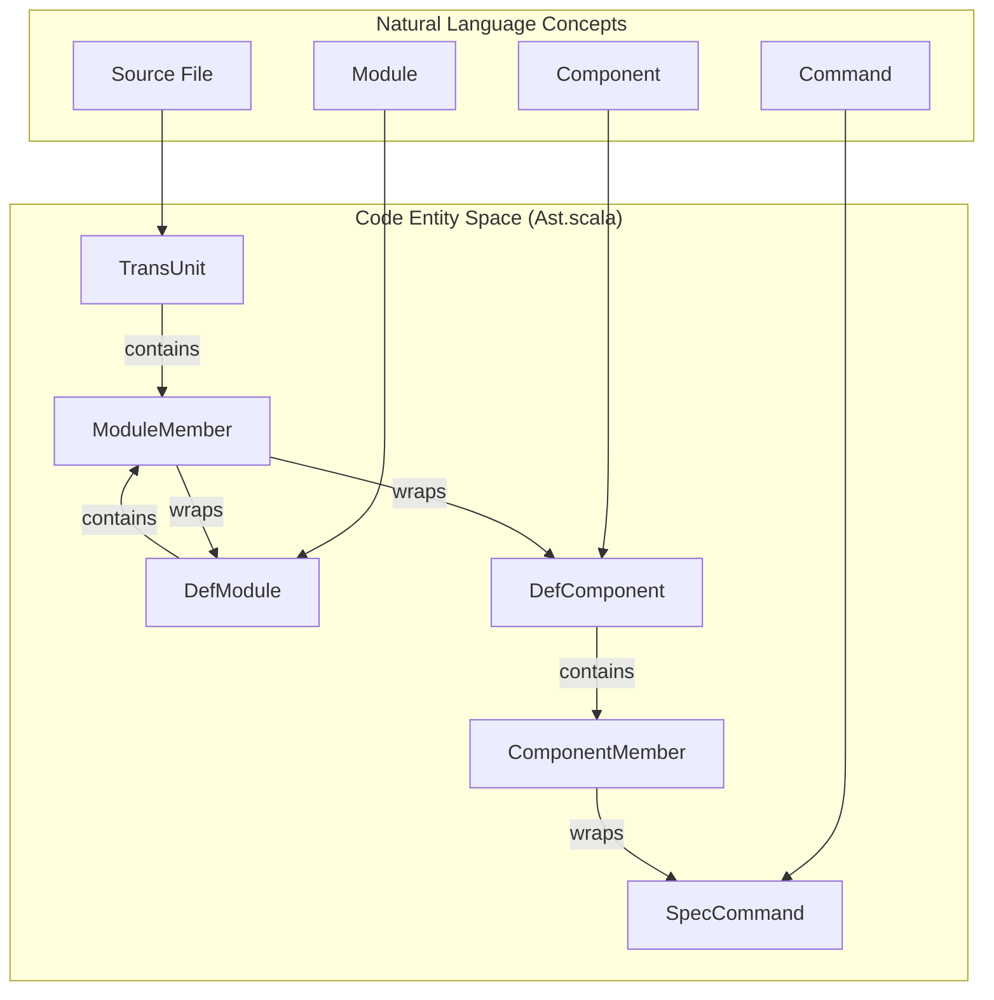
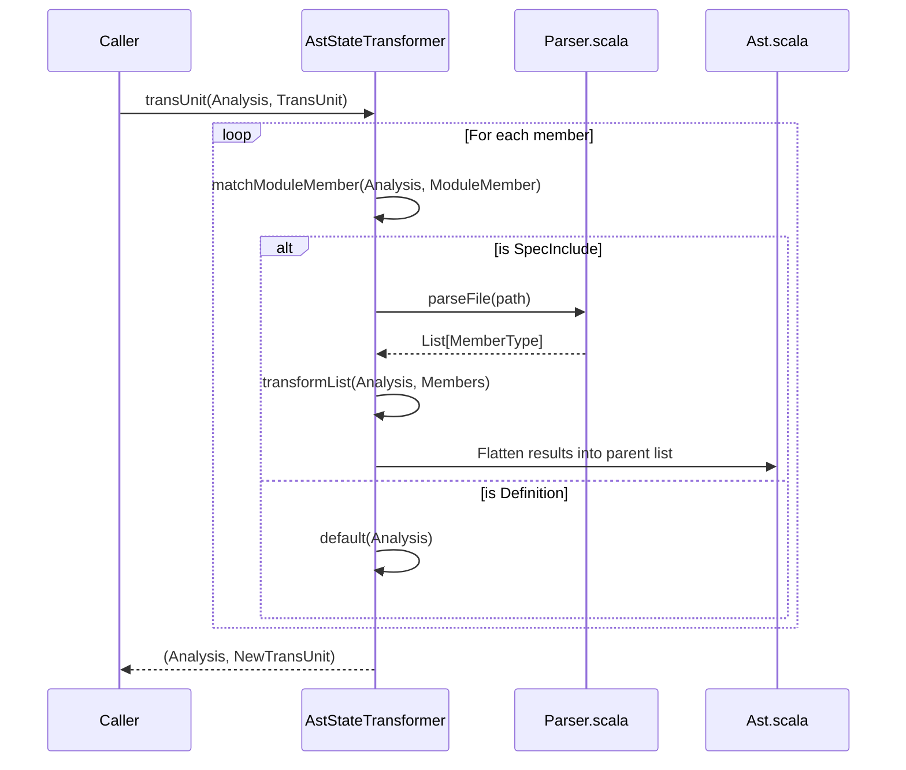

# Page: Abstract Syntax Tree (AST)

# Abstract Syntax Tree (AST)

Relevant source files

The following files were used as context for generating this wiki page:

- [compiler/lib/src/main/scala/ast/Ast.scala](compiler/lib/src/main/scala/ast/Ast.scala)
- [compiler/lib/src/main/scala/ast/AstStateTransformer.scala](compiler/lib/src/main/scala/ast/AstStateTransformer.scala)
- [compiler/lib/src/main/scala/ast/AstTransformer.scala](compiler/lib/src/main/scala/ast/AstTransformer.scala)
- [compiler/lib/src/main/scala/ast/AstVisitor.scala](compiler/lib/src/main/scala/ast/AstVisitor.scala)
- [compiler/lib/src/main/scala/ast/ComponentStateTransformer.scala](compiler/lib/src/main/scala/ast/ComponentStateTransformer.scala)
- [compiler/lib/src/main/scala/ast/ModuleStateTransformer.scala](compiler/lib/src/main/scala/ast/ModuleStateTransformer.scala)
- [compiler/lib/src/main/scala/ast/StateMachineStateTransformer.scala](compiler/lib/src/main/scala/ast/StateMachineStateTransformer.scala)
- [compiler/lib/src/main/scala/ast/TopologyStateTransformer.scala](compiler/lib/src/main/scala/ast/TopologyStateTransformer.scala)
- [compiler/lib/src/main/scala/codegen/AstWriter.scala](compiler/lib/src/main/scala/codegen/AstWriter.scala)
- [compiler/lib/src/main/scala/codegen/FppWriter.scala](compiler/lib/src/main/scala/codegen/FppWriter.scala)
- [compiler/lib/src/main/scala/syntax/Lexer.scala](compiler/lib/src/main/scala/syntax/Lexer.scala)
- [compiler/lib/src/main/scala/syntax/Parser.scala](compiler/lib/src/main/scala/syntax/Parser.scala)
- [compiler/lib/src/main/scala/syntax/Token.scala](compiler/lib/src/main/scala/syntax/Token.scala)
- [compiler/lib/src/main/scala/transform/AddStateEnums.scala](compiler/lib/src/main/scala/transform/AddStateEnums.scala)
- [compiler/lib/src/main/scala/transform/ResolveSpecInclude.scala](compiler/lib/src/main/scala/transform/ResolveSpecInclude.scala)
- [compiler/lib/src/main/scala/util/Version.scala](compiler/lib/src/main/scala/util/Version.scala)
- [compiler/lib/src/test/scala/syntax/Parser.scala](compiler/lib/src/test/scala/syntax/Parser.scala)
- [compiler/tools/fpp-format/test/include.ref.txt](compiler/tools/fpp-format/test/include.ref.txt)
- [compiler/tools/fpp-format/test/no_include.ref.txt](compiler/tools/fpp-format/test/no_include.ref.txt)
- [compiler/tools/fpp-format/test/state_machine.ref.txt](compiler/tools/fpp-format/test/state_machine.ref.txt)
- [compiler/tools/fpp-syntax/test/.gitignore](compiler/tools/fpp-syntax/test/.gitignore)
- [compiler/tools/fpp-syntax/test/include-constant-1.ref.txt](compiler/tools/fpp-syntax/test/include-constant-1.ref.txt)
- [compiler/tools/fpp-syntax/test/state-machine.fpp](compiler/tools/fpp-syntax/test/state-machine.fpp)
- [compiler/tools/fpp-syntax/test/state-machine.ref.txt](compiler/tools/fpp-syntax/test/state-machine.ref.txt)
- [compiler/tools/fpp-syntax/test/syntax-ast.ref.txt](compiler/tools/fpp-syntax/test/syntax-ast.ref.txt)
- [compiler/tools/fpp-syntax/test/syntax-include-ast.ref.txt](compiler/tools/fpp-syntax/test/syntax-include-ast.ref.txt)
- [compiler/tools/fpp-syntax/test/syntax-stdin.ref.txt](compiler/tools/fpp-syntax/test/syntax-stdin.ref.txt)
- [compiler/tools/fpp-syntax/test/syntax.fpp](compiler/tools/fpp-syntax/test/syntax.fpp)
- [compiler/tools/fpp-syntax/test/two-input-files.ref.txt](compiler/tools/fpp-syntax/test/two-input-files.ref.txt)
- [docs/spec/Definitions/Port-Definitions.adoc](docs/spec/Definitions/Port-Definitions.adoc)
- [docs/spec/Expressions/String-Literals.adoc](docs/spec/Expressions/String-Literals.adoc)
- [docs/spec/Specifiers/Init-Specifiers.adoc](docs/spec/Specifiers/Init-Specifiers.adoc)
- [docs/spec/Specifiers/Internal-Port-Specifiers.adoc](docs/spec/Specifiers/Internal-Port-Specifiers.adoc)
- [docs/spec/Specifiers/State-Machine-Instance-Specifiers.adoc](docs/spec/Specifiers/State-Machine-Instance-Specifiers.adoc)

The Abstract Syntax Tree (AST) is the central data model for the FPP compiler. It represents the structural content of FPP source files after parsing, but before semantic analysis. The AST is composed of immutable case classes that mirror the formal grammar of the FPP language.

## Data Model Implementation

The AST is defined primarily in `Ast.scala`. It uses a recursive structure where high-level constructs (like modules or components) contain lists of member nodes.

### The AstNode Wrapper
Most elements in the AST are wrapped in an `AstNode[T]` [compiler/lib/src/main/scala/ast/Ast.scala:54-72](). This wrapper associates a specific piece of syntax with its source code location (file and coordinates), which is critical for error reporting during subsequent analysis phases.

### Annotated Type Alias
FPP supports both pre-annotations (`@`) and post-annotations (`@<`). To preserve these comments for tools like `fpp-format` or documentation generators, the AST uses the `Annotated` type alias:
`type Annotated[T] = (List[String], T, List[String])` [compiler/lib/src/main/scala/ast/Ast.scala:8-8]().
The first list contains pre-annotations, the middle element is the AST node itself, and the last list contains post-annotations.

### Core Constructs
The following table maps FPP language definitions to their corresponding Scala case classes in the `Ast` object:

| FPP Construct | AST Case Class | Key Fields |
| :--- | :--- | :--- |
| **Translation Unit** | `TransUnit` | `members: List[TUMember]` |
| **Module** | `DefModule` | `name: Ident`, `members: List[ModuleMember]` |
| **Component** | `DefComponent` | `kind: ComponentKind`, `name: Ident`, `members: List[ComponentMember]` |
| **Topology** | `DefTopology` | `name: Ident`, `members: List[TopologyMember]` |
| **Port** | `DefPort` | `name: Ident`, `params: FormalParamList`, `returnType: Option[AstNode[TypeName]]` |
| **State Machine** | `DefStateMachine` | `name: Ident`, `members: Option[List[StateMachineMember]]` |
| **Constant** | `DefConstant` | `name: Ident`, `value: AstNode[Expr]`, `isDictionaryDef: Boolean` |

Sources: [compiler/lib/src/main/scala/ast/Ast.scala:17-17](), [compiler/lib/src/main/scala/ast/Ast.scala:96-100](), [compiler/lib/src/main/scala/ast/Ast.scala:139-142](), [compiler/lib/src/main/scala/ast/Ast.scala:166-170](), [compiler/lib/src/main/scala/ast/Ast.scala:173-176]().

## AST Structure Overview

The following diagram illustrates how natural language concepts in FPP are mapped to the recursive code entities in the `Ast` object.

**AST Entity Mapping**

Sources: [compiler/lib/src/main/scala/ast/Ast.scala:17-17](), [compiler/lib/src/main/scala/ast/Ast.scala:51-73](), [compiler/lib/src/main/scala/ast/Ast.scala:145-163]().

## Traversal and Transformation

The FPP compiler provides three primary traits for interacting with the AST. These traits use the Visitor pattern to decouple the tree structure from the logic performed on it.

### 1. AstVisitor
`AstVisitor` is used for read-only traversals (e.g., code generation or syntax checking). It defines `In` and `Out` types for passing data down and returning results up the tree [compiler/lib/src/main/scala/ast/AstVisitor.scala:4-9]().
*   **Implementation:** Tools like `FppWriter` [compiler/lib/src/main/scala/codegen/FppWriter.scala:9-9]() and `AstWriter` [compiler/lib/src/main/scala/codegen/AstWriter.scala:8-8]() extend this trait to convert the AST back into FPP source or a debug representation.

### 2. AstTransformer
`AstTransformer` is used for tree-to-tree transformations where the structure of the tree might change but the overall types remain AST nodes [compiler/lib/src/main/scala/ast/AstTransformer.scala:6-10]().

### 3. AstStateTransformer
This trait is a specialized version of the transformer that threads a state object (usually `Analysis`) through the transformation [compiler/lib/src/main/scala/transform/ResolveSpecInclude.scala:9-14](). It is used for complex passes like `ResolveSpecInclude`, which flattens `include` specifiers by parsing external files and injecting their members into the current AST [compiler/lib/src/main/scala/transform/ResolveSpecInclude.scala:146-165]().

**Visitor/Transformer Data Flow**

Sources: [compiler/lib/src/main/scala/transform/ResolveSpecInclude.scala:23-39](), [compiler/lib/src/main/scala/transform/ResolveSpecInclude.scala:146-165](), [compiler/lib/src/main/scala/ast/AstVisitor.scala:147-155]().

## Specialized Member Traits

To handle the recursive nature of nested definitions, the AST uses several internal traits to categorize members:

*   **TUMember:** Members allowed at the top level of a translation unit (aliased to `ModuleMember`) [compiler/lib/src/main/scala/ast/Ast.scala:17-17]().
*   **ModuleMember:** Members allowed inside a `module` block, including nested modules, components, and types [compiler/lib/src/main/scala/ast/Ast.scala:146-163]().
*   **ComponentMember:** Members allowed inside a `component` block, such as `SpecCommand`, `SpecEvent`, and `SpecPortInstance` [compiler/lib/src/main/scala/ast/Ast.scala:51-73]().
*   **TopologyMember:** Members allowed inside a `topology` block, primarily `SpecConnectionGraph` and `SpecInstance` [compiler/lib/src/main/scala/ast/Ast.scala:212-221]().

Sources: [compiler/lib/src/main/scala/ast/Ast.scala:51-73](), [compiler/lib/src/main/scala/ast/Ast.scala:145-163](), [compiler/lib/src/main/scala/ast/Ast.scala:212-221]().
