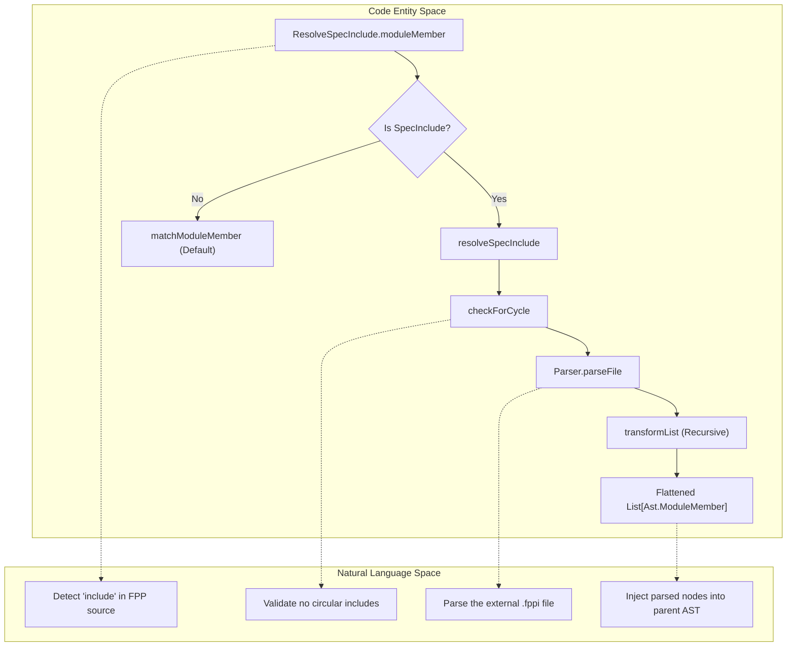
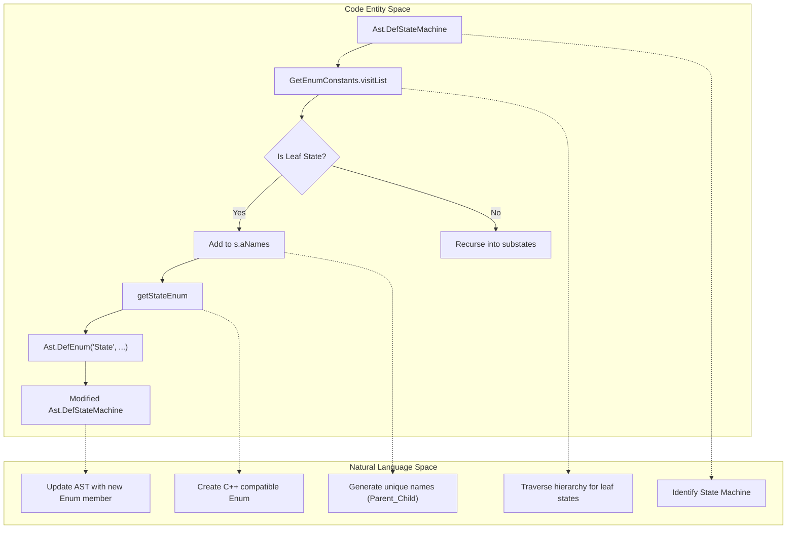

# Page: AST Transforms

# AST Transforms

Relevant source files

The following files were used as context for generating this wiki page:

- [compiler/lib/src/main/scala/ast/AstStateTransformer.scala](compiler/lib/src/main/scala/ast/AstStateTransformer.scala)
- [compiler/lib/src/main/scala/ast/ComponentStateTransformer.scala](compiler/lib/src/main/scala/ast/ComponentStateTransformer.scala)
- [compiler/lib/src/main/scala/ast/ModuleStateTransformer.scala](compiler/lib/src/main/scala/ast/ModuleStateTransformer.scala)
- [compiler/lib/src/main/scala/ast/StateMachineStateTransformer.scala](compiler/lib/src/main/scala/ast/StateMachineStateTransformer.scala)
- [compiler/lib/src/main/scala/ast/TopologyStateTransformer.scala](compiler/lib/src/main/scala/ast/TopologyStateTransformer.scala)
- [compiler/lib/src/main/scala/transform/AddStateEnums.scala](compiler/lib/src/main/scala/transform/AddStateEnums.scala)
- [compiler/lib/src/main/scala/transform/ResolveSpecInclude.scala](compiler/lib/src/main/scala/transform/ResolveSpecInclude.scala)
- [compiler/tools/fpp-syntax/test/.gitignore](compiler/tools/fpp-syntax/test/.gitignore)
- [compiler/tools/fpp-syntax/test/include-constant-1.ref.txt](compiler/tools/fpp-syntax/test/include-constant-1.ref.txt)
- [compiler/tools/fpp-syntax/test/two-input-files.ref.txt](compiler/tools/fpp-syntax/test/two-input-files.ref.txt)

AST transformations are pre-analysis passes that modify the Abstract Syntax Tree (AST) before it undergoes full semantic validation. These passes are used to flatten included files into a single tree and to automatically inject synthetic nodes, such as state enumerations for state machines.

## Transformation Infrastructure

The transformation logic is built upon a hierarchy of traits that extend the base `AstTransformer`. The primary mechanism for stateful transformation is the `AstStateTransformer` trait.

### AstStateTransformer Trait
The `AstStateTransformer` trait provides a framework for threading a state object through the recursive traversal of the AST [compiler/lib/src/main/scala/ast/AstStateTransformer.scala:6-12](). It defines a `State` type and overrides the `transUnit` method to handle the transformation of translation units [compiler/lib/src/main/scala/ast/AstStateTransformer.scala:14-17]().

A key utility is `transformList`, which processes a list of AST nodes in sequence, passing the resulting state from one transformation to the next [compiler/lib/src/main/scala/ast/AstStateTransformer.scala:20-36]().

### Specialized Transformers
To handle specific FPP constructs, the compiler provides specialized traits that override transformation logic for members of components, modules, topologies, and state machines:

| Trait | Purpose |
|-------|---------|
| `ComponentStateTransformer` | Handles transformation of `Ast.ComponentMember` nodes within a component definition [compiler/lib/src/main/scala/ast/ComponentStateTransformer.scala:6-26](). |
| `ModuleStateTransformer` | Handles transformation of `Ast.ModuleMember` nodes within a module definition [compiler/lib/src/main/scala/ast/ModuleStateTransformer.scala:6-27](). |
| `StateMachineStateTransformer` | Handles transformation of `Ast.StateMachineMember` and `Ast.StateMember` nodes [compiler/lib/src/main/scala/ast/StateMachineStateTransformer.scala:6-45](). |
| `TopologyStateTransformer` | Handles transformation of `Ast.TopologyMember`, `Ast.SpecTlmPacket`, and `Ast.SpecTlmPacketSet` [compiler/lib/src/main/scala/ast/TopologyStateTransformer.scala:6-62](). |

**Sources:** [compiler/lib/src/main/scala/ast/AstStateTransformer.scala:6-41](), [compiler/lib/src/main/scala/ast/ComponentStateTransformer.scala:1-26](), [compiler/lib/src/main/scala/ast/ModuleStateTransformer.scala:1-27](), [compiler/lib/src/main/scala/ast/StateMachineStateTransformer.scala:1-45](), [compiler/lib/src/main/scala/ast/TopologyStateTransformer.scala:1-62]().

---

## ResolveSpecInclude

The `ResolveSpecInclude` object is responsible for flattening `include` specifiers. It replaces an `include` node with the parsed content of the referenced file.

### Implementation Details
`ResolveSpecInclude` mixes in all specialized state transformer traits to ensure it can catch `SpecInclude` nodes at any level of the AST (modules, components, state machines, topologies, etc.) [compiler/lib/src/main/scala/transform/ResolveSpecInclude.scala:9-14]().

1.  **Node Detection**: It overrides methods like `componentMember` and `moduleMember` to look for `Ast.ComponentMember.SpecInclude` or `Ast.ModuleMember.SpecInclude` [compiler/lib/src/main/scala/transform/ResolveSpecInclude.scala:30-31](), [compiler/lib/src/main/scala/transform/ResolveSpecInclude.scala:43-44]().
2.  **Path Resolution**: It retrieves the path of the included file relative to the current file's location [compiler/lib/src/main/scala/transform/ResolveSpecInclude.scala:153-154]().
3.  **Cycle Detection**: The `checkForCycle` function prevents infinite recursion by maintaining a list of visited file paths in the `includingLoc` chain [compiler/lib/src/main/scala/transform/ResolveSpecInclude.scala:126-144]().
4.  **Parsing and Recursive Transformation**: It uses `Parser.parseFile` to convert the included file into a list of AST members [compiler/lib/src/main/scala/transform/ResolveSpecInclude.scala:158](). These members are then recursively transformed to handle nested includes [compiler/lib/src/main/scala/transform/ResolveSpecInclude.scala:161]().

### Include Resolution Data Flow
The following diagram illustrates how `ResolveSpecInclude` processes an include specifier within a module.

**Include Resolution Logic**

**Sources:** [compiler/lib/src/main/scala/transform/ResolveSpecInclude.scala:28-165]().

---

## AddStateEnums

The `AddStateEnums` pass automatically generates an internal `enum State` for every state machine definition. This enum contains constants representing all leaf states in the state machine.

### Implementation Details
`AddStateEnums` extends `AstStateTransformer` with a `Unit` state, as it does not need to carry analysis data across nodes [compiler/lib/src/main/scala/transform/AddStateEnums.scala:9-14]().

1.  **State Enumeration**: It uses an internal `GetEnumConstants` visitor to traverse the state machine and collect all leaf states [compiler/lib/src/main/scala/transform/AddStateEnums.scala:59-66]().
2.  **Leaf State Identification**: A state is considered a leaf if it has no substates [compiler/lib/src/main/scala/transform/AddStateEnums.scala:83-84](). The visitor concatenates names with underscores (e.g., `Top_Sub_Leaf`) to create unique enum constant names [compiler/lib/src/main/scala/transform/AddStateEnums.scala:94]().
3.  **Special Constants**: It automatically adds a `__FPRIME_UNINITIALIZED` constant to every generated state enum [compiler/lib/src/main/scala/transform/AddStateEnums.scala:111-114]().
4.  **Type Selection**: The underlying integer type for the enum (U8, U16, or U32) is selected based on the number of leaf states [compiler/lib/src/main/scala/transform/AddStateEnums.scala:42-48]().
5.  **AST Injection**: The generated `DefEnum` is wrapped in a `StateMachineMember` and prepended to the state machine's member list [compiler/lib/src/main/scala/transform/AddStateEnums.scala:31-36]().

### State Machine Enum Injection
The following diagram shows the relationship between the state machine definition and the synthetic enum generation.

**State Enum Generation Process**

**Sources:** [compiler/lib/src/main/scala/transform/AddStateEnums.scala:22-131]().
