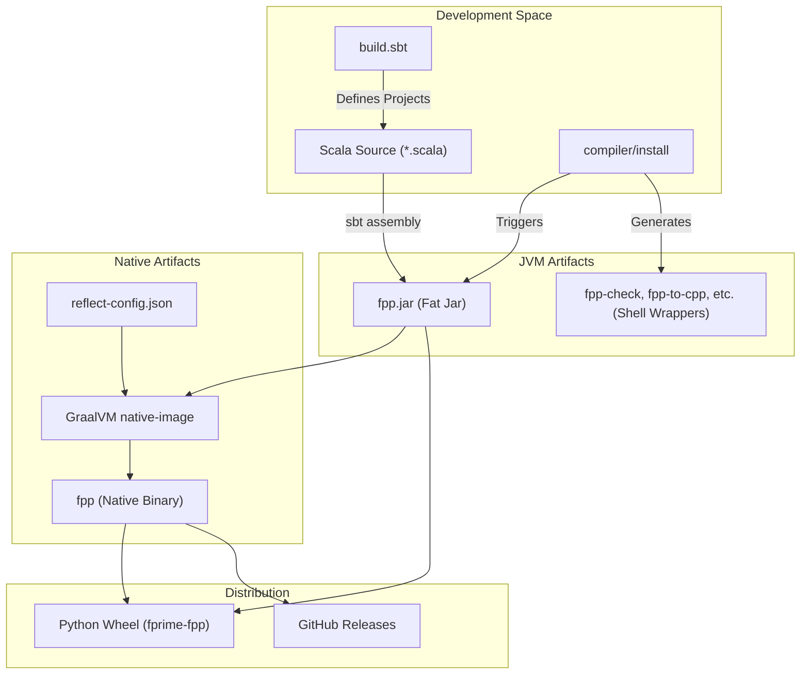
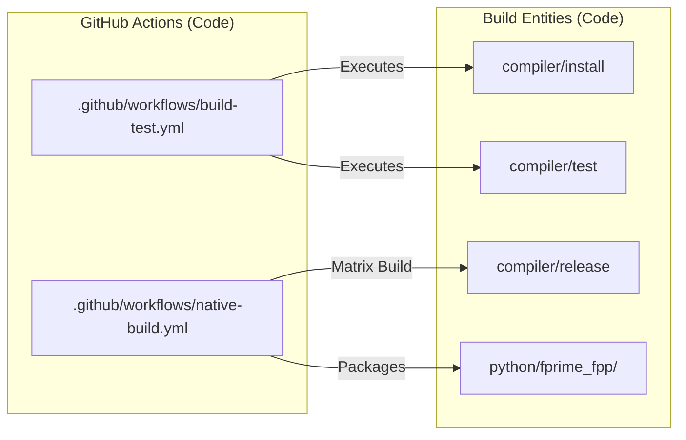

# Page: Build System and CI/CD

# Build System and CI/CD

Relevant source files

The following files were used as context for generating this wiki page:

- [.github/actions/build-native-images/action.yml](.github/actions/build-native-images/action.yml)
- [.github/actions/build-native-images/native-images](.github/actions/build-native-images/native-images)
- [.github/actions/native-tools-setup/action.yml](.github/actions/native-tools-setup/action.yml)
- [.github/actions/native-tools-setup/env-setup](.github/actions/native-tools-setup/env-setup)
- [.github/workflows/build-native.yml](.github/workflows/build-native.yml)
- [.github/workflows/build-test.yml](.github/workflows/build-test.yml)
- [.github/workflows/native-build.yml](.github/workflows/native-build.yml)
- [.github/workflows/publish](.github/workflows/publish)
- [README.adoc](README.adoc)
- [compiler/.jvmopts](compiler/.jvmopts)
- [compiler/README.adoc](compiler/README.adoc)
- [compiler/build.sbt](compiler/build.sbt)
- [compiler/fpp-sbt](compiler/fpp-sbt)
- [compiler/install](compiler/install)
- [compiler/install-trace](compiler/install-trace)
- [compiler/lib/src/main/resources/META-INF/native-image/jni-config.json](compiler/lib/src/main/resources/META-INF/native-image/jni-config.json)
- [compiler/lib/src/main/resources/META-INF/native-image/predefined-classes-config.json](compiler/lib/src/main/resources/META-INF/native-image/predefined-classes-config.json)
- [compiler/lib/src/main/resources/META-INF/native-image/proxy-config.json](compiler/lib/src/main/resources/META-INF/native-image/proxy-config.json)
- [compiler/lib/src/main/resources/META-INF/native-image/reflect-config.json](compiler/lib/src/main/resources/META-INF/native-image/reflect-config.json)
- [compiler/lib/src/main/resources/META-INF/native-image/resource-config.json](compiler/lib/src/main/resources/META-INF/native-image/resource-config.json)
- [compiler/lib/src/main/resources/META-INF/native-image/serialization-config.json](compiler/lib/src/main/resources/META-INF/native-image/serialization-config.json)
- [compiler/lib/src/main/scala/analysis/Semantics/ResolveTopology/ResolvePartiallyNumbered.scala](compiler/lib/src/main/scala/analysis/Semantics/ResolveTopology/ResolvePartiallyNumbered.scala)
- [compiler/lib/src/main/scala/analysis/Semantics/ResolveTopology/ResolveTopologyPortInterface.scala](compiler/lib/src/main/scala/analysis/Semantics/ResolveTopology/ResolveTopologyPortInterface.scala)
- [compiler/lib/src/main/scala/analysis/Semantics/TlmPacketSet.scala](compiler/lib/src/main/scala/analysis/Semantics/TlmPacketSet.scala)
- [compiler/lib/src/main/scala/analysis/Semantics/TopologyPort.scala](compiler/lib/src/main/scala/analysis/Semantics/TopologyPort.scala)
- [compiler/lib/src/main/scala/codegen/CppWriter/ValueCppWriter.scala](compiler/lib/src/main/scala/codegen/CppWriter/ValueCppWriter.scala)
- [compiler/release](compiler/release)
- [compiler/scripts/fprime-gcc](compiler/scripts/fprime-gcc)
- [compiler/tools.txt](compiler/tools.txt)
- [compiler/tools/fpp-check/test/top_ports/interface_instance_not_member.fpp](compiler/tools/fpp-check/test/top_ports/interface_instance_not_member.fpp)
- [compiler/tools/fpp-check/test/top_ports/interface_instance_not_member.ref.txt](compiler/tools/fpp-check/test/top_ports/interface_instance_not_member.ref.txt)
- [compiler/tools/fpp-check/test/top_ports/tests.sh](compiler/tools/fpp-check/test/top_ports/tests.sh)
- [compiler/tools/fpp-to-cpp/test/component/base/ActiveExternalStateMachinesComponentAc.ref.cpp](compiler/tools/fpp-to-cpp/test/component/base/ActiveExternalStateMachinesComponentAc.ref.cpp)
- [compiler/trace-fprime](compiler/trace-fprime)
- [defs.sh](defs.sh)
- [docs/index/defs.sh](docs/index/defs.sh)
- [docs/index/index.adoc](docs/index/index.adoc)
- [docs/users-guide/Defining-Ports.adoc](docs/users-guide/Defining-Ports.adoc)
- [pyproject.toml](pyproject.toml)
- [python/fprime_fpp/__init__.py](python/fprime_fpp/__init__.py)
- [python/fprime_fpp/__main__.py](python/fprime_fpp/__main__.py)
- [version.sh](version.sh)

This page provides a high-level overview of the FPP build infrastructure, which supports both a Java Virtual Machine (JVM) development path and a GraalVM-based native binary distribution path. The system is designed to provide high-performance compilers across multiple platforms while maintaining a streamlined development workflow using Scala and `sbt`.

## Overview of the Build Pipeline

The FPP build system transitions from Scala source code to cross-platform native binaries and Python wheels through a multi-stage process involving `sbt`, GraalVM `native-image`, and GitHub Actions.

### Build Artifact Flow

The following diagram illustrates how source code is transformed into the final distributed artifacts.

**FPP Artifact Pipeline**

**Sources:** [compiler/build.sbt:28-42](), [compiler/install:75-100](), [compiler/release:92-116]().

---

## SBT Project Structure and JVM Build

The core of the FPP compiler is a multi-project `sbt` build. It is divided into a core library (`lib`) containing the frontend and semantic analysis logic, and a set of command-line tools (under `tools/`) that provide the user interface.

*   **build.sbt**: Defines the `root`, `lib`, and `fpp` projects, including dependencies like `scopt` for CLI parsing and `circe` for JSON handling [compiler/build.sbt:18-42]().
*   **install script**: A shell script that automates the assembly of the "fat jar" and creates shell wrappers for each tool [compiler/install:1-101]().
*   **fpp-sbt**: A wrapper script that ensures `sbt` runs with the correct Java version and memory settings [compiler/fpp-sbt:1-10]().

For details on local development, Scala testing, and the JVM-based toolchain, see **[SBT Project Structure and JVM Build](#5.1)**.

**Sources:** [compiler/build.sbt:1-42](), [compiler/install:84-100](), [compiler/README.adoc:30-46]().

---

## GraalVM Native Image Pipeline

To eliminate JVM startup overhead and simplify distribution, FPP uses GraalVM `native-image` to compile the `fpp.jar` into a standalone native binary.

*   **Reflection Configuration**: Since the compiler uses reflection (e.g., for JSON encoding with `circe`), configuration files like `reflect-config.json` are required for the native image build [compiler/lib/src/main/resources/META-INF/native-image/reflect-config.json:1-128]().
*   **Tracing Agent**: The `install-trace` and `trace-fprime` scripts run the JVM version of the compiler through the test suite with a tracing agent to automatically generate these configuration files [compiler/README.adoc:176-216]().
*   **Release Script**: The `compiler/release` script orchestrates the native build, creating a platform-specific binary (e.g., `native-fpp-Linux-x86_64`) [compiler/release:57-116]().

**Sources:** [compiler/release:1-161](), [compiler/README.adoc:122-174](), [compiler/lib/src/main/resources/META-INF/native-image/reflect-config.json:1-100]().

---

## CI/CD and Distribution

FPP uses GitHub Actions to automate testing and cross-platform distribution.

### CI/CD Workflow Association
The following diagram bridges the CI configuration to the specific scripts and tools they execute.

**CI/CD Entity Mapping**

**Sources:** [.github/workflows/build-test.yml:31-41](), [.github/workflows/native-build.yml:171-201]().

### Distribution Channels
1.  **GitHub Releases**: Native binaries for macOS (ARM/Intel) and Linux (x86_64/aarch64) are attached to releases [.github/workflows/native-build.yml:92-113]().
2.  **Python Wheels**: The `fprime-fpp` package bundles the native binaries (or the JAR for generic platforms). A dispatch logic in `python/fprime_fpp/__main__.py` ensures the correct tool is invoked when running commands like `fpp-check` [.github/workflows/native-build.yml:171-201]().

For details on the native image configuration, the GitHub Actions matrix, and the Python packaging logic, see **[GraalVM Native Image and Python Distribution](#5.2)**.

**Sources:** [.github/workflows/native-build.yml:1-201](), [compiler/README.adoc:122-161]().
