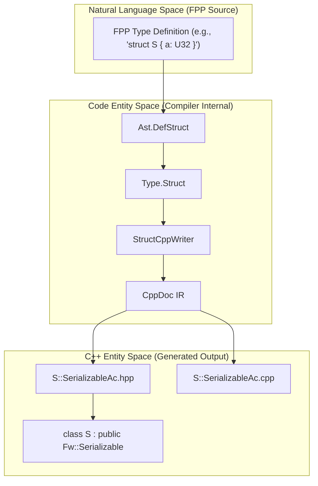
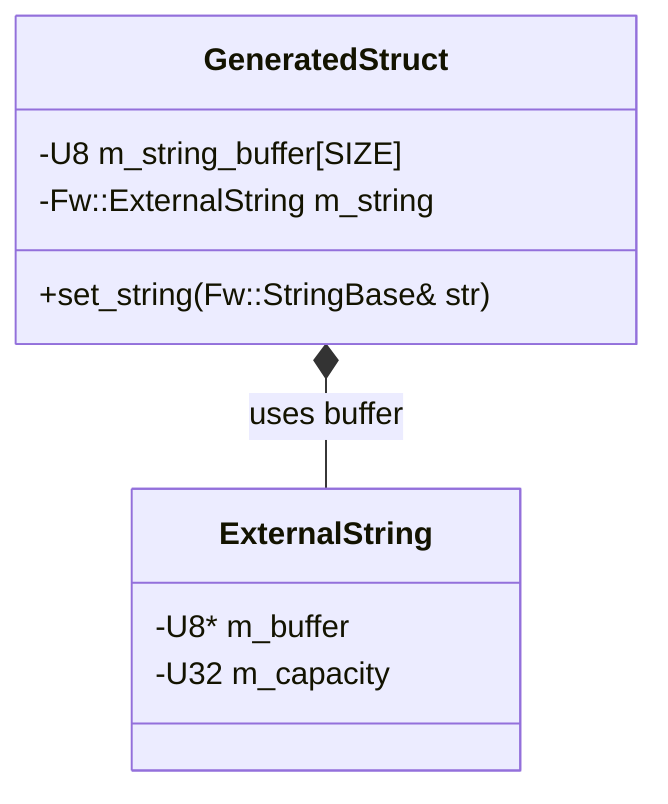

# Page: C++ Type Generators (Enum, Struct, Array, Port)

# C++ Type Generators (Enum, Struct, Array, Port)

Relevant source files

The following files were used as context for generating this wiki page:

- [compiler/lib/src/main/scala/codegen/CppWriter/ArrayCppWriter.scala](compiler/lib/src/main/scala/codegen/CppWriter/ArrayCppWriter.scala)
- [compiler/lib/src/main/scala/codegen/CppWriter/CppDoc.scala](compiler/lib/src/main/scala/codegen/CppWriter/CppDoc.scala)
- [compiler/lib/src/main/scala/codegen/CppWriter/CppDocCppWriter.scala](compiler/lib/src/main/scala/codegen/CppWriter/CppDocCppWriter.scala)
- [compiler/lib/src/main/scala/codegen/CppWriter/CppDocHppWriter.scala](compiler/lib/src/main/scala/codegen/CppWriter/CppDocHppWriter.scala)
- [compiler/lib/src/main/scala/codegen/CppWriter/CppDocVisitor.scala](compiler/lib/src/main/scala/codegen/CppWriter/CppDocVisitor.scala)
- [compiler/lib/src/main/scala/codegen/CppWriter/CppDocWriter.scala](compiler/lib/src/main/scala/codegen/CppWriter/CppDocWriter.scala)
- [compiler/lib/src/main/scala/codegen/CppWriter/CppWriterUtils.scala](compiler/lib/src/main/scala/codegen/CppWriter/CppWriterUtils.scala)
- [compiler/lib/src/main/scala/codegen/CppWriter/EnumCppWriter.scala](compiler/lib/src/main/scala/codegen/CppWriter/EnumCppWriter.scala)
- [compiler/lib/src/main/scala/codegen/CppWriter/FormatCppWriter.scala](compiler/lib/src/main/scala/codegen/CppWriter/FormatCppWriter.scala)
- [compiler/lib/src/main/scala/codegen/CppWriter/PortCppWriter.scala](compiler/lib/src/main/scala/codegen/CppWriter/PortCppWriter.scala)
- [compiler/lib/src/main/scala/codegen/CppWriter/StructCppWriter.scala](compiler/lib/src/main/scala/codegen/CppWriter/StructCppWriter.scala)
- [compiler/lib/src/main/scala/codegen/Indentation.scala](compiler/lib/src/main/scala/codegen/Indentation.scala)
- [compiler/lib/src/main/scala/codegen/Line.scala](compiler/lib/src/main/scala/codegen/Line.scala)
- [compiler/lib/src/main/scala/codegen/LineUtils.scala](compiler/lib/src/main/scala/codegen/LineUtils.scala)
- [compiler/tools/fpp-to-cpp/test/alias/AbsSerializableAc.ref.cpp](compiler/tools/fpp-to-cpp/test/alias/AbsSerializableAc.ref.cpp)
- [compiler/tools/fpp-to-cpp/test/alias/BasicSerializableAc.ref.cpp](compiler/tools/fpp-to-cpp/test/alias/BasicSerializableAc.ref.cpp)
- [compiler/tools/fpp-to-cpp/test/alias/NamespaceSerializableAc.ref.cpp](compiler/tools/fpp-to-cpp/test/alias/NamespaceSerializableAc.ref.cpp)
- [compiler/tools/fpp-to-cpp/test/array/AbsTypeArrayAc.ref.cpp](compiler/tools/fpp-to-cpp/test/array/AbsTypeArrayAc.ref.cpp)
- [compiler/tools/fpp-to-cpp/test/array/E1EnumAc.ref.hpp](compiler/tools/fpp-to-cpp/test/array/E1EnumAc.ref.hpp)
- [compiler/tools/fpp-to-cpp/test/array/E2EnumAc.ref.hpp](compiler/tools/fpp-to-cpp/test/array/E2EnumAc.ref.hpp)
- [compiler/tools/fpp-to-cpp/test/array/Enum1ArrayAc.ref.cpp](compiler/tools/fpp-to-cpp/test/array/Enum1ArrayAc.ref.cpp)
- [compiler/tools/fpp-to-cpp/test/array/Enum2ArrayAc.ref.cpp](compiler/tools/fpp-to-cpp/test/array/Enum2ArrayAc.ref.cpp)
- [compiler/tools/fpp-to-cpp/test/array/PrimitiveArrayArrayAc.ref.cpp](compiler/tools/fpp-to-cpp/test/array/PrimitiveArrayArrayAc.ref.cpp)
- [compiler/tools/fpp-to-cpp/test/array/PrimitiveBoolArrayAc.ref.cpp](compiler/tools/fpp-to-cpp/test/array/PrimitiveBoolArrayAc.ref.cpp)
- [compiler/tools/fpp-to-cpp/test/array/PrimitiveF32eArrayAc.ref.cpp](compiler/tools/fpp-to-cpp/test/array/PrimitiveF32eArrayAc.ref.cpp)
- [compiler/tools/fpp-to-cpp/test/array/PrimitiveF32fArrayAc.ref.cpp](compiler/tools/fpp-to-cpp/test/array/PrimitiveF32fArrayAc.ref.cpp)
- [compiler/tools/fpp-to-cpp/test/array/PrimitiveF64ArrayAc.ref.cpp](compiler/tools/fpp-to-cpp/test/array/PrimitiveF64ArrayAc.ref.cpp)
- [compiler/tools/fpp-to-cpp/test/array/PrimitiveI32ArrayAc.ref.cpp](compiler/tools/fpp-to-cpp/test/array/PrimitiveI32ArrayAc.ref.cpp)
- [compiler/tools/fpp-to-cpp/test/array/PrimitiveI64ArrayAc.ref.cpp](compiler/tools/fpp-to-cpp/test/array/PrimitiveI64ArrayAc.ref.cpp)
- [compiler/tools/fpp-to-cpp/test/array/PrimitiveU16ArrayAc.ref.cpp](compiler/tools/fpp-to-cpp/test/array/PrimitiveU16ArrayAc.ref.cpp)
- [compiler/tools/fpp-to-cpp/test/array/PrimitiveU8ArrayAc.ref.cpp](compiler/tools/fpp-to-cpp/test/array/PrimitiveU8ArrayAc.ref.cpp)
- [compiler/tools/fpp-to-cpp/test/array/S1SerializableAc.ref.cpp](compiler/tools/fpp-to-cpp/test/array/S1SerializableAc.ref.cpp)
- [compiler/tools/fpp-to-cpp/test/array/S1SerializableAc.ref.hpp](compiler/tools/fpp-to-cpp/test/array/S1SerializableAc.ref.hpp)
- [compiler/tools/fpp-to-cpp/test/array/S2SerializableAc.ref.cpp](compiler/tools/fpp-to-cpp/test/array/S2SerializableAc.ref.cpp)
- [compiler/tools/fpp-to-cpp/test/array/S2SerializableAc.ref.hpp](compiler/tools/fpp-to-cpp/test/array/S2SerializableAc.ref.hpp)
- [compiler/tools/fpp-to-cpp/test/array/S3SerializableAc.ref.cpp](compiler/tools/fpp-to-cpp/test/array/S3SerializableAc.ref.cpp)
- [compiler/tools/fpp-to-cpp/test/array/S3SerializableAc.ref.hpp](compiler/tools/fpp-to-cpp/test/array/S3SerializableAc.ref.hpp)
- [compiler/tools/fpp-to-cpp/test/array/SDefaultSerializableAc.ref.cpp](compiler/tools/fpp-to-cpp/test/array/SDefaultSerializableAc.ref.cpp)
- [compiler/tools/fpp-to-cpp/test/array/SDefaultSerializableAc.ref.hpp](compiler/tools/fpp-to-cpp/test/array/SDefaultSerializableAc.ref.hpp)
- [compiler/tools/fpp-to-cpp/test/array/SWrapperSerializableAc.ref.cpp](compiler/tools/fpp-to-cpp/test/array/SWrapperSerializableAc.ref.cpp)
- [compiler/tools/fpp-to-cpp/test/array/SWrapperSerializableAc.ref.hpp](compiler/tools/fpp-to-cpp/test/array/SWrapperSerializableAc.ref.hpp)
- [compiler/tools/fpp-to-cpp/test/array/String1ArrayAc.ref.cpp](compiler/tools/fpp-to-cpp/test/array/String1ArrayAc.ref.cpp)
- [compiler/tools/fpp-to-cpp/test/array/String2ArrayAc.ref.cpp](compiler/tools/fpp-to-cpp/test/array/String2ArrayAc.ref.cpp)
- [compiler/tools/fpp-to-cpp/test/array/StringArrayArrayAc.ref.cpp](compiler/tools/fpp-to-cpp/test/array/StringArrayArrayAc.ref.cpp)
- [compiler/tools/fpp-to-cpp/test/array/Struct1ArrayAc.ref.cpp](compiler/tools/fpp-to-cpp/test/array/Struct1ArrayAc.ref.cpp)
- [compiler/tools/fpp-to-cpp/test/array/Struct2ArrayAc.ref.cpp](compiler/tools/fpp-to-cpp/test/array/Struct2ArrayAc.ref.cpp)
- [compiler/tools/fpp-to-cpp/test/array/Struct3ArrayAc.ref.cpp](compiler/tools/fpp-to-cpp/test/array/Struct3ArrayAc.ref.cpp)
- [compiler/tools/fpp-to-cpp/test/array/Struct4ArrayAc.ref.cpp](compiler/tools/fpp-to-cpp/test/array/Struct4ArrayAc.ref.cpp)
- [compiler/tools/fpp-to-cpp/test/array/Struct4ArrayAc.ref.hpp](compiler/tools/fpp-to-cpp/test/array/Struct4ArrayAc.ref.hpp)
- [compiler/tools/fpp-to-cpp/test/array/run.sh](compiler/tools/fpp-to-cpp/test/array/run.sh)
- [compiler/tools/fpp-to-cpp/test/array/struct.fpp](compiler/tools/fpp-to-cpp/test/array/struct.fpp)
- [compiler/tools/fpp-to-cpp/test/array/tests.sh](compiler/tools/fpp-to-cpp/test/array/tests.sh)
- [compiler/tools/fpp-to-cpp/test/array/update-ref.sh](compiler/tools/fpp-to-cpp/test/array/update-ref.sh)
- [compiler/tools/fpp-to-cpp/test/component/base/AArrayAc.ref.cpp](compiler/tools/fpp-to-cpp/test/component/base/AArrayAc.ref.cpp)
- [compiler/tools/fpp-to-cpp/test/component/base/AArrayAc.ref.hpp](compiler/tools/fpp-to-cpp/test/component/base/AArrayAc.ref.hpp)
- [compiler/tools/fpp-to-cpp/test/component/base/ArrayAliasArrayArrayAc.ref.cpp](compiler/tools/fpp-to-cpp/test/component/base/ArrayAliasArrayArrayAc.ref.cpp)
- [compiler/tools/fpp-to-cpp/test/component/base/EEnumAc.ref.cpp](compiler/tools/fpp-to-cpp/test/component/base/EEnumAc.ref.cpp)
- [compiler/tools/fpp-to-cpp/test/component/base/EEnumAc.ref.hpp](compiler/tools/fpp-to-cpp/test/component/base/EEnumAc.ref.hpp)
- [compiler/tools/fpp-to-cpp/test/component/base/NoArgsPortAc.ref.hpp](compiler/tools/fpp-to-cpp/test/component/base/NoArgsPortAc.ref.hpp)
- [compiler/tools/fpp-to-cpp/test/component/base/NoArgsReturnPortAc.ref.hpp](compiler/tools/fpp-to-cpp/test/component/base/NoArgsReturnPortAc.ref.hpp)
- [compiler/tools/fpp-to-cpp/test/component/base/SSerializableAc.ref.cpp](compiler/tools/fpp-to-cpp/test/component/base/SSerializableAc.ref.cpp)
- [compiler/tools/fpp-to-cpp/test/component/base/SSerializableAc.ref.hpp](compiler/tools/fpp-to-cpp/test/component/base/SSerializableAc.ref.hpp)
- [compiler/tools/fpp-to-cpp/test/component/base/StructWithAliasSerializableAc.ref.cpp](compiler/tools/fpp-to-cpp/test/component/base/StructWithAliasSerializableAc.ref.cpp)
- [compiler/tools/fpp-to-cpp/test/component/base/TypedPortAc.ref.hpp](compiler/tools/fpp-to-cpp/test/component/base/TypedPortAc.ref.hpp)
- [compiler/tools/fpp-to-cpp/test/component/base/TypedReturnPortAc.ref.hpp](compiler/tools/fpp-to-cpp/test/component/base/TypedReturnPortAc.ref.hpp)
- [compiler/tools/fpp-to-cpp/test/enum/C_EEnumAc.ref.hpp](compiler/tools/fpp-to-cpp/test/enum/C_EEnumAc.ref.hpp)
- [compiler/tools/fpp-to-cpp/test/enum/DefaultEnumAc.ref.hpp](compiler/tools/fpp-to-cpp/test/enum/DefaultEnumAc.ref.hpp)
- [compiler/tools/fpp-to-cpp/test/enum/EEnumAc.ref.hpp](compiler/tools/fpp-to-cpp/test/enum/EEnumAc.ref.hpp)
- [compiler/tools/fpp-to-cpp/test/enum/ExplicitEnumAc.ref.cpp](compiler/tools/fpp-to-cpp/test/enum/ExplicitEnumAc.ref.cpp)
- [compiler/tools/fpp-to-cpp/test/enum/ExplicitEnumAc.ref.hpp](compiler/tools/fpp-to-cpp/test/enum/ExplicitEnumAc.ref.hpp)
- [compiler/tools/fpp-to-cpp/test/enum/ImplicitEnumAc.ref.hpp](compiler/tools/fpp-to-cpp/test/enum/ImplicitEnumAc.ref.hpp)
- [compiler/tools/fpp-to-cpp/test/enum/SerializeTypeEnumAc.ref.hpp](compiler/tools/fpp-to-cpp/test/enum/SerializeTypeEnumAc.ref.hpp)
- [compiler/tools/fpp-to-cpp/test/port/AbsTypePortAc.ref.cpp](compiler/tools/fpp-to-cpp/test/port/AbsTypePortAc.ref.cpp)
- [compiler/tools/fpp-to-cpp/test/port/AbsTypePortAc.ref.hpp](compiler/tools/fpp-to-cpp/test/port/AbsTypePortAc.ref.hpp)
- [compiler/tools/fpp-to-cpp/test/port/EmptyPortAc.ref.cpp](compiler/tools/fpp-to-cpp/test/port/EmptyPortAc.ref.cpp)
- [compiler/tools/fpp-to-cpp/test/port/EmptyPortAc.ref.hpp](compiler/tools/fpp-to-cpp/test/port/EmptyPortAc.ref.hpp)
- [compiler/tools/fpp-to-cpp/test/port/FppTypePortAc.ref.cpp](compiler/tools/fpp-to-cpp/test/port/FppTypePortAc.ref.cpp)
- [compiler/tools/fpp-to-cpp/test/port/FppTypePortAc.ref.hpp](compiler/tools/fpp-to-cpp/test/port/FppTypePortAc.ref.hpp)
- [compiler/tools/fpp-to-cpp/test/port/KwdNamePortAc.ref.cpp](compiler/tools/fpp-to-cpp/test/port/KwdNamePortAc.ref.cpp)
- [compiler/tools/fpp-to-cpp/test/port/KwdNamePortAc.ref.hpp](compiler/tools/fpp-to-cpp/test/port/KwdNamePortAc.ref.hpp)
- [compiler/tools/fpp-to-cpp/test/port/PrimitivePortAc.ref.cpp](compiler/tools/fpp-to-cpp/test/port/PrimitivePortAc.ref.cpp)
- [compiler/tools/fpp-to-cpp/test/port/PrimitivePortAc.ref.hpp](compiler/tools/fpp-to-cpp/test/port/PrimitivePortAc.ref.hpp)
- [compiler/tools/fpp-to-cpp/test/port/ReturnTypePortAc.ref.cpp](compiler/tools/fpp-to-cpp/test/port/ReturnTypePortAc.ref.cpp)
- [compiler/tools/fpp-to-cpp/test/port/ReturnTypePortAc.ref.hpp](compiler/tools/fpp-to-cpp/test/port/ReturnTypePortAc.ref.hpp)
- [compiler/tools/fpp-to-cpp/test/port/StringPortAc.ref.cpp](compiler/tools/fpp-to-cpp/test/port/StringPortAc.ref.cpp)
- [compiler/tools/fpp-to-cpp/test/port/StringPortAc.ref.hpp](compiler/tools/fpp-to-cpp/test/port/StringPortAc.ref.hpp)
- [compiler/tools/fpp-to-cpp/test/struct/AArrayAc.ref.cpp](compiler/tools/fpp-to-cpp/test/struct/AArrayAc.ref.cpp)
- [compiler/tools/fpp-to-cpp/test/struct/AbsTypeSerializableAc.ref.cpp](compiler/tools/fpp-to-cpp/test/struct/AbsTypeSerializableAc.ref.cpp)
- [compiler/tools/fpp-to-cpp/test/struct/AbsTypeSerializableAc.ref.hpp](compiler/tools/fpp-to-cpp/test/struct/AbsTypeSerializableAc.ref.hpp)
- [compiler/tools/fpp-to-cpp/test/struct/DefaultSerializableAc.ref.cpp](compiler/tools/fpp-to-cpp/test/struct/DefaultSerializableAc.ref.cpp)
- [compiler/tools/fpp-to-cpp/test/struct/DefaultSerializableAc.ref.hpp](compiler/tools/fpp-to-cpp/test/struct/DefaultSerializableAc.ref.hpp)
- [compiler/tools/fpp-to-cpp/test/struct/EEnumAc.ref.hpp](compiler/tools/fpp-to-cpp/test/struct/EEnumAc.ref.hpp)
- [compiler/tools/fpp-to-cpp/test/struct/EmptySerializableAc.ref.cpp](compiler/tools/fpp-to-cpp/test/struct/EmptySerializableAc.ref.cpp)
- [compiler/tools/fpp-to-cpp/test/struct/EmptySerializableAc.ref.hpp](compiler/tools/fpp-to-cpp/test/struct/EmptySerializableAc.ref.hpp)
- [compiler/tools/fpp-to-cpp/test/struct/EnumSerializableAc.ref.cpp](compiler/tools/fpp-to-cpp/test/struct/EnumSerializableAc.ref.cpp)
- [compiler/tools/fpp-to-cpp/test/struct/EnumSerializableAc.ref.hpp](compiler/tools/fpp-to-cpp/test/struct/EnumSerializableAc.ref.hpp)
- [compiler/tools/fpp-to-cpp/test/struct/FormatSerializableAc.ref.cpp](compiler/tools/fpp-to-cpp/test/struct/FormatSerializableAc.ref.cpp)
- [compiler/tools/fpp-to-cpp/test/struct/FormatSerializableAc.ref.hpp](compiler/tools/fpp-to-cpp/test/struct/FormatSerializableAc.ref.hpp)
- [compiler/tools/fpp-to-cpp/test/struct/IncludingSerializableAc.ref.cpp](compiler/tools/fpp-to-cpp/test/struct/IncludingSerializableAc.ref.cpp)
- [compiler/tools/fpp-to-cpp/test/struct/Modules1SerializableAc.ref.cpp](compiler/tools/fpp-to-cpp/test/struct/Modules1SerializableAc.ref.cpp)
- [compiler/tools/fpp-to-cpp/test/struct/Modules1SerializableAc.ref.hpp](compiler/tools/fpp-to-cpp/test/struct/Modules1SerializableAc.ref.hpp)
- [compiler/tools/fpp-to-cpp/test/struct/Modules2SerializableAc.ref.cpp](compiler/tools/fpp-to-cpp/test/struct/Modules2SerializableAc.ref.cpp)
- [compiler/tools/fpp-to-cpp/test/struct/Modules2SerializableAc.ref.hpp](compiler/tools/fpp-to-cpp/test/struct/Modules2SerializableAc.ref.hpp)
- [compiler/tools/fpp-to-cpp/test/struct/Modules3SerializableAc.ref.cpp](compiler/tools/fpp-to-cpp/test/struct/Modules3SerializableAc.ref.cpp)
- [compiler/tools/fpp-to-cpp/test/struct/Modules3SerializableAc.ref.hpp](compiler/tools/fpp-to-cpp/test/struct/Modules3SerializableAc.ref.hpp)
- [compiler/tools/fpp-to-cpp/test/struct/Modules4SerializableAc.ref.cpp](compiler/tools/fpp-to-cpp/test/struct/Modules4SerializableAc.ref.cpp)
- [compiler/tools/fpp-to-cpp/test/struct/PrimitiveSerializableAc.ref.cpp](compiler/tools/fpp-to-cpp/test/struct/PrimitiveSerializableAc.ref.cpp)
- [compiler/tools/fpp-to-cpp/test/struct/PrimitiveSerializableAc.ref.hpp](compiler/tools/fpp-to-cpp/test/struct/PrimitiveSerializableAc.ref.hpp)
- [compiler/tools/fpp-to-cpp/test/struct/PrimitiveStructSerializableAc.ref.cpp](compiler/tools/fpp-to-cpp/test/struct/PrimitiveStructSerializableAc.ref.cpp)
- [compiler/tools/fpp-to-cpp/test/struct/PrimitiveStructSerializableAc.ref.hpp](compiler/tools/fpp-to-cpp/test/struct/PrimitiveStructSerializableAc.ref.hpp)
- [compiler/tools/fpp-to-cpp/test/struct/StringArraySerializableAc.ref.cpp](compiler/tools/fpp-to-cpp/test/struct/StringArraySerializableAc.ref.cpp)
- [compiler/tools/fpp-to-cpp/test/struct/StringArraySerializableAc.ref.hpp](compiler/tools/fpp-to-cpp/test/struct/StringArraySerializableAc.ref.hpp)
- [compiler/tools/fpp-to-cpp/test/struct/StringSerializableAc.ref.cpp](compiler/tools/fpp-to-cpp/test/struct/StringSerializableAc.ref.cpp)
- [compiler/tools/fpp-to-cpp/test/struct/StringSerializableAc.ref.hpp](compiler/tools/fpp-to-cpp/test/struct/StringSerializableAc.ref.hpp)

This page documents the C++ code generation logic for FPP types. These generators translate FPP type definitions into C++ classes that typically inherit from `Fw::Serializable`, enabling them to be used in ports, telemetry, events, and commands within the F Prime framework.

## Overview of Type Generation

FPP types (Enums, Structs, Arrays) and Ports are translated into C++ using a set of dedicated writer classes. These writers consume the results of semantic analysis and produce a `CppDoc`, which is an intermediate representation (IR) of a C++ source and header file.

### Data Flow from AST to C++

The following diagram illustrates how FPP definitions move through the code generation pipeline to become C++ entities.

**Diagram: Type Generation Data Flow**

Sources: [compiler/lib/src/main/scala/codegen/CppWriter/StructCppWriter.scala:7-22](), [compiler/lib/src/main/scala/codegen/CppWriter/CppDoc.scala:4-17]()

## Core Type Writers

### EnumCppWriter
The `EnumCppWriter` translates FPP `enum` definitions into C++ classes. Unlike standard C++ enums, FPP enums are wrapped in a class that inherits from `Fw::Serializable` to provide serialization support and type safety [compiler/lib/src/main/scala/codegen/CppWriter/EnumCppWriter.scala:71-77]().

*   **Constants**: Generates `SERIALIZED_SIZE` and `NUM_CONSTANTS` [compiler/lib/src/main/scala/codegen/CppWriter/EnumCppWriter.scala:123-139]().
*   **Representation**: Uses a `typedef` for the underlying representation type (e.g., `I32`) [compiler/lib/src/main/scala/codegen/CppWriter/EnumCppWriter.scala:141-152]().
*   **Inner Enum**: Defines an internal `enum T` to hold the actual constant values [compiler/lib/src/main/scala/codegen/CppWriter/EnumCppWriter.scala:154-165]().

### StructCppWriter
The `StructCppWriter` generates C++ classes for FPP `struct` definitions. These classes include members for each struct field, getters/setters, and serialization logic [compiler/lib/src/main/scala/codegen/CppWriter/StructCppWriter.scala:7-10]().

*   **Member Handling**: It distinguishes between array members and non-array members to generate appropriate constructors and assignment operators [compiler/lib/src/main/scala/codegen/CppWriter/StructCppWriter.scala:52-54]().
*   **String Pattern**: For string members, it uses the `ExternalString` pattern with an internal buffer to avoid dynamic allocation [compiler/lib/src/main/scala/codegen/CppWriter/StructCppWriter.scala:26-27]().

### ArrayCppWriter
The `ArrayCppWriter` handles FPP `array` definitions. It generates a class that manages a fixed-size array of a specific element type [compiler/lib/src/main/scala/codegen/CppWriter/ArrayCppWriter.scala:8-11]().

*   **Initialization**: Provides constructors for default values, single-element initialization (filling the array), and initialization from a raw C++ array [compiler/lib/src/main/scala/codegen/CppWriter/ArrayCppWriter.scala:177-220]().
*   **Formatting**: Uses `FormatCppWriter` to generate `toString` methods based on the FPP `format` specifier [compiler/lib/src/main/scala/codegen/CppWriter/ArrayCppWriter.scala:43-47]().

### PortCppWriter
The `PortCppWriter` is unique as it generates two classes per port definition: an `InputPort` and an `OutputPort` [compiler/lib/src/main/scala/codegen/CppWriter/PortCppWriter.scala:102-113]().

*   **Input Port**: Inherits from `Fw::InputPortBase`. It includes the `invoke` method which is called by the component's port handler [compiler/lib/src/main/scala/codegen/PortCppWriter.scala:105]().
*   **Output Port**: Inherits from `Fw::OutputPortBase`. It includes the `invoke` method used to call an attached input port [compiler/lib/src/main/scala/codegen/PortCppWriter.scala:111]().
*   **Serialization**: For asynchronous ports, it generates a `PortBuffer` class to hold serialized arguments [compiler/lib/src/main/scala/codegen/CppWriter/PortCppWriter.scala:162-195]().

## CppDoc Intermediate Representation

The generators do not write text directly to files. Instead, they construct a `CppDoc` object.

| Entity | Description | Code Pointer |
| :--- | :--- | :--- |
| `CppDoc` | Root container for an `.hpp` and one or more `.cpp` files. | [CppDoc.scala:4]() |
| `Namespace` | Represents a C++ namespace scope. | [CppDoc.scala:125]() |
| `Class` | Represents a C++ class with members, constructors, and destructors. | [CppDoc.scala:36]() |
| `Function` | Represents a standalone or member function. | [CppDoc.scala:88]() |
| `Lines` | Uninterpreted C++ code blocks (e.g., for preprocessor directives). | [CppDoc.scala:152]() |

Sources: [compiler/lib/src/main/scala/codegen/CppWriter/CppDoc.scala:1-162]()

## Utility Helpers

### CppWriterUtils
This trait provides common logic for wrapping code in C++ constructs and managing access tags.

*   **`wrapInNamespace`**: Wraps a list of lines in a `namespace { ... }` block [compiler/lib/src/main/scala/codegen/CppWriter/CppWriterUtils.scala:82-83]().
*   **`addAccessTagAndComment`**: Injects `public:`, `protected:`, or `private:` tags along with a banner comment into a list of class members [compiler/lib/src/main/scala/codegen/CppWriter/CppWriterUtils.scala:38-50]().
*   **`wrapInForLoop`**: Generates standard `for` loop boilerplate [compiler/lib/src/main/scala/codegen/CppWriter/CppWriterUtils.scala:118-119]().

### FormatCppWriter
Translates FPP format strings (e.g., `"{.3f}"`) into C++ `printf`-style format strings. It automatically selects the correct PRI macros (from `cinttypes`) for integer types to ensure cross-platform compatibility [compiler/lib/src/main/scala/codegen/CppWriter/FormatCppWriter.scala:9-16]().

## ExternalString and Buffer Pattern

For types containing strings (Structs and Arrays), FPP generates a specific pattern to satisfy the F Prime requirement of no dynamic memory allocation.

1.  **Buffer Member**: A private `U8` array is generated to hold the string data: `m___fprime_ac_m_string_buffer` [compiler/tools/fpp-to-cpp/test/struct/PrimitiveSerializableAc.ref.cpp:28]().
2.  **ExternalString Member**: The actual member variable is an `Fw::ExternalString` initialized with the private buffer [compiler/tools/fpp-to-cpp/test/struct/PrimitiveSerializableAc.ref.cpp:59]().

**Diagram: String Member Implementation**

Sources: [compiler/lib/src/main/scala/codegen/CppWriter/StructCppWriter.scala:26-27](), [compiler/tools/fpp-to-cpp/test/struct/PrimitiveSerializableAc.ref.cpp:28-59]()

## Implementation Details

### Serialization Logic
All generated types implement `serializeTo` and `deserializeFrom`. For structs and arrays, this involves iterating through members or elements and calling `serialize` on the provided `Fw::SerialBufferBase` [compiler/tools/fpp-to-cpp/test/struct/PrimitiveSerializableAc.ref.cpp:187-247]().

### Equality Operators
The writers generate `operator==` and `operator!=`. For types with array members, these operators include loop-based comparison of every element [compiler/tools/fpp-to-cpp/test/struct/PrimitiveSerializableAc.ref.cpp:134-170]().

Sources:
- [compiler/lib/src/main/scala/codegen/CppWriter/StructCppWriter.scala]()
- [compiler/lib/src/main/scala/codegen/CppWriter/EnumCppWriter.scala]()
- [compiler/lib/src/main/scala/codegen/CppWriter/ArrayCppWriter.scala]()
- [compiler/lib/src/main/scala/codegen/CppWriter/PortCppWriter.scala]()
- [compiler/lib/src/main/scala/codegen/CppWriter/CppWriterUtils.scala]()
- [compiler/lib/src/main/scala/codegen/CppWriter/FormatCppWriter.scala]()
- [compiler/lib/src/main/scala/codegen/CppWriter/CppDoc.scala]()
