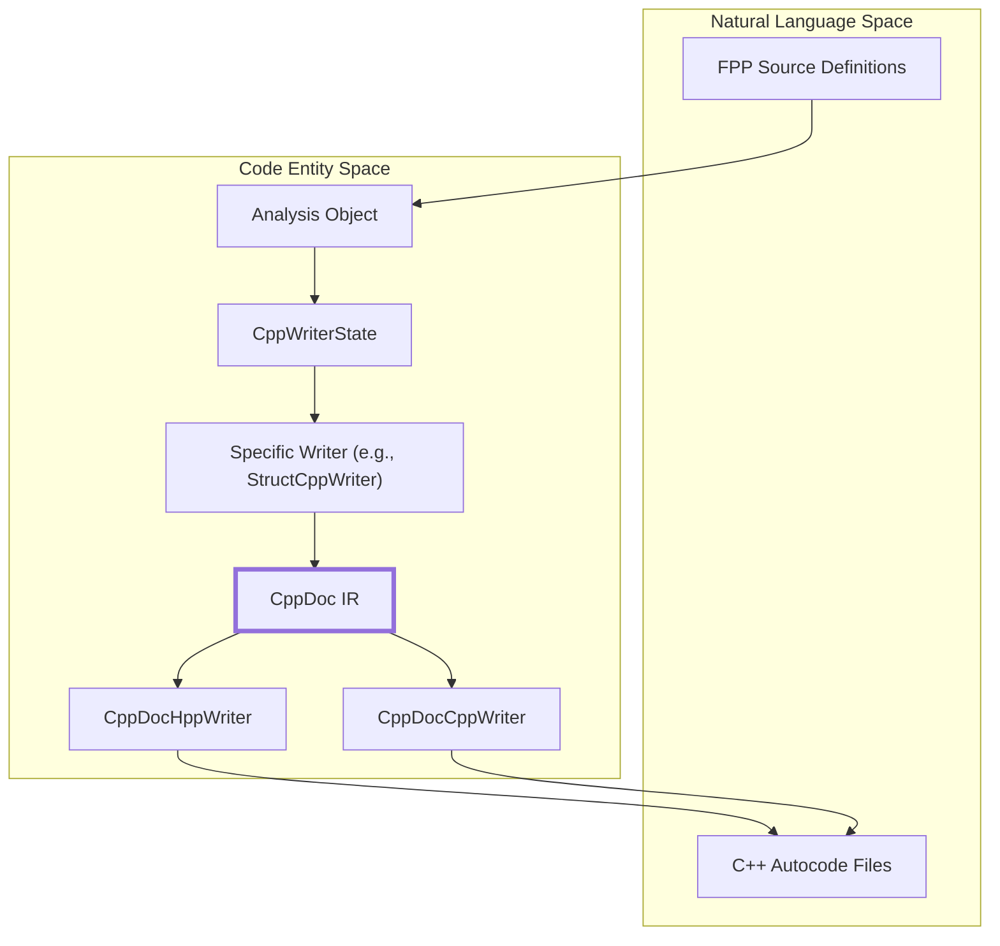

# Page: Code Generation

# Code Generation

Relevant source files

The following files were used as context for generating this wiki page:

- [compiler/lib/src/main/scala/analysis/Semantics/ResolveTopology/ResolveUnconnectedPorts.scala](compiler/lib/src/main/scala/analysis/Semantics/ResolveTopology/ResolveUnconnectedPorts.scala)
- [compiler/lib/src/main/scala/codegen/ComputeGeneratedFiles.scala](compiler/lib/src/main/scala/codegen/ComputeGeneratedFiles.scala)
- [compiler/lib/src/main/scala/codegen/CppWriter/ArrayCppWriter.scala](compiler/lib/src/main/scala/codegen/CppWriter/ArrayCppWriter.scala)
- [compiler/lib/src/main/scala/codegen/CppWriter/ComputeCppFiles.scala](compiler/lib/src/main/scala/codegen/CppWriter/ComputeCppFiles.scala)
- [compiler/lib/src/main/scala/codegen/CppWriter/ComputeImplCppFiles.scala](compiler/lib/src/main/scala/codegen/CppWriter/ComputeImplCppFiles.scala)
- [compiler/lib/src/main/scala/codegen/CppWriter/ComputeTestCppFiles.scala](compiler/lib/src/main/scala/codegen/CppWriter/ComputeTestCppFiles.scala)
- [compiler/lib/src/main/scala/codegen/CppWriter/ComputeTestImplCppFiles.scala](compiler/lib/src/main/scala/codegen/CppWriter/ComputeTestImplCppFiles.scala)
- [compiler/lib/src/main/scala/codegen/CppWriter/ConstantCppWriter.scala](compiler/lib/src/main/scala/codegen/CppWriter/ConstantCppWriter.scala)
- [compiler/lib/src/main/scala/codegen/CppWriter/CppDoc.scala](compiler/lib/src/main/scala/codegen/CppWriter/CppDoc.scala)
- [compiler/lib/src/main/scala/codegen/CppWriter/CppDocCppWriter.scala](compiler/lib/src/main/scala/codegen/CppWriter/CppDocCppWriter.scala)
- [compiler/lib/src/main/scala/codegen/CppWriter/CppDocHppWriter.scala](compiler/lib/src/main/scala/codegen/CppWriter/CppDocHppWriter.scala)
- [compiler/lib/src/main/scala/codegen/CppWriter/CppDocVisitor.scala](compiler/lib/src/main/scala/codegen/CppWriter/CppDocVisitor.scala)
- [compiler/lib/src/main/scala/codegen/CppWriter/CppDocWriter.scala](compiler/lib/src/main/scala/codegen/CppWriter/CppDocWriter.scala)
- [compiler/lib/src/main/scala/codegen/CppWriter/CppWriter.scala](compiler/lib/src/main/scala/codegen/CppWriter/CppWriter.scala)
- [compiler/lib/src/main/scala/codegen/CppWriter/CppWriterState.scala](compiler/lib/src/main/scala/codegen/CppWriter/CppWriterState.scala)
- [compiler/lib/src/main/scala/codegen/CppWriter/CppWriterUtils.scala](compiler/lib/src/main/scala/codegen/CppWriter/CppWriterUtils.scala)
- [compiler/lib/src/main/scala/codegen/CppWriter/EnumCppWriter.scala](compiler/lib/src/main/scala/codegen/CppWriter/EnumCppWriter.scala)
- [compiler/lib/src/main/scala/codegen/CppWriter/FormatCppWriter.scala](compiler/lib/src/main/scala/codegen/CppWriter/FormatCppWriter.scala)
- [compiler/lib/src/main/scala/codegen/CppWriter/ImplCppWriter.scala](compiler/lib/src/main/scala/codegen/CppWriter/ImplCppWriter.scala)
- [compiler/lib/src/main/scala/codegen/CppWriter/PortCppWriter.scala](compiler/lib/src/main/scala/codegen/CppWriter/PortCppWriter.scala)
- [compiler/lib/src/main/scala/codegen/CppWriter/StructCppWriter.scala](compiler/lib/src/main/scala/codegen/CppWriter/StructCppWriter.scala)
- [compiler/lib/src/main/scala/codegen/CppWriter/TestCppWriter.scala](compiler/lib/src/main/scala/codegen/CppWriter/TestCppWriter.scala)
- [compiler/lib/src/main/scala/codegen/CppWriter/TestImplCppWriter.scala](compiler/lib/src/main/scala/codegen/CppWriter/TestImplCppWriter.scala)
- [compiler/lib/src/main/scala/codegen/Indentation.scala](compiler/lib/src/main/scala/codegen/Indentation.scala)
- [compiler/lib/src/main/scala/codegen/Line.scala](compiler/lib/src/main/scala/codegen/Line.scala)
- [compiler/lib/src/main/scala/codegen/LineUtils.scala](compiler/lib/src/main/scala/codegen/LineUtils.scala)
- [compiler/lib/src/main/scala/codegen/LocateDefsFppWriter.scala](compiler/lib/src/main/scala/codegen/LocateDefsFppWriter.scala)
- [compiler/lib/src/main/scala/util/Tool.scala](compiler/lib/src/main/scala/util/Tool.scala)
- [compiler/tools/fpp-filenames/test/include_test_auto_helpers.ref.txt](compiler/tools/fpp-filenames/test/include_test_auto_helpers.ref.txt)
- [compiler/tools/fpp-filenames/test/include_test_template_auto_helpers.ref.txt](compiler/tools/fpp-filenames/test/include_test_template_auto_helpers.ref.txt)
- [compiler/tools/fpp-filenames/test/ok_test_auto_helpers.ref.txt](compiler/tools/fpp-filenames/test/ok_test_auto_helpers.ref.txt)
- [compiler/tools/fpp-locate-defs/test/defs.ref.txt](compiler/tools/fpp-locate-defs/test/defs.ref.txt)
- [compiler/tools/fpp-locate-defs/test/defs/defs-1.fpp](compiler/tools/fpp-locate-defs/test/defs/defs-1.fpp)
- [compiler/tools/fpp-locate-defs/test/defs/defs-2.fpp](compiler/tools/fpp-locate-defs/test/defs/defs-2.fpp)
- [compiler/tools/fpp-locate-defs/test/defs_dir.ref.txt](compiler/tools/fpp-locate-defs/test/defs_dir.ref.txt)
- [compiler/tools/fpp-to-cpp/test/component/base/AArrayAc.ref.cpp](compiler/tools/fpp-to-cpp/test/component/base/AArrayAc.ref.cpp)
- [compiler/tools/fpp-to-cpp/test/component/base/AArrayAc.ref.hpp](compiler/tools/fpp-to-cpp/test/component/base/AArrayAc.ref.hpp)
- [compiler/tools/fpp-to-cpp/test/component/base/ArrayAliasArrayArrayAc.ref.cpp](compiler/tools/fpp-to-cpp/test/component/base/ArrayAliasArrayArrayAc.ref.cpp)
- [compiler/tools/fpp-to-cpp/test/component/base/EEnumAc.ref.cpp](compiler/tools/fpp-to-cpp/test/component/base/EEnumAc.ref.cpp)
- [compiler/tools/fpp-to-cpp/test/struct/EmptySerializableAc.ref.cpp](compiler/tools/fpp-to-cpp/test/struct/EmptySerializableAc.ref.cpp)
- [compiler/tools/fpp-to-cpp/test/struct/EmptySerializableAc.ref.hpp](compiler/tools/fpp-to-cpp/test/struct/EmptySerializableAc.ref.hpp)

The FPP code generation back-end translates the results of semantic analysis into various output formats, primarily C++ autocode for the F Prime framework. The system is designed around a central intermediate representation (IR) called `CppDoc`, which abstracts C++ syntax into a structured object model before serialization to disk.

## The Generation Pipeline

The C++ generation process follows a structured pipeline to ensure consistency across different types of generated files (components, topologies, types, etc.).

1.  **Computation**: The generator determines the necessary metadata, such as file names, include guards, and required namespaces using `CppWriterState` [compiler/lib/src/main/scala/codegen/CppWriter/CppWriterState.scala:8-21]().
2.  **Writer Selection**: Based on the AST node type (e.g., `DefStruct`, `DefEnum`), a specific writer class is instantiated (e.g., `StructCppWriter`, `EnumCppWriter`) [compiler/lib/src/main/scala/codegen/CppWriter/StructCppWriter.scala:7-10]().
3.  **CppDoc Construction**: The writer populates a `CppDoc` object. This involves mapping FPP types to C++ types and organizing class members (constructors, functions, variables) [compiler/lib/src/main/scala/codegen/CppWriter/CppDoc.scala:4-17]().
4.  **Serialization**: The `CppDoc` is passed to `CppDocHppWriter` and `CppDocCppWriter` to generate the final `.hpp` and `.cpp` source code [compiler/lib/src/main/scala/codegen/CppWriter/CppWriter.scala:70-86]().

### Code Generation Workflow

**Sources:** [compiler/lib/src/main/scala/codegen/CppWriter/CppWriter.scala:70-110](), [compiler/lib/src/main/scala/codegen/CppWriter/StructCppWriter.scala:90-99]()

## CppDoc Intermediate Representation

`CppDoc` is the core IR for C++ code generation. It prevents the generators from having to manage raw string manipulation for common C++ constructs like namespaces, class definitions, and function prototypes.

| Entity | Role | Code Reference |
| :--- | :--- | :--- |
| `CppDoc` | Top-level container for a header and its associated implementation files. | [compiler/lib/src/main/scala/codegen/CppWriter/CppDoc.scala:4-17]() |
| `Member` | A namespace, class, function, or raw lines of code. | [compiler/lib/src/main/scala/codegen/CppWriter/CppDoc.scala:143-149]() |
| `Class` | Represents a C++ class, including superclasses and access modifiers. | [compiler/lib/src/main/scala/codegen/CppWriter/CppDoc.scala:36-47]() |
| `Function` | Represents a C++ function with parameters, return types, and qualifiers (static, virtual, const). | [compiler/lib/src/main/scala/codegen/CppWriter/CppDoc.scala:88-105]() |
| `Lines` | Uninterpreted lines of code for manual injections or specific logic. | [compiler/lib/src/main/scala/codegen/CppWriter/CppDoc.scala:152-156]() |

**Sources:** [compiler/lib/src/main/scala/codegen/CppWriter/CppDoc.scala:1-186]()

## CppWriterState

The `CppWriterState` object carries the context of the entire generation run. It bridges the gap between the semantic `Analysis` and the requirements of the C++ file system.

*   **Namespace Management**: Computes C++ namespace lists from FPP symbols [compiler/lib/src/main/scala/codegen/CppWriter/CppWriterState.scala:69-71]().
*   **Include Management**: Resolves include paths for dependencies and generates standard include guards [compiler/lib/src/main/scala/codegen/CppWriter/CppWriterState.scala:144-152]().
*   **Symbol Translation**: Converts FPP symbols into valid C++ identifiers and qualified names [compiler/lib/src/main/scala/codegen/CppWriter/CppWriterState.scala:44-45]().

**Sources:** [compiler/lib/src/main/scala/codegen/CppWriter/CppWriterState.scala:8-152]()

## Output Modes

The generator supports different modes depending on the intended use of the output:

*   **Autocode (`Autocode`)**: The default mode. Generates base classes and types that are not intended to be modified by the user [compiler/lib/src/main/scala/codegen/CppWriter/CppWriter.scala:194]() .
*   **Implementation Template (`ImplTemplate`)**: Generates "stub" files for components, providing the user with a starting point for manual logic implementation [compiler/lib/src/main/scala/codegen/CppWriter/CppWriter.scala:195]().
*   **Unit Test (`UnitTest`)**: Generates GTest-based harnesses and tester base classes to facilitate component testing [compiler/lib/src/main/scala/codegen/CppWriter/CppWriter.scala:196]().

### C++ File Naming Conventions
The `ComputeCppFiles.FileNames` object defines the standard naming suffixes used by the toolchain:
*   **Types**: `*ArrayAc.hpp`, `*EnumAc.hpp`, `*SerializableAc.hpp` [compiler/lib/src/main/scala/codegen/CppWriter/ComputeCppFiles.scala:83-105]().
*   **Components**: `*ComponentAc.hpp` (Base) and `*TesterBase.hpp` (Test) [compiler/lib/src/main/scala/codegen/CppWriter/ComputeCppFiles.scala:86-117]().
*   **Topologies**: `*TopologyAc.hpp` [compiler/lib/src/main/scala/codegen/CppWriter/ComputeCppFiles.scala:111]().

**Sources:** [compiler/lib/src/main/scala/codegen/CppWriter/CppWriter.scala:135-141](), [compiler/lib/src/main/scala/codegen/CppWriter/ComputeCppFiles.scala:70-154]()

## Child Pages

For detailed documentation on specific generators, see the following pages:

*   **[C++ Type Generators (Enum, Struct, Array, Port)](#4.1)**: Translation of FPP types into `Fw::Serializable` subclasses.
*   **[Component Base Class Generator](#4.2)**: Generation of component input/output ports, commands, events, and telemetry.
*   **[Topology C++ Generator](#4.3)**: Generation of system-wide setup/teardown functions and component instances.
*   **[State Machine C++ Generator](#4.4)**: Translation of hierarchical state machines into C++ classes.
*   **[Unit Test Harness Generator](#4.5)**: Generation of `TesterBase` and GTest integration.
*   **[JSON and XML Output Generators](#4.6)**: Non-C++ backends for dictionaries and analysis export.
*   **[Layout and Filename Utilities](#4.7)**: Build system integration and connection graph layout generation.
