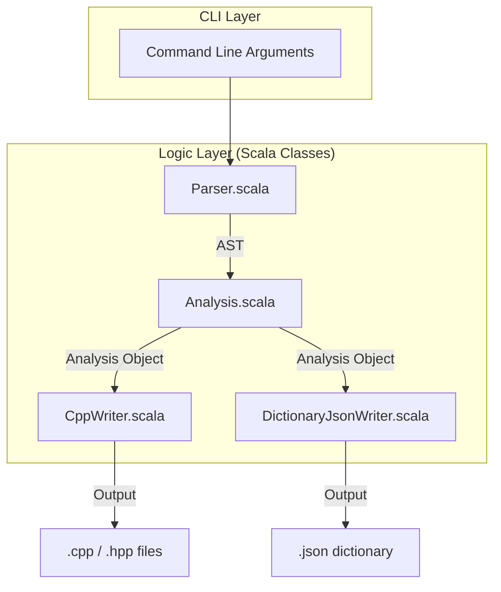
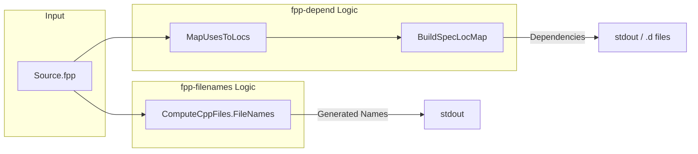

# Page: Command-Line Tools Reference

# Command-Line Tools Reference

Relevant source files

The following files were used as context for generating this wiki page:

- [.github/actions/build-native-images/action.yml](.github/actions/build-native-images/action.yml)
- [.github/actions/build-native-images/native-images](.github/actions/build-native-images/native-images)
- [.github/actions/native-tools-setup/action.yml](.github/actions/native-tools-setup/action.yml)
- [.github/actions/native-tools-setup/env-setup](.github/actions/native-tools-setup/env-setup)
- [.github/workflows/build-native.yml](.github/workflows/build-native.yml)
- [.github/workflows/build-test.yml](.github/workflows/build-test.yml)
- [.github/workflows/native-build.yml](.github/workflows/native-build.yml)
- [.github/workflows/publish](.github/workflows/publish)
- [README.adoc](README.adoc)
- [compiler/.jvmopts](compiler/.jvmopts)
- [compiler/README.adoc](compiler/README.adoc)
- [compiler/fpp-sbt](compiler/fpp-sbt)
- [compiler/install-trace](compiler/install-trace)
- [compiler/lib/src/main/resources/META-INF/native-image/jni-config.json](compiler/lib/src/main/resources/META-INF/native-image/jni-config.json)
- [compiler/lib/src/main/resources/META-INF/native-image/predefined-classes-config.json](compiler/lib/src/main/resources/META-INF/native-image/predefined-classes-config.json)
- [compiler/lib/src/main/resources/META-INF/native-image/proxy-config.json](compiler/lib/src/main/resources/META-INF/native-image/proxy-config.json)
- [compiler/lib/src/main/resources/META-INF/native-image/reflect-config.json](compiler/lib/src/main/resources/META-INF/native-image/reflect-config.json)
- [compiler/lib/src/main/resources/META-INF/native-image/resource-config.json](compiler/lib/src/main/resources/META-INF/native-image/resource-config.json)
- [compiler/lib/src/main/resources/META-INF/native-image/serialization-config.json](compiler/lib/src/main/resources/META-INF/native-image/serialization-config.json)
- [compiler/lib/src/main/scala/analysis/Semantics/ResolveTopology/ResolvePartiallyNumbered.scala](compiler/lib/src/main/scala/analysis/Semantics/ResolveTopology/ResolvePartiallyNumbered.scala)
- [compiler/lib/src/main/scala/analysis/Semantics/ResolveTopology/ResolveTopologyPortInterface.scala](compiler/lib/src/main/scala/analysis/Semantics/ResolveTopology/ResolveTopologyPortInterface.scala)
- [compiler/lib/src/main/scala/analysis/Semantics/ResolveTopology/ResolveUnconnectedPorts.scala](compiler/lib/src/main/scala/analysis/Semantics/ResolveTopology/ResolveUnconnectedPorts.scala)
- [compiler/lib/src/main/scala/analysis/Semantics/TlmPacketSet.scala](compiler/lib/src/main/scala/analysis/Semantics/TlmPacketSet.scala)
- [compiler/lib/src/main/scala/analysis/Semantics/TopologyPort.scala](compiler/lib/src/main/scala/analysis/Semantics/TopologyPort.scala)
- [compiler/lib/src/main/scala/codegen/ComputeGeneratedFiles.scala](compiler/lib/src/main/scala/codegen/ComputeGeneratedFiles.scala)
- [compiler/lib/src/main/scala/codegen/CppWriter/ComputeAutocodeCppFiles.scala](compiler/lib/src/main/scala/codegen/CppWriter/ComputeAutocodeCppFiles.scala)
- [compiler/lib/src/main/scala/codegen/CppWriter/ComputeCppFiles.scala](compiler/lib/src/main/scala/codegen/CppWriter/ComputeCppFiles.scala)
- [compiler/lib/src/main/scala/codegen/CppWriter/ComputeImplCppFiles.scala](compiler/lib/src/main/scala/codegen/CppWriter/ComputeImplCppFiles.scala)
- [compiler/lib/src/main/scala/codegen/CppWriter/ComputeTestCppFiles.scala](compiler/lib/src/main/scala/codegen/CppWriter/ComputeTestCppFiles.scala)
- [compiler/lib/src/main/scala/codegen/CppWriter/ComputeTestImplCppFiles.scala](compiler/lib/src/main/scala/codegen/CppWriter/ComputeTestImplCppFiles.scala)
- [compiler/lib/src/main/scala/codegen/CppWriter/ConstantCppWriter.scala](compiler/lib/src/main/scala/codegen/CppWriter/ConstantCppWriter.scala)
- [compiler/lib/src/main/scala/codegen/CppWriter/CppWriter.scala](compiler/lib/src/main/scala/codegen/CppWriter/CppWriter.scala)
- [compiler/lib/src/main/scala/codegen/CppWriter/CppWriterState.scala](compiler/lib/src/main/scala/codegen/CppWriter/CppWriterState.scala)
- [compiler/lib/src/main/scala/codegen/CppWriter/ImplCppWriter.scala](compiler/lib/src/main/scala/codegen/CppWriter/ImplCppWriter.scala)
- [compiler/lib/src/main/scala/codegen/CppWriter/TestCppWriter.scala](compiler/lib/src/main/scala/codegen/CppWriter/TestCppWriter.scala)
- [compiler/lib/src/main/scala/codegen/CppWriter/TestImplCppWriter.scala](compiler/lib/src/main/scala/codegen/CppWriter/TestImplCppWriter.scala)
- [compiler/lib/src/main/scala/codegen/LocateDefsFppWriter.scala](compiler/lib/src/main/scala/codegen/LocateDefsFppWriter.scala)
- [compiler/lib/src/main/scala/syntax/ParserState.scala](compiler/lib/src/main/scala/syntax/ParserState.scala)
- [compiler/lib/src/main/scala/util/File.scala](compiler/lib/src/main/scala/util/File.scala)
- [compiler/lib/src/main/scala/util/Location.scala](compiler/lib/src/main/scala/util/Location.scala)
- [compiler/lib/src/main/scala/util/Result.scala](compiler/lib/src/main/scala/util/Result.scala)
- [compiler/lib/src/main/scala/util/Tool.scala](compiler/lib/src/main/scala/util/Tool.scala)
- [compiler/release](compiler/release)
- [compiler/tools.txt](compiler/tools.txt)
- [compiler/tools/fpp-check/test/top_ports/interface_instance_not_member.fpp](compiler/tools/fpp-check/test/top_ports/interface_instance_not_member.fpp)
- [compiler/tools/fpp-check/test/top_ports/interface_instance_not_member.ref.txt](compiler/tools/fpp-check/test/top_ports/interface_instance_not_member.ref.txt)
- [compiler/tools/fpp-check/test/top_ports/tests.sh](compiler/tools/fpp-check/test/top_ports/tests.sh)
- [compiler/tools/fpp-depend/test/clean](compiler/tools/fpp-depend/test/clean)
- [compiler/tools/fpp-depend/test/def_port.fpp](compiler/tools/fpp-depend/test/def_port.fpp)
- [compiler/tools/fpp-depend/test/def_state_machine.fpp](compiler/tools/fpp-depend/test/def_state_machine.fpp)
- [compiler/tools/fpp-depend/test/def_state_machine.ref.txt](compiler/tools/fpp-depend/test/def_state_machine.ref.txt)
- [compiler/tools/fpp-depend/test/def_struct.fpp](compiler/tools/fpp-depend/test/def_struct.fpp)
- [compiler/tools/fpp-depend/test/filenames_auto_generated_output.ref.txt](compiler/tools/fpp-depend/test/filenames_auto_generated_output.ref.txt)
- [compiler/tools/fpp-depend/test/filenames_generated_output.ref.txt](compiler/tools/fpp-depend/test/filenames_generated_output.ref.txt)
- [compiler/tools/fpp-depend/test/filenames_include_auto_generated_output.ref.txt](compiler/tools/fpp-depend/test/filenames_include_auto_generated_output.ref.txt)
- [compiler/tools/fpp-depend/test/filenames_include_generated_output.ref.txt](compiler/tools/fpp-depend/test/filenames_include_generated_output.ref.txt)
- [compiler/tools/fpp-depend/test/filenames_include_ut_output.ref.txt](compiler/tools/fpp-depend/test/filenames_include_ut_output.ref.txt)
- [compiler/tools/fpp-depend/test/filenames_ut_output.ref.txt](compiler/tools/fpp-depend/test/filenames_ut_output.ref.txt)
- [compiler/tools/fpp-depend/test/run](compiler/tools/fpp-depend/test/run)
- [compiler/tools/fpp-depend/test/spec_command.fpp](compiler/tools/fpp-depend/test/spec_command.fpp)
- [compiler/tools/fpp-depend/test/spec_command.ref.txt](compiler/tools/fpp-depend/test/spec_command.ref.txt)
- [compiler/tools/fpp-depend/test/spec_connection_graph_direct.fpp](compiler/tools/fpp-depend/test/spec_connection_graph_direct.fpp)
- [compiler/tools/fpp-depend/test/spec_connection_graph_direct.ref.txt](compiler/tools/fpp-depend/test/spec_connection_graph_direct.ref.txt)
- [compiler/tools/fpp-depend/test/spec_state_machine_instance.fpp](compiler/tools/fpp-depend/test/spec_state_machine_instance.fpp)
- [compiler/tools/fpp-depend/test/spec_state_machine_instance.ref.txt](compiler/tools/fpp-depend/test/spec_state_machine_instance.ref.txt)
- [compiler/tools/fpp-depend/test/tests.sh](compiler/tools/fpp-depend/test/tests.sh)
- [compiler/tools/fpp-depend/test/update-ref](compiler/tools/fpp-depend/test/update-ref)
- [compiler/tools/fpp-filenames/test/include.ref.txt](compiler/tools/fpp-filenames/test/include.ref.txt)
- [compiler/tools/fpp-filenames/test/include_test_auto_helpers.ref.txt](compiler/tools/fpp-filenames/test/include_test_auto_helpers.ref.txt)
- [compiler/tools/fpp-filenames/test/include_test_template_auto_helpers.ref.txt](compiler/tools/fpp-filenames/test/include_test_template_auto_helpers.ref.txt)
- [compiler/tools/fpp-filenames/test/ok.fpp](compiler/tools/fpp-filenames/test/ok.fpp)
- [compiler/tools/fpp-filenames/test/ok.ref.txt](compiler/tools/fpp-filenames/test/ok.ref.txt)
- [compiler/tools/fpp-filenames/test/ok_test_auto_helpers.ref.txt](compiler/tools/fpp-filenames/test/ok_test_auto_helpers.ref.txt)
- [compiler/tools/fpp-locate-defs/test/defs.ref.txt](compiler/tools/fpp-locate-defs/test/defs.ref.txt)
- [compiler/tools/fpp-locate-defs/test/defs/defs-1.fpp](compiler/tools/fpp-locate-defs/test/defs/defs-1.fpp)
- [compiler/tools/fpp-locate-defs/test/defs/defs-2.fpp](compiler/tools/fpp-locate-defs/test/defs/defs-2.fpp)
- [compiler/tools/fpp-locate-defs/test/defs_dir.ref.txt](compiler/tools/fpp-locate-defs/test/defs_dir.ref.txt)
- [compiler/tools/fpp-to-dict/test/scripts/run.sh](compiler/tools/fpp-to-dict/test/scripts/run.sh)
- [compiler/tools/fpp-to-dict/test/scripts/update-ref.sh](compiler/tools/fpp-to-dict/test/scripts/update-ref.sh)
- [compiler/tools/fpp-to-dict/test/top/dataProducts.ref.txt](compiler/tools/fpp-to-dict/test/top/dataProducts.ref.txt)
- [compiler/tools/fpp-to-dict/test/top/duplicate.fpp](compiler/tools/fpp-to-dict/test/top/duplicate.fpp)
- [compiler/tools/fpp-to-dict/test/top/duplicate.ref.txt](compiler/tools/fpp-to-dict/test/top/duplicate.ref.txt)
- [compiler/tools/fpp-to-dict/test/top/multipleTops.ref.txt](compiler/tools/fpp-to-dict/test/top/multipleTops.ref.txt)
- [compiler/tools/fpp-to-dict/test/top/unqualifiedComponentInstances.ref.txt](compiler/tools/fpp-to-dict/test/top/unqualifiedComponentInstances.ref.txt)
- [compiler/trace-fprime](compiler/trace-fprime)
- [docs/index/defs.sh](docs/index/defs.sh)
- [docs/index/index.adoc](docs/index/index.adoc)
- [pyproject.toml](pyproject.toml)
- [python/fprime_fpp/__init__.py](python/fprime_fpp/__init__.py)
- [python/fprime_fpp/__main__.py](python/fprime_fpp/__main__.py)

This page provides a technical reference for the command-line tools provided by the FPP toolchain. These tools are used to analyze FPP source files, generate C++ autocode, produce dictionaries, and manage build dependencies.

The FPP tools are distributed both as JVM-based executable scripts and as native binaries generated via GraalVM `native-image` [compiler/release:125-130]().

## Overview of Tools

The following tools are available in the FPP distribution [compiler/README.adoc:50-61]():

| Tool | Category | Primary Function |
|---|---|---|
| `fpp-check` | Analysis | Performs full semantic analysis and validation. |
| `fpp-syntax` | Frontend | Checks FPP source against the formal grammar. |
| `fpp-to-cpp` | Codegen | Generates F++ (F Prime) C++ implementation files. |
| `fpp-to-dict` | Codegen | Generates JSON dictionaries for commands, telemetry, etc. |
| `fpp-depend` | Build System | Computes file-level dependencies for build automation. |
| `fpp-filenames` | Build System | Predicts the names of files that will be generated. |
| `fpp-format` | Utility | Re-formats FPP source code (pretty-printer). |
| `fpp-from-xml` | Migration | Converts legacy F Prime XML models to FPP. |
| `fpp-locate-defs` | IDE/Nav | Locates the definition of a symbol. |
| `fpp-locate-uses` | IDE/Nav | Locates all uses of a symbol. |
| `fpp-to-json` | Analysis | Exports the internal Analysis state to JSON. |
| `fpp-to-layout` | Visualization | Generates layout information for topology diagrams. |

Sources: [compiler/README.adoc:50-61](), [compiler/release:90-117]()

## Data Flow and Implementation

Most tools follow a standard pipeline: 
1. **Frontend**: Parse FPP files into an AST.
2. **Analysis**: Perform semantic checks and build an `Analysis` object.
3. **Backend**: Use the `Analysis` object to generate output (C++, JSON, etc.).

### Tool Execution Logic
The tools are dispatched through a common entry point in the native binary or through individual shell scripts that call `fpp.jar` [compiler/release:113-115]().

**System Component Mapping**

Sources: [compiler/lib/src/main/scala/codegen/CppWriter/CppWriter.scala:7-18](), [compiler/lib/src/main/scala/codegen/CppWriter/CppWriterState.scala:8-21]()

## C++ Code Generation (`fpp-to-cpp`)

`fpp-to-cpp` is the primary code generator. It translates FPP definitions into F Prime framework C++ classes.

### Output File Naming
The tool uses `ComputeCppFiles` to determine output names consistently [compiler/lib/src/main/scala/codegen/CppWriter/ComputeCppFiles.scala:11-15]().

| FPP Construct | Generated Base Name | Source Code |
|---|---|---|
| Constant | `FppConstantsAc` | [compiler/lib/src/main/scala/codegen/CppWriter/ComputeCppFiles.scala:73]() |
| Array | `${Name}ArrayAc` | [compiler/lib/src/main/scala/codegen/CppWriter/ComputeCppFiles.scala:83]() |
| Component | `${Name}ComponentAc` | [compiler/lib/src/main/scala/codegen/CppWriter/ComputeCppFiles.scala:86]() |
| Port | `${Name}PortAc` | [compiler/lib/src/main/scala/codegen/CppWriter/ComputeCppFiles.scala:95]() |
| Topology | `${Name}TopologyAc` | [compiler/lib/src/main/scala/codegen/CppWriter/ComputeCppFiles.scala:111]() |

### Implementation Details
The generation is driven by `CppWriterState`, which carries the `Analysis` results and configuration like include guard prefixes [compiler/lib/src/main/scala/codegen/CppWriter/CppWriterState.scala:8-21]().

*   **Namespace Handling**: Namespaces are derived from FPP modules and converted to C++ `::` syntax [compiler/lib/src/main/scala/codegen/CppWriter/CppWriterState.scala:61-65]().
*   **Include Guards**: Generated based on the relative path of the file to ensure uniqueness [compiler/lib/src/main/scala/codegen/CppWriter/CppWriterState.scala:34-41]().
*   **Constant Generation**: Handled by `ConstantCppWriter`, which translates FPP `Value` types (Boolean, Integer, Float, String) into C++ `extern` constants or anonymous enums [compiler/lib/src/main/scala/codegen/CppWriter/ConstantCppWriter.scala:56-64]().

Sources: [compiler/lib/src/main/scala/codegen/CppWriter/ComputeCppFiles.scala:70-154](), [compiler/lib/src/main/scala/codegen/CppWriter/CppWriterState.scala:8-100](), [compiler/lib/src/main/scala/codegen/CppWriter/ConstantCppWriter.scala:7-38]()

## Build System Integration Tools

### `fpp-depend`
Computes dependencies between FPP files. It identifies which files are required to analyze a given set of FPP source files, including files pulled in via `include` specifiers or transitive symbol references [compiler/tools/fpp-depend/test/tests.sh:1-66]().

### `fpp-filenames`
Predicts the names of all files that `fpp-to-cpp` will generate. This is critical for build systems like CMake or Make to establish build rules before the tools actually run [compiler/lib/src/main/scala/codegen/ComputeGeneratedFiles.scala:1-10]().

**Dependency Mapping**

Sources: [compiler/lib/src/main/scala/codegen/CppWriter/ComputeCppFiles.scala:70-154](), [compiler/tools/fpp-depend/test/tests.sh:25-28]()

## Navigation and Analysis Tools

### `fpp-locate-defs` and `fpp-locate-uses`
These tools facilitate IDE features.
*   **Locate Defs**: Given a symbol name and a set of files, it returns the file and line number where that symbol is defined [compiler/lib/src/main/scala/codegen/LocateDefsFppWriter.scala:1-10]().
*   **Locate Uses**: Identifies every location where a symbol is referenced across the model.

### `fpp-to-json`
Exports the internal compiler state. This includes:
*   The AST (Abstract Syntax Tree).
*   The `Analysis` object (resolved symbols, types, and topologies).
*   Location maps [compiler/lib/src/main/resources/META-INF/native-image/reflect-config.json:26-50]().

This tool is primarily used for external tools that need to process FPP models without re-implementing the front-end.

Sources: [compiler/lib/src/main/scala/codegen/LocateDefsFppWriter.scala:1-10](), [compiler/lib/src/main/resources/META-INF/native-image/reflect-config.json:26-100]()

## Native Binary Construction

The tools are compiled into a single native executable named `fpp` using GraalVM. Individual tool commands (e.g., `fpp-check`) are implemented as shell script wrappers that call the main `fpp` binary with the tool name as the first argument [compiler/release:113-115]().

**Native Build Process**
1.  **JAR Creation**: `sbt assembly` creates `fpp.jar` [compiler/README.adoc:109-112]().
2.  **Tracing**: The `native-image-agent` runs during unit tests to generate reflection configurations [compiler/README.adoc:177-183]().
3.  **Compilation**: `native-image` compiles the JAR into a standalone binary `fpp` [compiler/release:95-97]().

Sources: [compiler/release:90-117](), [compiler/README.adoc:125-158](), [compiler/README.adoc:177-213]()
