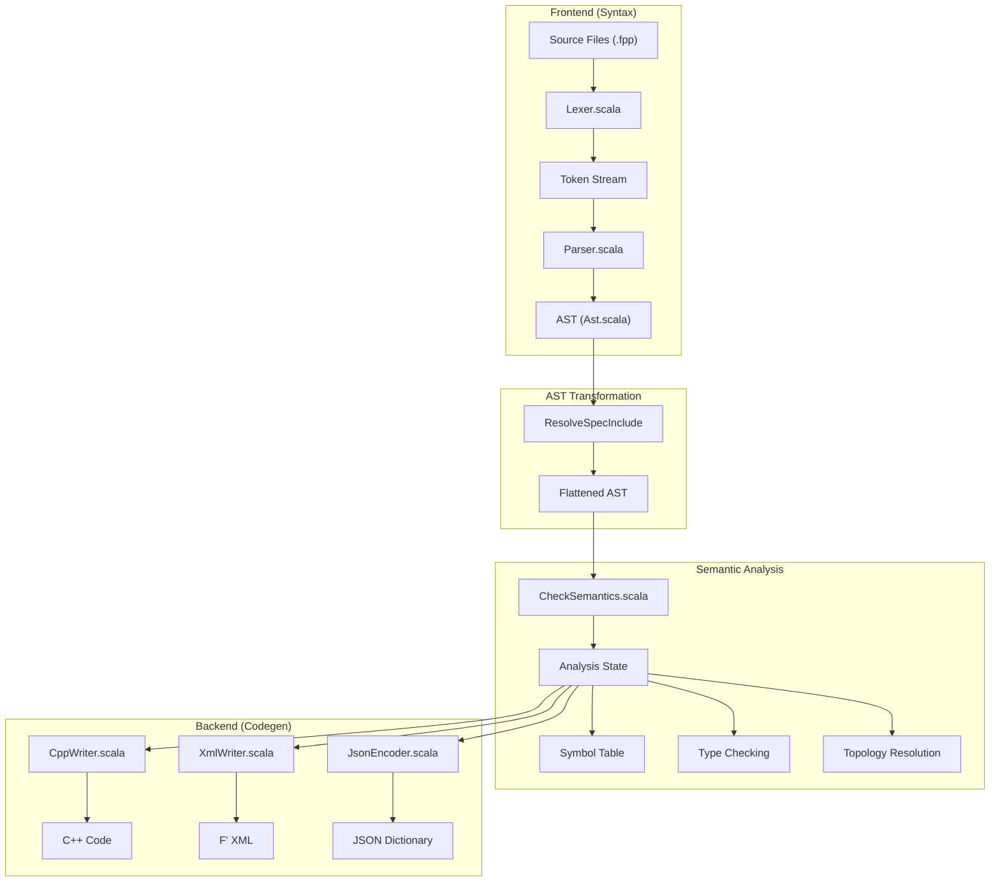
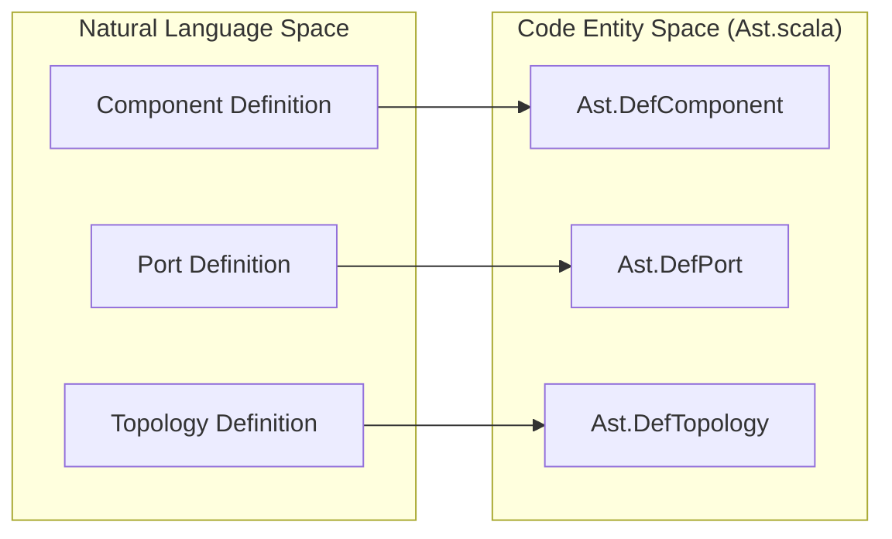
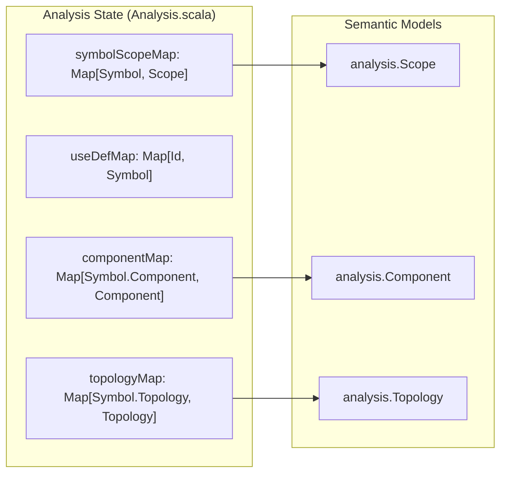

# Page: Compiler Architecture

# Compiler Architecture

Relevant source files

The following files were used as context for generating this wiki page:

- [compiler/lib/src/main/scala/analysis/Analysis.scala](compiler/lib/src/main/scala/analysis/Analysis.scala)
- [compiler/lib/src/main/scala/analysis/Analyzers/BasicUseAnalyzer.scala](compiler/lib/src/main/scala/analysis/Analyzers/BasicUseAnalyzer.scala)
- [compiler/lib/src/main/scala/analysis/CheckSemantics/CheckSemantics.scala](compiler/lib/src/main/scala/analysis/CheckSemantics/CheckSemantics.scala)
- [compiler/lib/src/main/scala/analysis/CheckSemantics/CheckTopologyDefs.scala](compiler/lib/src/main/scala/analysis/CheckSemantics/CheckTopologyDefs.scala)
- [compiler/lib/src/main/scala/analysis/CheckSemantics/CheckUses.scala](compiler/lib/src/main/scala/analysis/CheckSemantics/CheckUses.scala)
- [compiler/lib/src/main/scala/analysis/CheckSemantics/ConstructImpliedUseMap.scala](compiler/lib/src/main/scala/analysis/CheckSemantics/ConstructImpliedUseMap.scala)
- [compiler/lib/src/main/scala/analysis/Semantics/Connection.scala](compiler/lib/src/main/scala/analysis/Semantics/Connection.scala)
- [compiler/lib/src/main/scala/analysis/Semantics/ImpliedUse.scala](compiler/lib/src/main/scala/analysis/Semantics/ImpliedUse.scala)
- [compiler/lib/src/main/scala/analysis/Semantics/InitSpecifier.scala](compiler/lib/src/main/scala/analysis/Semantics/InitSpecifier.scala)
- [compiler/lib/src/main/scala/analysis/Semantics/PortInstance.scala](compiler/lib/src/main/scala/analysis/Semantics/PortInstance.scala)
- [compiler/lib/src/main/scala/analysis/Semantics/PortInstanceIdentifier.scala](compiler/lib/src/main/scala/analysis/Semantics/PortInstanceIdentifier.scala)
- [compiler/lib/src/main/scala/analysis/Semantics/PortInterface.scala](compiler/lib/src/main/scala/analysis/Semantics/PortInterface.scala)
- [compiler/lib/src/main/scala/analysis/Semantics/ResolveTopology/GeneralPortNumbering.scala](compiler/lib/src/main/scala/analysis/Semantics/ResolveTopology/GeneralPortNumbering.scala)
- [compiler/lib/src/main/scala/analysis/Semantics/ResolveTopology/MatchedPortNumbering.scala](compiler/lib/src/main/scala/analysis/Semantics/ResolveTopology/MatchedPortNumbering.scala)
- [compiler/lib/src/main/scala/analysis/Semantics/ResolveTopology/PatternResolver.scala](compiler/lib/src/main/scala/analysis/Semantics/ResolveTopology/PatternResolver.scala)
- [compiler/lib/src/main/scala/analysis/Semantics/ResolveTopology/PortNumberingState.scala](compiler/lib/src/main/scala/analysis/Semantics/ResolveTopology/PortNumberingState.scala)
- [compiler/lib/src/main/scala/analysis/Semantics/ResolveTopology/ResolvePortNumbers.scala](compiler/lib/src/main/scala/analysis/Semantics/ResolveTopology/ResolvePortNumbers.scala)
- [compiler/lib/src/main/scala/analysis/Semantics/ResolveTopology/ResolveTopology.scala](compiler/lib/src/main/scala/analysis/Semantics/ResolveTopology/ResolveTopology.scala)
- [compiler/lib/src/main/scala/analysis/Semantics/ResolveTopology/ResolveUnconnectedPorts.scala](compiler/lib/src/main/scala/analysis/Semantics/ResolveTopology/ResolveUnconnectedPorts.scala)
- [compiler/lib/src/main/scala/analysis/Semantics/Topology.scala](compiler/lib/src/main/scala/analysis/Semantics/Topology.scala)
- [compiler/lib/src/main/scala/ast/Ast.scala](compiler/lib/src/main/scala/ast/Ast.scala)
- [compiler/lib/src/main/scala/ast/AstTransformer.scala](compiler/lib/src/main/scala/ast/AstTransformer.scala)
- [compiler/lib/src/main/scala/ast/AstVisitor.scala](compiler/lib/src/main/scala/ast/AstVisitor.scala)
- [compiler/lib/src/main/scala/codegen/AstWriter.scala](compiler/lib/src/main/scala/codegen/AstWriter.scala)
- [compiler/lib/src/main/scala/codegen/ComputeGeneratedFiles.scala](compiler/lib/src/main/scala/codegen/ComputeGeneratedFiles.scala)
- [compiler/lib/src/main/scala/codegen/CppWriter/ComputeCppFiles.scala](compiler/lib/src/main/scala/codegen/CppWriter/ComputeCppFiles.scala)
- [compiler/lib/src/main/scala/codegen/CppWriter/ComputeImplCppFiles.scala](compiler/lib/src/main/scala/codegen/CppWriter/ComputeImplCppFiles.scala)
- [compiler/lib/src/main/scala/codegen/CppWriter/ComputeTestCppFiles.scala](compiler/lib/src/main/scala/codegen/CppWriter/ComputeTestCppFiles.scala)
- [compiler/lib/src/main/scala/codegen/CppWriter/ComputeTestImplCppFiles.scala](compiler/lib/src/main/scala/codegen/CppWriter/ComputeTestImplCppFiles.scala)
- [compiler/lib/src/main/scala/codegen/CppWriter/ConstantCppWriter.scala](compiler/lib/src/main/scala/codegen/CppWriter/ConstantCppWriter.scala)
- [compiler/lib/src/main/scala/codegen/CppWriter/CppWriter.scala](compiler/lib/src/main/scala/codegen/CppWriter/CppWriter.scala)
- [compiler/lib/src/main/scala/codegen/CppWriter/CppWriterState.scala](compiler/lib/src/main/scala/codegen/CppWriter/CppWriterState.scala)
- [compiler/lib/src/main/scala/codegen/CppWriter/ImplCppWriter.scala](compiler/lib/src/main/scala/codegen/CppWriter/ImplCppWriter.scala)
- [compiler/lib/src/main/scala/codegen/CppWriter/TestCppWriter.scala](compiler/lib/src/main/scala/codegen/CppWriter/TestCppWriter.scala)
- [compiler/lib/src/main/scala/codegen/CppWriter/TestImplCppWriter.scala](compiler/lib/src/main/scala/codegen/CppWriter/TestImplCppWriter.scala)
- [compiler/lib/src/main/scala/codegen/FppWriter.scala](compiler/lib/src/main/scala/codegen/FppWriter.scala)
- [compiler/lib/src/main/scala/codegen/LocateDefsFppWriter.scala](compiler/lib/src/main/scala/codegen/LocateDefsFppWriter.scala)
- [compiler/lib/src/main/scala/codegen/XmlFppWriter/TopologyXmlFppWriter.scala](compiler/lib/src/main/scala/codegen/XmlFppWriter/TopologyXmlFppWriter.scala)
- [compiler/lib/src/main/scala/syntax/Lexer.scala](compiler/lib/src/main/scala/syntax/Lexer.scala)
- [compiler/lib/src/main/scala/syntax/Parser.scala](compiler/lib/src/main/scala/syntax/Parser.scala)
- [compiler/lib/src/main/scala/syntax/Token.scala](compiler/lib/src/main/scala/syntax/Token.scala)
- [compiler/lib/src/main/scala/util/Error.scala](compiler/lib/src/main/scala/util/Error.scala)
- [compiler/lib/src/main/scala/util/Tool.scala](compiler/lib/src/main/scala/util/Tool.scala)
- [compiler/lib/src/main/scala/util/Version.scala](compiler/lib/src/main/scala/util/Version.scala)
- [compiler/lib/src/test/scala/syntax/Parser.scala](compiler/lib/src/test/scala/syntax/Parser.scala)
- [compiler/tools/fpp-filenames/test/include_test_auto_helpers.ref.txt](compiler/tools/fpp-filenames/test/include_test_auto_helpers.ref.txt)
- [compiler/tools/fpp-filenames/test/include_test_template_auto_helpers.ref.txt](compiler/tools/fpp-filenames/test/include_test_template_auto_helpers.ref.txt)
- [compiler/tools/fpp-filenames/test/ok_test_auto_helpers.ref.txt](compiler/tools/fpp-filenames/test/ok_test_auto_helpers.ref.txt)
- [compiler/tools/fpp-format/test/include.ref.txt](compiler/tools/fpp-format/test/include.ref.txt)
- [compiler/tools/fpp-format/test/no_include.ref.txt](compiler/tools/fpp-format/test/no_include.ref.txt)
- [compiler/tools/fpp-format/test/state_machine.ref.txt](compiler/tools/fpp-format/test/state_machine.ref.txt)
- [compiler/tools/fpp-locate-defs/test/defs.ref.txt](compiler/tools/fpp-locate-defs/test/defs.ref.txt)
- [compiler/tools/fpp-locate-defs/test/defs/defs-1.fpp](compiler/tools/fpp-locate-defs/test/defs/defs-1.fpp)
- [compiler/tools/fpp-locate-defs/test/defs/defs-2.fpp](compiler/tools/fpp-locate-defs/test/defs/defs-2.fpp)
- [compiler/tools/fpp-locate-defs/test/defs_dir.ref.txt](compiler/tools/fpp-locate-defs/test/defs_dir.ref.txt)
- [compiler/tools/fpp-syntax/test/state-machine.fpp](compiler/tools/fpp-syntax/test/state-machine.fpp)
- [compiler/tools/fpp-syntax/test/state-machine.ref.txt](compiler/tools/fpp-syntax/test/state-machine.ref.txt)
- [compiler/tools/fpp-syntax/test/syntax-ast.ref.txt](compiler/tools/fpp-syntax/test/syntax-ast.ref.txt)
- [compiler/tools/fpp-syntax/test/syntax-include-ast.ref.txt](compiler/tools/fpp-syntax/test/syntax-include-ast.ref.txt)
- [compiler/tools/fpp-syntax/test/syntax-stdin.ref.txt](compiler/tools/fpp-syntax/test/syntax-stdin.ref.txt)
- [compiler/tools/fpp-syntax/test/syntax.fpp](compiler/tools/fpp-syntax/test/syntax.fpp)

The FPP compiler transforms FPP source text into various artifacts, including C++ autocode, XML/JSON dictionaries, and dependency information. The architecture follows a multi-stage pipeline where each phase refines the representation of the model, moving from raw text to a structured semantic graph, and finally to target-specific output.

## Compiler Pipeline Overview

The following diagram illustrates the flow of data through the major compiler phases:

### Pipeline: Source to Artifacts

**Sources:** [compiler/lib/src/main/scala/syntax/Parser.scala:9-19](), [compiler/lib/src/main/scala/analysis/Analysis.scala:9-93](), [compiler/lib/src/main/scala/codegen/CppWriter/CppWriter.scala:70-86]()

---

## 1. Frontend: Lexing and Parsing
The frontend is responsible for converting FPP source text into an Abstract Syntax Tree (AST). 

- **Lexer**: The `Lexer` [compiler/lib/src/main/scala/syntax/Lexer.scala:16-16]() identifies keywords (e.g., `component`, `topology`, `active`) [compiler/lib/src/main/scala/syntax/Lexer.scala:18-133]() and literals, producing a stream of `Token` objects [compiler/lib/src/main/scala/syntax/Token.scala]().
- **Parser**: The `Parser` [compiler/lib/src/main/scala/syntax/Parser.scala:9-9]() uses Scala parser combinators to match the token stream against the FPP grammar. It produces `AstNode` objects that wrap AST elements with source `Location` information [compiler/lib/src/main/scala/syntax/Parser.scala:62-75]().

For details, see [Lexer and Parser (Frontend)](#2.1).

---

## 2. Abstract Syntax Tree (AST)
The AST is the central data structure representing the syntactic structure of an FPP model. It is defined in `Ast.scala` as a collection of case classes.

- **Nodes**: Most AST elements are wrapped in an `AstNode[T]`, which associates the element with a unique ID and a source location.
- **Annotations**: FPP supports pre- and post-annotations (comments starting with `@`), which are captured in the `Annotated[T]` type [compiler/lib/src/main/scala/ast/Ast.scala:8-8]().
- **Structure**: The tree mirrors the language hierarchy, from `TransUnit` (Translation Unit) [compiler/lib/src/main/scala/ast/Ast.scala:17-17]() down to individual expressions and identifiers.

For details, see [Abstract Syntax Tree (AST)](#2.2).

### AST Entity Mapping
The following diagram maps high-level FPP concepts to their corresponding Scala classes in the `Ast` object:

**Sources:** [compiler/lib/src/main/scala/ast/Ast.scala:96-100](), [compiler/lib/src/main/scala/ast/Ast.scala:166-170](), [compiler/lib/src/main/scala/ast/Ast.scala:244-248]()

---

## 3. AST Transforms
Before full semantic analysis, the compiler performs several AST-to-AST transformations. These passes simplify the tree or resolve structural requirements.

- **Inclusion**: `ResolveSpecInclude` flattens the model by replacing `include` specifiers with the actual AST nodes from the included files.
- **State Machines**: Transformations like `AddStateEnums` inject generated types required for state machine implementation.

For details, see [AST Transforms](#2.3).

---

## 4. Semantic Analysis
Semantic analysis validates the model and builds a comprehensive `Analysis` state object [compiler/lib/src/main/scala/analysis/Analysis.scala:9-93](). This phase moves the compiler from "syntax" to "meaning."

- **Symbol Table**: Mapping names to definitions via `useDefMap` [compiler/lib/src/main/scala/analysis/Analysis.scala:44-44]().
- **Type Checking**: Resolving types for all expressions and ensuring type safety [compiler/lib/src/main/scala/analysis/Analysis.scala:55-55]().
- **Topology Resolution**: Computing port connections, numbering, and validating connection patterns [compiler/lib/src/main/scala/analysis/Semantics/Topology.scala:7-42]().

### Semantic State Mapping
This diagram shows how the internal `Analysis` object tracks the relationship between symbols and resolved semantic models:

**Sources:** [compiler/lib/src/main/scala/analysis/Analysis.scala:42-44](), [compiler/lib/src/main/scala/analysis/Analysis.scala:63-78]()

For details, see [Semantic Analysis](#3).

---

## 5. Code Generation
The backend consumes the `Analysis` state to produce output.

- **C++ Generator**: Uses `CppWriter` [compiler/lib/src/main/scala/codegen/CppWriter/CppWriter.scala:8-18]() and `CppWriterState` [compiler/lib/src/main/scala/codegen/CppWriter/CppWriterState.scala:8-21]() to generate F' component base classes, port headers, and topology setup code.
- **Other Backends**: Includes `XmlWriter` for F' framework XML, `JsonEncoder` for telemetry/command dictionaries, and `FppWriter` [compiler/lib/src/main/scala/codegen/FppWriter.scala:9-9]() for formatting FPP source.

For details, see [Code Generation](#4).

---
**Sources:**
- [compiler/lib/src/main/scala/syntax/Lexer.scala:16-133]()
- [compiler/lib/src/main/scala/syntax/Parser.scala:9-75]()
- [compiler/lib/src/main/scala/ast/Ast.scala:8-248]()
- [compiler/lib/src/main/scala/analysis/Analysis.scala:9-93]()
- [compiler/lib/src/main/scala/codegen/CppWriter/CppWriter.scala:8-205]()
- [compiler/lib/src/main/scala/codegen/CppWriter/CppWriterState.scala:8-192]()
